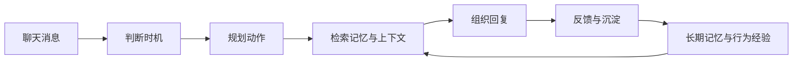

# MaiBot 1.0.0 更新专题

MaiBot 1.0.0 是一次面向长期使用体验的系统性升级。它不只是在原有功能上增加开关，而是把回复、记忆、插件、WebUI、图片资源和调试观测重新串成了一套更完整的日常使用流程。

  

    <strong>更自然的聊天</strong>
    Maisaka 会观察上下文、判断时机、选择工具，再生成回复。
  

  

    <strong>更可靠的记忆</strong>
    A_Memorix 将长期记忆、证据、人物画像和知识来源统一管理。
  

  

    <strong>更完整的 WebUI</strong>
    Dashboard 成为配置、管理、观测和排查问题的统一工作台。
  

## 这次升级改变了什么

1.0.0 之后，麦麦更像一个能持续工作的聊天智能体。她会根据聊天场景决定是否说话，能在长对话里保留摘要，能把图片和工具返回内容继续带入上下文，也能通过长期记忆和人物画像理解更稳定的背景信息。

对使用者来说，最直接的变化是：回复更有节奏，记忆更容易维护，WebUI 能管理的范围更完整，插件和图片资源也更不容易成为长期运行时的负担。

## Maisaka 回复核心

Maisaka 是 1.0.0 中最核心的变化。麦麦收到消息后，会先根据聊天节奏和上下文判断是否需要行动，再决定是等待、回复、调用工具、发送图片，还是保持安静。

**回复更像一次连续交流**  
群聊、私聊和 WebUI 本地聊天的回复链路进一步统一。引用回复、等待、打字节奏、不回复策略和回复分割都经过重新整理，减少突然插话、空回复和无意义行动。

**长对话不容易断片**  
中期记忆会把较长的聊天压缩成摘要，并在后续上下文中继续可用。对于持续数小时甚至更长的聊天，麦麦更容易保留前面讨论过的关键内容。

**多模态内容能继续参与对话**  
图片、转发消息、复杂消息和工具返回的媒体内容会更稳定地进入上下文。模型是否携带图片，会按配置和模型能力判断，减少非视觉模型误收图片导致的请求问题。

## A_Memorix 记忆系统

A_Memorix 在 1.0.0 中成为长期记忆主线。新的记忆系统不再只保存零散文本，而是把段落、实体、关系、来源、向量和图谱放在同一套结构里。

**记忆有来源，也能被纠错**  
人物画像、事实、关系和知识片段会尽量保留来源证据。WebUI 中可以查看证据链和纠错历史，发现过时或错误记忆时，也能通过纠错闭环让后续检索更准确。

**检索更重视场景相关性**  
长期记忆检索融合向量、图关系、BM25、PageRank 和阈值过滤等方式，目标是减少无关记忆进入回复上下文，让麦麦更常想起“这次聊天真正需要的内容”。

**知识库维护更适合长期使用**  
历史聊天总结可以导入长期记忆，网页和文档导入也更稳定。删除知识来源、重新导入、失效清理和批量导入的流程更完整，适合把麦麦作为长期陪伴或知识助手来维护。

## Dashboard 新工作台

1.0.0 的 Dashboard 不只是一个设置页，而是新的管理工作台。聊天、配置、插件、记忆、知识库、统计、监控、日志、推理过程和系统设置都进入了统一入口。

  <section>
    <h3>配置管理</h3>
    
动态表单、数字草稿输入、列表、JSON、extra params、模型任务配置和插件原始 TOML 编辑都可以在 WebUI 中完成。

  </section>
  <section>
    <h3>动态发言频率</h3>
    
按平台、聊天流、聊天类型和时间段配置麦麦活跃节奏，并通过可视化时间轴理解规则优先级。

  </section>
  <section>
    <h3>推理过程</h3>
    
可以查看阶段、工具调用、prompt 预览、请求模型、推理耗时、动作摘要，并在多份记录之间连续导航。

  </section>
  <section>
    <h3>本地缓存</h3>
    
数据库、图片缓存、表情包缓存、日志目录和 data 目录都能查看与清理，数据库还支持按表清理和 VACUUM。

  </section>

WebUI 的主题、侧边栏、按钮、表单、弹窗、移动端布局和长内容展示也进行了多轮打磨。对普通用户来说，它更像一个能日常打开使用的控制台；对排查问题的人来说，它能更快告诉你“麦麦刚才为什么这么做”。

## 插件、MCP 与工具

插件系统在 1.0.0 中重构为独立的 `plugin_runtime`。插件可以独立启动、停止、重载，并显示运行状态；插件市场也能展示 README、分类、图标、评价和随机推荐。

对插件使用者来说，安装、启停、配置、更新和定位错误都更直观。对插件开发者来说，插件可以访问宿主消息、聊天流、配置、运行时数据、embedding 能力和 LLM provider 适配能力，能做的事情更多，也更容易和主程序协作。

MCP 能力也进入主线。MaiBot 可以加载 MCP 工具、Prompt 和 Resource，并通过 Host LLM Bridge 调用主程序模型。第三方 MCP 服务输出额外日志或缺少部分可选接口时，连接流程也更稳。

## 图片、表情包与多模态

1.0.0 对图片和表情包做了不少长期运行向的整理。WebUI 聊天支持发送图片消息，入站大图可以按配置压缩或丢弃，图片缓存可以自动清理，也可以按日期筛选、预览、单个删除或批量删除。

表情包管理升级为“认识”“不认识”“据为己用”“丢弃”等状态视角，并支持按状态、格式和 tag 管理。重复上传、识别失败、取消注册、替换和删除流程更稳，发送成功后再计数，统计也更可信。

## 性能、稳定性与安全

1.0.0 针对长期运行做了不少看不见但很重要的调整。

**启动更快**  
非关键服务会延后初始化，减少启动时的阻塞步骤。

**运行更稳**  
回复分割、Timing Gate、Planner 配合、空白消息过滤和工具调用历史清理都做了优化，减少无效行动、空回复和供应商格式错误。

**资源更可控**  
日志系统增加上限和清理能力，Prompt 预览不再默认内联大体积图片数据，统计系统也降低了大数据量下的内存压力。

**WebUI 更安全**  
认证、路径校验、URL 校验、静态资源访问和反爬策略都得到加强，公网或局域网部署时更不容易暴露不该暴露的内容。

## 相关文档

- [MaiBot 是怎么思考的](../manual/features/maisaka-reasoning.md)
- [MaiBot 的记忆](../manual/features/memory-system.md)
- [WebUI 管理面板](../manual/webui/index.md)
- [插件管理](../manual/webui/plugin-management.md)
- [MCP 工具](../manual/features/mcp.md)
- [完整更新日志](./index.md)

