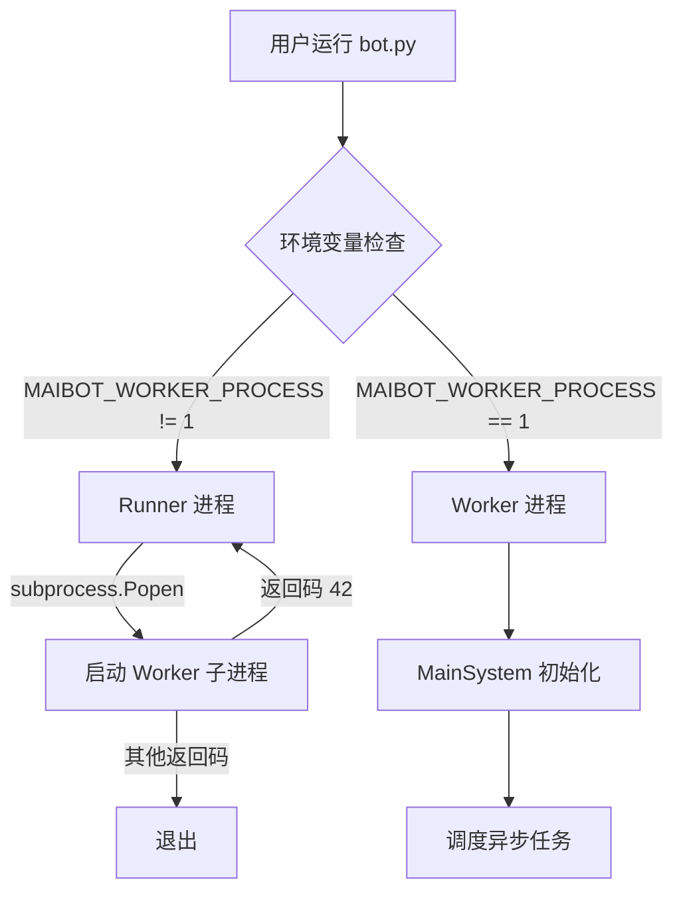
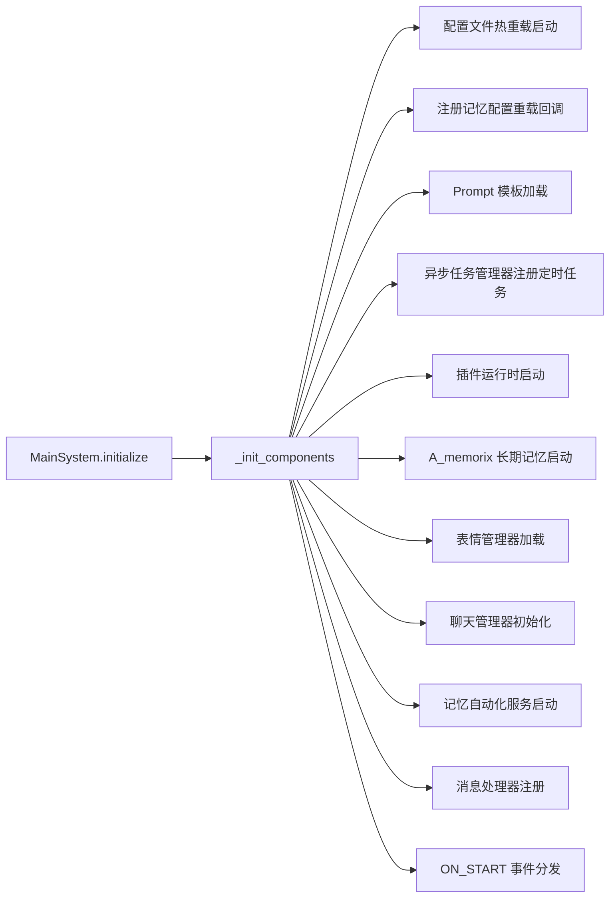

# 架构设计

本文基于 code-map 快照编写，作为架构文档的导航中心。它把 MaiBot 的架构拆成 12 篇专题文档，并用 Runner/Worker 进程模型与 MainSystem 初始化流程串起主入口。

## 快速入口

**消息处理管线** ：从平台消息入站到出站发送的完整链路，详见 [消息管线](architecture/message-pipeline.md)。

**插件运行时架构** ：插件生命周期、Host/Runner 双进程通信、组件注册和 Hook 分发，详见 [插件开发文档](../plugin/)、[生命周期](../plugin/lifecycle.md)、[工具](../plugin/tools.md)、[Hook](../plugin/hooks.md)。

**Platform IO 架构** ：MaiBot 与适配器之间的发送、接收、路由、去重和出站跟踪，详见 [PlatformIO 驱动开发](./adapter-dev/platform-io.md)。

**事件总线（EventBus）** ：事件总线（EventBus）是 MaiBot 全系统通信中枢，提供发布/订阅模型，支持拦截型（同步顺序）和非拦截型（异步并发）两种事件处理器。详见 [事件总线架构](architecture/event-bus.md)。

**工具抽象层（Tool System）** ：工具抽象层（Tool System）统一管理四类工具来源：插件 @Tool、旧 @Action（自动转换）、MaiSaka 内置 Tool、MCP Tool，提供统一的 ToolProvider 接口。详见 [工具系统架构](architecture/tool-system.md)。

## Runner/Worker 进程模型

MaiBot 通过 `bot.py` 实现 Runner/Worker 双进程模型：

- **Runner 进程**：守护进程，负责启动、监控 Worker 子进程。当 Worker 以退出码 42 退出时，Runner 会自动重新启动 Worker（热重启机制）。当 Runner 收到 Ctrl+C 信号时，会优雅终止 Worker。
- **Worker 进程**：实际执行业务逻辑的进程。设置环境变量 `MAIBOT_WORKER_PROCESS=1` 后进入 Worker 模式，执行 `MainSystem` 的初始化和任务调度。

## MainSystem 初始化流程

`MainSystem.initialize()` 通过 `await` 串行初始化各组件：

核心初始化顺序：

1. 启动配置文件热重载监视器
2. 注册 A_memorix 配置重载回调（`register_config_reload_callback()`）
3. 加载 Prompt 模板
4. 注册定时任务（在线时间统计、统计输出、遥测心跳）
5. 启动插件运行时（`PluginRuntimeManager.start()`），建立双子进程（内置插件 + 第三方插件）
6. 启动 A_memorix 长期记忆服务
7. 加载表情管理器
8. 初始化聊天管理器
9. 启动记忆自动化服务（`memory_automation_service.start()`）
10. 将 `ChatBot.message_process` 注册到消息 API 服务器
11. 触发 `ON_START` 事件（`event_bus.emit`）并分发到插件运行时（`bridge_event`）

`schedule_tasks()` 随后启动持续运行的服务：表情定期维护、消息 API 服务器、消息服务器。

## 新增架构入口

**[事件总线架构](architecture/event-bus.md)** ：事件总线（EventBus）是 MaiBot 全系统通信中枢，提供发布/订阅模型，支持拦截型（同步顺序）和非拦截型（异步并发）两种事件处理器。详见 [事件总线架构](architecture/event-bus.md)。

**[工具系统架构](architecture/tool-system.md)** ：工具抽象层统一管理插件 @Tool、旧 @Action（自动转换）、MaiSaka 内置 Tool、MCP Tool 四类工具来源，并通过 ToolProvider 接口接入推理与执行链路。详见 [工具系统架构](architecture/tool-system.md)。

**[服务层架构](architecture/service-layer.md)** ：服务层把 LLM 调用、记忆操作、发送消息、数据库访问和统计聚合等业务能力封装成可复用服务，避免上层模块直接耦合底层实现。详见 [服务层架构](architecture/service-layer.md)。

**[表达学习架构](architecture/expression-learning.md)** ：表达学习从对话中沉淀行为模式、俚语和表达偏好，让 MaiBot 的回复风格随时间适配用户语境。详见 [表达学习架构](architecture/expression-learning.md)。

**[表情系统内部架构](architecture/emoji-internals.md)** ：表情系统管理表情包的加载、匹配和生成，是消息语义理解与个性化回复的重要素材来源。详见 [表情系统内部架构](architecture/emoji-internals.md)。

**[MCP 集成架构](architecture/mcp-integration.md)** ：MCP 集成连接外部 MCP Server，把远程工具能力纳入统一 Tool System，扩展模型可调用的工具边界。详见 [MCP 集成架构](architecture/mcp-integration.md)。

**[Prompt 模板系统](architecture/prompt-templates.md)** ：Prompt 模板系统负责系统提示词、任务模板和运行参数的加载管理，影响推理引擎的上下文组织方式。详见 [Prompt 模板系统](architecture/prompt-templates.md)。

**[全局管理器架构](architecture/global-managers.md)** ：全局管理器集中维护跨模块共享的异步任务、配置状态和运行时服务，降低入口编排复杂度。详见 [全局管理器架构](architecture/global-managers.md)。

## 消息处理管线

消息处理管线是 MaiBot 从平台入站到最终发送的主链路，覆盖消息预处理、会话管理、命令执行、心流调度、Maisaka 推理、回复生成和 Platform IO 发送。详细阶段、数据结构、Hook 拦截点和出站流程请阅读 [消息管线](architecture/message-pipeline.md)。

## 插件运行时架构

插件运行时采用 Host 主进程加两个 Runner 子进程的双子进程隔离模型，通过 msgpack IPC 和 RPC 管理内置插件、第三方插件、组件注册和 Hook 分发。完整设计、开发约束和组件 API 请转至 [插件开发文档](../plugin/)，重点阅读 [生命周期](../plugin/lifecycle.md)、[工具](../plugin/tools.md)、[命令](../plugin/commands.md)、[Hook](../plugin/hooks.md)、[事件处理器](../plugin/event-handlers.md) 和 [消息网关](../plugin/message-gateway.md)。

## Platform IO 架构

Platform IO 是 MaiBot 与平台适配器之间的中间层，负责 RouteKey 解析、发送和接收路由、驱动注册、入站去重和出站追踪。适配器实现与驱动接口请阅读 [PlatformIO 驱动开发](./adapter-dev/platform-io.md)。

## 本节文档索引

**基础域（Wave 1）** ：底层基础设施，提供通信、工具抽象和系统运行底座。
  : [事件总线架构](architecture/event-bus.md) ：MaiBot 全系统事件通信中枢，提供发布/订阅模型和拦截型、非拦截型两类处理器。
  : [工具系统架构](architecture/tool-system.md) ：四类工具来源的统一抽象层，通过 ToolProvider 接入插件、旧 Action、MaiSaka 内置工具和 MCP 工具。

**核心功能域（Wave 2）** ：消息处理、推理、记忆、WebUI 和服务封装构成 MaiBot 的主要业务链路。
  : [消息管线](architecture/message-pipeline.md) ：从平台消息入站到出站发送的完整链路，包含预处理、会话、命令、心流、推理和发送 Hook。
  : [Maisaka 推理引擎](architecture/maisaka-reasoning.md) ：MaiBot 的核心 AI 运行时，负责对话推理、节奏控制、LLM 请求和工具调用循环。
  : [记忆系统（A-Memorix）](architecture/memory-system.md) ：MaiBot 的长期记忆子系统，负责持久化、嵌入、图谱检索、人物画像和记忆策略。
  : [WebUI 内部机制](architecture/webui-internals.md) ：基于 FastAPI 的 Web 管理后端，覆盖认证、路由、WebSocket、插件运行时 IPC 和安全机制。
  : [服务层架构](architecture/service-layer.md) ：封装 LLM 调用、记忆操作、发送消息、数据库访问和统计聚合等业务服务，供上层模块复用。

**辅助功能域（Wave 3）** ：增强能力模块，可按部署需求启用、替换或扩展。
  : [表达学习架构](architecture/expression-learning.md) ：从对话中学习行为模式、俚语和表达偏好，为个性化回复提供持续更新的风格素材。
  : [表情系统内部架构](architecture/emoji-internals.md) ：管理表情包加载、匹配和生成，为消息理解与回复生成提供视觉表达素材。
  : [MCP 集成架构](architecture/mcp-integration.md) ：连接外部 MCP Server，将远程工具能力接入统一 Tool System。
  : [Prompt 模板系统](architecture/prompt-templates.md) ：管理 Prompt 模板加载、参数化和运行时更新，支撑推理引擎的上下文组织。
  : [全局管理器架构](architecture/global-managers.md) ：集中管理跨模块异步任务、配置状态和运行时服务，减少入口编排复杂度。
