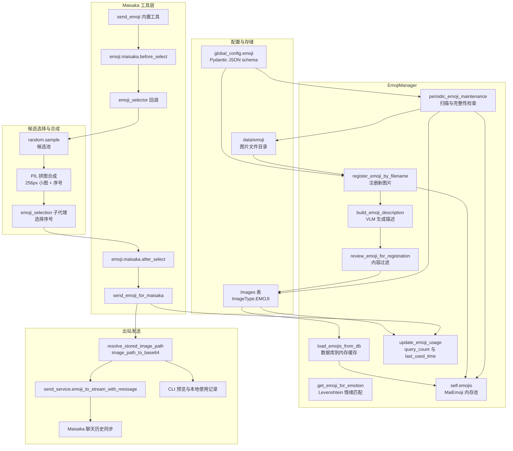

# 表情系统内部架构

本文基于 code-map 快照编写。

本文面向开发者，说明 `emoji_system/` 目录、`send_emoji` 内置工具、表情包数据库、内存缓存、VLM 描述生成、PIL 拼图合成和定期维护之间的协作关系。它与 `docs/manual/features/emoji-system.md` 的用户视角互补，不重复介绍如何管理表情包，也不把 WebUI 操作当成内部实现。

## 概述

**定位** ：表情系统是 MaiBot 的视觉表达素材层。它负责把图片文件、数据库记录、情绪标签、使用次数和维护状态组织成可被推理引擎调用的能力。

**核心单例** ：`EmojiManager` 是表情包的集中管理器。它保存 `self.emojis` 内存池，维护 `self._emoji_num` 数量，注册配置热重载回调，并调度描述构建和定期维护任务。

**用户边界** ：用户文档解释“什么时候会发表情包、如何上传和审核”。本文解释“为什么能选中这张图、图片如何变成 base64、使用次数如何写入数据库”。

**实现边界** ：当前实现不把表情包选择权重直接交给 `ExpressionLearner`。表情包有 `query_count` 和 `last_used_time`，表达方式学习有 `Expression.count` 和 `last_active_time`，两者通过 Maisaka 的上下文和工具调用产生间接关系。

**主要输入** ：配置项、数据库中的 `Images` 记录、`data/emoji` 目录中的图片、Maisaka 推理上下文、工具调用参数和 Hook 返回值。

**主要输出** ：选中 `MaiEmoji` 对象、base64 图片、发送服务消息、使用次数更新、描述缓存、维护日志和监控 metadata。

## 架构图

## 核心概念

**`EmojiManager`** ：表情包生命周期管理器。它不直接代表一张图片，而是把数据库、文件系统、内存缓存、VLM 调用、Hook 和定期维护串起来。

**`MaiEmoji`** ：运行时表情包对象。它包含 `full_path`、`file_name`、`file_hash`、`image_format`、`description`、`emotion`、`query_count`、`register_time` 和 `last_used_time`。

**`file_hash`** ：图片身份标识。它由 SHA256 计算得到，用于数据库主索引、内存查找、Hook 序列化和发送成功后的使用统计。

**`description`** ：逗号分隔的描述或标签文本。它通常由 VLM 生成，也可以来自数据库缓存、WebUI 上传或 Hook 改写。

**`emotion`** ：从 `description` 规范化得到的标签列表。规范化会拆分中文逗号、顿号、分号和换行，并去重。

**`query_count`** ：表情包被真实发送后的累计次数。它用于统计热度，也在满额替换时作为低使用率优先候选的权重来源。

**`last_used_time`** ：最近一次真实发送时间。它用于维护、排序和开发者排查使用频率。

**`is_registered`** ：数据库注册状态。只有已注册、未封禁且文件存在的记录会进入可发送内存池。

**`is_banned`** ：封禁状态。被封禁的表情不会加载到 `self.emojis`，也不会通过普通选择流程发送。

**`no_file_flag`** ：文件缺失标记。删除时保留描述缓存会设置该标记，未注册记录可继续作为描述缓存存在。

**`vlm_processed`** ：VLM 处理标记。自动维护用它避免对同一批已处理文件反复消耗视觉模型额度。

**`EMOJI_DIR`** ：`data/emoji` 目录。新收集的表情、临时文件和注册文件都在这里落地。

**`Images` 表** ：通用图片数据库表。表情使用 `image_type = ImageType.EMOJI` 区分于普通图片。

**JSON 配置入口** ：`EmojiConfig` 通过 Pydantic 配置模型暴露 JSON schema，运行时通过 `global_config.emoji` 读取。文档说“JSON 配置”时，指的是这些结构化配置项，而不是图片文件内嵌 JSON。

**模型任务配置** ：VLM 描述、内容过滤和选择子代理依赖 `model_task_config`。`emoji_manager_vlm` 使用 `task_name="vlm"`，`emoji_manager_emotion_judge_llm` 使用 `task_name="utils"`。

**内存缓存** ：`emoji_manager.emojis` 是可发送池。它不是完整数据库镜像，只包含当前可用、已注册、未封禁且有文件的 `MaiEmoji`。

**Hook 载荷** ：`_serialize_emoji_for_hook()` 把 `file_hash`、`file_name`、`full_path`、`description`、`emotions` 和 `query_count` 转成插件可接收的字典。

## 表情包加载

**加载入口** ：`load_emojis_from_db()` 在启动阶段把数据库中的已注册表情读入内存。

**数据库扫描** ：它查询全部 `Images` 记录，跳过非 `ImageType.EMOJI` 的记录。

**注册过滤** ：只有 `is_registered=True` 且 `is_banned=False` 的记录会进入候选列表。

**文件校验** ：记录如果标记 `no_file_flag`，或 `resolve_stored_image_path()` 找不到实际文件，会被视为破损注册记录。

**内存构建** ：可用记录通过 `MaiEmoji.from_db_instance()` 转成运行时对象，再追加到 `self.emojis`。

**数量同步** ：加载结束后，`self._emoji_num` 被设置为 `len(self.emojis)`，后续维护循环依赖这个数量判断是否还能收集新表情。

**破损清理** ：破损的已注册记录会从数据库删除，并记录清理数量。未注册但缺少文件的记录不会被当作可发送表情加载。

**注册入口** ：`register_emoji_by_filename()` 用于把 `data/emoji` 中的图片注册进数据库和内存池。

**路径归一化** ：注册时先调用 `Path(filename).absolute().resolve()`，保证后续路径比较和文件访问稳定。

**图片初始化** ：`MaiEmoji(full_path=file_full_path)` 会校验文件存在，记录目录和文件名。

**哈希与格式** ：`calculate_hash_format()` 读取图片字节，计算 SHA256，识别实际格式，并在扩展名不匹配时重命名文件。

**数据库查重** ：注册前按 `image_hash` 和 `ImageType.EMOJI` 查询已有记录。已封禁记录直接跳过，已注册且文件可用也跳过。

**描述复用** ：如果数据库已有 `description`，注册流程会把缓存描述转成 `target_emoji.description` 和 `target_emoji.emotion`。

**描述生成** ：没有描述时调用 `build_emoji_description()`，用 VLM 提取最多 5 个情绪或场景标签。

**内容过滤** ：启用 `content_filtration` 时，`review_emoji_for_registration()` 会把图片转 base64 后调用 VLM 审核。响应包含“否”会拒绝注册。

**容量控制** ：如果 `self._emoji_num` 达到 `max_reg_num` 且 `do_replace=True`，会进入替换流程。

**替换策略** ：`replace_an_emoji_by_llm()` 用 `1 / (query_count + 1)` 作为低使用率优先概率，选择最多 20 个候选，再让 LLM 决定取消注册哪一个编号。

**注册写库** ：`register_emoji_to_db()` 写入 `Images` 记录，设置 `is_registered=True`、`is_banned=False`、`no_file_flag=False`，并保存路径、描述、使用次数和时间。

**注册入内存** ：注册成功后，新 `MaiEmoji` 被追加到 `self.emojis`，`self._emoji_num` 同步增加。

**删除文件** ：`delete_emoji()` 先删除图片文件。文件不存在时只记录警告。

**删除数据库** ：`keep_desc=True` 时保留数据库描述并把 `no_file_flag` 设为 `True`；`keep_desc=False` 时删除数据库记录。

**封禁** ：`ban_emoji()` 把数据库 `is_banned` 设为 `True`，并按 `file_hash` 从内存池移除。

**取消注册** ：`unregister_emoji()` 保留文件和描述，但把 `is_registered` 设为 `False`，并从内存池移除。

## 表情匹配算法

**触发词入口** ：`send_emoji` 工具本身没有参数 schema，实际情绪词来自 Maisaka 的推理结果、工具调用参数或格式化回复标签。

**情绪参数** ：`handle_tool()` 从 `invocation.arguments["emotion"]` 读取 `requested_emotion`，再传给 `send_emoji_for_maisaka()`。

**格式化标签入口** ：`_build_emoji_component_for_label()` 会先尝试把标签当作 `file_hash` 精确查找。

**精确命中** ：`get_emoji_by_hash()` 在 `self.emojis` 中线性查找 `file_hash`。命中后直接返回该 `MaiEmoji`。

**模糊匹配** ：精确查找失败时，`get_emoji_for_emotion()` 调用 `_calculate_emotion_similarity_list()`，把输入标签和每个表情的标签做 Levenshtein 相似度比较。

**相似度公式** ：单个标签相似度为 `1 - distance / max(len(input), len(tag))`。一个表情包取所有标签中的最高相似度。

**Top-N 随机** ：`get_emoji_for_emotion()` 取相似度最高的 10 个表情，再 `random.choice()` 一个。这避免固定返回同一张图。

**空库回退** ：如果 `self.emojis` 为空，匹配函数记录警告并返回 `None`。

**候选池采样** ：`send_emoji.py` 的 `_select_emoji_with_sub_agent()` 使用 `random.sample()` 从 `emoji_manager.emojis` 中抽取候选。默认配置为 25，最大 64。

**上下文匹配** ：工具会收集最近 5 条 `LLMContextMessage.processed_plain_text`，并把 Maisaka 上一次的 `last_reasoning_content` 作为推理理由传给子代理。

**候选拼图匹配** ：子代理看到的是拼图图片和“根据上下文选择最合适一张”的提示词，不是完整数据库列表。

**命中回退** ：子代理返回无效 JSON、越界序号或空候选池时，流程会回退到候选首项或返回空结果。

**Hook 改写** ：`emoji.maisaka.before_select` 可以修改 `requested_emotion`、`reasoning`、`context_texts`、`sample_size`，也可以中止选择。

**结果改写** ：`emoji.maisaka.after_select` 可以替换 `selected_emoji_hash`、补充 `matched_emotion`，也可以中止发送。

**匹配边界** ：当前算法不把 `ExpressionLearner` 的学习结果直接写入表情包权重。它影响的是回复文本和上下文，再间接影响 `send_emoji` 子代理看到的语义环境。

## 关键流程一：表情选择算法

**第一步，触发词提取** ：Maisaka 决定是否调用 `send_emoji`。调用时，`handle_tool()` 尝试从工具参数读取 `emotion`，同时读取最近推理理由和最近聊天文本。

**第二步，选择前 Hook** ：`send_emoji_for_maisaka()` 先触发 `emoji.maisaka.before_select`。插件可以改写输入，也可以返回 `abort_message` 直接中止。

**第三步，候选采样** ：`send_emoji.py` 读取 `emoji_manager.emojis`，按配置数量随机采样。采样数量受 `emoji_send_num` 限制，且不会超过 64。

**第四步，拼图合成** ：候选图片被读取成字节，逐一缩放到 256px 小图，并叠加序号角标，再合成一张 PNG 拼图。

**第五步，子代理选择** ：`run_sub_agent()` 使用 `emoji_selection` prompt。模型任务优先选择专用 `emoji`，其次选择具备视觉能力的 `planner`，最后回退到 `vlm`。

**第六步，结果解析** ：子代理必须返回 `{"emoji_index": 1, "reason": "简短理由"}`。解析失败时记录警告，并使用候选首项。

**第七步，选择后 Hook** ：`send_emoji_for_maisaka()` 触发 `emoji.maisaka.after_select`。Hook 可以替换最终表情，也可以中止发送。

**第八步，空结果处理** ：如果最终 `selected_emoji` 为 `None`，返回失败结果，消息为“当前表情包库中没有可用表情”。

**第九步，发送结果回写** ：`send_emoji.py` 在成功且 `sent_message is None` 时，把 base64 表情追加到聊天历史，保证 Maisaka 后续上下文能看见自己刚发的表情。

**第十步，监控信息** ：工具会把请求消息、子代理输出、token 指标、耗时、选择理由和发送结果写入 metadata，供监控和调试使用。

## PIL 图片合成

**合成目标** ：`send_emoji.py` 的 PIL 合成不是生成新表情包，而是为选择子代理生成候选拼图。

**候选数量** ：`_EMOJI_MAX_CANDIDATE_COUNT = 64`，默认读取 `global_config.emoji.emoji_send_num`。

**小图尺寸** ：`_EMOJI_CANDIDATE_TILE_SIZE = 256`，每张候选图被放入 256x256 的方格。

**网格计算** ：`_calculate_grid_shape()` 枚举列数，计算行数和空位数量，优先选择行列差最小、空位最少的矩形。

**尺寸调整** ：`_build_labeled_tile()` 用 `thumbnail((tile_size, tile_size))` 缩放图片，保持原图比例，不拉伸变形。

**透明通道** ：候选图转换为 `RGBA`，粘贴到白色 `RGBA` 画布上。粘贴时传入原图作为 alpha mask，保留透明边缘。

**文字叠加** ：序号角标用 `ImageDraw` 绘制。黑色半透明圆角矩形作为底，白色数字作为文字。

**默认字体** ：当前实现使用 `ImageFont.load_default()`。如果部署环境没有自定义字体，序号仍能显示，但视觉一致性依赖默认字体。

**占位图** ：读取候选图失败时，`_build_placeholder_tile()` 创建灰色 RGB 背景，并在中间写序号。

**拼图间距** ：`_merge_emoji_tiles()` 使用 `gap = 12`，画布宽高按 `tile_size * columns + gap * (columns - 1)` 计算。

**粘贴顺序** ：候选按列表顺序从左到右、从上到下排列。序号从 1 开始，便于子代理返回 `emoji_index`。

**导出格式** ：最终画布先 `convert("RGB")`，再保存为 PNG 字节流。这样输出稳定，避免透明背景在不同平台渲染差异。

**失败边界** ：图片打不开、格式不支持或文件被占用时，单张小图会变成占位图，不会导致整个拼图流程崩溃。

**性能边界** ：读取候选图片、合并拼图都通过 `asyncio.to_thread()` 放到线程池，避免阻塞事件循环。

## 关键流程二：PIL 图片合成

**第一步，读取字节** ：`_load_emoji_bytes()` 使用 `asyncio.to_thread(emoji.full_path.read_bytes)` 读取单张表情包。

**第二步，并发读取** ：`_build_emoji_candidate_message()` 用 `asyncio.gather()` 并发读取全部候选图片。

**第三步，构建小图** ：`_build_labeled_tile()` 打开图片字节，转换色彩模式，缩放到 256px，再绘制序号角标。

**第四步，创建画布** ：`_merge_emoji_tiles()` 根据候选数量计算行列，创建白色 `RGBA` 大画布。

**第五步，网格粘贴** ：每张带序号小图按行列偏移粘贴到画布，偏移量为 `column * (tile_size + gap)` 和 `row * (tile_size + gap)`。

**第六步，输出消息** ：合成后的 PNG 字节放入 `ImageComponent`，并和“请从这张拼图中选择一个序号”的文本组成 `SessionBackedMessage`。

**第七步，交给子代理** ：候选消息作为 `extra_messages` 传入 `run_sub_agent()`，子代理根据上下文和拼图选择序号。

**第八步，解析序号** ：返回 JSON 中的 `emoji_index` 被转换为 0-based 索引，并检查是否越界。

**第九步，回退处理** ：无效 JSON 或越界序号都会回退到候选首项，避免工具调用因模型格式问题完全失败。

**第十步，记录理由** ：子代理返回的 `reason` 被写入 `selection_metadata`，最终进入工具成功结果。

## 表情发送

**路径解析** ：`send_emoji_for_maisaka()` 先调用 `resolve_stored_image_path(selected_emoji.full_path)`，把存储路径映射为实际文件路径。

**base64 转换** ：`ImageUtils.image_path_to_base64()` 读取图片并转为 base64 字符串。转换失败会返回失败结果。

**会话解析** ：工具通过 `chat_manager.get_session_by_session_id(stream_id)` 找到目标会话。

**CLI 分支** ：如果目标会话平台是 CLI，工具只渲染预览文本，设置 `record_usage_locally=True`，并在发送成功后调用 `emoji_manager.update_emoji_usage(selected_emoji)`。

**平台分支** ：非 CLI 平台调用 `send_service.emoji_to_stream_with_message()`。参数包含 `storage_message=True`、`set_reply=False`、`reply_message=None`、`sync_to_maisaka_history=True` 和 `maisaka_source_kind="guided_reply"`。

**消息构造** ：发送服务负责把 base64 图片包装成平台消息组件，并决定是否写入数据库、同步到 Maisaka 历史和触发发送后通知。

**使用统计** ：正常平台路径由发送服务在消息真实发送后记录使用次数。CLI 路径没有统一发送服务，因此在 `send_emoji_for_maisaka()` 中本地更新。

**成功结果** ：`MaisakaEmojiSendResult.success=True` 时，结果包含 `emoji_base64`、`description`、`emotions`、`requested_emotion`、`matched_emotion` 和 `sent_message`。

**失败结果** ：选择失败、base64 转换失败、发送异常或 Hook 中止都会返回结构化失败结果，便于工具层输出错误信息。

**聊天历史补偿** ：`handle_tool()` 发现 `send_result.sent_message is None` 时，会调用 `append_sent_emoji_to_chat_history()`，把 base64 表情写入当前上下文。

**结果日志** ：成功时会记录描述、情绪标签和命中情绪。失败时会记录错误信息，并保留描述和情绪字段用于监控。

## 与 Maisaka 的交互

**工具声明** ：`get_tool_spec()` 返回 `name="send_emoji"`，描述为“发送一个合适的表情包来辅助表达情绪”。参数 schema 为空，表示默认由推理引擎自动调用。

**工具入口** ：`handle_tool()` 是内置工具执行函数。它从运行时上下文读取会话、聊天历史和推理理由。

**上下文切片** ：工具只取最近 5 条 `LLMContextMessage` 的 `processed_plain_text`。这限制子代理看到的上下文大小，也降低 token 成本。

**推理理由传递** ：`tool_ctx.engine.last_reasoning_content` 作为 `reasoning` 传入选择流程，让子代理知道 Maisaka 为什么想发表情。

**选择回调** ：`send_emoji_for_maisaka()` 接收 `emoji_selector` 回调。默认内置工具把回调接到 `_select_emoji_with_sub_agent()`。

**模型任务选择** ：`_resolve_emoji_selector_model_task_name()` 优先使用专用 `emoji` 模型任务。没有专用任务时，如果 planner 模型具备视觉能力，则使用 planner。否则使用 vlm。

**视觉模型检查** ：当模型任务是 `vlm` 且 `_is_vlm_task_configured()` 为 `False` 时，工具抛出“没有配置视觉模型”的错误。

**子代理上下文限制** ：`_EMOJI_SUB_AGENT_CONTEXT_LIMIT = 12`，限制子代理读取的历史消息数量。

**统一监控** ：`_build_send_emoji_monitor_detail()` 和 `_build_send_emoji_monitor_metadata()` 把请求消息、推理文本、输出文本、指标、异常和发送结果组织成统一监控结构。

**Hook 边界** ：Maisaka 工具层只负责调用 Hook 和解释 Hook 返回值。真正的图片加载、描述生成和数据库维护仍在 `EmojiManager`。

**结果边界** ：`send_emoji_for_maisaka()` 返回的是结构化结果，不直接操作 UI。UI 展示由工具执行结果和 Maisaka 监控层处理。

## 与学习模块的交互

**ExpressionLearner 定位** ：`ExpressionLearner` 学习的是表达方式，即“什么情境下用什么风格说话”。它写入 `Expression` 表，而不是直接写入 `Images` 表。

**学习输入** ：`learn_from_context_messages()` 从裁切历史中过滤真实聊天消息，跳过工具结果、参考消息、记忆注入和规划器思考。

**最小消息数** ：默认至少需要 10 条真实聊天消息，才会进入表达学习批次。

**候选解析** ：学习模型输出 JSON 后，`parse_expression_response()` 提取 `expression` 和 `jargon` 两类候选。

**过滤规则** ：`_filter_expressions()` 会跳过机器人自己的发言、空消息、包含 SELF 的内容、包含表情包或图片标记的内容，以及和机器人名称重复的风格。

**写入数据库** ：`_upsert_expression_to_db()` 根据 `situation` 查找相似表达。完全匹配时直接复用，相似匹配时可用 LLM 概括新的情境文本。

**使用次数** ：每次表达方式被选中或写入时，`Expression.count` 会增加。它代表表达方式的学习热度。

**选择权重** ：`MaisakaExpressionSelector._load_expression_candidates()` 会对 `count > 1` 的候选使用 `weighted_sample()` 抽样。这部分影响的是文本表达方式选择，不是表情包选择权重。

**间接影响** ：表达学习会改变回复上下文、回复理由和目标消息。`send_emoji` 子代理看到这些上下文后，可能选择不同的候选拼图序号。

**无直接耦合** ：`ExpressionLearner` 不修改 `emoji_manager.emojis`，不调用 `update_emoji_usage()`，也不改变 `MaiEmoji.query_count`。

**相似机制** ：表情包也有 `query_count`，但只用于使用统计和满额替换时的低使用率优先，不用于 ExpressionLearner 的表达候选抽样。

**共同边界** ：两者都通过 Hook 允许插件扩展。表达学习有 `expression.select.*` 和 `expression.learn.*` Hook，表情包有 `emoji.maisaka.*` 和 `emoji.register.after_build_description` Hook。

**调试建议** ：如果看到“学习结果没有影响表情包”，先确认是否影响的是表达方式选择。若要影响表情包选择，应通过 `emoji.maisaka.before_select` 改写 `requested_emotion`、`reasoning`、`context_texts` 或 `sample_size`。

## 关键流程三：拼图筛选

**第一步，候选池生成** ：从 `emoji_manager.emojis` 随机采样，数量由配置决定。

**第二步，图片读取** ：每个候选图异步读取为字节，失败时后续使用占位图。

**第三步，缩略图生成** ：每张图片缩放到 256px 以内，放入独立方格。

**第四步，序号叠加** ：每个方格左上角绘制 56px 黑色圆角角标，并在其中写白色序号。

**第五步，布局计算** ：根据候选数量计算行列，尽量让拼图接近矩形，同时减少空位。

**第六步，网格合成** ：所有方格按行列粘贴到白色画布，方格之间保留 12px 间距。

**第七步，消息包装** ：合成图片被包装成 `ImageComponent`，并附加可见文本 `[表情包拼图候选]`。

**第八步，子代理选择** ：子代理只看拼图和任务提示，返回一个序号和简短理由。

**第九步，序号映射** ：返回序号减 1 后映射回采样列表。越界时回退到第 1 张。

**第十步，结果合并** ：选中的 `MaiEmoji` 和选择理由进入 `send_emoji_for_maisaka()` 的选择后 Hook。

## 定期维护

**维护循环** ：`periodic_emoji_maintenance()` 是无限循环。它等待 `global_config.emoji.check_interval` 分钟，或等待 `_maintenance_wakeup_event` 被配置热重载唤醒。

**扫描条件** ：只有 `steal_emoji=True`，并且当前数量低于 `max_reg_num`，或超过上限且 `do_replace=True`，才会扫描 `data/emoji`。

**已知文件集合** ：维护任务先读取 `Images` 表，把已注册、已封禁或已 VLM 处理且文件存在的图片加入 `known_paths`。

**新文件扫描** ：遍历 `EMOJI_DIR.iterdir()`，跳过目录、已知路径和超过 `max_emoji_size_mb` 的文件。

**逐个注册** ：每个新文件调用 `register_emoji_by_filename()`。注册成功后立即停止本轮扫描，避免一次维护循环注册过多图片。

**跳过逻辑** ：已注册、已封禁或描述构建失败的图片会被保留在文件系统中，但不会进入可发送池。

**完整性检查** ：`check_emoji_file_integrity()` 重新扫描 `Images` 表，重建 `self.emojis`，删除破损的已注册记录。

**描述缓存保留** ：未注册且缺少文件的记录会被保留为描述缓存，不会被完整性检查删除。

**文件清理边界** ：完整性检查不主动删除 `data/emoji` 下的图片文件。真正删除文件由 `delete_emoji()` 或外部管理流程触发。

**使用频率统计** ：`query_count` 和 `last_used_time` 由发送路径更新。正常平台发送由 `send_service._record_sent_emoji_usage()` 根据消息中的 `EmojiComponent.binary_hash` 更新。

**CLI 使用统计** ：CLI 分支没有统一发送服务回执，因此在 `send_emoji_for_maisaka()` 成功后直接调用 `emoji_manager.update_emoji_usage(selected_emoji)`。

**缓存清理** ：封禁、取消注册、删除、完整性检查和启动加载都会重建或修剪 `self.emojis`。后台描述构建任务完成后会从 `_pending_description_tasks` 移除。

**配置热重载** ：`reload_runtime_config()` 只唤醒维护等待事件。下一次维护循环会读取最新的 `global_config.emoji` 值。

**关闭清理** ：`shutdown()` 注销配置热重载回调，并唤醒维护循环，让后台任务有机会退出。

## 错误与回退

**无可用表情** ：候选池为空时，工具返回“当前表情包库中没有可用表情”。

**无视觉模型** ：选择子代理需要视觉模型时，如果未配置 VLM 任务，工具返回明确错误。

**图片读取失败** ：单张候选图读取失败会变成占位图，不会中断拼图。

**base64 转换失败** ：选中图片无法转换时，发送流程返回失败结果，并保留描述和情绪标签。

**发送失败** ：发送服务返回空消息或抛出异常时，工具返回失败结果。

**Hook 中止** ：选择前或选择后 Hook 可以中止流程。中止消息会进入工具失败结果。

**子代理 JSON 失败** ：解析失败时回退到候选首项，并记录 warning。

**序号越界** ：子代理返回不在候选范围内的序号时，回退到第 1 张。

**描述为空** ：VLM 返回空描述或 Hook 返回空标签时，注册流程拒绝该图片。

**数据库异常** ：加载、注册、更新使用次数和完整性检查都会记录错误，避免单个数据库问题扩大成整个系统崩溃。

## 开发调试入口

**查看内存池** ：`emoji_manager.emojis` 是当前可发送表情列表。它不包含未注册、封禁或缺文件的表情。

**查看数量** ：`emoji_manager._emoji_num` 是内部数量缓存。修改内存池后必须同步更新它。

**查看描述** ：`emoji.description` 是原始描述文本，`emoji.emotion` 是规范化后的标签列表。

**查看使用次数** ：`emoji.query_count` 和 `emoji.last_used_time` 来自数据库记录，发送成功后会更新。

**查看数据库字段** ：`Images.image_hash`、`Images.description`、`Images.full_path`、`Images.is_registered`、`Images.is_banned`、`Images.no_file_flag` 和 `Images.vlm_processed` 是核心字段。

**查看 Hook 规格** ：`register_emoji_hook_specs()` 注册了选择前、选择后和描述构建后三类 Hook。

**查看发送监控** ：`send_emoji.py` 的 metadata 包含请求消息、子代理输出、token 指标、耗时和发送结果。

**查看拼图合成** ：`_merge_emoji_tiles()`、`_build_labeled_tile()` 和 `_calculate_grid_shape()` 是候选拼图的核心函数。

**查看情绪匹配** ：`_calculate_emotion_similarity_list()` 和 `get_emoji_for_emotion()` 是标签匹配入口。

**查看维护循环** ：`periodic_emoji_maintenance()`、`check_emoji_file_integrity()` 和 `register_emoji_by_filename()` 是维护入口。

## 设计约束

**不要把 `self.emojis` 当数据库** ：内存池是发送优化缓存，完整状态仍以 `Images` 表为准。

**不要绕过 `resolve_stored_image_path()`** ：数据库保存的是存储路径，发送和校验前必须解析为实际文件路径。

**不要在维护循环中删除未知文件** ：当前完整性检查只维护数据库和内存池，不主动清理 `data/emoji`。

**不要让 Hook 直接依赖内部类** ：Hook 载荷使用 `_serialize_emoji_for_hook()` 的字典结构，避免跨进程序列化 `MaiEmoji`。

**不要假设 VLM 一定可用** ：描述生成、内容过滤和选择子代理都可能因为模型任务缺失而失败。

**不要重复更新使用次数** ：正常平台路径由发送服务记录。CLI 路径才在工具层本地更新。

**不要把表达学习和表情包学习混为一谈** ：`ExpressionLearner` 学习的是文本表达，表情包描述来自 VLM 或缓存描述。

**不要忽略配置上限** ：候选数量最大 64，收集大小受 `max_emoji_size_mb` 限制，注册数量受 `max_reg_num` 限制。

## 小结

**表情包加载** ：数据库记录经过注册状态、封禁状态和文件存在性过滤后进入 `emoji_manager.emojis`。

**表情匹配** ：精确哈希查找、Levenshtein 情绪匹配、最近上下文和随机候选采样共同决定候选池。

**图片合成** ：PIL 负责把候选图缩略、加序号、拼网格，为视觉子代理提供可选择的拼图。

**表情发送** ：选中表情后，路径被解析为实际文件，再转为 base64，由发送服务或 CLI 分支完成出站。

**学习交互** ：`ExpressionLearner` 不直接改变表情包权重，它通过表达方式和上下文间接影响 `send_emoji` 子代理看到的信息。

**定期维护** ：维护循环扫描新文件、注册可用表情、检查文件完整性，并通过 `query_count` 与 `last_used_time` 保留使用频率统计。
