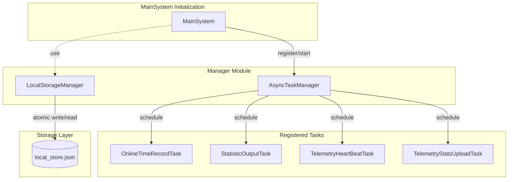

# 全局管理器

本文基于 code-map 快照编写

## 概述

全局管理器模块（`src.manager`）负责提供应用级的单例服务，用于协调系统底层的通用基础能力。该模块设计轻量，不包含业务逻辑，仅作为纯粹的工具型服务，确保在整个应用生命周期内，基础任务调度和持久化存储拥有统一的入口和状态管理。

该模块不依赖其他 MaiBot 内部模块，仅使用 Python 标准库中的 `asyncio`、`json`、`os` 等基础包。两个核心管理器（AsyncTaskManager 和 LocalStorageManager）互不依赖，各自独立运行。这种设计确保了管理器模块可以作为系统的基础设施层，被 MainSystem、各适配器以及插件按需引用，而不会引入循环依赖。

## 架构图

## 核心概念

### AsyncTaskManager

异步任务管理器负责管理后台异步任务的生命周期。它允许系统在不阻塞主逻辑的前提下，运行定时心跳、数据统计等循环任务。

AsyncTaskManager
    职责：管理任务的注册、启动、取消和优雅停止。
    关键组件：
        AsyncTask：任务基类。定义了 `wait_before_start`（启动延迟）和 `run_interval`（运行间隔），支持一次性任务或循环任务。
        abort_flag：全局中止标志。当系统关闭时，通过设置该标志通知所有循环任务停止运行。
        _lock：异步锁。确保在添加或停止任务时的线程安全，防止并发修改任务列表。
    单例实例：`async_task_manager`

任务调度机制
    AsyncTaskManager 的核心是一个基于 `asyncio` 的任务调度引擎，其工作流程分为四个阶段：

    注册阶段
        调用 `add_task()` 将 AsyncTask 实例加入内部任务列表。该方法持有 `_lock` 异步锁，防止并发场景下的竞态条件。注册时任务处于"已注册"状态，尚未创建 `asyncio.Task`，不会占用事件循环资源。

    调度阶段
        调用 `start_task()` 为注册的任务创建 `asyncio.Task`。该方法内部通过 `asyncio.create_task()` 将 `AsyncTask.run()` 包装为协程任务。每个 AsyncTask 实例对应一个 `asyncio.Task` 对象，引用保存在 `_task` 属性中，用于后续的取消与等待操作。调度后的任务进入"运行中"状态。

    执行循环
        调度启动后，任务进入事件循环驱动的执行循环：
        - 若 `wait_before_start > 0`，先执行 `asyncio.sleep(wait_before_start)` 实现延迟启动。
        - 主循环条件为 `while not self.abort_flag`，持续检测全局中止标志。
        - 每轮循环中调用 `run()` 执行业务逻辑，`run()` 内的异常会被 `try/except` 捕获并记录，防止单个任务崩溃影响整个管理器。
        - `run()` 返回后，若 `run_interval > 0`，通过 `asyncio.sleep(run_interval)` 休眠指定间隔，实现周期执行；否则任务仅执行一次后退出。

    停止与清理阶段
        调用 `stop_and_wait_all_tasks()` 时，管理器设置 `abort_flag = True`。所有运行中的任务在下一次循环条件检查时感知到该标志并主动退出。管理器通过 `asyncio.wait_for()` 等待每个任务退出，超时时间为 10 秒。超时未退出的任务会被强制取消。每个 `asyncio.Task` 注册了 `add_done_callback`，任务结束后自动从内部列表中移除已终止的引用，防止内存泄漏。

### LocalStorageManager

本地存储管理器提供一个简单的键值对接口，用于将轻量级配置或状态持久化到本地 JSON 文件中。

LocalStorageManager
    职责：实现本地数据的原子化读写与损坏自动恢复。
    实现机制：
        字典接口：通过实现 `__getitem__`、`__setitem__` 等魔术方法，使其像 Python 字典一样操作。
        原子写入：写入时先创建临时文件（`.tmp`），写入完成后使用 `os.replace` 原子替换目标文件，防止写入崩溃导致数据丢失。
        损坏恢复：在加载文件时，若检测到 JSON 损坏，会自动将原文件备份为 `.corrupt` 后缀，并重建一个空的存储文件，确保系统能正常启动。
    单例实例：`local_storage`

初始化流程
    LocalStorageManager 在 `MainSystem.initialize()` 阶段被初始化。初始化时首先确定存储文件路径（默认与主配置文件同目录下的 `local_store.json`）。随后尝试加载已存在的文件内容至内存字典，若文件不存在则以空字典启动。加载过程中若发现 JSON 解析错误，自动执行损坏恢复流程。

使用场景
    该管理器适合存储以下类型的数据：
    - 用户配置偏好（如语言设置、主题选择）。
    - 运行时状态标记（如首次运行标记、功能开关）。
    - 轻量计数器与缓存值。
    对于需要复杂查询或事务支持的数据，应直接使用数据库代替。

## 关键流程

### 定时任务执行流程

AsyncTaskManager 对定时任务的管理遵循从注册到清理的完整生命周期：

1. 任务定义
    开发者继承 `AsyncTask` 基类并实现 `run()` 方法。`run()` 是任务的核心逻辑，应设计为可重入的幂等操作，因为同一任务可能在多次调度中重复执行。基类构造函数接收 `wait_before_start` 和 `run_interval` 两个参数，分别控制首次执行延迟和执行间隔。

2. 任务注册
    调用 `async_task_manager.add_task(task)` 将任务实例加入内部列表。注册时持有 `_lock` 异步锁，确保在并发场景下不会出现竞态条件。注册完成后任务处于"已注册"状态，尚未创建对应的 `asyncio.Task`，不占用事件循环资源。

3. 调度启动
    管理器遍历已注册任务列表，对每个任务调用 `start_task()`，内部通过 `asyncio.create_task()` 创建协程任务。每个 AsyncTask 实例对应一个 `asyncio.Task`，其引用保存在 `_task` 属性中，用于后续的取消与等待操作。调度成功后任务进入"运行中"状态。

4. 执行循环
    - 若 `wait_before_start > 0`，先执行 `asyncio.sleep(wait_before_start)`，实现延迟启动，避免系统启动阶段的任务竞争。
    - 进入 `while not self.abort_flag` 循环，只要 `abort_flag` 未被设置，就持续执行 `run()`。
    - 每次 `run()` 返回后，若 `run_interval > 0`，通过 `asyncio.sleep(run_interval)` 休眠指定间隔，实现固定周期的循环执行。
    - 若 `run_interval <= 0`，任务在完成一次 `run()` 后自动退出，适用于一次性任务。
    - `run()` 内部的异常会被 `try/except` 捕获并记录日志，防止单个异常导致任务永久终止。

5. 任务清理
    通过 `add_done_callback` 注册完成回调。当 `asyncio.Task` 完成时（无论是正常结束、异常退出还是被取消），回调函数自动将该任务从内部列表中移除。这确保了管理器不会持有已终止任务的引用，避免内存泄漏。

批量停止机制
    `stop_and_wait_all_tasks()` 提供了统一的批量停止能力：
    - 设置 `abort_flag = True`，通知所有运行中的任务主动退出。
    - 并发等待所有任务完成，超时上限为 10 秒。
    - 超时未退出的任务通过 `task.cancel()` 强制取消。
    - 所有任务停止后清空内部任务列表，释放引用。

### 本地存储读写流程

写入数据：
    - 用户调用 `local_storage[key] = value`。
    - 更新内存中的 `store` 字典。
    - 调用 `save_local_store()` 触发原子写入。
    - 创建临时文件 $\rightarrow$ JSON 序列化 $\rightarrow$ 原子替换 $\rightarrow$ 删除临时文件。
    - 若写入过程发生异常（如磁盘空间不足、权限错误），临时文件会自动清理，原始文件不受影响。

    原子写入的优势在于：即使写入过程中进程崩溃，也不会破坏原有数据文件。临时文件写完后通过 `os.replace` 进行文件系统级别的重命名操作，确保目标文件的更新是瞬时的。

读取数据：
    - 用户调用 `local_storage[key]`。
    - 直接从内存字典 `store` 中获取值（启动时已一次性加载至内存）。

    读取操作仅涉及内存访问，不会触发文件 I/O，因此具有极高的性能。所有文件读取仅在初始化时执行一次，后续所有读操作都在内存中进行。

持久化触发策略
    `save_local_store()` 在每次写操作后立即调用，实现同步持久化。这种设计在每次赋值时都涉及磁盘 I/O，但换取了数据安全性，确保任何写操作的结果都能被即时持久化，避免系统崩溃导致的内存数据丢失。

## 与 MainSystem 的交互

全局管理器在 `MainSystem` 的生命周期中扮演关键的支撑角色，两者通过直接方法调用进行协作，遵循注册 → 调度 → 执行 → 清理的完整任务生命周期。

初始化阶段
    在 `MainSystem.initialize()` 执行过程中，系统通过 `AsyncTaskManager.add_task()` 注册一系列核心后台任务。注册完成后，管理器依次调用 `start_task()` 为每个任务创建 `asyncio.Task` 并启动执行循环。注册的核心任务包括：
    - OnlineTimeRecordTask：记录机器人在线时长，周期性更新启动时间戳。
    - StatisticOutputTask：定期输出运行统计数据，包括消息吞吐量、活跃会话数等。
    - TelemetryHeartBeatTask：发送遥测心跳包，用于监控系统健康状态。
    - TelemetryStatsUploadTask：上传统计指标至遥测服务，用于数据分析与性能监控。

    这些任务的 `wait_before_start` 和 `run_interval` 参数在实例化时指定，确保了系统完全启动后再开始执行各定时任务，避免启动阶段的任务竞争。

运行阶段
    任务启动后各自独立运行，通过 `abort_flag` 机制感知系统状态。各任务之间互不干扰，单个任务的异常不会影响管理器或其他任务的正常运行。AsyncTaskManager 在此阶段仅作为任务列表的维护者，不介入具体业务逻辑的执行。

关闭阶段
    在 `main()` 函数的 `finally` 块中，系统调用 `async_task_manager.stop_and_wait_all_tasks()`。该方法的执行流程如下：
    1. 设置 `abort_flag = True`：通知所有运行中的任务在下一次循环条件检查时退出。
    2. 广播取消信号：遍历所有活跃的 `asyncio.Task`，依次调用 `cancel()`。
    3. 等待优雅退出：通过 `asyncio.wait_for()` 等待每个任务退出，超时时间为 10 秒。
    4. 强制终止：对于超时未退出的任务，由 `asyncio` 事件循环强制取消。
    5. 资源清理：清空内部任务列表，确保所有 async_task_manager 占用的引用被释放。

    整个关闭过程确保没有任何挂起的异步操作导致进程僵死，实现可预期的干净退出。

## Hook/扩展点

全局管理器模块作为基础设施层，在设计哲学上遵循最小化和非侵入原则，因此**不对外暴露 Hook 接口**。MainSystem 与 Manager 之间的交互全部通过直接方法调用完成，没有经过事件总线或 Hook 机制。

与其他模块的协作方式如下：

插件自定义定时任务
    在 `MainSystem` 启动流程中，`event_bus.emit(EventType.ON_START)` 发出后，插件可以在其 `on_start` 回调中获取 `async_task_manager` 的单例实例，并通过 `add_task()` 注册自定义定时任务。这为插件提供了定时执行自身逻辑的能力，例如定期清理缓存、定时发送消息等。

本地存储的使用
    插件或系统模块可以通过 `local_storage` 单例直接读写持久化数据。`LocalStorageManager` 提供的是同步文件 I/O 接口，适合存储配置项、状态标记等轻量级数据。对于需要结构化查询的场景，应直接使用数据库而非本地存储。

设计考量
    管理器模块刻意保持最小化接口的原因是：
    - 避免在基础设施层引入复杂度，保持职责边界清晰。
    - 定时任务的管理已由 AsyncTaskManager 完整覆盖，无需额外的 Hook 抽象。
    - 本地存储仅提供最基础的键值对操作，不承担数据模型的职责。

    这种设计使得管理器模块可以独立于业务逻辑变化而稳定存在，同时为上层模块提供了足够的扩展能力。
