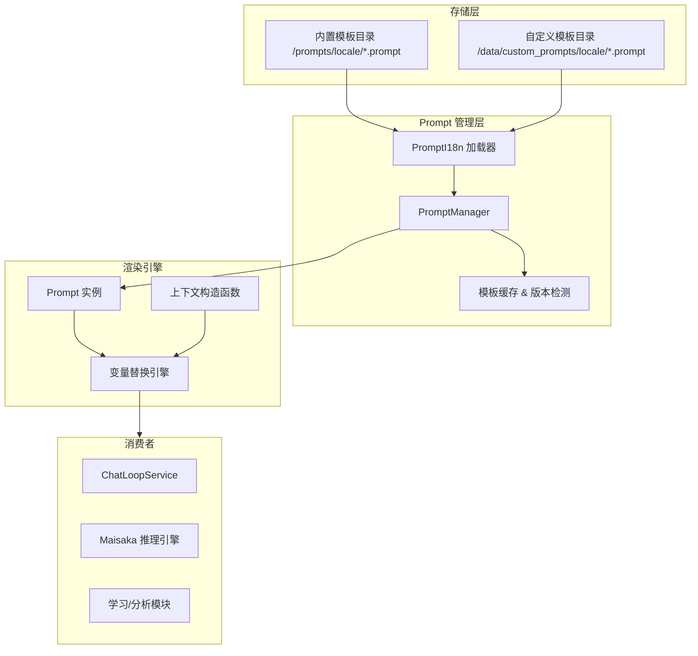

本文基于 code-map 快照编写。

# Prompt 模板系统

Prompt 模板系统是 MaiBot 赋予 AI 角色灵魂的核心机制。它将 LLM 的指令（System Prompt）、任务逻辑（Task Templates）与运行时数据（Runtime Parameters）解耦，使得开发者可以在不修改代码的情况下，通过编辑 `.prompt` 文件快速调整 AI 的行为模式、回复风格和推理逻辑。

Prompt 模板系统在 MaiBot 整体架构中属于基础服务层，与 Config 配置模块、i18n 国际化模块和 Maisaka 推理引擎深度协作。它向下屏蔽了文件系统和多语言路由的复杂性，向上为 ChatLoopService、学习模块等消费者提供统一的模板获取接口。通过这套系统，MaiBot 能够在多种语言环境下保持一致的回复质量，同时支持运行时的行为热更新。

## 架构概述

Prompt 系统的核心目标是提供一个可国际化、可热重载、且支持复杂变量注入的模板管理机制。它将静态的模板文件转换为可动态渲染的 Prompt 实例，并允许通过上下文构造函数将实时的业务数据注入到模板中。整个系统在 MaiBot 中承担着"AI 行为定义层"的角色——它决定了 LLM 以何种身份、何种风格、何种逻辑框架与用户交互。

系统的整体架构分为四层：
- **存储层**：负责模板文件的物理存储，划分为内置模板目录（`/prompts/`）和自定义模板目录（`/data/custom_prompts/`），按 locale 子目录组织，支持 UTF-8 编码的纯文本 `.prompt` 文件。
- **管理层**：`PromptManager` 作为中央控制器，维护模板的注册、缓存、版本检测和热重载逻辑，通过版本号计数器实现增量更新。
- **渲染引擎层**：接收 `Prompt` 实例和上下文构造函数，执行异步变量替换与递归渲染，输出纯文本 Prompt。渲染管线基于 `asyncio` 实现并发解析。
- **消费者层**：以 Maisaka 的 `ChatLoopService` 为代表的上游模块，通过 `PromptManager.get_prompt()` 获取渲染后的 Prompt 字符串，用于构建 LLM 请求的 System Message 和任务指令。

各层之间通过明确的接口边界解耦：管理层不关心模板文件的存储格式细节，渲染引擎不关心模板的来源与生命周期，消费者不关心渲染引擎的内部实现。这种分层设计确保了每个关注点可以被独立修改和测试。

数据流向为单向管道：模板文件从存储层流向管理层完成注册与缓存，再从管理层流向渲染引擎进行变量注入与渲染，最终渲染结果输出给消费者层。每一层只与相邻层交互，层间不产生循环依赖。

## 架构图

## 核心概念

**PromptManager** — 模板系统的中央控制台。
负责 Prompt 实例的生命周期管理，包括注册、加载、替换和保存。它维护一个全局的 Prompt 实例字典，并实现了基于文件版本号的自动热重载机制，确保在修改 `.prompt` 文件后无需重启即可生效。

**热重载实现细节**
PromptManager 的热重载基于文件修改时间（mtime）与版本号计数器协同工作。每次 `load_prompts()` 被调用时，系统会遍历模板目录中的所有 `.prompt` 文件，计算文件的 `mtime` 哈希并与缓存中的版本号对比。若检测到变更，则仅重新加载发生变更的模板文件，而非全量刷新。这种增量更新策略在大型多语言部署场景下有效降低了 I/O 开销。版本号计数器是一个单调递增的整数值，每次检测到任何文件变更时自增，消费者可通过对比前后版本号快速判断是否需要重新获取模板。

**缓存失效策略**
模板缓存遵循以下失效规则：
- **Locale 切换**：当 `common.i18n.set_locale()` 被调用时，`PromptManager` 标记所有缓存为 stale，下次 `get_prompt()` 调用触发全量重新加载并重建 locale → 文件路径映射表。
- **文件修改检测**：通过周期性的版本号轮询（非实时文件监听，无 inotify 依赖）检测模板文件变更。检测间隔由 `Config` 模块中的 `prompt_reload_interval` 参数控制，默认值为 60 秒。
- **显式刷新**：开发者可通过 `PromptManager.reload_prompts()` 强制刷新缓存，适用于部署后的模板热修复场景，调用后将清空全部缓存并重新扫描模板目录。
- **模板不存在回退**：当请求的模板名称在当前 locale 下不存在时，系统自动回退至默认 locale（`en-US`）查找，若仍不存在则抛出 `PromptNotFoundError`。

**Prompt 实例** — 模板的包装对象。
每个 `Prompt` 对象持有原始模板字符串。为了保证线程安全和会话隔离，`PromptManager.get_prompt()` 总是返回一个克隆实例。克隆实例允许针对特定会话注入临时的上下文函数，而不会污染全局模板。克隆操作采用浅拷贝策略——原始模板字符串为不可变对象，因此无需深拷贝；但上下文函数字典在每个克隆实例上独立维护，避免并发写入冲突。

**模板文件结构** — 以 `.prompt` 为后缀的纯文本文件。
模板文件采用简单的占位符语法 <code v-pre>{{variable}}</code>。在系统内部，这些占位符在渲染前会被转换为 Python 的 `string.Formatter` 语法。模板文件按语言目录（如 `zh-CN`, `en-US`）组织，支持通过自定义目录进行优先级覆盖。模板加载的完整优先级链为：`自定义/目标 locale` → `自定义/回退 locale` → `内置/目标 locale` → `内置/回退 locale`，其中回退 locale 固定为 `en-US`。文件编码要求为 UTF-8（无 BOM），文件名即为模板的逻辑名称（不含 `.prompt` 后缀）。

**变量替换机制** — 递归渲染引擎。
系统支持三种层级的变量解析优先级：
- **内部构造函数**：绑定在特定 Prompt 实例上的函数，优先度最高，仅在当前克隆实例的生命周期内有效。
- **全局构造函数**：通过 `add_context_construct_function` 注册的全局通用函数，对所有 Prompt 实例生效。
- **嵌套 Prompt**：如果变量名指向另一个已注册的 Prompt，引擎将递归渲染该 Prompt 并将其结果注入当前位置。嵌套深度受 `recursive_level > 10` 限制保护。

变量解析失败时（如未注册的变量名且无对应构造函数），渲染引擎抛出 `ContextFunctionNotFoundError`，该异常会被上层 `ChatLoopService` 捕获并记录告警日志，但不会中断整个推理循环。

**多语言支持** — 基于 locale 的动态路由。
系统在加载模板时会调用 `common.i18n` 的 `get_locale()`。加载顺序为：`自定义目录/当前 locale` → `自定义目录/默认 locale` → `内置目录/当前 locale` → `内置目录/默认 locale`。模板加载器 `PromptI18n` 在初始化时会建立 locale → 文件路径的映射表，避免每次加载时重复扫描目录，并将映射关系缓存在内存中以加速后续访问。当某个 locale 的模板目录不存在时，加载器会自动跳过该目录并记录 debug 级别的日志。

## 关键流程

**模板加载流程**
1. `PromptManager` 启动时调用 `load_prompts()`。
2. `PromptI18n` 加载器扫描 `/prompts` 和 `/data/custom_prompts` 目录，收集所有 `.prompt` 文件路径。
3. 根据当前 locale 优先级建立模板映射表，同名的自定义模板覆盖内置模板。
4. 将每个模板文件实例化为 `Prompt` 对象并存入 `PromptManager.prompts` 字典缓存。
5. 记录每个文件的 mtime 哈希作为初始版本号，供后续热重载比对。

重复加载时，`load_prompts()` 仅重新处理版本号发生变化的模板文件，未变动的模板继续使用缓存，避免不必要的 I/O 和解析开销。

加载过程中若遇到文件读取失败、语法解析错误等问题，`PromptI18n` 加载器会跳过该文件并记录错误日志，不会因单个模板文件损坏而导致整个加载流程中断。被跳过的模板将维持上一次成功加载的版本继续服务，直到问题被修复。

**变量注入与渲染流程**
1. 调用方通过 `get_prompt("prompt_name")` 获取克隆实例。
2. (可选) 调用 `add_context("var", func)` 绑定实时数据源，func 是异步可调用对象，返回字符串。
3. 调用 `render_prompt(prompt)` 进入异步渲染管线，该管线基于 `asyncio` 实现并发解析。
4. 渲染引擎解析 <code v-pre>{{...}}</code> 块，按优先级顺序调用对应的构造函数或递归渲染子模板。解析过程是异步的：每个 <code v-pre>{{variable}}</code> 的解析任务被调度为独立协程，通过 `asyncio.gather()` 并发执行，显著提升含多个变量的模板的渲染速度。
5. 将所有解析结果通过 `.format(**fields)` 注入模板，最终输出纯文本 Prompt。
6. 返回的字符串可供消费者直接用于构建 LLM 的 Message 对象。

渲染引擎在步骤 4 中维护一个已解析变量的集合，防止同一变量在递归渲染中被重复解析，避免同一会话内出现不一致的渲染结果。

## 模块交互

**与 Maisaka 的交互**
Maisaka 的推理引擎（如 `ChatLoopService`）是 Prompt 系统的最大消费者。
- **系统提示词构建**：Maisaka 通过 `PromptManager` 获取 `maisaka_chat` 等核心模板，注入当前用户画像、会话记忆和近期印象，构建最终发送给 LLM 的 System Message。
- **任务分发**：不同的子代理（Planner, Replyer, ExpressionSelector）分别关联不同的 Prompt 模板，从而在同一会话中切换不同的推理模式。

**与 i18n 的交互**
Prompt 系统的国际化与 `common.i18n` 深度集成。
- **Locale 同步**：当用户通过 `set_locale()` 切换语言时，`PromptManager` 在下次获取 Prompt 时会检测到版本变更或 locale 变更，从而触发模板的重新加载。
- **路径解析**：利用 `prompt_i18n.py` 实现的路径路由机制，确保不同语言的 Prompt 能够映射到同一个逻辑名称。

**与 config 的交互**
- **路径配置**：Prompt 系统的根目录由代码中定义的 `PROMPTS_DIR` 和 `CUSTOM_PROMPTS_DIR` 决定，这些路径与项目的根目录相对位置挂钩。
- **自定义覆盖**：用户可以通过在 `data/custom_prompts` 下创建同名 `.prompt` 文件来覆盖内置指令，实现了无需修改源码的"提示词工程"自定义。

## 与其它模块交互

**与 Maisaka 推理引擎的集成**
Maisaka 的 `ChatLoopService` 是 Prompt 模板的核心消费者，其交互深度体现在以下方面：
- **系统提示词装配**：`ChatLoopService` 在每次推理循环开始时调用 `PromptManager.get_prompt("maisaka_chat")` 获取基础系统模板，随后通过 `add_context()` 注入当前会话的用户画像（Persona）、记忆摘要（MemorySummary）、近期印象（RecentImpression）等动态数据。装配完成的 Prompt 作为 System Message 发送给 LLM。
- **子代理模板隔离**：Planner、Replyer、ExpressionSelector 等子代理各自关联独立的 Prompt 模板名称（如 `maisaka_planner`、`maisaka_replyer`）。`ChatLoopService` 根据当前推理阶段选择对应的模板，实现同一会话内的角色切换，确保不同子代理接收差异化的系统指令。
- **上下文生命周期**：每个推理周期（ChatLoop iteration）创建一个新的 Prompt 克隆实例，确保上一次推理的上下文注入不会泄漏到下一次请求中。克隆实例在 `render_prompt()` 完成后即被丢弃，由 Python GC 回收。

**与国际化模块的协作**
`common.i18n` 为 Prompt 系统提供语言环境支持，两者的协作基于事件驱动模型：
- **Locale 变更传播**：当上层调用 `set_locale(locale)` 时，i18n 模块会触发 `LOCALE_CHANGED` 事件。`PromptManager` 通过事件总线监听该事件并自增内部版本号计数器，使所有缓存的模板在下次访问时标记为待刷新。这种松耦合设计避免了 `PromptManager` 对 i18n 模块的直接依赖。
- **模板路径路由**：`PromptI18n` 加载器内部维护一个 `locale → [PromptDir]` 的路由表。加载时优先匹配精确 locale，若无匹配则降级至默认 locale（`en-US`）。例如，若当前 locale 为 `zh-CN` 且 `custom_prompts/zh-CN/` 和 `prompts/zh-CN/` 均存在时，加载顺序为：`custom_prompts/zh-CN/` → `prompts/zh-CN/` → `custom_prompts/en-US/` → `prompts/en-US/`。

**与配置模块的联动**
- **路径配置解析**：模板系统的根目录通过 `Config.prompts_dir` 和 `Config.custom_prompts_dir` 配置项定义。`PromptManager` 在初始化时从 `Config` 读取这些路径，并支持运行时通过配置热更新（Config hot-reload）动态调整模板目录位置。
- **配置驱动的行为控制**：`prompt_reload_interval`（热重载轮询间隔，单位秒）、`prompt_cache_ttl`（缓存 TTL，单位秒）等参数通过 Config 模块管理。当这些配置项变更时，`PromptManager` 通过 Config 模块的事件系统接收 `CONFIG_UPDATED` 通知并即时调整内部参数，无需重启进程。
- **启动依赖顺序**：`PromptManager` 的初始化依赖于 `Config` 模块已完成加载。在 MaiBot 的启动生命周期中，`Config` 模块优先初始化，随后才是 `PromptManager`。若在测试环境中单独使用 Prompt 系统，需要先构造一个最小化的 `Config` 实例。

## 开发注意事项

**避免循环引用**
由于支持嵌套 Prompt 渲染，如果 Prompt A 引用 Prompt B，而 Prompt B 又引用 Prompt A，将导致死循环。`PromptManager` 内部设有 `recursive_level > 10` 的硬限制以防止崩溃。在开发新模板时，应仔细检查模板间的引用关系，避免无意中引入循环依赖。

**不要在原始实例上修改**
`PromptManager.prompts` 中的实例是全局共享的。任何对模板的修改或上下文注入必须在 `get_prompt()` 返回的克隆实例上进行，否则会导致所有会话共享同一套上下文数据。在多会话并发场景下，直接在原始实例上修改将引发数据竞争和不可预期的渲染结果。

**占位符规范**
模板中必须使用 <code v-pre>{{variable}}</code> 形式的命名占位符。严禁使用未命名的 `{}` 占位符，因为这会导致 `string.Formatter` 在解析时抛出异常。变量名应遵循蛇形命名法（snake_case），避免包含空格或特殊字符。

**异步安全**
`render_prompt()` 是异步函数，其中调用的上下文构造函数也必须是异步的。在 `add_context()` 中注册同步函数会导致类型错误。开发者应在上下文构造函数中使用 `async def` 签名，并在函数体内避免阻塞调用。若必须调用同步代码，应使用 `asyncio.to_thread()` 将其委托到线程池执行。

**模板调试技巧**
- 在开发阶段，可以临时调用 `PromptManager.get_prompt("name").raw` 查看原始模板字符串，确认模板文件是否被正确加载。
- 使用 `PromptManager.render_prompt(prompt, debug=True)` 启用调试模式，渲染引擎会输出每个变量的解析过程与耗时，便于定位性能瓶颈或解析失败原因。
- 模板内容的热重载不会触发全量日志，如需验证重载是否生效，可对比 `PromptManager._version` 在修改文件前后的值。

**性能考量**
- 模板文件数量较多时（超过 50 个），首次 `load_prompts()` 的 I/O 压力较大，建议在服务启动预热阶段完成加载。
- 嵌套 Prompt 渲染会引入额外的异步调度开销，嵌套深度建议控制在 3 层以内以保持响应速度。
- 全局构造函数 `add_context_construct_function` 注册的函数会在每次渲染时被调用，应确保其执行效率，避免在其中执行重量级计算或远程调用。

## Hook/扩展点

Prompt 模板系统在设计上不直接暴露 Hook 接口，模板的自定义与扩展通过以下机制实现：

**文件级热重载**
模板更新不依赖代码层面的 Hook 回调。用户在修改 `.prompt` 文件后，`PromptManager` 通过文件版本号检测自动识别变更并在下次模板请求时热加载新内容。整个流程对上层消费者透明，无需重启服务或触发任何手动刷新命令。热重载的触发条件是版本号计数器自增，消费者仅需在调用 `get_prompt()` 时传入 `force_reload=False`（默认值），系统会自动比对缓存版本号决定是否重新加载。

**生命周期事件委托**
模板系统的状态变更事件（如 reload 完成、locale 切换）由 `Config` 模块的事件系统统一管理。其他模块可以通过监听 `Config` 模块的 `PROMPT_RELOADED`、`LOCALE_CHANGED` 等事件来响应模板变化。若需扩展模板加载行为（如加载前预处理、加载后校验），推荐在 `Config` 模块的事件总线上注册自定义监听器，而非直接修改 `PromptManager` 的加载逻辑。这种事件委托模式保持了模板核心链路的简洁性，同时为上层模块提供了足够的扩展点。

**模板自定义机制**
开发者无需侵入代码即可修改 AI 行为模式：
- **自定义模板目录**：在 `data/custom_prompts/{locale}/` 目录下放置同名 `.prompt` 文件，系统将优先加载自定义版本而非内置版本。
- **优先级覆盖**：自定义模板的加载优先级高于内置模板，这意味着只需提供与内置模板同名的 `.prompt` 文件即可覆盖原有行为，无需复制全部内置模板内容。
- **细粒度增量自定义**：支持仅自定义特定 locale 的模板，未覆盖的 locale 自动回退到内置模板，实现渐进式模板定制。例如，用户可以仅提供 `custom_prompts/zh-CN/maisaka_chat.prompt` 来覆盖中文版本的聊天提示词，而英文版本仍使用内置模板。

**最佳实践建议**
- 对于简单的行为调整（修改措辞、调整指令权重），优先使用自定义模板覆盖而非修改源码。
- 对于需要动态注入数据的场景，通过 `add_context()` 绑定上下文构造函数实现，不在模板文件中硬编码业务逻辑。
- 监控模板变更时，监听 `Config` 模块的 `PROMPT_RELOADED` 事件而非自建文件轮询。
- 在团队协作中，建议将自定义模板纳入版本控制（如 Git），并在部署流水线中统一同步 `data/custom_prompts` 目录，避免不同环境间的模板差异导致行为不一致。
- 编写模板时保持每个模板文件聚焦单一职责，避免在一个 `.prompt` 文件中塞入过多逻辑分支，便于后续维护和复用。
- 进行模板 A/B 测试时，利用自定义模板目录的优先级覆盖机制，为不同测试组部署不同版本的模板文件，通过路由分发实现流量划分。
- 模板文件应保持向后兼容，新增占位符时提供默认值或兜底渲染逻辑，避免旧版本消费者因缺失变量而渲染失败。
