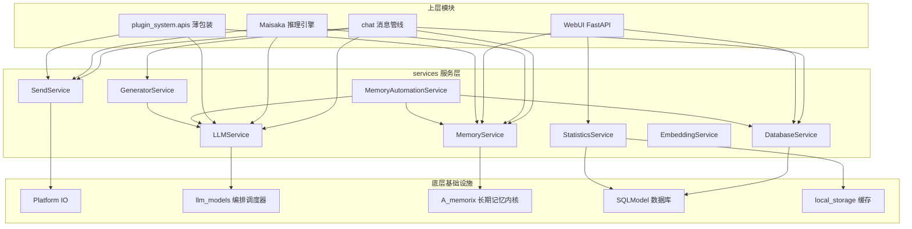

本文基于 code-map 快照编写。

# 服务层架构

MaiBot 的 `services/` 服务层是宿主进程内部的业务逻辑封装层。它把 LLM 调用、长期记忆、出站消息、数据库访问、统计聚合和记忆自动化等能力收口成稳定的 Python 接口，供 `chat`、`maisaka`、`webui` 以及插件运行时包装层调用。

服务层不直接承担平台协议细节，也不替代 A_memorix 内核或 Platform IO 驱动。它的职责是把上层意图翻译成底层模块能执行的请求，再把底层返回的结果整理成上层更容易消费的对象。

## 服务层在架构中的位置

**业务边界**：服务层位于宿主业务模块和底层基础设施之间。`chat` 负责消息入口、会话状态和管线调度，`maisaka` 负责推理、规划和工具执行，`webui` 负责管理接口和可视化，底层模块负责协议、数据库、模型客户端和记忆内核。

**调用方边界**：内部模块可以直接导入 `src.services` 下的服务模块。插件系统不应绕过服务层直接访问底层模块，而应通过 `plugin_system.apis` 的薄包装间接调用，这样插件升级时不会把底层实现细节暴露给插件生态。

**职责边界**：服务层允许封装请求构造、参数规范化、错误收敛、统计记录和统一日志，但不应该把不同平台的私有协议写进服务层。平台差异应继续留在 `platform_io` 和适配器驱动中。

**数据边界**：服务层返回的对象优先面向业务语义，例如 `MemorySearchResult`、`LLMResponseResult`、`DashboardData`。底层模型、数据库行和平台回执可以在服务层内转换，避免上层到处处理实现细节。

## 架构图

## 服务目录总览

**`__init__.py`**：声明 `services` 是核心服务层。模块注释明确说明内部模块应直接使用此层，插件系统通过薄包装间接调用。

**`send_service.py`**：统一出站消息发送。它构造 `SessionMessage`，执行发送前 Hook，委托 `PlatformIOManager.send_message()`，再处理成功回执、落库、表情包使用统计和 Maisaka 历史同步。

**`llm_service.py`**：统一 LLM 调用门面。它解析模型任务名，构造 `LLMServiceClient`，封装文本生成、多图消息生成、图片理解、语音转写和兼容嵌入入口，并把实际执行交给 `LLMOrchestrator`。

**`memory_service.py`**：统一长期记忆操作。它通过 `a_memorix_host_service.invoke()` 路由到 A_memorix，提供搜索、文本摄入、摘要摄入、人物画像查询、维护和管理类接口。

**`memory_flow_service.py`**：记忆自动化服务。它包含人物事实写回队列、聊天摘要写回队列和 `MemoryAutomationService`，在消息发送后触发自动提取和摘要写回。

**`database_service.py`**：数据库通用 CRUD 门面。它封装 SQLModel 查询、过滤、排序、分页、日期和枚举序列化，并提供工具记录保存接口。

**`statistics_service.py`**：WebUI 仪表盘统计门面。它聚合消息量、模型请求、在线时间、Token 用量、费用和最近活动，并提供 24h、168h、720h 缓存。

**`statistics_aggregation_service.py`**：统计汇总表刷新服务。它用原生 SQL 增量刷新消息、工具调用和模型用量的小时汇总表。

**`embedding_service.py`**：文本嵌入服务。它把嵌入请求转发给 `llm_models`，推荐替代 `LLMServiceClient.embed_text()` 的兼容入口。

**`generator_service.py`**：回复器调用入口。它从 `replyer_manager` 获取会话级 `MaisakaReplyGenerator`，生成回复文本并做分词、纠错等后处理。

**`message_service.py`**：消息查询和格式化服务。它按时间范围、会话、分页检索 `SessionMessage`，支持工具记录查询和历史消息量统计。

**`message_word_frequency_service.py`**：词频服务。它使用 jieba 和正则规则分析群聊消息，维护 `HighFrequencyTerm` 表，并提供缓存和过期清理。

**`html_render_service.py`**：HTML 渲染服务。它管理 Playwright 浏览器实例生命周期，把 HTML 内容渲染为 PNG 图片。

**`telemetry_stats_service.py`**：遥测统计服务。它构建匿名运行载荷，聚合模型任务分配、LLM 用量、在线时段和消息量。

**`service_task_resolver.py`**：模型任务解析工具。它从 `model_task_config` 中解析可用任务名，支持旧版 `TaskConfig` 对象映射。

**`llm_cache_stats.py`**：LLM prompt cache 统计服务。它按任务、请求类型和模型聚合缓存命中指标，并生成 HTML 或 JSON 诊断报告。

## 核心服务详解

### SendService

**定位**：`SendService` 是内部模块的统一出站消息发送入口。它对应文档中的 `send_text`、`send_image`、`send_emoji` 三类发送意图，代码入口分别是 `text_to_stream()`、`image_to_stream()`、`emoji_to_stream()`，以及面向消息组件序列的 `custom_reply_set_to_stream()`。

**职责**：服务层负责把文本、Base64 图片或 Base64 表情包转换成内部 `MessageSequence`，再构造出站 `SessionMessage`。它会补齐机器人账号、平台、群信息、路由元数据、引用回复组件和轻量纯文本摘要，但不会决定底层走插件链还是 legacy 旧链。

**Platform IO 协作**：真正的路由和发送由 `PlatformIOManager` 完成。`SendService` 会先调用 `ensure_send_pipeline_ready()`，再用 `build_route_key_from_message()` 构造路由键，最后调用 `send_message()`。发送成功后，服务层回填外部平台消息 ID，分发适配器回调，并在需要时写入数据库。

**状态副作用**：成功发送后，`SendService` 会记录表情包使用次数，通知 `memory_automation_service.on_message_sent()`，并可选择同步到当前会话的 Maisaka 历史。这个同步动作让后续推理能看到自己刚刚发出的消息，避免历史链断裂。

**失败语义**：如果目标聊天流不存在、平台未配置机器人账号、Platform IO 发送失败或发送前 Hook 中止，服务层返回 `None` 或 `False`。调用方不应假设消息一定送达，需要按返回值处理失败分支。

### LLMService

**定位**：`LLMService` 是宿主侧的 LLM 调用门面。它把文本生成、消息列表生成、图片理解、语音转写和兼容嵌入请求统一成服务层入口，再把请求交给 `src.llm_models` 的 `LLMOrchestrator` 执行。

**请求构造**：`LLMServiceClient` 初始化时会解析 `task_name`，绑定 `request_type` 和 `session_id`，并创建 `LLMOrchestrator`。`generate_response()` 负责单轮文本请求，`generate_response_with_messages()` 接收消息工厂，`generate_response_for_image()` 会规范化图片 Base64 和格式，`transcribe_audio()` 负责语音转写。

**重试和模型选择**：服务层不直接实现重试循环，而是通过 `LLMOrchestrator` 统一处理。底层会根据任务配置选择模型，支持随机、顺序和负载均衡策略。网络错误、空回复、429、5xx、响应解析失败等可重试问题会在底层按 provider 配置重试。

**流式响应**：底层请求对象支持 `stream_response_handler`，用于承载流式响应能力。服务层保留这个扩展点，让上层可以在不改变服务边界的情况下接入流式消费逻辑，同时继续由底层负责协议客户端和请求生命周期。

**统计记录**：`LLMServiceClient` 会记录 prompt cache 命中和未命中 token，底层 `llm_usage_recorder` 会把模型调用写入 `ModelUsage`。这些记录再被 `StatisticsService` 汇总成 WebUI 仪表盘数据。

**兼容入口**：`embed_text()` 保留在 `LLMServiceClient` 中，但代码注释推荐新调用方改用 `EmbeddingServiceClient`。这样可以把文本生成和向量生成拆成更清晰的职责。

### MemoryService

**定位**：`MemoryService` 是 A_memorix 的宿主侧门面。它把长期记忆的搜索、写入、维护和管理操作封装成稳定接口，避免业务模块直接理解 A_memorix 的组件名和返回结构。

**add 写入**：代码中的写入入口主要是 `ingest_text()` 和 `ingest_summary()`。`ingest_text()` 用于摄入文本、实体、关系、标签和来源元数据，`ingest_summary()` 用于写入聊天摘要或外部整理后的文本。两者都会带上 `chat_id`、`user_id`、`group_id`、时间范围和过滤策略。

**recall 检索**：`search()` 对应记忆召回。调用方传入查询文本、limit、mode、人物 ID、会话 ID、时间范围和过滤参数，服务层调用 A_memorix 的 `search_memory`，再把结果整理成 `MemorySearchResult` 和 `MemoryHit`。

**forget 与删除**：`forget` 语义在代码中分散在维护和管理接口里。`maintain_memory()` 支持 restore、reinforce、freeze、protect 等维护动作，`delete_admin()` 支持预览和执行删除操作，WebUI 和内置工具可通过 `action` 参数表达更细的删除意图。

**graph_query 图谱查询**：`graph_admin()` 是图谱相关查询和管理的入口。WebUI 中 `action="get_graph"` 和 `action="search"` 就是通过该服务查询记忆图谱。人物画像查询则使用 `get_person_profile()`。

**错误收敛**：服务层会把 A_memorix 的复杂返回统一成布尔值、错误字符串和结构化对象。调用方可以优先判断 `success`，再读取 `detail`、`error` 或结构化命中列表。

### DatabaseService

**定位**：`DatabaseService` 是 SQLModel 访问的通用封装。它不表达业务规则，而是把数据库会话、查询语句、过滤条件、排序字段、分页限制和返回值序列化统一起来。

**CRUD 操作**：`db_save()` 支持按主键或指定字段更新或插入记录，`db_get()` 支持过滤、排序、limit 和单条结果，`db_update()` 和 `db_delete()` 按过滤条件批量操作，`db_count()` 返回匹配记录数量。

**类型处理**：服务层会把 `datetime`、`date`、`Enum`、字典、列表和集合转换成适合 msgpack 或 JSON 的值。返回记录时会优先使用 Pydantic 的 `model_dump()`，没有该能力时再回退到 `__dict__`。

**工具记录**：`store_tool_info()` 和兼容入口 `store_action_info()` 用于保存 Maisaka 工具调用记录。它们会写入工具 ID、时间戳、会话 ID、工具名称、工具数据、推理文本和展示提示。

**调用边界**：业务服务可以在服务层内部调用 `DatabaseService`，例如 `StatisticsService` 读取 `ModelUsage`、`OnlineTime`、`Messages` 和 `ToolRecord`。普通业务模块不应到处手写 SQLModel 查询，除非它本身就是数据访问层的一部分。

### StatisticsService

**定位**：`StatisticsService` 是 WebUI 仪表盘统计的服务层入口。它面向前端展示聚合数据，而不是直接暴露数据库表。

**在线时间**：服务层读取 `OnlineTime` 记录，并按查询窗口裁剪起止时间。它计算窗口内的有效在线秒数，再用于计算每小时费用和每小时 token 用量。

**消息计数**：服务层通过 `count_messages()` 统计时间窗口内的总消息数和带引用回复的消息数。这些指标进入 `StatisticsSummary`，供仪表盘展示聊天活跃度。

**Token 用量**：服务层读取 `ModelUsage`，聚合请求数、总费用、总 token、平均响应耗时，并按模型名称排序返回 Top 模型统计。小时和日级时间序列会补齐空桶，便于前端绘制连续图表。

**缓存策略**：`get_dashboard_statistics()` 会优先读取 `local_storage` 中的仪表盘缓存，默认缓存 600 秒，支持 24h、168h、720h 三个窗口。`refresh_dashboard_statistics_cache()` 可以重新计算并保存稀疏时间序列。

**汇总表协作**：`statistics_aggregation_service` 负责把消息、工具记录和模型用量写入小时汇总表。`StatisticsService` 面向仪表盘，汇总表服务面向查询性能，两者不应混成一个职责。

### MemoryAutomationService

**定位**：`MemoryAutomationService` 是记忆自动化的协调器。它包含 `PersonFactWritebackService` 和 `ChatSummaryWritebackService`，在消息发送后把合适的内容送入异步队列。

**触发方式**：当前实现不是简单全局定时任务，而是由 `send_service` 在发送成功后调用 `on_message_sent()`。这样自动化服务只处理已经确认发送的消息，避免把失败消息写入长期记忆。

**人物事实写回**：`PersonFactWritebackService` 会识别目标人物，收集用户原始发言和邻近上下文，再使用 `LLMServiceClient(task_name="utils")` 提取稳定事实。提取结果会通过 `store_person_memory_from_answer()` 写入 A_memorix。

**聊天摘要写回**：`ChatSummaryWritebackService` 会按会话维护触发游标。当新增消息数达到配置阈值时，它读取最近上下文，调用 `memory_service.ingest_summary()` 写入聊天摘要，并更新触发计数避免重启后重复写入。

**队列边界**：两个写回服务都使用 `asyncio.Queue`，默认队列大小为 256。队列满时服务层只记录警告并跳过本次触发，不阻塞主消息发送流程。

**配置依赖**：人物事实写回和聊天摘要写回都受 A_memorix 集成配置控制。服务层在入队前检查配置，避免用户关闭功能后仍消耗模型调用和写入资源。

## 服务间依赖关系

**LLMService 与 MemoryService**：LLMService 依赖 MemoryService 注入记忆上下文。这里不是全局单例强依赖，而是调用方先从 `MemoryService.search()` 或启发式记忆模块得到 `MemorySearchResult`，再把它格式化为 prompt 或 `message_factory` 中的上下文消息，交给 `LLMServiceClient.generate_response_with_messages()` 使用。

**MemoryService 与 A_memorix**：MemoryService 的所有核心记忆操作都通过 `a_memorix_host_service.invoke()` 路由。服务层负责参数整理、超时、异常收敛和返回对象转换，A_memorix 负责索引、检索、摘要、图谱和写入内核。

**SendService 与 Platform IO**：SendService 负责构造消息和执行 Hook，Platform IO 负责平台路由和驱动发送。服务层不直接调用适配器驱动，这样新增平台时不需要改业务发送逻辑。

**StatisticsService 与 DatabaseService**：StatisticsService 当前直接读取 SQLModel 模型和统计汇总表，但它依赖数据库服务所维护的数据契约。消息、工具记录、模型用量和在线时间都需要由其他服务或管线先写入数据库。

**MemoryAutomationService 与 LLMService**：人物事实写回会把用户发言、上下文和机器人回复交给 `LLMServiceClient` 做事实提取。这个调用使用 `utils` 任务，并带有明确的提示约束，要求只提取用户原始发言可支持的稳定事实。

**MemoryAutomationService 与 MemoryService**：聊天摘要写回最终调用 `memory_service.ingest_summary()`。摘要服务只负责判断触发条件、收集上下文和更新游标，真正写入长期记忆仍由 MemoryService 完成。

**GeneratorService 与 LLMService**：GeneratorService 通过 `replyer_manager` 获取 Maisaka 回复器，回复器内部再按请求类型获取 `LLMServiceClient`。这样回复生成、表达方式和模型调用被分层管理。

## Hook 扩展点

**`send_service.after_build_message`**：出站 `SessionMessage` 构建完成后触发。此时消息已经包含目标会话、机器人账号、消息组件和轻量纯文本摘要，但尚未进入 Platform IO。Hook 可以改写消息体，也可以中止发送。

**`send_service.before_send`**：真正调用 Platform IO 前触发。它是最接近真实发送的拦截点，适合做敏感词二次检查、平台策略判断、引用回复修正或发送参数改写。

**`send_service.after_send`**：发送流程结束后触发。它只用于观察最终结果，不允许中止或改写。参数中包含 `sent`、`typing`、`set_reply`、`reply_message_id`、`storage_message` 和 `show_log`。

**send_before 语义**：文档中说的 `send_before` 对应代码里的 `send_service.before_send`。它接收的是发送前的最终消息和发送参数，允许 Hook 通过返回 kwargs 修改这些参数。

**send_after 语义**：文档中说的 `send_after` 对应代码里的 `send_service.after_send`。它用于日志、埋点、审计和后续观察，不应在这里重新发起发送或修改消息体。

**Hook 超时**：发送服务 Hook 的默认超时为 5000ms。`after_build_message` 和 `before_send` 允许中止，`after_send` 不允许中止。

**Hook 消息格式**：Hook 收到的是序列化后的 `SessionMessage`，返回时也可以返回序列化消息。服务层会尝试反序列化返回消息，失败时记录警告并继续使用原消息。

**Hook 与 Platform IO 的边界**：Hook 可以改变发送参数和消息内容，但不应直接调用平台驱动。真正的发送仍然由 Platform IO 完成，这样插件链、legacy 旧链和适配器路由选择保持一致。

## 与 Maisaka 的交互

**推理引擎获取 LLM 客户端**：`MaisakaChatLoopService` 会按 `request_kind` 解析模型任务名和统计 request_type，然后缓存 `LLMServiceClient`。不同子代理可以使用不同模型任务，例如 planner、replyer、expression_selector 或 mid_memory。

**启发式记忆注入**：`HeuristicMemoryInjector` 先用 `LLMServiceClient(task_name="utils")` 根据近期消息生成聊天印象，再调用 `memory_service.search()` 召回相关长期记忆。召回结果会格式化为一次性参考文本，合并给 Planner 或 Replyer。

**中期记忆摘要**：`mid_term.py` 使用 `LLMServiceClient(task_name="mid_memory", request_type="maisaka.mid_term_memory")` 生成中期聊天记录摘要。摘要结果会被转换成复杂消息，再插入 Maisaka 历史，供后续上下文使用。

**记忆查询工具**：`query_memory` 内置工具直接调用 `memory_service.search()`。当人物定向检索未命中且查询文本存在时，它会降级为普通关键词检索，并把结果包装成工具响应和 Replyer 记忆参考。

**回复发送工具**：`reply` 内置工具生成可见回复后，通过 `send_service._send_to_target_with_message()` 发送。调用时会传入 `sync_to_maisaka_history=True` 和 `maisaka_source_kind="guided_reply"`，确保发送结果同步回 Maisaka 历史。

**反馈纠错任务**：推理引擎在生成响应后，会调用 `memory_service.enqueue_feedback_task()` 把查询工具 ID、会话 ID 和时间戳交给 A_memorix 反馈系统。这让长期记忆可以根据工具查询结果进行后续纠错。

**服务层隔离价值**：Maisaka 不需要理解 Platform IO 路由、A_memorix 组件名、SQLModel 模型或统计缓存结构。它只通过服务层表达“要生成内容”、“要检索记忆”、“要发送回复”和“要记录统计”的意图。

## 典型调用链

**Chat 到 SendService**：Chat 管线完成推理或命令处理后，把回复文本或消息组件交给 SendService。SendService 构建出站消息，执行 `after_build_message` 和 `before_send`，通过 Platform IO 发送，再执行 `after_send`。

**Maisaka 到 LLMService**：Maisaka 的子代理按请求类型获取 `LLMServiceClient`，构造 prompt 或消息工厂，调用 `generate_response_with_messages()`。底层 Orchestrator 选择模型、构造请求、执行重试、记录 token，并返回统一结果。

**Maisaka 到 MemoryService**：启发式记忆、人物画像和内置查询工具都会调用 MemoryService。服务层把查询条件传给 A_memorix，再把命中结果整理成业务对象，供推理引擎决定是否注入上下文。

**WebUI 到 StatisticsService**：WebUI 的 `/statistics/dashboard`、`/statistics/summary` 和 `/statistics/models` 路由调用 StatisticsService。服务层负责读取缓存、实时计算、补齐时间序列和返回前端 schema。

**MemoryAutomationService 到 MemoryService**：发送成功后，SendService 通知 MemoryAutomationService。自动化服务先入队，再在后台判断是否触发人物事实写回或聊天摘要写回，最终通过 MemoryService 写入长期记忆。

## 开发注意事项

**不要绕过服务层写业务逻辑**：如果 chat、maisaka 或 webui 需要新的业务动作，应优先新增或扩展服务层接口，而不是让上层直接调用底层客户端。

**不要把平台协议写进服务层**：SendService 可以继承 Platform IO 路由元数据，但不能知道具体平台如何发送消息。平台差异应留在 `platform_io` 和适配器。

**不要把 A_memorix 细节暴露给推理层**：MemoryService 应继续屏蔽 A_memorix 组件名、payload 结构和错误格式。Maisaka 只需要关心记忆是否可用，以及召回内容如何进入上下文。

**不要让 Hook 承担核心发送职责**：Hook 可以拦截和改写发送，但不应替代 SendService。发送成功后的落库、回执回填、记忆自动化通知和 Maisaka 历史同步仍由服务层统一管理。

**不要让统计服务变成数据库服务**：StatisticsService 可以读取数据库和汇总表，但通用 CRUD 仍属于 DatabaseService。统计服务应关注聚合口径、缓存和前端 schema。

**不要阻塞主消息管线**：MemoryAutomationService 使用异步队列处理写回。即使队列满或模型提取失败，也不应阻塞用户消息发送。

## 小结

服务层是 MaiBot 宿主进程中的业务协调层。它让 `chat`、`maisaka` 和 `webui` 用一致的方式完成消息发送、模型调用、记忆检索、数据访问和统计展示，同时把平台协议、模型客户端、数据库细节和 A_memorix 内核隔离在底层。

当服务层保持清晰边界时，上层可以专注业务流程，底层可以独立演进，插件生态也能通过稳定包装获得能力，而不会直接依赖容易变化的内部实现。
