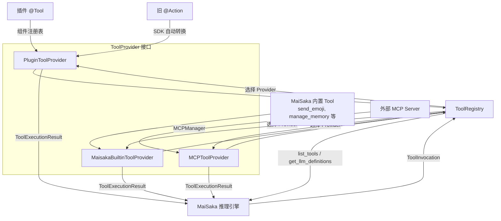
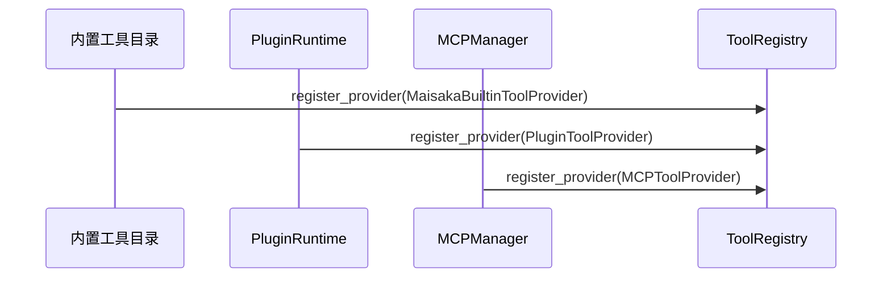
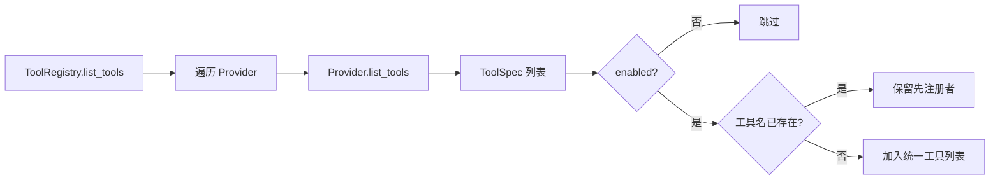
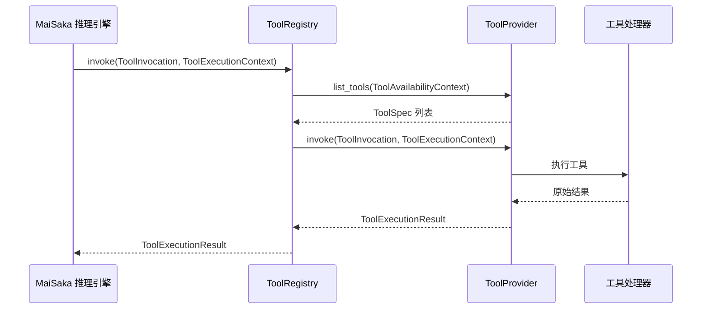

# 工具系统架构

本文基于 code-map 快照编写。

MaiBot 的工具系统把插件工具、旧版 Action、MaiSaka 内置能力和外部 MCP 工具收敛到同一套抽象层。它不负责教插件作者如何写一个 `@Tool`，也不替代 [插件 Tool 用法](../../plugin/tools.md) 中的开发教程。本文聚焦内部实现，说明工具声明、工具调用、Provider 适配和 ToolRegistry 路由如何协同工作。

## 1. 概述

MaiBot 当前统一四类工具来源：

**插件 `@Tool`** ：插件运行时中的 Tool 组件。插件 SDK 使用 `@Tool` 声明工具，运行时把声明写入组件注册表，`PluginToolProvider` 再把这些工具暴露给统一工具层。

**旧 `@Action`** ：旧版插件中的 Action 组件。SDK 2.0 会把 `@Action` 自动转换为 Tool 声明，MaiBot 运行时仍保留兼容路径，使旧插件可以继续被 LLM 调用。

**MaiSaka 内置 Tool** ：推理引擎自带的系统级能力，例如 `send_emoji`、记忆查询、回复、等待、结束本轮等。这些工具由 `MaisakaBuiltinToolProvider` 提供。

**MCP Tool** ：通过 `MCPToolProvider` 桥接外部 MCP 服务器的远程工具。MCP 管理器负责连接、发现和调用，MaiBot 工具层只消费统一后的 `ToolSpec` 和 `ToolExecutionResult`。

统一后的目标是让推理引擎只面对一种工具模型：

**工具声明** ：告诉 LLM 有哪些工具、工具做什么、参数是什么。

**工具调用** ：把 LLM 的选择转成可执行请求，包含工具名、参数、会话和流信息。

**工具执行** ：由对应 Provider 执行，返回统一结果，再写回对话历史或触发后续动作。

## 2. 架构图

这张图说明了两层边界。上层是工具来源，来源可以来自插件、旧 Action、内置模块或 MCP 服务器。下层是统一协议，所有来源都要变成 `ToolProvider`，再由 `ToolRegistry` 统一暴露给 MaiSaka 推理引擎。

概念层可以把 Provider 接口理解为 `get_tools()` 和 `execute_tool()`。源码中的实际方法名是 `list_tools()` 和 `invoke()`，二者职责一致：前者返回工具声明，后者执行工具调用。

## 3. 核心概念

### 3.1 ToolCall

**定义** ：LLM 在推理过程中产生的工具调用意图。

**内部模型** ：MaiBot 内部执行时使用 `ToolInvocation`，而不是直接复用模型 API 的原始 `ToolCall`。

**关键字段** ：

**`tool_name`** ：要执行的工具名。

**`arguments`** ：LLM 生成的参数对象。

**`call_id`** ：模型工具调用 ID，用于把结果放回正确位置。

**`session_id`** ：会话 ID。

**`stream_id`** ：聊天流 ID。

**`reasoning`** ：模型选择该工具时的推理文本。

**`metadata`** ：扩展信息，例如 anchor message、来源标记或调试字段。

`ToolCall` 是推理结果，`ToolInvocation` 是执行请求。MaiBot 在二者之间做标准化，避免每个 Provider 都理解不同模型的原始格式。

### 3.2 ToolIcon

**定义** ：统一工具图标定义。

**源码模型** ：`ToolIcon`。

**关键字段** ：

**`src`** ：图标资源地址。

**`mime_type`** ：资源 MIME 类型。

**`sizes`** ：图标尺寸列表。

图标不是 LLM 选择工具的必要信息。它主要服务于需要展示工具列表的 UI、监控面板或调试界面。工具声明中 `icons` 可以为空，不影响推理和调用。

### 3.3 ToolAnnotation

**定义** ：统一工具注解信息。

**源码模型** ：`ToolAnnotation`。

**关键字段** ：

**`audience`** ：工具面向的使用者或模型集合。

**`priority`** ：工具优先级。

**`metadata`** ：注解扩展字段。

注解用于表达工具的非功能信息。它不直接决定工具是否可调用，但可以为未来的调度、过滤、展示或权限判断提供结构化元数据。

### 3.4 ToolSpec

**定义** ：统一工具声明。

**源码模型** ：`ToolSpec`。

**关键字段** ：

**`name`** ：工具名，必须在统一工具视图中唯一。

**`description`** ：给 LLM 使用的工具描述。

**`title`** ：可选展示标题。

**`parameters_schema`** ：参数 JSON Schema。

**`output_schema`** ：输出 Schema，供支持结构化输出的模型使用。

**`provider_name`** ：声明来自哪个 Provider。

**`provider_type`** ：Provider 类型，例如 `plugin`、`builtin`、`mcp`。

**`enabled`** ：是否启用。

**`icons`** ：图标列表。

**`annotation`** ：工具注解。

**`metadata`** ：扩展元数据。

`ToolSpec` 是工具系统的核心数据对象。所有来源都必须先变成 `ToolSpec`，才能进入 LLM 工具定义列表和调用路由。

### 3.5 ToolProvider

**定义** ：统一工具提供者接口。

**源码模型** ：`ToolProvider` Protocol。

**概念方法** ：

**`get_tools()`** ：列出当前 Provider 可暴露的工具声明。源码对应 `list_tools(context)`。

**`execute_tool()`** ：执行指定工具调用。源码对应 `invoke(invocation, context)`。

**资源释放** ：源码还要求 `close()`，用于释放 Provider 持有的外部连接或异步资源。

Provider 不关心其他来源如何注册，也不直接参与 LLM 选择。它只负责把自己的工具翻译成统一声明，并在被注册表选中时执行请求。

### 3.6 ToolRegistry

**定义** ：统一工具注册表。

**源码模型** ：`ToolRegistry`。

**职责** ：

**注册 Provider** ：`register_provider()` 保存 Provider。同名 Provider 后注册会替换先注册者。

**注销 Provider** ：`unregister_provider()` 按 Provider 名称移除。

**列出工具** ：`list_tools()` 按 Provider 顺序收集工具，并跳过重复名称。

**查询工具** ：`get_tool_spec()` 和 `has_tool()` 用于判断某个工具是否存在。

**生成 LLM 定义** ：`get_llm_definitions()` 把 `ToolSpec` 转为模型层可消费的 `ToolDefinitionInput`。

**执行调用** ：`invoke()` 根据工具名找到负责 Provider，并返回统一结果。

**关闭资源** ：`close()` 关闭所有 Provider。

`ToolRegistry` 是工具系统的调度中心。它让 MaiSaka 推理引擎不需要知道工具来自插件、内置模块还是 MCP。

### 3.7 ToolExecutionContext

**定义** ：工具执行上下文。

**关键字段** ：

**`session_id`** ：会话 ID。

**`stream_id`** ：聊天流 ID。

**`reasoning`** ：模型选择工具的推理文本。

**`is_group_chat`** ：是否为群聊。

**`group_id`** ：群 ID。

**`user_id`** ：用户 ID。

**`platform`** ：平台名称。

**`metadata`** ：扩展上下文。

执行上下文把模型调用时的会话状态传给 Provider。插件工具尤其依赖这些字段，例如通过 `stream_id` 找到可发送消息的聊天流。

### 3.8 ToolAvailabilityContext

**定义** ：工具暴露可用性判断上下文。

**关键字段** ：

**`session_id`** ：会话 ID。

**`stream_id`** ：聊天流 ID。

**`is_group_chat`** ：是否为群聊。

**`group_id`** ：群 ID。

**`user_id`** ：用户 ID。

**`platform`** ：平台名称。

可用性上下文用于决定某个工具在当前聊天中是否应该暴露给 LLM。内置工具会根据群聊、私聊和配置过滤；插件工具也可以基于运行时状态做可见性判断。

### 3.9 ToolExecutionResult

**定义** ：统一工具执行结果。

**关键字段** ：

**`tool_name`** ：被执行的工具名。

**`success`** ：是否成功。

**`content`** ：文本结果。

**`error_message`** ：错误信息。

**`structured_content`** ：结构化结果，通常是 dict 或 list。

**`content_items`** ：可包含图片、音频、资源链接等多媒体结果项。

**`post_history_messages`** ：执行后需要追加到历史的消息。

**`metadata`** ：扩展元数据。

`ToolExecutionResult.get_history_content()` 会把结果转成适合写入历史消息的文本。若存在 `content_items`，会优先拼合可读摘要，避免直接把媒体二进制塞进 LLM 上下文。

## 4. 四类工具来源详解

### 4.1 插件 `@Tool`

**源码入口** ：`maibot/src/plugin_runtime/tool_provider.py`。

**Provider** ：`PluginToolProvider`。

**provider_name** ：`plugin_runtime`。

**provider_type** ：`plugin`。

插件 `@Tool` 由 SDK 注册为插件组件。插件运行时启动后，Host 侧 `ComponentRegistry` 保存 Tool 条目，`ComponentQueryService` 提供只读查询视图。`PluginToolProvider` 不直接持有插件对象，而是通过 `component_query_service` 读取当前可用的工具声明。

声明阶段：

**插件加载** ：Runner 子进程加载插件，并注册 Tool 组件。

**组件注册表** ：Host 侧 `ComponentRegistry` 记录工具名、插件 ID、调用方法、参数 Schema、可见性和启用状态。

**查询视图** ：`ComponentQueryService` 把注册表条目转换为 `ToolSpec`。

**Provider 暴露** ：`PluginToolProvider.list_tools()` 返回统一工具列表。

执行阶段：

**工具名匹配** ：`PluginToolProvider.invoke()` 根据 `ToolInvocation.tool_name` 找到 Tool 条目。

**IPC 调用** ：Host 通过插件运行时 RPC 调用 Runner 子进程中的插件方法。

**结果归一化** ：插件返回值被转换为 `ToolExecutionResult`。

**历史兼容** ：旧 `@Action` 转换后的工具也走同一执行路径。

### 4.2 旧 `@Action`

**源码入口** ：插件 SDK 转换层和 `plugin_runtime/tool_provider.py`。

**Provider** ：仍由 `PluginToolProvider` 暴露。

**兼容方式** ：SDK 内部把 `@Action` 转换为 `@Tool` 声明。

旧 Action 的兼容重点不是让 LLM 知道它曾经是 Action，而是让它以 Tool 语义进入统一系统。转换后，旧 Action 会获得工具名、描述、参数 Schema 和调用入口。运行时保留必要的元数据，用于区分它来自 legacy component。

兼容边界：

**不鼓励新插件使用** ：新插件应直接使用 `@Tool`。

**保留执行路径** ：MaiBot 运行时仍能调用由旧 Action 转换来的工具。

**不重复 API 教程** ：Action 到 Tool 的转换细节属于插件开发文档边界，本文只说明架构位置。

**统一结果模型** ：执行完成后仍返回 `ToolExecutionResult`，MaiSaka 不关心它来自旧 Action 还是新 Tool。

### 4.3 MaiSaka 内置 Tool

**源码入口** ：`maibot/src/maisaka/builtin_tool/`。

**Provider** ：`MaisakaBuiltinToolProvider`。

**provider_name** ：`maisaka_builtin`。

**provider_type** ：`builtin`。

内置工具是 MaiSaka 推理引擎的一部分，用于完成模型自身不能直接完成的核心动作。例如 `send_emoji` 发送表情包，记忆查询类工具读取长期记忆或人物画像，`reply` 发送回复，`finish` 结束本轮思考。

内置工具特点：

**强绑定推理流程** ：内置工具服务于 Planner、Timing Gate 和 Action Loop。

**声明集中管理** ：`BUILTIN_TOOL_ENTRIES` 集中声明工具名、spec 构造器和 handler。

**阶段控制** ：工具可标记为 `timing`、`action` 或 `both`。

**可见性控制** ：工具可标记为 `visible`、`deferred` 或 `hidden`。

**配置过滤** ：部分工具根据全局配置启用或禁用。

**聊天范围过滤** ：部分工具只在群聊或私聊中暴露。

`MaisakaBuiltinToolProvider` 的 `list_tools()` 会调用内置工具聚合函数，按当前可用性上下文过滤工具。`invoke()` 则通过工具名找到对应 handler 并执行。

### 4.4 MCP Tool

**源码入口** ：`maibot/src/mcp_module/provider.py`。

**Provider** ：`MCPToolProvider`。

**provider_name** ：`mcp`。

**provider_type** ：`mcp`。

MCP 工具来自外部 MCP 服务器。MaiBot 通过 `MCPManager` 连接服务器、发现工具、调用工具并关闭连接。`MCPToolProvider` 是这个能力的适配器。

MCP 工具特点：

**外部能力** ：工具实现位于 MaiBot 进程外。

**运行时连接** ：MaiBot 启动时根据 MCP 配置初始化管理器。

**工具发现** ：`MCPManager.get_tool_specs()` 返回统一 `ToolSpec` 列表。

**工具调用** ：`MCPManager.call_tool_invocation()` 执行远程调用。

**资源释放** ：`MCPToolProvider.close()` 会关闭 MCP 连接。

MCP 工具扩展了 MaiBot 的能力边界，但调用链仍保持统一。MaiSaka 只看到 `ToolSpec`，执行时只提交 `ToolInvocation`，最后只接收 `ToolExecutionResult`。

## 5. 关键流程

### 5.1 工具注册

注册发生在 MaiSaka 运行时初始化阶段。内置 Provider 和插件 Provider 是默认注册的。MCP Provider 只有在 MCP 启用且成功发现工具时才会注册。

注册规则：

**同名替换** ：`ToolRegistry.register_provider()` 会先移除同名 Provider，再加入新 Provider。

**顺序保留** ：列出工具时按注册顺序遍历 Provider。

**去重保护** ：如果多个 Provider 暴露同名工具，先注册的保留，后出现的跳过并记录警告。

**启用过滤** ：`ToolSpec.enabled` 为 false 的工具不会进入统一列表。

### 5.2 工具发现

工具发现不是一次性静态快照。每次 MaiSaka 需要给模型准备工具定义时，都会通过 `ToolRegistry.list_tools()` 收集当前可用工具。

发现阶段会处理三类差异：

**来源差异** ：插件、内置、MCP 的声明来源不同，但最终都是 `ToolSpec`。

**上下文差异** ：不同聊天流、群聊或私聊可能暴露不同工具。

**可见性差异** ：隐藏工具不会进入 LLM 工具列表，延迟发现工具也可能暂时不暴露。

### 5.3 推理引擎选择

MaiSaka 通过 `ChatLoopService` 设置统一 `ToolRegistry`。当 Planner 需要工具定义时，`ToolRegistry.get_llm_definitions()` 会把 `ToolSpec` 转为模型层工具定义。

选择过程：

**模型看到工具列表** ：LLM 根据 prompt、上下文和工具描述决定是否调用工具。

**模型返回 ToolCall** ：模型返回工具名和参数。

**MaiBot 构建 ToolInvocation** ：把模型调用标准化为内部请求。

**Registry 查找 Provider** ：按工具名遍历 Provider，找到声明包含该工具且启用的 Provider。

**执行对应 Provider** ：调用 `provider.invoke()`。

### 5.4 工具调用

调用阶段的关键是定位 Provider。`ToolRegistry.invoke()` 会把 `ToolExecutionContext` 转成 `ToolAvailabilityContext`，用于匹配当前聊天环境中的工具声明。找到 Provider 后，它会执行工具并返回统一结果。

异常处理：

**Provider 抛出异常** ：Registry 捕获异常，返回失败的 `ToolExecutionResult`。

**Provider 未找到工具** ：返回 `未找到工具：{tool_name}`。

**工具自身失败** ：Provider 应返回 `success=False`，并填写 `error_message`。

**资源清理** ：运行时关闭时调用 `ToolRegistry.close()`，由每个 Provider 自行释放资源。

### 5.5 结果返回

工具结果进入 MaiSaka 后，会被写入对话历史或触发后续动作。结果可能包含：

**纯文本结果** ：写入 `content`，适合简单查询类工具。

**结构化结果** ：写入 `structured_content`，适合模型继续分析的数据。

**媒体内容项** ：写入 `content_items`，例如图片、音频或资源链接。

**后续消息** ：写入 `post_history_messages`，用于补充工具执行后的上下文。

`ToolExecutionResult.get_history_content()` 负责生成历史摘要。它优先使用文本内容，其次使用内容项摘要，再其次使用结构化内容 JSON，最后才使用错误信息。

## 6. 与插件开发的关系

插件开发文档 [Tool 组件](../../plugin/tools.md) 关注的是插件作者如何使用 `@Tool`、如何声明参数、如何返回值、如何处理图片和媒体。本文不重复这些 API 用法，只说明它们在内部架构中的位置。

对插件作者而言，需要理解三条边界：

**声明边界** ：插件使用 `@Tool` 声明能力，运行时把它变成 Tool 组件。

**发现边界** ：MaiSaka 通过 `PluginToolProvider` 和 `ToolRegistry` 发现插件工具。

**执行边界** ：插件方法在 Runner 子进程中执行，Host 通过统一工具协议接收结果。

对 MaiBot 内部实现而言，插件工具只是 `ToolProvider` 的一个来源。无论工具来自插件、旧 Action、内置模块还是 MCP，MaiSaka 最终只面对同一套 `ToolSpec`、`ToolInvocation` 和 `ToolExecutionResult`。
