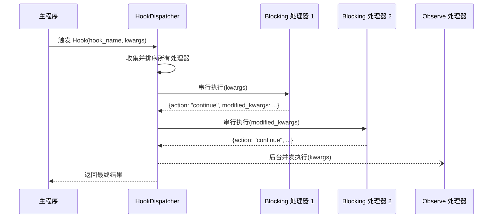

# Hook 处理器

`@HookHandler` 是 MaiBot 插件系统中用于订阅**命名 Hook 点**的组件装饰器。主程序在关键执行点触发命名 Hook，所有订阅该 Hook 的插件处理器按固定规则调度执行，从而实现消息拦截、改写和观察。

::: warning WorkflowStep 已移除
SDK 2.0 中 `WorkflowStep` 已被 `@HookHandler` 取代。旧代码仍在使用 `WorkflowStep` 时会在运行时抛出 `RuntimeError`，这是一个不向后兼容的更改，必须迁移到 `@HookHandler`。
:::

## 装饰器签名

```python
from maibot_sdk import HookHandler
from maibot_sdk.types import HookMode, HookOrder, ErrorPolicy

@HookHandler(
    hook: str,                              # 订阅的命名 Hook 名称（必填）
    *,
    name: str = "",                         # 组件名称，留空时使用方法名
    description: str = "",                  # 组件描述
    mode: HookMode = HookMode.BLOCKING,     # 处理模式
    order: HookOrder = HookOrder.NORMAL,    # 同一模式内的顺序槽位
    timeout_ms: int = 0,                    # 处理器超时（毫秒），0 = 使用 Hook 默认值
    error_policy: ErrorPolicy = ErrorPolicy.SKIP,  # 异常处理策略
    **metadata,                             # 额外元数据
)
```

## 处理模式

### BLOCKING（阻塞模式）

- 串行执行，**可以修改**传入的 `kwargs`
- 返回 `modified_kwargs` 可以更新后续处理器接收的参数
- 返回 `action: "abort"` 可以终止整个 Hook 调用链
- 适合需要拦截或改写消息的场景

### OBSERVE（观察模式）

- 后台并发执行，**只读**旁路观察
- 不参与主流程控制，返回的 `modified_kwargs` 和 `abort` 请求会被忽略
- 适合日志记录、数据分析等不影响主流程的场景

```python
class HookMode(str, Enum):
    BLOCKING = "blocking"  # 同步等待，可修改数据
    OBSERVE = "observe"    # 异步观察，不可修改
```

## 顺序槽位

同一模式内的处理器按 `order` 排序执行：

- **`HookOrder.EARLY`** — 优先执行，适合前置拦截
- **`HookOrder.NORMAL`** — 默认顺序
- **`HookOrder.LATE`** — 延后执行，适合补充处理

## 异常处理策略

当处理器抛出异常时，根据 `error_policy` 决定后续行为：

- **`ErrorPolicy.ABORT`** — 异常时终止当前 Hook 调用
- **`ErrorPolicy.SKIP`** — 记录日志，跳过此处理器继续（**默认**）
- **`ErrorPolicy.LOG`** — 记录日志，并继续执行后续 hook

## 调度顺序

Hook 处理器按以下规则全局排序：

1. **模式优先**：`blocking` 先于 `observe`
2. **顺序槽位**：`early` → `normal` → `late`
3. **来源优先**：内置插件先于第三方插件
4. **插件 ID**：按字典序排列
5. **处理器名称**：按字典序排列

## 基本用法

### 阻塞模式示例：拦截并修改消息

```python
from maibot_sdk import MaiBotPlugin, HookHandler
from maibot_sdk.types import HookMode, HookOrder, ErrorPolicy


class MyPlugin(MaiBotPlugin):
    async def on_load(self) -> None:
        self.ctx.logger.info("插件已加载")

    async def on_unload(self) -> None:
        self.ctx.logger.info("插件已卸载")

    async def on_config_update(self, scope: str, config_data: dict, version: str) -> None:
        pass

    @HookHandler(
        "chat.receive.before_process",
        name="message_filter",
        description="过滤入站消息",
        mode=HookMode.BLOCKING,
        order=HookOrder.EARLY,
        error_policy=ErrorPolicy.ABORT,
    )
    async def handle_message_filter(self, **kwargs):
        message = kwargs.get("message", {})
        # 过滤逻辑：如果消息包含敏感词，终止处理链
        raw_message = message.get("raw_message", "")
        if "违禁词" in raw_message:
            self.ctx.logger.info("消息被过滤: %s", raw_message)
            return {"action": "abort"}

        # 修改消息内容后继续
        kwargs["message"]["filtered"] = True
        return {"action": "continue", "modified_kwargs": kwargs}
```

### 观察模式示例：日志记录

```python
from maibot_sdk import MaiBotPlugin, HookHandler
from maibot_sdk.types import HookMode, HookOrder


class LogPlugin(MaiBotPlugin):
    async def on_load(self) -> None:
        self.ctx.logger.info("日志插件已加载")

    async def on_unload(self) -> None:
        self.ctx.logger.info("日志插件已卸载")

    async def on_config_update(self, scope: str, config_data: dict, version: str) -> None:
        pass

    @HookHandler(
        "chat.receive.after_process",
        name="message_logger",
        description="记录所有入站消息",
        mode=HookMode.OBSERVE,
        order=HookOrder.LATE,
    )
    async def observe_message(self, **kwargs):
        message = kwargs.get("message", {})
        self.ctx.logger.info(
            "观察到消息: user=%s, text=%s",
            message.get("user_id", "unknown"),
            message.get("raw_message", ""),
        )
        # observe 模式返回值会被忽略
```

### 阻塞模式示例：修改发送参数

```python
from maibot_sdk import MaiBotPlugin, HookHandler
from maibot_sdk.types import HookMode, HookOrder


class SendInterceptorPlugin(MaiBotPlugin):
    async def on_load(self) -> None:
        self.ctx.logger.info("发送拦截插件已加载")

    async def on_unload(self) -> None:
        self.ctx.logger.info("发送拦截插件已卸载")

    async def on_config_update(self, scope: str, config_data: dict, version: str) -> None:
        pass

    @HookHandler(
        "send_service.before_send",
        name="send_modifier",
        description="修改发送参数",
        mode=HookMode.BLOCKING,
        order=HookOrder.NORMAL,
        timeout_ms=5000,
    )
    async def modify_send_params(self, **kwargs):
        # 禁用打字效果，强制开启发送日志
        kwargs["typing"] = False
        kwargs["show_log"] = True
        return {"action": "continue", "modified_kwargs": kwargs}
```

## 内置 Hook 清单

以下为 Host 运行时中心表注册的全部 Hook 点。每个 Hook 注明是否允许 abort（中止调用链）和是否允许改参（修改后续处理器接收的 kwargs）。

### 聊天消息链

- **`chat.receive.before_process`** — 入站消息执行 `SessionMessage.process()` 前 — 允许 abort ✅ · 允许改参 ✅
- **`chat.receive.after_process`** — 入站消息轻量预处理完成后 — 允许 abort ✅ · 允许改参 ✅

### 命令执行链

- **`chat.command.before_execute`** — 命令匹配成功、正式执行前 — 允许 abort ✅ · 允许改参 ✅
- **`chat.command.after_execute`** — 命令执行结束后 — 允许 abort ❌ · 允许改参 ✅

### 表情包链

- **`emoji.maisaka.before_select`** — Maisaka 选择表情前 — 允许 abort ✅ · 允许改参 ✅
- **`emoji.maisaka.after_select`** — Maisaka 选出表情后 — 允许 abort ✅ · 允许改参 ✅
- **`emoji.register.after_build_description`** — 表情包描述生成完成后 — 允许 abort ✅ · 允许改参 ✅
- **`emoji.register.after_build_emotion`** — 表情包情绪标签生成完成后 — 允许 abort ✅ · 允许改参 ✅

### 黑话（Jargon）链

- **`jargon.query.before_search`** — Maisaka 黑话查询前 — 允许 abort ✅ · 允许改参 ✅
- **`jargon.query.after_search`** — Maisaka 黑话查询完成后 — 允许 abort ✅ · 允许改参 ✅
- **`jargon.extract.before_persist`** — 黑话条目写库前 — 允许 abort ✅ · 允许改参 ✅
- **`jargon.inference.before_finalize`** — 黑话推断结果写回前 — 允许 abort ✅ · 允许改参 ✅

### 表达方式（Expression）链

- **`expression.select.before_select`** — 表达方式选择前 — 允许 abort ✅ · 允许改参 ✅
- **`expression.select.after_selection`** — 表达方式选择完成后 — 允许 abort ✅ · 允许改参 ✅
- **`expression.learn.after_extract`** — 表达方式学习解析候选后 — 允许 abort ✅ · 允许改参 ✅
- **`expression.learn.before_upsert`** — 表达方式写库前 — 允许 abort ✅ · 允许改参 ✅

### 发送服务链

- **`send_service.after_build_message`** — 出站 `SessionMessage` 构建完成后 — 允许 abort ✅ · 允许改参 ✅
- **`send_service.before_send`** — 调用 Platform IO 发送前 — 允许 abort ✅ · 允许改参 ✅
- **`send_service.after_send`** — 发送流程完成后 — 允许 abort ❌ · 允许改参 ❌

### Maisaka 规划器链

- **`maisaka.planner.before_request`** — Maisaka 规划器请求模型前 — 允许 abort ❌ · 允许改参 ✅
- **`maisaka.planner.after_response`** — Maisaka 收到模型响应后 — 允许 abort ❌ · 允许改参 ✅

### Maisaka 回复器链

- **`maisaka.replyer.before_request`** — Maisaka replyer 请求模型前；可读取或改写本次 `reply_tool_args` — 允许 abort ❌ · 允许改参 ✅
- **`maisaka.replyer.before_model_request`** — Maisaka replyer 构造完最终 `messages` 后、请求模型前；可改写实际发送给模型的消息列表 — 允许 abort ❌ · 允许改参 ✅
- **`maisaka.replyer.after_response`** — Maisaka replyer 收到模型响应后；可改写回复或要求重生成 — 允许 abort ❌ · 允许改参 ✅

`reply_tool_args` 会在表达方式选择链、`maisaka.replyer.before_request` 和 `maisaka.replyer.after_response` 中保持可见。它包含 reply 工具里除 `msg_id`、`set_quote`、`reference_info` 外的额外参数；`before_request` 返回的 `reply_tool_args` 修改会继续传递给后续 replyer hook。

#### 在 replyer 请求前切换模型或追加提示词

`maisaka.replyer.before_request` 是 replyer 真正请求模型前的最后一个可改写点。阻塞模式处理器可以修改以下字段：

- **`task_name`** `str` — 本次 replyer 请求使用的任务名。修改后会用该任务的默认模型池和生成参数。
- **`model_name`** `str` — 本次 replyer 请求指定的具体模型名称，必须存在于 `model_config.toml` 的 `[[models]]` 中。指定后只尝试该模型一次，不再按任务模型池轮换。
- **`extra_prompt`** `str` — 追加到本次 replyer prompt 的额外回复要求。
- **`reference_info`** `str` — 本次 reply 工具传入的引用信息，可以被改写。
- **`reply_tool_args`** `dict` — reply 工具额外参数，修改后会传给后续 replyer hook。

`model_name` 是具体模型名，不是 task 名；如果只想切换到另一个任务的模型池，修改 `task_name` 即可。如果同时设置 `task_name` 和 `model_name`，任务提供温度、token 上限、超时等生成参数，`model_name` 指定实际调用的模型。

如果需要改写 replyer 真正发给模型的消息列表，请使用 `maisaka.replyer.before_model_request`。该 Hook 会在 replyer 已经根据当前模型能力构造好 `messages` 后触发，阻塞模式处理器可以返回新的 `messages`；适合在 `system` 后插入一条合成的第一条 `user` 消息、做临时提示词实验或记录最终请求体。这个 Hook 只改写本次临时 LLM 请求，不会回写聊天历史，也不会影响中期记忆插入。

常见用法是先通过 `maisaka.planner.before_request` 给内置 `reply` 工具追加参数 schema，让 planner 可以在调用 reply 工具时填入参数；随后在 `maisaka.replyer.before_request` 中读取 `reply_tool_args` 并路由模型：

```python
from maibot_sdk import MaiBotPlugin, HookHandler
from maibot_sdk.types import HookMode


class ThinkingLevelPlugin(MaiBotPlugin):
    @HookHandler("maisaka.planner.before_request", mode=HookMode.BLOCKING)
    async def add_reply_tool_param(self, **kwargs):
        for tool in kwargs.get("tool_definitions", []):
            function = tool.get("function", {})
            if function.get("name") != "reply":
                continue

            parameters = function.setdefault("parameters", {})
            properties = parameters.setdefault("properties", {})
            properties["thinking_level"] = {
                "type": "string",
                "enum": ["normal", "deep"],
                "description": "回复时的思考强度。normal 表示常规回复，deep 表示使用更强模型并更细致分析。",
            }
        return {"action": "continue", "modified_kwargs": kwargs}

    @HookHandler("maisaka.replyer.before_request", mode=HookMode.BLOCKING)
    async def route_replyer_model(self, **kwargs):
        reply_tool_args = kwargs.get("reply_tool_args", {})
        if reply_tool_args.get("thinking_level") == "deep":
            kwargs["model_name"] = "your-deep-model-name"
            kwargs["extra_prompt"] = "请更细致地理解上下文后再回复。"

        return {"action": "continue", "modified_kwargs": kwargs}
```

只新增或修改 hook 名本身通常不需要改插件 SDK 运行时代码：`@HookHandler` 接收的是字符串 hook 名，是否可用由 Host 注册的 HookSpec 校验。只有需要 SDK 常量、类型提示、文档或示例同步时，才需要更新 SDK 侧内容。

## Host 校验规则

Host 在插件注册阶段会对 `@HookHandler` 声明进行校验，不合法时插件直接注册失败（而非"加载成功但 Hook 不生效"的半成功状态）。校验规则如下：

1. **Hook 名称必须已注册**：`hook` 参数必须是上述内置 Hook 清单中已存在的名称。传入未注册的 Hook 名称会导致注册失败。
2. **mode 必须符合 Hook 的能力约束**：Host 会检查 `mode` 是否与该 Hook 点的能力兼容（例如，仅允许改参的 Hook 不能以不可改参的模式运行）。
3. **error_policy=ABORT 须 Hook 允许 abort**：只有当该 Hook 的"允许 abort"列为"是"时，才能声明 `error_policy=ErrorPolicy.ABORT`。对于不允许 abort 的 Hook 声明 `ABORT` 策略将导致注册失败。

运行时 Host 会将这份 Hook 清单公开给 WebUI 后端路由 `/plugins/runtime/hooks`，便于面板或调试工具直接读取动态中心表。

### 表达方式选择链

- **`expression.select.before_select`** — 表达候选池载入后、默认选择结果生成前；可改写 `candidates`、`max_num` 或 `abort` 跳过本次选择
- **`expression.select.after_selection`** — 默认选择结果生成后；可改写 `selected_expression_ids` 或 `selected_expressions`

`before_select` 会收到 `chat_id`、`session_id`、`chat_info`、`chat_history`、`reply_message`、`reply_tool_args`、`target_message`、`reply_reason`、`max_num`、`think_level`、`candidates`。`reply_tool_args` 包含 reply 工具里除 `msg_id`、`set_quote`、`reference_info` 外的额外参数。`after_selection` 在此基础上额外包含 `selected_expression_ids` 与 `selected_expressions`。

```python
@HookHandler("expression.select.after_selection", mode=HookMode.BLOCKING)
async def replace_expression_selection(self, **kwargs):
    strategy = kwargs.get("reply_tool_args", {}).get("expression_strategy")
    candidates = kwargs.get("candidates", [])
    selected_ids = [item["id"] for item in candidates[:1]]
    kwargs["selected_expression_ids"] = selected_ids
    return {"action": "continue", "modified_kwargs": kwargs}
```

## 处理器返回值

阻塞模式的处理器可以返回字典来控制后续流程：

- **`action`** `str` — `"continue"` 继续调用链，`"abort"` 终止调用链
- **`modified_kwargs`** `dict` — 修改后的参数，将传递给后续处理器

观察模式的处理器返回值会被忽略，不需要返回控制字典。

## Hook 分发流程



## 迁移指南：WorkflowStep → HookHandler

- **`@WorkflowStep(stage="pre_process")`** → **`@HookHandler("chat.receive.before_process")`** — 使用命名 Hook 点代替固定 stage
- **`blocking=True`** → **`mode=HookMode.BLOCKING`** — 参数名变更
- **`observe=True`** → **`mode=HookMode.OBSERVE`** — 参数名变更
- **`priority=10`** → **`order=HookOrder.EARLY`** — 改为三档枚举

::: danger
直接调用 `WorkflowStep(...)` 现在会立即抛出 `RuntimeError`，不存在兼容映射。必须手动将所有 `@WorkflowStep` 替换为 `@HookHandler`。
:::

```python
# 旧代码（SDK 1.x）— 不再可用
@WorkflowStep(stage="pre_process", blocking=True)
async def on_pre_process(self, **kwargs):
    ...

# 新代码（SDK 2.0）
@HookHandler("chat.receive.before_process", mode=HookMode.BLOCKING)
async def on_pre_process(self, **kwargs):
    ...
```
