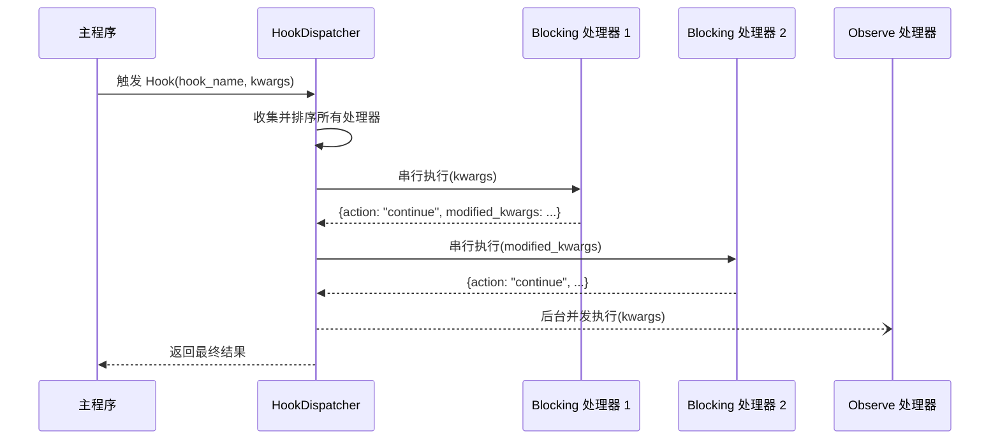

# Hook 处理器

`@HookHandler` 是 MaiBot 插件系统中用于订阅**命名 Hook 点**的组件装饰器。主程序在关键执行点触发命名 Hook，所有订阅该 Hook 的插件处理器按固定规则调度执行，从而实现消息拦截、改写和观察。

::: warning WorkflowStep 已移除
SDK 2.0 中 `WorkflowStep` 已被 `@HookHandler` 取代。旧代码仍在使用 `WorkflowStep` 时会在运行时抛出 `RuntimeError`，这是一个不向后兼容的更改，必须迁移到 `@HookHandler`。
:::

## 装饰器签名

```python
from maibot_sdk import HookHandler
from maibot_sdk.types import HookMode, HookOrder, ErrorPolicy

@HookHandler(
    hook: str,                              # 订阅的命名 Hook 名称（必填）
    *,
    name: str = "",                         # 组件名称，留空时使用方法名
    description: str = "",                  # 组件描述
    mode: HookMode = HookMode.BLOCKING,     # 处理模式
    order: HookOrder = HookOrder.NORMAL,    # 同一模式内的顺序槽位
    timeout_ms: int = 0,                    # 处理器超时（毫秒），0 = 使用 Hook 默认值
    error_policy: ErrorPolicy = ErrorPolicy.SKIP,  # 异常处理策略
    **metadata,                             # 额外元数据
)
```

## 处理模式

### BLOCKING（阻塞模式）

- 串行执行，**可以修改**传入的 `kwargs`
- 返回 `modified_kwargs` 可以更新后续处理器接收的参数
- 返回 `action: "abort"` 可以终止整个 Hook 调用链
- 适合需要拦截或改写消息的场景

### OBSERVE（观察模式）

- 后台并发执行，**只读**旁路观察
- 不参与主流程控制，返回的 `modified_kwargs` 和 `abort` 请求会被忽略
- 适合日志记录、数据分析等不影响主流程的场景

```python
class HookMode(str, Enum):
    BLOCKING = "blocking"  # 同步等待，可修改数据
    OBSERVE = "observe"    # 异步观察，不可修改
```

## 顺序槽位

同一模式内的处理器按 `order` 排序执行：

| 值 | 说明 |
|----|------|
| `HookOrder.EARLY` | 优先执行，适合前置拦截 |
| `HookOrder.NORMAL` | 默认顺序 |
| `HookOrder.LATE` | 延后执行，适合补充处理 |

## 异常处理策略

当处理器抛出异常时，根据 `error_policy` 决定后续行为：

| 值 | 说明 |
|----|------|
| `ErrorPolicy.ABORT` | 异常时终止当前 Hook 调用 |
| `ErrorPolicy.SKIP` | 记录日志，跳过此处理器继续（**默认**） |
| `ErrorPolicy.LOG` | 记录日志，并继续执行后续 hook |

## 调度顺序

Hook 处理器按以下规则全局排序：

1. **模式优先**：`blocking` 先于 `observe`
2. **顺序槽位**：`early` → `normal` → `late`
3. **来源优先**：内置插件先于第三方插件
4. **插件 ID**：按字典序排列
5. **处理器名称**：按字典序排列

## 基本用法

### 阻塞模式示例：拦截并修改消息

```python
from maibot_sdk import MaiBotPlugin, HookHandler
from maibot_sdk.types import HookMode, HookOrder, ErrorPolicy


class MyPlugin(MaiBotPlugin):
    async def on_load(self) -> None:
        self.ctx.logger.info("插件已加载")

    async def on_unload(self) -> None:
        self.ctx.logger.info("插件已卸载")

    async def on_config_update(self, scope: str, config_data: dict, version: str) -> None:
        pass

    @HookHandler(
        "chat.receive.before_process",
        name="message_filter",
        description="过滤入站消息",
        mode=HookMode.BLOCKING,
        order=HookOrder.EARLY,
        error_policy=ErrorPolicy.ABORT,
    )
    async def handle_message_filter(self, **kwargs):
        message = kwargs.get("message", {})
        # 过滤逻辑：如果消息包含敏感词，终止处理链
        raw_message = message.get("raw_message", "")
        if "违禁词" in raw_message:
            self.ctx.logger.info("消息被过滤: %s", raw_message)
            return {"action": "abort"}

        # 修改消息内容后继续
        kwargs["message"]["filtered"] = True
        return {"action": "continue", "modified_kwargs": kwargs}
```

### 观察模式示例：日志记录

```python
from maibot_sdk import MaiBotPlugin, HookHandler
from maibot_sdk.types import HookMode, HookOrder


class LogPlugin(MaiBotPlugin):
    async def on_load(self) -> None:
        self.ctx.logger.info("日志插件已加载")

    async def on_unload(self) -> None:
        self.ctx.logger.info("日志插件已卸载")

    async def on_config_update(self, scope: str, config_data: dict, version: str) -> None:
        pass

    @HookHandler(
        "chat.receive.after_process",
        name="message_logger",
        description="记录所有入站消息",
        mode=HookMode.OBSERVE,
        order=HookOrder.LATE,
    )
    async def observe_message(self, **kwargs):
        message = kwargs.get("message", {})
        self.ctx.logger.info(
            "观察到消息: user=%s, text=%s",
            message.get("user_id", "unknown"),
            message.get("raw_message", ""),
        )
        # observe 模式返回值会被忽略
```

### 阻塞模式示例：修改发送参数

```python
from maibot_sdk import MaiBotPlugin, HookHandler
from maibot_sdk.types import HookMode, HookOrder


class SendInterceptorPlugin(MaiBotPlugin):
    async def on_load(self) -> None:
        self.ctx.logger.info("发送拦截插件已加载")

    async def on_unload(self) -> None:
        self.ctx.logger.info("发送拦截插件已卸载")

    async def on_config_update(self, scope: str, config_data: dict, version: str) -> None:
        pass

    @HookHandler(
        "send_service.before_send",
        name="send_modifier",
        description="修改发送参数",
        mode=HookMode.BLOCKING,
        order=HookOrder.NORMAL,
        timeout_ms=5000,
    )
    async def modify_send_params(self, **kwargs):
        # 禁用打字效果，强制开启发送日志
        kwargs["typing"] = False
        kwargs["show_log"] = True
        return {"action": "continue", "modified_kwargs": kwargs}
```

## 内置 Hook 清单

以下为 Host 运行时中心表注册的全部 Hook 点。每个 Hook 注明是否允许 abort（中止调用链）和是否允许改参（修改后续处理器接收的 kwargs）。

### 聊天消息链

| Hook 名称 | 触发时机 | 允许 abort | 允许改参 |
|-----------|----------|-----------|---------|
| `chat.receive.before_process` | 入站消息执行 `SessionMessage.process()` 前 | 是 | 是 |
| `chat.receive.after_process` | 入站消息轻量预处理完成后 | 是 | 是 |

### 命令执行链

| Hook 名称 | 触发时机 | 允许 abort | 允许改参 |
|-----------|----------|-----------|---------|
| `chat.command.before_execute` | 命令匹配成功、正式执行前 | 是 | 是 |
| `chat.command.after_execute` | 命令执行结束后 | 否 | 是 |

### 表情包链

| Hook 名称 | 触发时机 | 允许 abort | 允许改参 |
|-----------|----------|-----------|---------|
| `emoji.maisaka.before_select` | Maisaka 选择表情前 | 是 | 是 |
| `emoji.maisaka.after_select` | Maisaka 选出表情后 | 是 | 是 |
| `emoji.register.after_build_description` | 表情包描述生成完成后 | 是 | 是 |
| `emoji.register.after_build_emotion` | 表情包情绪标签生成完成后 | 是 | 是 |

### 黑话（Jargon）链

| Hook 名称 | 触发时机 | 允许 abort | 允许改参 |
|-----------|----------|-----------|---------|
| `jargon.query.before_search` | Maisaka 黑话查询前 | 是 | 是 |
| `jargon.query.after_search` | Maisaka 黑话查询完成后 | 是 | 是 |
| `jargon.extract.before_persist` | 黑话条目写库前 | 是 | 是 |
| `jargon.inference.before_finalize` | 黑话推断结果写回前 | 是 | 是 |

### 表达方式（Expression）链

| Hook 名称 | 触发时机 | 允许 abort | 允许改参 |
|-----------|----------|-----------|---------|
| `expression.select.before_select` | 表达方式选择前 | 是 | 是 |
| `expression.select.after_selection` | 表达方式选择完成后 | 是 | 是 |
| `expression.learn.after_extract` | 表达方式学习解析候选后 | 是 | 是 |
| `expression.learn.before_upsert` | 表达方式写库前 | 是 | 是 |

### 发送服务链

| Hook 名称 | 触发时机 | 允许 abort | 允许改参 |
|-----------|----------|-----------|---------|
| `send_service.after_build_message` | 出站 `SessionMessage` 构建完成后 | 是 | 是 |
| `send_service.before_send` | 调用 Platform IO 发送前 | 是 | 是 |
| `send_service.after_send` | 发送流程完成后 | 否 | 否 |

### Maisaka 规划器链

| Hook 名称 | 触发时机 | 允许 abort | 允许改参 |
|-----------|----------|-----------|---------|
| `maisaka.planner.before_request` | Maisaka 规划器请求模型前 | 否 | 是 |
| `maisaka.planner.after_response` | Maisaka 收到模型响应后 | 否 | 是 |

## Host 校验规则

Host 在插件注册阶段会对 `@HookHandler` 声明进行校验，不合法时插件直接注册失败（而非"加载成功但 Hook 不生效"的半成功状态）。校验规则如下：

1. **Hook 名称必须已注册**：`hook` 参数必须是上述内置 Hook 清单中已存在的名称。传入未注册的 Hook 名称会导致注册失败。
2. **mode 必须符合 Hook 的能力约束**：Host 会检查 `mode` 是否与该 Hook 点的能力兼容（例如，仅允许改参的 Hook 不能以不可改参的模式运行）。
3. **error_policy=ABORT 须 Hook 允许 abort**：只有当该 Hook 的"允许 abort"列为"是"时，才能声明 `error_policy=ErrorPolicy.ABORT`。对于不允许 abort 的 Hook 声明 `ABORT` 策略将导致注册失败。

运行时 Host 会将这份 Hook 清单公开给 WebUI 后端路由 `/plugins/runtime/hooks`，便于面板或调试工具直接读取动态中心表。

### 表达方式选择链

| Hook 名称 | 触发时机 |
|-----------|----------|
| `expression.select.before_select` | 表达候选池载入后、默认选择结果生成前；可改写 `candidates`、`max_num` 或 `abort` 跳过本次选择 |
| `expression.select.after_selection` | 默认选择结果生成后；可改写 `selected_expression_ids` 或 `selected_expressions` |

`before_select` 会收到 `chat_id`、`session_id`、`chat_info`、`chat_history`、`reply_message`、`reply_tool_args`、`target_message`、`reply_reason`、`max_num`、`think_level`、`candidates`。`reply_tool_args` 包含 reply 工具里除 `msg_id`、`set_quote`、`reference_info` 外的额外参数。`after_selection` 在此基础上额外包含 `selected_expression_ids` 与 `selected_expressions`。

```python
@HookHandler("expression.select.after_selection", mode=HookMode.BLOCKING)
async def replace_expression_selection(self, **kwargs):
    strategy = kwargs.get("reply_tool_args", {}).get("expression_strategy")
    candidates = kwargs.get("candidates", [])
    selected_ids = [item["id"] for item in candidates[:1]]
    kwargs["selected_expression_ids"] = selected_ids
    return {"action": "continue", "modified_kwargs": kwargs}
```

## 处理器返回值

阻塞模式的处理器可以返回字典来控制后续流程：

| 返回字段 | 类型 | 说明 |
|---------|------|------|
| `action` | `str` | `"continue"` 继续调用链，`"abort"` 终止调用链 |
| `modified_kwargs` | `dict` | 修改后的参数，将传递给后续处理器 |

观察模式的处理器返回值会被忽略，不需要返回控制字典。

## Hook 分发流程



## 迁移指南：WorkflowStep → HookHandler

| 旧 API | 新 API | 说明 |
|--------|--------|------|
| `@WorkflowStep(stage="pre_process")` | `@HookHandler("chat.receive.before_process")` | 使用命名 Hook 点代替固定 stage |
| `blocking=True` | `mode=HookMode.BLOCKING` | 参数名变更 |
| `observe=True` | `mode=HookMode.OBSERVE` | 参数名变更 |
| `priority=10` | `order=HookOrder.EARLY` | 改为三档枚举 |

::: danger
直接调用 `WorkflowStep(...)` 现在会立即抛出 `RuntimeError`，不存在兼容映射。必须手动将所有 `@WorkflowStep` 替换为 `@HookHandler`。
:::

```python
# 旧代码（SDK 1.x）— 不再可用
@WorkflowStep(stage="pre_process", blocking=True)
async def on_pre_process(self, **kwargs):
    ...

# 新代码（SDK 2.0）
@HookHandler("chat.receive.before_process", mode=HookMode.BLOCKING)
async def on_pre_process(self, **kwargs):
    ...
```
