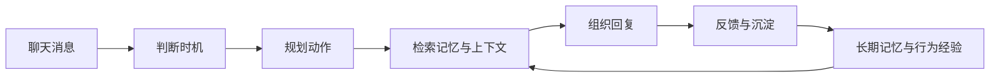

---
title: MaiBot 1.0.0 Update Special
description: User-side update overview for MaiBot 1.0.0, covering Maisaka, 
  A_Memorix, Dashboard, plugins, multi-modal capabilities, and stability 
  improvements.
---# MaiBot 1.0.0 Update Special Topic

MaiBot 1.0.0 is a systemic upgrade focused on the long-term user experience. Rather than simply adding toggles to existing features, it re-integrates responses, memory, plugins, WebUI, image resources, and debug observation into a more complete daily usage workflow.

  

    <strong>更自然的聊天</strong>
    Maisaka 会观察上下文、判断时机、选择工具，再生成回复。
  

  

    <strong>更可靠的记忆</strong>
    A_Memorix 将长期记忆、证据、人物画像和知识来源统一管理。
  

  

    <strong>更完整的 WebUI</strong>
    Dashboard 成为配置、管理、观测和排查问题的统一工作台。
  

## What has changed in this upgrade

After 1.0.0, MaiMai is more like a chat agent capable of continuous work. She can decide whether to speak based on the chat scenario, maintain summaries in long conversations, carry image and tool return content back into the context, and understand more stable background information through long-term memory and persona profiles.

For users, the most direct changes are: responses have a better rhythm, memory is easier to maintain, the WebUI manages a more comprehensive range of functions, and plugins and image resources are less likely to become a burden during long-term operation.

## Maisaka Response Core

Maisaka is the most core change in 1.0.0. After MaiMai receives a message, she first judges whether action is needed based on the chat rhythm and context, then decides whether to wait, reply, call a tool, send an image, or remain silent.

**Responses feel more like a continuous exchange**
Response links for group chats, private chats, and WebUI local chats are further unified. Quote replies, waiting, typing rhythms, non-response strategies, and response splitting have been reorganized to reduce sudden interruptions, empty replies, and meaningless actions.

**Long conversations are less likely to lose track**
Mid-term memory compresses longer chats into summaries, which remain available in subsequent contexts. For chats lasting several hours or longer, it is easier for MaiMai to retain key content discussed previously.

**Multimodal content can continue to participate in conversations**
Images, forwarded messages, complex messages, and media content returned by tools enter the context more stably. Whether the model carries images is determined by configuration and model capabilities, reducing request issues caused by non-vision models mistakenly receiving images.

## A_Memorix Memory System

A_Memorix becomes the main line for long-term memory in 1.0.0. The new memory system no longer just saves scattered text, but places paragraphs, entities, relationships, sources, vectors, and graphs within the same structure.

**Memory has sources and can be corrected**
Persona profiles, facts, relationships, and knowledge snippets attempt to preserve source evidence. In the WebUI, you can view the evidence chain and correction history; when outdated or incorrect memories are found, the correction loop ensures more accurate subsequent retrieval.

**Retrieval prioritizes scenario relevance**
Long-term memory retrieval integrates vectors, graph relationships, BM25, PageRank, and threshold filtering. The goal is to reduce irrelevant memories entering the response context, making MaiMai more frequently recall "the content actually needed for this specific chat."

**Knowledge base maintenance is better suited for long-term use**
Historical chat summaries can be imported into long-term memory, and web/document imports are more stable. The processes for deleting knowledge sources, re-importing, expiration cleaning, and batch importing are more complete, making it suitable to maintain MaiMai as a long-term companion or knowledge assistant.

## Dashboard New Workbench

The 1.0.0 Dashboard is not just a settings page, but a new management workbench. Chat, configuration, plugins, memory, knowledge base, statistics, monitoring, logs, reasoning processes, and system settings all enter through a unified entry point.

  <section>
    <h3>配置管理</h3>
    
动态表单、数字草稿输入、列表、JSON、extra params、模型任务配置和插件原始 TOML 编辑都可以在 WebUI 中完成。

  </section>
  <section>
    <h3>动态发言频率</h3>
    
按平台、聊天流、聊天类型和时间段配置麦麦活跃节奏，并通过可视化时间轴理解规则优先级。

  </section>
  <section>
    <h3>推理过程</h3>
    
可以查看阶段、工具调用、prompt 预览、请求模型、推理耗时、动作摘要，并在多份记录之间连续导航。

  </section>
  <section>
    <h3>本地缓存</h3>
    
数据库、图片缓存、表情包缓存、日志目录和 data 目录都能查看与清理，数据库还支持按表清理和 VACUUM。

  </section>

The WebUI's themes, sidebar, buttons, forms, pop-ups, mobile layout, and long-content display have also undergone multiple rounds of polishing. For ordinary users, it feels more like a console that can be opened for daily use; for those troubleshooting, it can tell you faster "why MaiMai just did that."

## Plugins, MCP, and Tools

The plugin system in 1.0.0 has been refactored into an independent `plugin_runtime`. Plugins can be started, stopped, and reloaded independently, and their running status is displayed; the plugin market can also show READMEs, categories, icons, ratings, and random recommendations.

For plugin users, installation, starting/stopping, configuration, updating, and error localization are more intuitive. For plugin developers, plugins can access host messages, chat streams, configurations, runtime data, embedding capabilities, and LLM provider adaptation capabilities, allowing them to do more and collaborate more easily with the main program.

MCP capabilities have also entered the main line. MaiBot can load MCP tools, Prompts, and Resources, and call the main program model via the Host LLM Bridge. The connection process is more stable even when third-party MCP services output extra logs or lack some optional interfaces.

## Images, Stickers, and Multimodality

1.0.0 has made several long-term operation optimizations for images and stickers. WebUI chat supports sending image messages, inbound large images can be compressed or discarded based on configuration, image caches can be cleaned automatically, and images can be filtered by date, previewed, deleted individually, or deleted in batches.

Sticker management has been upgraded to status perspectives such as "Known," "Unknown," "Appropriate for Self," and "Discard," and supports management by status, format, and tag. Processes for duplicate uploads, recognition failure, deregistration, replacement, and deletion are more stable; counting occurs only after successful sending, making statistics more reliable.

## Performance, Stability, and Security

1.0.0 includes many invisible but important adjustments for long-term operation.

**Faster Startup**
Non-critical services will initialize later, reducing blocking steps during startup.

**More Stable Operation**
Response splitting, Timing Gate, Planner coordination, blank message filtering, and tool call history cleaning have been optimized to reduce invalid actions, empty replies, and provider format errors.

**More Controllable Resources**
The log system adds upper limits and cleaning capabilities, Prompt previews no longer inline large image data by default, and the statistics system has reduced memory pressure under large data volumes.

**More Secure WebUI**
Authentication, path validation, URL validation, static resource access, and anti-scraping strategies have been strengthened, making it less likely to expose content that should not be exposed when deployed on the public internet or local area network.

## Related Documentation

- [How MaiBot Thinks](../manual/features/maisaka-reasoning.md)
- [MaiBot's Memory](../manual/features/memory-system.md)
- [WebUI Management Panel](../manual/webui/index.md)
- [Plugin Management](../manual/webui/plugin-management.md)
- [MCP Tools](../manual/features/mcp.md)
- [Full Changelog](./index.md)

