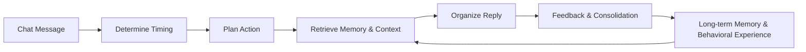

# MaiBot 1.0.0 Update Feature

MaiBot 1.0.0 is a systematic upgrade designed for long-term usage experience. Rather than simply adding switches to existing features, it restructures replying, memory, plugins, WebUI, image resources, and debugging/observation into a more complete daily workflow.

  

    <strong>更自然的聊天</strong>
    Maisaka 会观察上下文、判断时机、选择工具，再生成回复。
  

  

    <strong>更可靠的记忆</strong>
    A_Memorix 将长期记忆、证据、人物画像和知识来源统一管理。
  

  

    <strong>更完整的 WebUI</strong>
    Dashboard 成为配置、管理、观测和排查问题的统一工作台。
  

## What This Upgrade Changes

After 1.0.0, Mai is more like a chat agent capable of sustained work. She decides whether to speak based on the chat context, retains summaries in long conversations, feeds images and tool outputs back into the context, and understands more stable background information through long-term memory and persona profiles.

For users, the most direct changes are: replies have better pacing, memory is easier to maintain, the WebUI covers a more complete management scope, and plugins and image resources are less likely to become a burden during long-term operation.

## Maisaka Reply Core

Maisaka is the most core change in 1.0.0. After receiving a message, Mai first determines whether action is needed based on the chat rhythm and context, then decides whether to wait, reply, call a tool, send an image, or stay quiet.

**Replies feel more like continuous conversation**  
The reply pipeline for group chats, private chats, and WebUI local chats is further unified. Quote replies, waiting, typing rhythm, no-reply strategies, and reply splitting have been reorganized to reduce sudden interruptions, empty replies, and meaningless actions.

**Long conversations are less likely to lose context**  
Medium-term memory compresses longer chats into summaries, which remain available in subsequent contexts. For chats lasting several hours or more, Mai is better at retaining key content discussed earlier.

**Multimodal content can continue participating in conversations**  
Images, forwarded messages, complex messages, and media content returned by tools enter the context more stably. Whether the model carries images is determined based on configuration and model capabilities, reducing request errors caused by non-vision models mistakenly receiving images.

## A_Memorix Memory System

A_Memorix becomes the main long-term memory line in 1.0.0. The new memory system no longer just saves scattered text, but places paragraphs, entities, relationships, sources, vectors, and graphs into the same structure.

**Memory has sources and can be corrected**  
Persona profiles, facts, relationships, and knowledge fragments will try to retain source evidence. In the WebUI, you can view evidence chains and correction history. When outdated or incorrect memories are found, the correction closed loop can make subsequent retrieval more accurate.

**Retrieval focuses more on contextual relevance**  
Long-term memory retrieval integrates vector, graph relationships, BM25, PageRank, and threshold filtering, aiming to reduce irrelevant memories entering the reply context, making Mai more likely to recall "what is truly needed for this chat."

**Knowledge base maintenance is more suited for long-term use**  
Historical chat summaries can be imported into long-term memory, and web and document imports are more stable. The workflows for deleting knowledge sources, re-importing, invalidation cleanup, and batch importing are more complete, suitable for maintaining Mai as a long-term companion or knowledge assistant.

## Dashboard New Workspace

The 1.0.0 Dashboard is not just a settings page, but a new management workspace. Chat, configuration, plugins, memory, knowledge base, statistics, monitoring, logs, reasoning processes, and system settings have all entered a unified entry point.

  <section>
    <h3>配置管理</h3>
    
动态表单、数字草稿输入、列表、JSON、extra params、模型任务配置和插件原始 TOML 编辑都可以在 WebUI 中完成。

  </section>
  <section>
    <h3>动态发言频率</h3>
    
按平台、聊天流、聊天类型和时间段配置麦麦活跃节奏，并通过可视化时间轴理解规则优先级。

  </section>
  <section>
    <h3>推理过程</h3>
    
可以查看阶段、工具调用、prompt 预览、请求模型、推理耗时、动作摘要，并在多份记录之间连续导航。

  </section>
  <section>
    <h3>本地缓存</h3>
    
数据库、图片缓存、表情包缓存、日志目录和 data 目录都能查看与清理，数据库还支持按表清理和 VACUUM。

  </section>

The WebUI's theme, sidebar, buttons, forms, popups, mobile layout, and long content display have also undergone multiple rounds of polishing. For regular users, it feels more like a console for daily use; for those troubleshooting issues, it can tell you faster "why Mai just did that."

## Plugins, MCP, and Tools

The plugin system has been restructured in 1.0.0 into an independent `plugin_runtime`. Plugins can be independently started, stopped, reloaded, and display their running status; the plugin marketplace can also display READMEs, categories, icons, ratings, and random recommendations.

For plugin users, installing, starting/stopping, configuring, updating, and locating errors are more intuitive. For plugin developers, plugins can access host messages, chat streams, configurations, runtime data, embedding capabilities, and LLM provider adapters, allowing them to do more and collaborate more easily with the main program.

MCP capabilities have also entered the mainline. MaiBot can load MCP tools, prompts, and resources, and call the main program's model via the Host LLM Bridge. The connection process is also more stable when third-party MCP services output extra logs or lack some optional interfaces.

## Images, Stickers, and Multimodal

1.0.0 has made many long-term operation-oriented improvements to images and stickers. WebUI chat supports sending image messages, inbound large images can be compressed or dropped based on configuration, image caches can be automatically cleaned, and can also be filtered by date, previewed, deleted individually, or deleted in bulk.

Sticker management has been upgraded to a state perspective such as "recognized," "unrecognized," "claim as own," and "discard," and supports management by state, format, and tag. The workflows for duplicate uploads, recognition failures, unregistration, replacement, and deletion are more stable. Counting only occurs after successful sending, making statistics more reliable.

## Performance, Stability, and Security

1.0.0 includes many invisible but important adjustments for long-term operation.

**Faster startup**  
Non-critical services will have their initialization delayed, reducing blocking steps during startup.

**More stable operation**  
Reply splitting, Planner coordination, blank message filtering, and tool call history cleanup have all been optimized, reducing invalid actions, empty replies, and provider format errors.

**More controllable resources**  
The logging system adds limits and cleanup capabilities, Prompt previews no longer inline large image data by default, and the statistics system also reduces memory pressure under large data volumes.

**Safer WebUI**  
Authentication, path validation, URL validation, static resource access, and anti-scraping strategies have been strengthened, making it less likely to expose unintended content when deployed on public networks or LANs.

## Related Documentation

- [How MaiBot Thinks](../manual/features/maisaka-reasoning.md)
- [MaiBot's Memory](../manual/features/memory-system.md)
- [WebUI Management Panel](../manual/webui/index.md)
- [Plugin Management](../manual/webui/plugin-management.md)
- [MCP Tools](../manual/features/mcp.md)
- [Full Changelog](./index.md)

