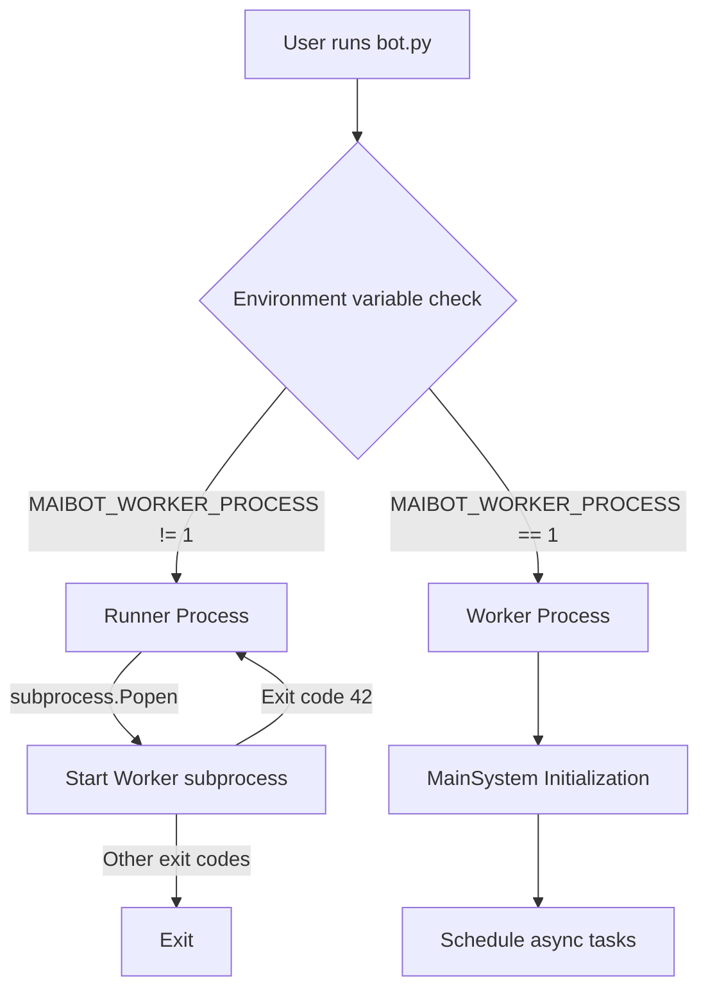
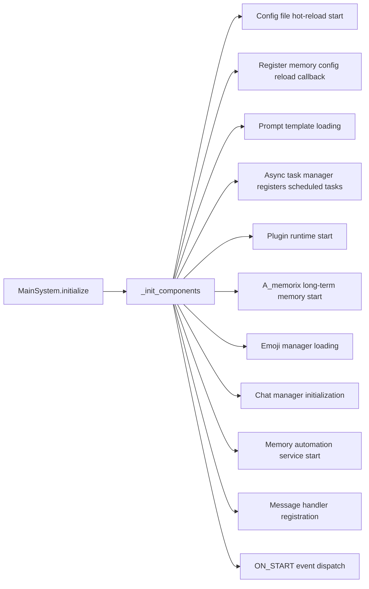

# Architecture Design

This document is based on the code-map snapshot and serves as the navigation center for the architecture documentation. It breaks down MaiBot's architecture into 12 topical documents and connects the main entry points using the Runner/Worker process model and the MainSystem initialization flow.

## Quick Entry

**Message Processing Pipeline**: The complete chain from platform message inbound to outbound sending, see [Message Pipeline](architecture/message-pipeline.md).

**Plugin Runtime Architecture**: Plugin lifecycle, Host/Runner dual-process communication, component registration, and Hook dispatch, see [Plugin Development Documentation](../plugin/), [Lifecycle](../plugin/lifecycle.md), [Tools](../plugin/tools.md), [Hooks](../plugin/hooks.md).

**Platform IO Architecture**: Sending, receiving, routing, deduplication, and outbound tracking between MaiBot and adapters, see [PlatformIO Driver Development](./adapter-dev/platform-io.md).

**Event Bus (EventBus)**: The Event Bus (EventBus) is MaiBot's system-wide communication hub, providing a publish/subscribe model that supports both intercepting (synchronous sequential) and non-intercepting (asynchronous concurrent) event handlers. See [Event Bus Architecture](architecture/event-bus.md).

**Tool Abstraction Layer (Tool System)**: The Tool Abstraction Layer (Tool System) uniformly manages four tool sources: Plugin @Tool, legacy @Action (auto-converted), MaiSaka built-in Tool, and MCP Tool, providing a unified ToolProvider interface. See [Tool System Architecture](architecture/tool-system.md).

## Runner/Worker Process Model

MaiBot implements the Runner/Worker dual-process model via `bot.py`:

- **Runner Process**: The daemon process responsible for starting and monitoring the Worker subprocess. When the Worker exits with exit code 42, the Runner automatically restarts the Worker (hot restart mechanism). When the Runner receives a Ctrl+C signal, it gracefully terminates the Worker.
- **Worker Process**: The process that actually executes the business logic. After setting the environment variable `MAIBOT_WORKER_PROCESS=1`, it enters Worker mode, executing `MainSystem`'s initialization and task scheduling.

## MainSystem Initialization Flow

`MainSystem.initialize()` serially initializes components via `await`:

Core initialization sequence:

1. Start the configuration file hot-reload watcher
2. Register A_memorix configuration reload callback (`register_config_reload_callback()`)
3. Load Prompt templates
4. Register scheduled tasks (online time statistics, statistics output, telemetry heartbeat)
5. Start the plugin runtime (`PluginRuntimeManager.start()`), establishing dual subprocesses (built-in plugins + third-party plugins)
6. Start the A_memorix long-term memory service
7. Load the emoji manager
8. Initialize the chat manager
9. Start the memory automation service (`memory_automation_service.start()`)
10. Register `ChatBot.message_process` to the message API server
11. Trigger the `ON_START` event (`event_bus.emit`) and dispatch it to the plugin runtime (`bridge_event`)

`schedule_tasks()` then starts the continuously running services: periodic emoji maintenance, message API server, and message server.

## New Architecture Entries

**[Event Bus Architecture](architecture/event-bus.md)**: The Event Bus (EventBus) is MaiBot's system-wide communication hub, providing a publish/subscribe model that supports both intercepting (synchronous sequential) and non-intercepting (asynchronous concurrent) event handlers. See [Event Bus Architecture](architecture/event-bus.md).

**[Tool System Architecture](architecture/tool-system.md)**: The tool abstraction layer uniformly manages four tool sources: Plugin @Tool, legacy @Action (auto-converted), MaiSaka built-in Tool, and MCP Tool, and connects them to the reasoning and execution chain via the ToolProvider interface. See [Tool System Architecture](architecture/tool-system.md).

**[Service Layer Architecture](architecture/service-layer.md)**: The service layer encapsulates business capabilities such as LLM calls, memory operations, message sending, database access, and statistics aggregation into reusable services, preventing upper-level modules from directly coupling with underlying implementations. See [Service Layer Architecture](architecture/service-layer.md).

**[Expression Learning Architecture](architecture/expression-learning.md)**: Expression learning precipitates behavioral patterns, slang, and expression preferences from conversations, allowing MaiBot's reply style to adapt to the user's context over time. See [Expression Learning Architecture](architecture/expression-learning.md).

**[Emoji System Internals Architecture](architecture/emoji-internals.md)**: The emoji system manages the loading, matching, and generation of emojis, serving as an important source of material for message semantic understanding and personalized replies. See [Emoji System Internals Architecture](architecture/emoji-internals.md).

**[MCP Integration Architecture](architecture/mcp-integration.md)**: MCP integration connects to external MCP Servers, incorporating remote tool capabilities into the unified Tool System, expanding the boundaries of tools callable by the model. See [MCP Integration Architecture](architecture/mcp-integration.md).

**[Prompt Template System](architecture/prompt-templates.md)**: The Prompt template system is responsible for loading and managing system prompts, task templates, and runtime parameters, influencing the context organization method of the reasoning engine. See [Prompt Template System](architecture/prompt-templates.md).

**[Global Managers Architecture](architecture/global-managers.md)**: Global managers centrally maintain cross-module shared async tasks, configuration states, and runtime services, reducing entry orchestration complexity. See [Global Managers Architecture](architecture/global-managers.md).

## Message Processing Pipeline

The message processing pipeline is MaiBot's main link from platform inbound to final sending, covering message preprocessing, session management, command execution, flow scheduling, Maisaka reasoning, reply generation, and Platform IO sending. For detailed stages, data structures, Hook interception points, and outbound processes, please read [Message Pipeline](architecture/message-pipeline.md).

## Plugin Runtime Architecture

The plugin runtime adopts a dual-subprocess isolation model consisting of a Host main process plus two Runner subprocesses, managing built-in plugins, third-party plugins, component registration, and Hook dispatch via msgpack IPC and RPC. For complete design, development constraints, and component APIs, please refer to [Plugin Development Documentation](../plugin/), focusing on [Lifecycle](../plugin/lifecycle.md), [Tools](../plugin/tools.md), [Commands](../plugin/commands.md), [Hooks](../plugin/hooks.md), [Event Handlers](../plugin/event-handlers.md), and [Message Gateway](../plugin/message-gateway.md).

## Platform IO Architecture

Platform IO is the middleware between MaiBot and platform adapters, responsible for RouteKey resolution, send and receive routing, driver registration, inbound deduplication, and outbound tracking. For adapter implementation and driver interfaces, please read [PlatformIO Driver Development](./adapter-dev/platform-io.md).

## Document Index for This Section

**Base Domain (Wave 1)**: Underlying infrastructure, providing communication, tool abstraction, and the system runtime foundation.
  : [Event Bus Architecture](architecture/event-bus.md): MaiBot's system-wide event communication hub, providing a publish/subscribe model and both intercepting and non-intercepting handlers.
  : [Tool System Architecture](architecture/tool-system.md): Unified abstraction layer for four tool sources, connecting plugins, legacy Actions, MaiSaka built-in tools, and MCP tools via the ToolProvider interface.

**Core Functionality Domain (Wave 2)**: Message processing, reasoning, memory, WebUI, and service encapsulation form MaiBot's primary business chain.
  : [Message Pipeline](architecture/message-pipeline.md): The complete chain from platform message inbound to outbound sending, including preprocessing, session, commands, flow, reasoning, and sending Hooks.
  : [Maisaka Reasoning Engine](architecture/maisaka-reasoning.md): MaiBot's core AI runtime, responsible for dialogue reasoning, pacing control, LLM requests, and tool call loops.
  : [Memory System (A-Memorix)](architecture/memory-system.md): MaiBot's long-term memory subsystem, responsible for persistence, embedding, graph retrieval, persona portraits, and memory strategies.
  : [WebUI Internals](architecture/webui-internals.md): FastAPI-based Web management backend, covering authentication, routing, WebSocket, plugin runtime IPC, and security mechanisms.
  : [Service Layer Architecture](architecture/service-layer.md): Encapsulates business services such as LLM calls, memory operations, message sending, database access, and statistics aggregation for reuse by upper-level modules.

**Auxiliary Functionality Domain (Wave 3)**: Enhanced capability modules that can be enabled, replaced, or extended according to deployment needs.
  : [Expression Learning Architecture](architecture/expression-learning.md): Learns behavioral patterns, slang, and expression preferences from conversations, providing continuously updated style material for personalized replies.
  : [Emoji System Internals Architecture](architecture/emoji-internals.md): Manages emoji loading, matching, and generation, providing visual expression material for message understanding and reply generation.
  : [MCP Integration Architecture](architecture/mcp-integration.md): Connects to external MCP Servers, integrating remote tool capabilities into the unified Tool System.
  : [Prompt Template System](architecture/prompt-templates.md): Manages Prompt template loading, parameterization, and runtime updates, supporting the context organization of the reasoning engine.
  : [Global Managers Architecture](architecture/global-managers.md): Centrally manages cross-module async tasks, configuration states, and runtime services, reducing entry orchestration complexity.
