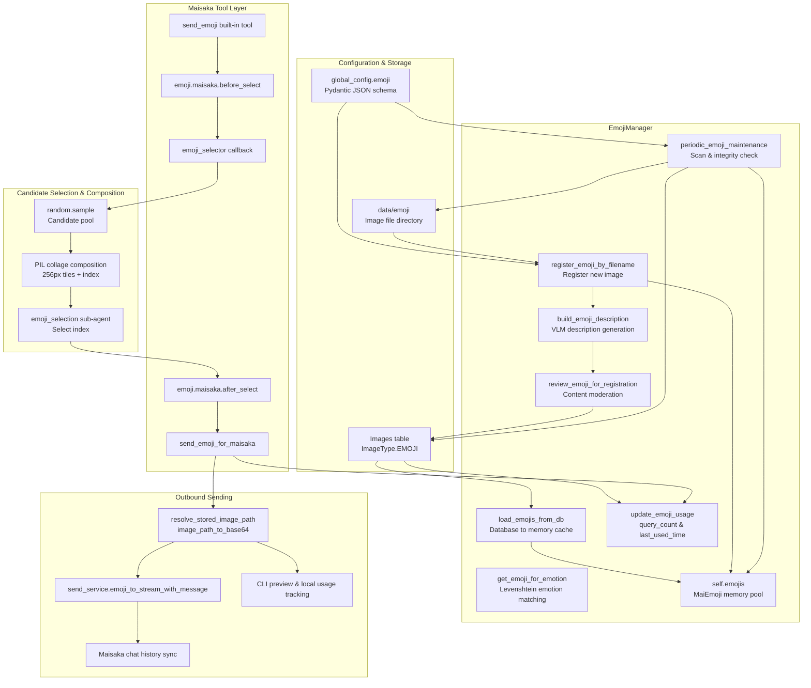

# Emoji System Internals

This document is written based on a code-map snapshot.

This document is intended for developers. It explains the collaboration between the `emoji_system/` directory, the `send_emoji` built-in tool, the emoji database, the in-memory cache, VLM description generation, PIL collage composition, and periodic maintenance. It complements the user-facing perspective in `docs/manual/features/emoji-system.md`, does not repeat how to manage emoji packs, and does not treat WebUI operations as internal implementation.

## Overview

**Positioning**: The emoji system is the visual expression material layer of MaiBot. It organizes image files, database records, emotion tags, usage counts, and maintenance states into capabilities callable by the reasoning engine.

**Core Singleton**: `EmojiManager` is the centralized manager for emoji packs. It holds the `self.emojis` in-memory pool, maintains `self._emoji_num`, registers configuration hot-reload callbacks, and dispatches description building and periodic maintenance tasks.

**User Boundary**: The user documentation explains "when emojis are sent, how to upload and review them." This document explains "why a particular image is selected, how an image becomes base64, and how usage counts are written to the database."

**Implementation Boundary**: The current implementation does not directly hand emoji selection weights to `ExpressionLearner`. Emojis have `query_count` and `last_used_time`, while expression learning has `Expression.count` and `last_active_time` — the two are indirectly related through Maisaka's context and tool calls.

**Primary Inputs**: Configuration items, `Images` records in the database, images in the `data/emoji` directory, Maisaka reasoning context, tool call parameters, and Hook return values.

**Primary Outputs**: Selected `MaiEmoji` object, base64 image, sent service message, usage count updates, description cache, maintenance logs, and monitoring metadata.

## Architecture Diagram

## Core Concepts

**`EmojiManager`**: The emoji lifecycle manager. It does not directly represent a single image, but strings together the database, filesystem, in-memory cache, VLM calls, Hooks, and periodic maintenance.

**`MaiEmoji`**: The runtime emoji object. It contains `full_path`, `file_name`, `file_hash`, `image_format`, `description`, `emotion`, `query_count`, `register_time`, and `last_used_time`.

**`file_hash`**: The image identity. It is computed via SHA256 and used as the primary database index, for in-memory lookup, Hook serialization, and usage statistics after successful sending.

**`description`**: Comma-separated description or tag text. It is typically generated by VLM, but can also come from database cache, WebUI upload, or Hook modification.

**`emotion`**: A list of tags normalized from `description`. Normalization splits on Chinese commas, Chinese enumeration commas, semicolons, and newlines, and deduplicates.

**`query_count`**: The cumulative count of times an emoji has actually been sent. It is used for popularity statistics and, during full-capacity replacement, as a weight source favoring low-usage candidates.

**`last_used_time`**: The timestamp of the most recent actual send. It is used for maintenance, sorting, and developer investigation of usage frequency.

**`is_registered`**: Database registration status. Only records that are registered, not banned, and whose files exist enter the sendable in-memory pool.

**`is_banned`**: Ban status. Banned emojis are not loaded into `self.emojis` and are not sent through the normal selection flow.

**`no_file_flag`**: File missing flag. When deleting and keeping the description cache, this flag is set; unregistered records can continue to exist as description caches.

**`vlm_processed`**: VLM processing flag. Automated maintenance uses this to avoid repeatedly consuming vision model quota on already-processed files from the same batch.

**`EMOJI_DIR`**: The `data/emoji` directory. Newly collected emojis, temporary files, and registered files all land here.

**`Images` table**: The general image database table. Emojis use `image_type = ImageType.EMOJI` to distinguish themselves from ordinary images.

**JSON Configuration Entry**: `EmojiConfig` exposes a JSON schema through the Pydantic configuration model, read at runtime via `global_config.emoji`. When the documentation says "JSON configuration," it refers to these structured configuration items, not JSON embedded in image files.

**Model Task Configuration**: VLM description, content moderation, and selection sub-agents depend on `model_task_config`. `emoji_manager_vlm` uses `task_name="vlm"`, `emoji_manager_emotion_judge_llm` uses `task_name="utils"`.

**In-Memory Cache**: `emoji_manager.emojis` is the sendable pool. It is not a complete database mirror — it only contains currently available, registered, unbanned, filed `MaiEmoji` objects.

**Hook Payload**: `_serialize_emoji_for_hook()` converts `file_hash`, `file_name`, `full_path`, `description`, `emotions`, and `query_count` into a dictionary that plugins can receive.

## Emoji Loading

**Loading Entry**: `load_emojis_from_db()` reads registered emojis from the database into memory during startup.

**Database Scan**: It queries all `Images` records, skipping any that are not `ImageType.EMOJI`.

**Registration Filter**: Only records with `is_registered=True` and `is_banned=False` enter the candidate list.

**File Validation**: A record marked with `no_file_flag`, or for which `resolve_stored_image_path()` cannot find the actual file, is treated as a broken registration record.

**Memory Construction**: Available records are converted to runtime objects via `MaiEmoji.from_db_instance()` and then appended to `self.emojis`.

**Count Sync**: After loading finishes, `self._emoji_num` is set to `len(self.emojis)`. Subsequent maintenance loops depend on this count to determine whether new emojis can still be collected.

**Broken Record Cleanup**: Broken registered records are deleted from the database, and the cleanup count is logged. Unregistered records missing files are not loaded as sendable emojis.

**Registration Entry**: `register_emoji_by_filename()` is used to register images from `data/emoji` into the database and memory pool.

**Path Normalization**: During registration, `Path(filename).absolute().resolve()` is called first to ensure stable path comparisons and file access.

**Image Initialization**: `MaiEmoji(full_path=file_full_path)` validates that the file exists and records the directory and filename.

**Hash & Format**: `calculate_hash_format()` reads the image bytes, computes SHA256, identifies the actual format, and renames the file if the extension does not match.

**Database Deduplication**: Before registration, existing records are queried by `image_hash` and `ImageType.EMOJI`. Banned records are skipped entirely; registered records with available files are also skipped.

**Description Reuse**: If the database already has a `description`, the registration flow converts the cached description into `target_emoji.description` and `target_emoji.emotion`.

**Description Generation**: When no description exists, `build_emoji_description()` is called to extract up to 5 emotion or scene tags using VLM.

**Content Moderation**: When `content_filtration` is enabled, `review_emoji_for_registration()` converts the image to base64 and calls the VLM for review. A response containing "no" rejects the registration.

**Capacity Control**: If `self._emoji_num` reaches `max_reg_num` and `do_replace=True`, the replacement flow is entered.

**Replacement Strategy**: `replace_an_emoji_by_llm()` uses `1 / (query_count + 1)` as a low-usage priority probability, selects up to 20 candidates, and then lets the LLM decide which index to unregister.

**Registration Write to Database**: `register_emoji_to_db()` writes an `Images` record, setting `is_registered=True`, `is_banned=False`, `no_file_flag=False`, and saving the path, description, usage count, and timestamps.

**Registration into Memory**: On successful registration, the new `MaiEmoji` is appended to `self.emojis`, and `self._emoji_num` is incremented accordingly.

**File Deletion**: `delete_emoji()` first deletes the image file. If the file does not exist, it only logs a warning.

**Database Deletion**: When `keep_desc=True`, the database description is retained and `no_file_flag` is set to `True`; when `keep_desc=False`, the database record is deleted.

**Banning**: `ban_emoji()` sets the database `is_banned` to `True` and removes the emoji from the memory pool by `file_hash`.

**Unregistration**: `unregister_emoji()` keeps the file and description but sets `is_registered` to `False` and removes it from the memory pool.

## Emoji Matching Algorithm

**Trigger Word Entry**: The `send_emoji` tool itself has no parameter schema; the actual emotion words come from Maisaka's reasoning results, tool call parameters, or formatted reply tags.

**Emotion Parameter**: `handle_tool()` reads `requested_emotion` from `invocation.arguments["emotion"]` and passes it to `send_emoji_for_maisaka()`.

**Formatted Tag Entry**: `_build_emoji_component_for_label()` first attempts to treat the tag as a `file_hash` for exact lookup.

**Exact Match**: `get_emoji_by_hash()` linearly searches `self.emojis` for a matching `file_hash`. On hit, it returns the `MaiEmoji` directly.

**Fuzzy Matching**: When exact lookup fails, `get_emoji_for_emotion()` calls `_calculate_emotion_similarity_list()`, comparing the input tag against each emoji's tags using Levenshtein similarity.

**Similarity Formula**: The similarity for a single tag is `1 - distance / max(len(input), len(tag))`. For an emoji, the highest similarity across all its tags is used.

**Top-N Random**: `get_emoji_for_emotion()` takes the 10 most similar emojis and picks one via `random.choice()`. This avoids always returning the same image.

**Empty Pool Fallback**: If `self.emojis` is empty, the matching function logs a warning and returns `None`.

**Candidate Pool Sampling**: `_select_emoji_with_sub_agent()` in `send_emoji.py` uses `random.sample()` to draw candidates from `emoji_manager.emojis`. The default configuration is 25, with a maximum of 64.

**Context Matching**: The tool collects the most recent 5 `LLMContextMessage.processed_plain_text` entries and passes Maisaka's last `last_reasoning_content` as the reasoning rationale to the sub-agent.

**Candidate Collage Matching**: The sub-agent sees only the collage image and the prompt "select the most suitable one based on context" — not the full database listing.

**Hit Fallback**: When the sub-agent returns invalid JSON, an out-of-range index, or the candidate pool is empty, the flow falls back to the first candidate or returns an empty result.

**Hook Modification**: `emoji.maisaka.before_select` can modify `requested_emotion`, `reasoning`, `context_texts`, `sample_size`, or abort the selection entirely.

**Result Modification**: `emoji.maisaka.after_select` can replace `selected_emoji_hash`, supplement `matched_emotion`, or abort sending.

**Matching Boundary**: The current algorithm does not write `ExpressionLearner` learning results directly into emoji weights. It affects reply text and context, which indirectly influences the semantic environment seen by the `send_emoji` sub-agent.

## Key Flow 1: Emoji Selection Algorithm

**Step 1, Trigger Word Extraction**: Maisaka decides whether to call `send_emoji`. When called, `handle_tool()` attempts to read `emotion` from the tool parameters, along with the most recent reasoning rationale and recent chat text.

**Step 2, Pre-Selection Hook**: `send_emoji_for_maisaka()` first triggers `emoji.maisaka.before_select`. Plugins can modify the input or return an `abort_message` to abort directly.

**Step 3, Candidate Sampling**: `send_emoji.py` reads `emoji_manager.emojis` and randomly samples according to the configured count. The sample size is limited by `emoji_send_num` and does not exceed 64.

**Step 4, Collage Composition**: Candidate images are read as bytes, each scaled to 256px tiles with an index badge overlaid, then composed into a single PNG collage.

**Step 5, Sub-Agent Selection**: `run_sub_agent()` uses the `emoji_selection` prompt. The model task prefers a dedicated `emoji` task, then a vision-capable `planner`, and finally falls back to `vlm`.

**Step 6, Result Parsing**: The sub-agent must return `{"emoji_index": 1, "reason": "Short reason"}`. On parse failure, a warning is logged and the first candidate is used.

**Step 7, Post-Selection Hook**: `send_emoji_for_maisaka()` triggers `emoji.maisaka.after_select`. The Hook can replace the final emoji or abort sending.

**Step 8, Empty Result Handling**: If the final `selected_emoji` is `None`, a failure result is returned with the message "No emojis available in the emoji library."

**Step 9, Send Result Write-Back**: On success and when `sent_message is None`, `send_emoji.py` appends the base64 emoji to the chat history, ensuring Maisaka's subsequent context can see the emoji it just sent.

**Step 10, Monitoring Information**: The tool writes the request message, sub-agent output, token metrics, elapsed time, selection reason, and send result into metadata for monitoring and debugging.

## PIL Image Composition

**Composition Goal**: The PIL composition in `send_emoji.py` does not generate new emoji packs — it generates a candidate collage for the selection sub-agent.

**Candidate Count**: `_EMOJI_MAX_CANDIDATE_COUNT = 64`, default reads from `global_config.emoji.emoji_send_num`.

**Tile Size**: `_EMOJI_CANDIDATE_TILE_SIZE = 256`, each candidate image is placed into a 256x256 cell.

**Grid Calculation**: `_calculate_grid_shape()` enumerates column counts, calculates row counts and empty slot counts, and prefers the rectangle with the smallest row-column difference and fewest empty slots.

**Resizing**: `_build_labeled_tile()` uses `thumbnail((tile_size, tile_size))` to scale the image while preserving its aspect ratio, avoiding stretching or distortion.

**Alpha Channel**: Candidate images are converted to `RGBA` and pasted onto a white `RGBA` canvas. The original image is passed as the alpha mask during pasting to preserve transparent edges.

**Text Overlay**: Index badges are drawn with `ImageDraw`. A semi-transparent black rounded rectangle serves as the background, with white numbers as text.

**Default Font**: The current implementation uses `ImageFont.load_default()`. If the deployment environment lacks a custom font, the index numbers will still display, but visual consistency depends on the default font.

**Placeholder Images**: When reading a candidate image fails, `_build_placeholder_tile()` creates a gray RGB background with the index number written in the center.

**Collage Spacing**: `_merge_emoji_tiles()` uses `gap = 12`. The canvas width and height are calculated as `tile_size * columns + gap * (columns - 1)`.

**Paste Order**: Candidates are arranged left-to-right, top-to-bottom in list order. Index numbers start at 1, making it convenient for the sub-agent to return `emoji_index`.

**Export Format**: The final canvas is first converted via `convert("RGB")`, then saved as a PNG byte stream. This ensures stable output and avoids transparent background rendering differences across platforms.

**Failure Boundary**: When an image cannot be opened, the format is unsupported, or the file is locked, the individual tile becomes a placeholder image without crashing the entire collage flow.

**Performance Boundary**: Reading candidate images and merging collages are offloaded to a thread pool via `asyncio.to_thread()` to avoid blocking the event loop.

## Key Flow 2: PIL Image Composition

**Step 1, Read Bytes**: `_load_emoji_bytes()` uses `asyncio.to_thread(emoji.full_path.read_bytes)` to read a single emoji pack.

**Step 2, Concurrent Reading**: `_build_emoji_candidate_message()` uses `asyncio.gather()` to read all candidate images concurrently.

**Step 3, Build Tile**: `_build_labeled_tile()` opens the image bytes, converts the color mode, scales to 256px, and draws the index badge.

**Step 4, Create Canvas**: `_merge_emoji_tiles()` calculates rows and columns based on the candidate count, creating a large white `RGBA` canvas.

**Step 5, Grid Paste**: Each labeled tile is pasted onto the canvas at a row/column offset of `column * (tile_size + gap)` and `row * (tile_size + gap)`.

**Step 6, Output Message**: The composed PNG bytes are placed into an `ImageComponent`, and combined with the text "Please select an index from this collage" to form a `SessionBackedMessage`.

**Step 7, Pass to Sub-Agent**: The candidate message is passed as `extra_messages` into `run_sub_agent()`, where the sub-agent selects an index based on context and the collage.

**Step 8, Parse Index**: The `emoji_index` in the returned JSON is converted to a 0-based index and checked for bounds.

**Step 9, Fallback Handling**: Invalid JSON or out-of-range indices fall back to the first candidate, preventing the tool call from failing completely due to model format issues.

**Step 10, Record Reason**: The `reason` returned by the sub-agent is written into `selection_metadata` and ultimately into the tool's success result.

## Emoji Sending

**Path Resolution**: `send_emoji_for_maisaka()` first calls `resolve_stored_image_path(selected_emoji.full_path)` to map the storage path to the actual file path.

**base64 Conversion**: `ImageUtils.image_path_to_base64()` reads the image and converts it to a base64 string. Conversion failure returns a failure result.

**Session Resolution**: The tool finds the target session via `chat_manager.get_session_by_session_id(stream_id)`.

**CLI Branch**: If the target session platform is CLI, the tool only renders preview text, sets `record_usage_locally=True`, and calls `emoji_manager.update_emoji_usage(selected_emoji)` after successful sending.

**Platform Branch**: Non-CLI platforms call `send_service.emoji_to_stream_with_message()`. Parameters include `storage_message=True`, `set_reply=False`, `reply_message=None`, `sync_to_maisaka_history=True`, and `maisaka_source_kind="guided_reply"`.

**Message Construction**: The send service wraps the base64 image into a platform message component and decides whether to write to the database, sync to Maisaka history, and trigger post-send notifications.

**Usage Statistics**: On the normal platform path, the send service records usage counts after the message is actually sent. The CLI path lacks a unified send service, so it updates locally in `send_emoji_for_maisaka()`.

**Success Result**: When `MaisakaEmojiSendResult.success=True`, the result includes `emoji_base64`, `description`, `emotions`, `requested_emotion`, `matched_emotion`, and `sent_message`.

**Failure Result**: Selection failure, base64 conversion failure, send exception, or Hook abort all return a structured failure result, allowing the tool layer to output error information.

**Chat History Compensation**: When `handle_tool()` finds `send_result.sent_message is None`, it calls `append_sent_emoji_to_chat_history()` to write the base64 emoji into the current context.

**Result Logging**: On success, the description, emotion tags, and matched emotion are logged. On failure, the error message is logged while retaining description and emotion fields for monitoring.

## Interaction with Maisaka

**Tool Declaration**: `get_tool_spec()` returns `name="send_emoji"` with the description "Send a suitable emoji to help express emotion." The parameter schema is empty, meaning it defaults to automatic invocation by the reasoning engine.

**Tool Entry**: `handle_tool()` is the built-in tool execution function. It reads the session, chat history, and reasoning rationale from the runtime context.

**Context Slicing**: The tool only takes the most recent 5 `LLMContextMessage` entries' `processed_plain_text`. This limits the context size visible to the sub-agent and reduces token costs.

**Reasoning Rationale Passing**: `tool_ctx.engine.last_reasoning_content` is passed as `reasoning` into the selection flow, letting the sub-agent know why Maisaka wants to send an emoji.

**Selection Callback**: `send_emoji_for_maisaka()` receives an `emoji_selector` callback. By default, the built-in tool connects this callback to `_select_emoji_with_sub_agent()`.

**Model Task Selection**: `_resolve_emoji_selector_model_task_name()` prefers a dedicated `emoji` model task. Without a dedicated task, if the `planner` model has vision capability, it uses the planner. Otherwise, it falls back to `vlm`.

**Vision Model Check**: When the model task is `vlm` and `_is_vlm_task_configured()` returns `False`, the tool throws an error "No vision model configured."

**Sub-Agent Context Limit**: `_EMOJI_SUB_AGENT_CONTEXT_LIMIT = 12`, limiting the number of history messages the sub-agent can read.

**Unified Monitoring**: `_build_send_emoji_monitor_detail()` and `_build_send_emoji_monitor_metadata()` organize the request message, reasoning text, output text, metrics, exceptions, and send result into a unified monitoring structure.

**Hook Boundary**: The Maisaka tool layer is only responsible for calling Hooks and interpreting Hook return values. The actual image loading, description generation, and database maintenance remain in `EmojiManager`.

**Result Boundary**: `send_emoji_for_maisaka()` returns a structured result and does not directly manipulate the UI. UI display is handled by the tool execution result and the Maisaka monitoring layer.

## Interaction with the Learning Module

**ExpressionLearner Positioning**: `ExpressionLearner` learns expression styles — "what style of speech to use in what situation." It writes to the `Expression` table, not directly to the `Images` table.

**Learning Input**: `learn_from_context_messages()` filters real chat messages from the trimmed history, skipping tool results, reference messages, memory injections, and planner thinking.

**Minimum Message Count**: By default, at least 10 real chat messages are required before entering an expression learning batch.

**Candidate Parsing**: After the learning model outputs JSON, `parse_expression_response()` extracts `expression` and `jargon` candidates.

**Filtering Rules**: `_filter_expressions()` skips the bot's own messages, empty messages, content containing SELF, content containing emoji or image markers, and styles that duplicate the bot's name.

**Database Write**: `_upsert_expression_to_db()` looks for similar expressions by `situation`. On exact match, it reuses directly; on similar match, it can use the LLM to summarize new situation text.

**Usage Count**: Each time an expression style is selected or written, `Expression.count` increases. It represents the learning popularity of the expression style.

**Selection Weight**: `MaisakaExpressionSelector._load_expression_candidates()` uses `weighted_sample()` for candidates with `count > 1`. This affects text expression style selection, not emoji selection weights.

**Indirect Influence**: Expression learning changes the reply context, reply rationale, and target message. When the `send_emoji` sub-agent sees this changed context, it may select a different candidate collage index.

**No Direct Coupling**: `ExpressionLearner` does not modify `emoji_manager.emojis`, does not call `update_emoji_usage()`, and does not change `MaiEmoji.query_count`.

**Similar Mechanism**: Emojis also have `query_count`, but it is only used for usage statistics and low-usage priority during full-capacity replacement — not for ExpressionLearner's expression candidate sampling.

**Common Boundary**: Both allow plugin extension through Hooks. Expression learning has `expression.select.*` and `expression.learn.*` Hooks; the emoji system has `emoji.maisaka.*` and `emoji.register.after_build_description` Hooks.

**Debugging Advice**: If you see that "learning results are not affecting emoji selection," first confirm whether it is affecting expression style selection instead. To influence emoji selection, modify `requested_emotion`, `reasoning`, `context_texts`, or `sample_size` through `emoji.maisaka.before_select`.

## Key Flow 3: Collage Selection

**Step 1, Candidate Pool Generation**: Random sampling from `emoji_manager.emojis`, with the quantity determined by configuration.

**Step 2, Image Reading**: Each candidate image is read asynchronously as bytes; on failure, a placeholder image is used downstream.

**Step 3, Thumbnail Generation**: Each image is scaled to fit within 256px and placed into its own cell.

**Step 4, Index Overlay**: A 56px black rounded-corner badge is drawn at the top-left of each cell, with a white index number written inside.

**Step 5, Layout Calculation**: Rows and columns are calculated based on the candidate count, aiming to make the collage close to rectangular while minimizing empty slots.

**Step 6, Grid Composition**: All cells are pasted onto a white canvas in row/column order, with 12px spacing between cells.

**Step 7, Message Packaging**: The composed image is wrapped as an `ImageComponent` with the visible text `[Emoji Collage Candidates]`.

**Step 8, Sub-Agent Selection**: The sub-agent sees only the collage and the task prompt, returning an index and a brief reason.

**Step 9, Index Mapping**: The returned index minus 1 is mapped back to the sampled list. Out-of-bounds indices fall back to the first image.

**Step 10, Result Merge**: The selected `MaiEmoji` and selection reason enter the post-selection Hook in `send_emoji_for_maisaka()`.

## Periodic Maintenance

**Maintenance Loop**: `periodic_emoji_maintenance()` is an infinite loop. It waits for `global_config.emoji.check_interval` minutes, or until `_maintenance_wakeup_event` is triggered by a configuration hot-reload.

**Scan Condition**: Only when `steal_emoji=True` and the current count is below `max_reg_num`, or exceeds the limit with `do_replace=True`, does it scan `data/emoji`.

**Known File Set**: The maintenance task first reads the `Images` table, adding images that are registered, banned, or VLM-processed with existing files into `known_paths`.

**New File Scan**: It iterates through `EMOJI_DIR.iterdir()`, skipping directories, known paths, and files exceeding `max_emoji_size_mb`.

**One-by-One Registration**: Each new file triggers `register_emoji_by_filename()`. After a successful registration, the scan stops immediately to avoid registering too many images in a single maintenance loop.

**Skip Logic**: Images that are already registered, banned, or whose description building failed are retained in the filesystem but do not enter the sendable pool.

**Integrity Check**: `check_emoji_file_integrity()` rescans the `Images` table, rebuilds `self.emojis`, and deletes broken registered records.

**Description Cache Retention**: Unregistered records missing files are retained as description caches and are not deleted by the integrity check.

**File Cleanup Boundary**: The integrity check does not actively delete image files under `data/emoji`. Actual file deletion is triggered by `delete_emoji()` or an external management process.

**Usage Frequency Statistics**: `query_count` and `last_used_time` are updated by the send path. Normal platform sends are updated by `send_service._record_sent_emoji_usage()` based on the `EmojiComponent.binary_hash` in the message.

**CLI Usage Statistics**: The CLI branch lacks a unified send service receipt, so `emoji_manager.update_emoji_usage(selected_emoji)` is called directly after successful sending in `send_emoji_for_maisaka()`.

**Cache Cleanup**: Banning, unregistration, deletion, integrity check, and startup loading all rebuild or prune `self.emojis`. After background description building tasks complete, they are removed from `_pending_description_tasks`.

**Configuration Hot-Reload**: `reload_runtime_config()` only wakes up the maintenance wait event. The next maintenance loop reads the latest `global_config.emoji` values.

**Shutdown Cleanup**: `shutdown()` unregisters the configuration hot-reload callback and wakes up the maintenance loop, giving the background task a chance to exit.

## Errors & Fallbacks

**No Available Emojis**: When the candidate pool is empty, the tool returns "No emojis available in the emoji library."

**No Vision Model**: When the selection sub-agent requires a vision model but no VLM task is configured, the tool returns a clear error.

**Image Read Failure**: A single candidate image read failure becomes a placeholder image without interrupting the collage.

**base64 Conversion Failure**: When the selected image cannot be converted, the send flow returns a failure result while retaining the description and emotion tags.

**Send Failure**: When the send service returns an empty message or throws an exception, the tool returns a failure result.

**Hook Abort**: Pre-selection or post-selection Hooks can abort the flow. The abort message enters the tool's failure result.

**Sub-Agent JSON Failure**: On parse failure, the flow falls back to the first candidate and logs a warning.

**Index Out of Bounds**: When the sub-agent returns an index outside the candidate range, it falls back to the first image.

**Empty Description**: When VLM returns an empty description or a Hook returns empty tags, the registration flow rejects the image.

**Database Exception**: Loading, registration, usage count updates, and integrity checks all log errors to prevent a single database issue from escalating into a full system crash.

## Development & Debugging Entry Points

**View the Memory Pool**: `emoji_manager.emojis` is the list of currently sendable emojis. It does not include unregistered, banned, or file-missing emojis.

**View the Count**: `emoji_manager._emoji_num` is the internal count cache. It must be kept in sync after modifying the memory pool.

**View the Description**: `emoji.description` is the raw description text; `emoji.emotion` is the normalized list of tags.

**View Usage Counts**: `emoji.query_count` and `emoji.last_used_time` come from database records and are updated after successful sending.

**View Database Fields**: `Images.image_hash`, `Images.description`, `Images.full_path`, `Images.is_registered`, `Images.is_banned`, `Images.no_file_flag`, and `Images.vlm_processed` are the core fields.

**View Hook Specifications**: `register_emoji_hook_specs()` registers three types of Hooks: pre-selection, post-selection, and post-description-building.

**View Send Monitoring**: The metadata in `send_emoji.py` includes the request message, sub-agent output, token metrics, elapsed time, and send result.

**View Collage Composition**: `_merge_emoji_tiles()`, `_build_labeled_tile()`, and `_calculate_grid_shape()` are the core functions for candidate collage composition.

**View Emotion Matching**: `_calculate_emotion_similarity_list()` and `get_emoji_for_emotion()` are the tag matching entry points.

**View Maintenance Loop**: `periodic_emoji_maintenance()`, `check_emoji_file_integrity()`, and `register_emoji_by_filename()` are the maintenance entry points.

## Design Constraints

**Do not treat `self.emojis` as the database**: The memory pool is a send optimization cache; the authoritative state resides in the `Images` table.

**Do not bypass `resolve_stored_image_path()`**: The database stores storage paths; they must be resolved to actual file paths before sending and validation.

**Do not delete unknown files in the maintenance loop**: The current integrity check only maintains the database and memory pool; it does not actively clean up `data/emoji`.

**Do not let Hooks directly depend on internal classes**: Hook payloads use the dictionary structure from `_serialize_emoji_for_hook()` to avoid cross-process serialization of `MaiEmoji`.

**Do not assume VLM is always available**: Description generation, content moderation, and selection sub-agents may all fail due to missing model tasks.

**Do not update usage counts twice**: The normal platform path records usage via the send service. Only the CLI path updates locally in the tool layer.

**Do not conflate expression learning with emoji learning**: `ExpressionLearner` learns text expressions; emoji descriptions come from VLM or cached descriptions.

**Do not ignore configuration limits**: The candidate count has a maximum of 64, collection size is limited by `max_emoji_size_mb`, and registration count is limited by `max_reg_num`.

## Summary

**Emoji Loading**: Database records are filtered by registration status, ban status, and file existence before entering `emoji_manager.emojis`.

**Emoji Matching**: Exact hash lookup, Levenshtein emotion matching, recent context, and random candidate sampling together determine the candidate pool.

**Image Composition**: PIL is responsible for thumbnailing candidate images, adding index numbers, and arranging them into a grid, providing a selectable collage for the vision sub-agent.

**Emoji Sending**: After selection, the path is resolved to the actual file, converted to base64, and sent outbound by the send service or the CLI branch.

**Learning Interaction**: `ExpressionLearner` does not directly change emoji weights; it indirectly influences what information the `send_emoji` sub-agent sees through expression styles and context.

**Periodic Maintenance**: The maintenance loop scans for new files, registers available emojis, checks file integrity, and retains usage frequency statistics through `query_count` and `last_used_time`.
