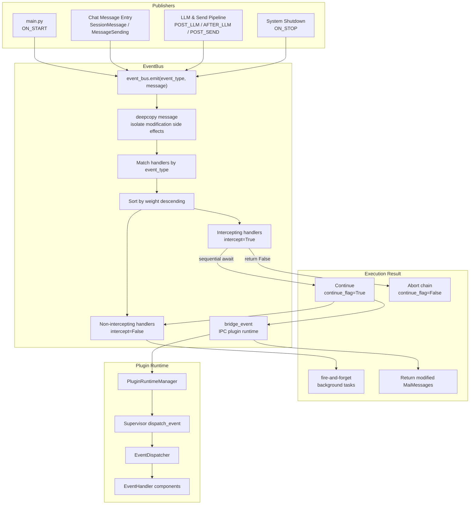
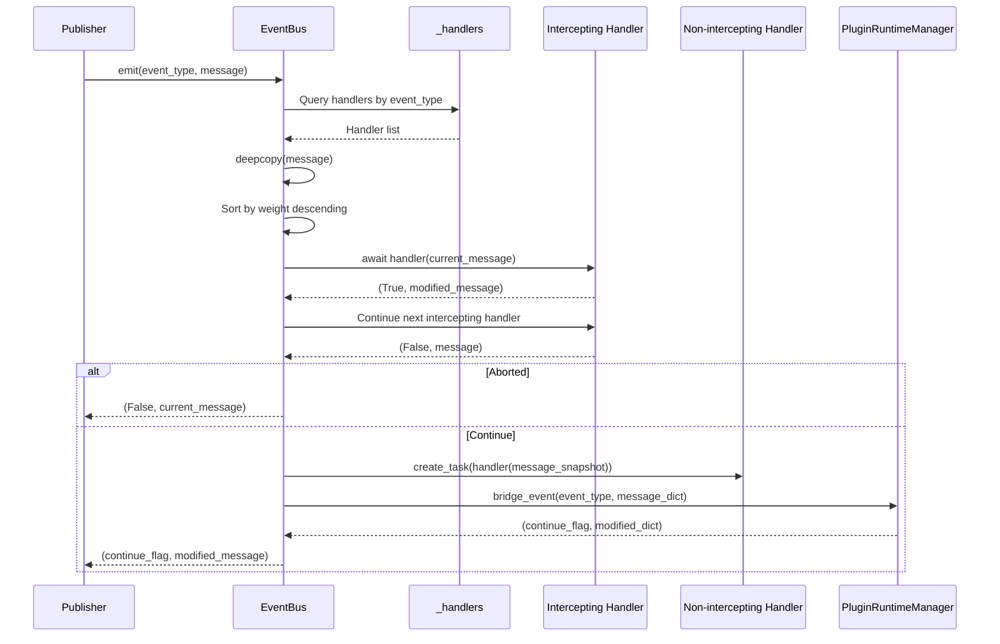

This document is written based on the code-map snapshot.

# Event Bus Architecture

MaiBot's EventBus is the in-process communication hub, responsible for unifying events scattered across the startup flow, chat entry points, LLM pipeline, send pipeline, and plugin runtime into a publish/subscribe model. It does not directly define business actions nor execute specific functions; instead, it provides the underlying capabilities of event registration, event triggering, handler ordering, message isolation, and cross-runtime bridging.

## Overview

EventBus is located in `maibot/src/core/event_bus.py` and belongs to the `core` infrastructure layer. Together with `EventType` and `MaiMessages` from `maibot/src/core/types.py`, it forms the minimal closed loop of the main program's internal event system.

**EventBus** — Global event bus instance, providing `subscribe()`, `unsubscribe()`, `emit()`, and task cancellation.
**EventHandler** — The handler signature in source code, accepting `Optional[MaiMessages]` and returning `(continue_flag, modified_message)`.
**EventInterceptor** — A conceptual intercepting handler in documentation, marked via `intercept=True` in source code, executed sequentially, can modify messages and abort the chain.
**EventListener** — A conceptual non-intercepting handler in documentation, marked via `intercept=False` in source code, executed asynchronously and concurrently, does not participate in main flow control.
**InterceptResult** — A conceptual interception result. The current implementation does not have a separate class; it is effectively equivalent to returning `(False, message)`, which can be conceptually understood as `intercept_result.abort()`.
**EventType** — Event type enumeration, defining standard event names recognizable within the system.
**MaiMessages** — Event message model, carrying message segments, plain text, LLM prompts, LLM responses, stream IDs, and additional data.

The core responsibility of EventBus is not to replace the Hook system, but to provide an underlying channel for event-driven invocation. Business modules can call `event_bus.emit()` at key execution points, the plugin runtime can receive events through IPC bridging, and internal handlers can participate in event processing through the registry.

## Architecture Diagram



This diagram illustrates a complete dispatch cycle of EventBus: the publisher calls `emit()`, EventBus retrieves handlers by event type, sorts by `weight`, executes intercepting handlers first, then schedules non-intercepting handlers if continuation is allowed, and finally bridges the event to the plugin runtime.

## Core Concepts

### Intercepting Handlers

Intercepting handlers are part of the main flow. They are registered with `intercept=True` via `subscribe()` and awaited synchronously in `emit()`. Each handler can view the current message object and return a new message object.

**Execution Order** — Intercepting handlers under the same event type execute in descending order by `weight`; higher weight executes first.
**Message Isolation** — At the start of `emit()`, the incoming message is `deepcopy()`'d to prevent direct modification of the external object.
**Message Modification** — When the `modified_message` returned by a handler is non-empty, it replaces the current `current_message`.
**Chain Abort** — When `continue_flag` returned by a handler is `False`, EventBus stops subsequent intercepting handlers and skips non-intercepting handlers.
**Exception Handling** — An exception in a single intercepting handler will not crash the entire event bus; the exception is logged and processing continues with the next handler.

Conceptually, an intercepting handler can be written as follows:

::: code-group

```python [Python ~vscode-icons:file-type-python~]
async def security_filter(message: Optional[MaiMessages]):
    if should_block(message):
        return False, message  # equivalent to intercept_result.abort()
    return True, message
```

:::

If a handler needs to return a modified message, it can pass the new `MaiMessages` as the second return value. The caller can continue to write the `modified_message` back to the business object after receiving the `emit()` result.

### Non-Intercepting Handlers

Non-intercepting handlers are side-channel observers. They are registered with `intercept=False` via `subscribe()` and executed as background tasks in `emit()`.

**Execution Timing** — Non-intercepting handlers are scheduled only when all intercepting handlers allow continuation.
**Execution Method** — Tasks are created via `asyncio.create_task()` without awaiting their completion.
**Control Capability** — Non-intercepting handlers cannot abort the event chain nor change the return value of `emit()`.
**Message Snapshot** — Each non-intercepting handler receives a `deepcopy()` of the current message to prevent concurrent tasks from overwriting each other.
**Task Tracking** — Running tasks are recorded in `_running_tasks` by handler name, supporting cancellation of specific handler tasks via `cancel_handler_tasks()`.

Conceptually, non-intercepting handlers are suitable for auditing, statistics, logging, monitoring, and asynchronous side effects:

::: code-group

```python [Python ~vscode-icons:file-type-python~]
async def audit_listener(message: Optional[MaiMessages]):
    await write_audit_log(message)
    return True, message
```

:::

Even if `audit_listener()` throws an error, it will not affect the main chain. The exception is recorded in the task completion callback.

### EventType Enumeration Categories

`EventType` is defined in `maibot/src/core/types.py`. It is not a plugin declaration file, but a shared event type dictionary for the main program. EventBus pre-registers all built-in `EventType` values during initialization, so standard events can be recognized even without any handlers.

**Lifecycle Events** — `ON_START`, `ON_STOP`, used during startup and shutdown phases.
**Message Preprocessing Events** — `ON_MESSAGE_PRE_PROCESS`, used as an interception point before messages enter core processing.
**Message Main Chain Events** — `ON_MESSAGE`, used for event notification and interception on the main message processing chain.
**Planning & Reasoning Events** — `ON_PLAN`, `POST_LLM`, `AFTER_LLM`, used for nodes before and after LLM reasoning and plan generation.
**Send Pipeline Events** — `POST_SEND_PRE_PROCESS`, `POST_SEND`, `AFTER_SEND`, used before and after message sending.
**Unknown Events** — `UNKNOWN`, used for unclassifiable events or compatibility scenarios.

### Handler Registration Model

EventBus handlers are plain async callables that do not need to inherit from a plugin base class or be registered as Hooks. Registration information is stored in `_HandlerEntry`.

**event_type** — Event type, can be an `EventType` enum value or a string.
**handler** — Async callable with signature `(Optional[MaiMessages]) -> (bool, Optional[MaiMessages])`.
**name** — Handler identifier, used for unsubscription and task tracking.
**weight** — Weight; higher values execute first.
**intercept** — Whether to execute as an intercepting handler.

The registration flow is straightforward:

::: code-group

```python [Python ~vscode-icons:file-type-python~]
event_bus.subscribe(
    event_type=EventType.ON_MESSAGE,
    handler=handler_func,
    name="example.handler",
    weight=10,
    intercept=True,
)
```

:::

Unsubscription only requires the event type and handler name:

::: code-group

```python [Python ~vscode-icons:file-type-python~]
event_bus.unsubscribe(event_type=EventType.ON_MESSAGE, name="example.handler")
```

:::

## Key Flow

A single `emit()` on EventBus can be divided into four stages: event triggering, handler matching, sequential interception execution, and concurrent non-interception execution.



### Emit to Handler Matching

`emit(event_type, message)` is the only trigger entry point. It looks up the handler list from `_handlers` by `event_type`. If the event type has no handlers, it directly returns `(True, None)`.

**Event Type Lookup** — `handlers = self._handlers.get(event_type, [])`.
**Empty List Handling** — Returns the continue flag and an empty message when there are no handlers.
**Sorting Strategy** — Handlers are already sorted by `weight` in descending order at registration time, so the current list is used directly during dispatch.
**String Events** — In addition to `EventType` enum values, string event types are also allowed for runtime extensibility.

### Sequential Interception Execution

Intercepting handlers are collected into `intercept_handlers`. EventBus `await`s each of them sequentially.

**Continue Flag** — Initially `True`.
**Current Message** — Uses `current_message` to hold the message as modified by preceding handlers.
**Message Modification** — If the `modified` value returned by a handler is non-empty, it replaces `current_message`.
**Chain Abort** — If the `should_continue` returned by a handler is `False`, `continue_flag` becomes `False` and the loop breaks.
**Exception Isolation** — Exceptions are logged and do not interrupt other handlers for the same event.

### Concurrent Non-Interception Execution

Non-intercepting handlers are scheduled only when `continue_flag` is still `True`. Each handler receives a snapshot of the current message.

**Scheduling Method** — `asyncio.create_task(entry.handler(message))`.
**Task Naming** — The task is named after the handler name for easier logging and cancellation.
**Completion Callback** — After a task completes, exceptions are logged and the task is removed from `_running_tasks`.
**Cannot Abort** — The return value of non-intercepting handlers does not affect the final result of `emit()`.

### IPC Plugin Runtime Bridging

After intercepting and non-intercepting handlers have executed, EventBus bridges the event to the plugin runtime. This step is handled by `_bridge_to_ipc_runtime()` in `event_bus.py`.

**Continuity Check** — If the main chain has been aborted by an intercepting handler, bridging is skipped.
**Runtime Check** — If the plugin runtime is not running, the current result is returned directly.
**Event Value Conversion** — `EventType` is converted to `.value`, while string events retain their original value.
**Message Serialization** — `MaiMessages` is converted to a transportable dictionary via `to_transport_dict()` for IPC transmission.
**Write-Back Modifications** — The modification dictionary returned by the plugin runtime is written back to the message object via `apply_transport_update()`.

## Module Interaction

EventBus is not an isolated component. It obtains event names and message models through `core#Type System`, collaborates with the plugin runtime through `plugin_runtime#Hook Dispatcher`, and receives events from message entry points through `chat#Message Entry Dispatch`.

### Collaboration with core#Type System

The `core#Type System` primarily refers to `maibot/src/core/types.py`. It provides the two core types that EventBus needs.

**EventType** — Defines standard event names; EventBus pre-registers these enums at initialization.
**MaiMessages** — Defines a unified message structure that intercepting handlers can modify.
**ModifyFlag** — Records which fields were modified during IPC write-back, such as message segments, plain text, and LLM prompts.
**Transport Methods** — `to_transport_dict()` and `apply_transport_update()` support message passing across IPC.

The fields of `MaiMessages` cover common event system requirements:

**message_segments** — List of message segments, from `maim_message.Seg`.
**message_base_info** — Basic platform, user, group, and other information.
**plain_text** — Processed plain text message.
**raw_message** — Raw message text.
**stream_id** — Chat stream ID, used to locate session context.
**llm_prompt** — Prompt sent to the LLM.
**llm_response_content** — LLM response body.
**llm_response_reasoning** — LLM reasoning content.
**llm_response_tool_call** — LLM tool call information.
**action_usage** — List of used Actions.
**additional_data** — Additional data, used by business modules to pass temporary context.

### Collaboration with plugin_runtime#Hook Dispatcher

EventBus and the Hook dispatcher are not the same system, but they share similar publish/subscribe ideas. EventBus dispatches by event type, while the Hook dispatcher dispatches by named Hooks.

**EventBus** — Oriented toward `EventType`, main entry point is `event_bus.emit()`.
**HookDispatcher** — Oriented toward Hook names, main entry point is `PluginRuntimeManager.invoke_hook()`.
**EventHandler** — Event handler component in the plugin runtime, dispatched by `EventDispatcher`.
**HookHandler** — Named Hook handler in the plugin runtime, dispatched by `HookDispatcher`.
**Blocking Handlers** — Called intercepting handlers in EventBus, called `blocking` handlers in Hook.
**Observing Handlers** — Called non-intercepting handlers in EventBus, called `observe` handlers in Hook.

The relevant source locations for `plugin_runtime#Hook Dispatcher` are as follows:

**PluginRuntimeManager** — `maibot/src/plugin_runtime/integration.py`, provides `bridge_event()` and `invoke_hook()`.
**EventDispatcher** — `maibot/src/plugin_runtime/host/event_dispatcher.py`, responsible for dispatching plugin event handlers.
**HookDispatcher** — `maibot/src/plugin_runtime/host/hook_dispatcher.py`, responsible for dispatching named Hooks.
**Supervisor** — `maibot/src/plugin_runtime/host/supervisor.py`, exposes `dispatch_event()` and `invoke_hook()` within the Supervisor.

The bridging flow of EventBus first calls `PluginRuntimeManager.bridge_event()`, then `bridge_event()` iterates through Supervisors and calls `supervisor.dispatch_event()`. Inside the Supervisor, it delegates to `EventDispatcher` to look up `EventHandlerEntry` and execute.

### Collaboration with chat#Message Entry Dispatch

`chat#Message Entry Dispatch` is one of the most natural business entry points for EventBus. After the chat entry receives an external platform message, it forms a `SessionMessage` or `MessageSending`, which is then converted to `MaiMessages`.

**Message Conversion Utility** — `maibot/src/chat/event_helpers.py` provides `build_event_message()`.
**Inbound Messages** — `SessionMessage` can be converted to `MaiMessages`.
**Outbound Messages** — `MessageSending` can be converted to `MaiMessages`.
**Stream Context** — If only `stream_id` is available, the session can be looked up from `chat_manager` to build a minimal event message.
**Lifecycle Events** — `ON_START` and `ON_STOP` have no message body; `build_event_message()` returns `None` for them.

The file `maibot/src/chat/message_receive/bot.py` contains integration point comments for the event bus, such as the call locations for `ON_MESSAGE_PRE_PROCESS` and `ON_MESSAGE`. The current implementation also uses plugin Hooks to execute `chat.receive.before_process` and `chat.receive.after_process` before and after message processing. This indicates the relationship between EventBus and the chat entry is well-defined, but which specific event points are enabled should be confirmed against the actual calls in the source code.

## Event Type Enumeration

This section lists the key events in the current `EventType` enumeration and common compatibility event names found in documentation. All of them can be used as event type keys for EventBus; enum events are pre-registered at initialization, while string event names are suitable for plugin or external system extension.

**`MESSAGE_RECEIVED`** — Compatibility event name, commonly used to describe that an external platform message has been received. The current `EventType` enum does not directly define this name; it can be registered or bridged via string event types.
**`COMMAND_EXECUTED`** — Compatibility event name, commonly used to describe posting a notification after command processing completes. The current `EventType` enum does not directly define this name; it can be registered or bridged via string event types.
**`ON_START`** — Startup event. `maibot/src/main.py` triggers this event after initializing the chat manager and memory automation service; EventBus uniformly bridges it to the IPC plugin runtime.
**`ON_STOP`** — Shutdown event. Can be triggered during system restart or shutdown flows to notify components that need to clean up resources.
**`ON_MESSAGE_PRE_PROCESS`** — Message preprocessing event. Suitable for intercepting, rewriting, or filtering messages before they enter core processing. The current call site in the chat entry is a TODO, indicating this event point is reserved.
**`ON_MESSAGE`** — Message main chain event. Suitable for participating in flow control after basic message processing completes but before entering reasoning or command processing.
**`ON_PLAN`** — Plan event. Used for plan generation-related nodes; can carry `stream_id` and LLM context.
**`POST_LLM`** — Post-LLM event. Triggered after the LLM has generated a response; can be used for response rewriting, auditing, or triggering subsequent actions.
**`AFTER_LLM`** — LLM completion event. Used for side-channel notifications or statistics after the LLM pipeline finishes.
**`POST_SEND_PRE_PROCESS`** — Pre-send preprocessing event. Suitable for final checks or rewrites before sending.
**`POST_SEND`** — Send event. Triggered when a message is about to be sent; can be used for auditing, counting, or external synchronization.
**`AFTER_SEND`** — Post-send event. Triggered after a message has been sent; suitable for logging, statistics, and status updates.
**`UNKNOWN`** — Unknown event type. Used for compatibility with unclassified events or runtime dynamic events.

### Event Category Description

**Lifecycle** — `ON_START`, `ON_STOP` do not depend on a message body; they are typically triggered during application startup and shutdown.
**Inbound Message** — `MESSAGE_RECEIVED`, `ON_MESSAGE_PRE_PROCESS`, `ON_MESSAGE` are for messages entering the system from external platforms.
**Command Processing** — `COMMAND_EXECUTED` is for notifications or auditing after command execution completes.
**Reasoning & Planning** — `ON_PLAN`, `POST_LLM`, `AFTER_LLM` are for the LLM reasoning and plan generation process.
**Outbound Send** — `POST_SEND_PRE_PROCESS`, `POST_SEND`, `AFTER_SEND` are for the message sending process.
**Compatibility** — `UNKNOWN` serves as a fallback and should not be the preferred type for new business events.

## Extension Points / Hooks

EventBus itself does not provide a Hook system. It has no Hook specification registry, no `allow_abort`, `allow_observe`, `order`, or other Hook semantics, and does not directly manage plugin component declarations. It provides lower-level event publish/subscribe capabilities.

**EventBus is responsible for** — Event type matching, handler registration, sequential interception, asynchronous side channels, message snapshots, and IPC bridging.
**Hook system is responsible for** — Named Hook specifications, plugin component declarations, blocking/observe modes, early/normal/late ordering, and abort policies.
**EventHandler is responsible for** — Processor components registered by event type on the plugin side.
**HookHandler is responsible for** — Processor components registered by Hook name on the plugin side.

EventBus is the underlying implementation foundation of the Hook system because it validates and solidifies several key patterns.

**Publish/Subscribe** — The caller only cares about the event type, not who will handle the event.
**Weight Sorting** — Handlers can be prioritized, avoiding hardcoded call order.
**Separation of Interception and Side Channel** — Main flow control authority is separated from observational side effects.
**Message Immutability Protection** — `deepcopy()` reduces side-effect coupling between handlers.
**Cross-Runtime Extension** — Events are propagated to the plugin Supervisor through IPC bridging.

If new Hooks need to be added in the future, Hook specifications should not be crammed into EventBus. A more reasonable direction is for the Hook system to reuse EventBus's sorting, interception, side-channel, and bridging ideas, while retaining its own naming, specifications, plugin declarations, and error policies.

## Design Boundaries

EventBus is suitable for handling in-process events and plugin runtime bridging, but not for carrying all business control logic.

**Suitable for EventBus** — Startup/shutdown notifications, message entry interception, pre/post-send notifications, LLM pipeline side-channel events, and cross-module state synchronization.
**Not suitable for EventBus** — High-frequency fine-grained state updates, operations requiring strong transaction guarantees, business processes requiring complex permission models, and event logs requiring long-term persistence.
**Suitable for intercepting handlers** — Security filtering, sensitive word processing, message rewriting, and flow abortion.
**Suitable for non-intercepting handlers** — Statistics, auditing, monitoring, asynchronous notifications, and cache refreshing.
**Suitable for Hook system** — Extension points explicitly declared by plugins, extension points requiring parameter schemas, and extension points requiring blocking/observe policies.

## Implementation Details

### Handler Storage Structure

EventBus uses `_handlers` to store the mapping from event types to handler entries.

**Key** — `EventType` enum or string event type.
**Value** — List of `_HandlerEntry`.
**Sorting** — After each `subscribe()`, the list is re-sorted by `weight` in descending order.
**Pre-registration** — The constructor iterates through all `EventType` values and creates empty lists for built-in events.

### Message Isolation Strategy

`emit()` performs a `deepcopy()` on the incoming message. This design allows handlers to safely modify the message object without polluting the caller's original object.

**Input Message** — The `message` passed in by the caller.
**Current Message** — `current_message`, a mutable copy passed between intercepting handlers.
**Async Snapshot** — Non-intercepting handlers receive a `current_message.deepcopy()`.
**IPC Message** — Converted to a transport dictionary during bridging, modified on the plugin side, then written back.

### Exception Strategy

EventBus uses an isolation strategy for handler exceptions.

**Interception Exception** — Log the error and continue processing subsequent handlers.
**Non-Interception Exception** — Log the error in the task completion callback.
**IPC Bridging Exception** — Log a warning, does not affect the main chain return value.
**Task Creation Failure** — Log the error, does not block other handlers.

This strategy keeps the event bus stable, but also means that the caller cannot rely on a given handler always executing successfully. Logic requiring strong consistency should be placed in the business main flow or under the Hook's blocking policy.

### Task Cancellation

`cancel_handler_tasks(handler_name)` is used to cancel running tasks for a specific handler.

**Find Tasks** — Retrieve the task list corresponding to the handler name from `_running_tasks`.
**Cancel Tasks** — Call `cancel()` on incomplete tasks.
**Await Cleanup** — Wait for cancellation to complete via `asyncio.gather(..., return_exceptions=True)`.
**Clean Up Records** — The task completion callback removes completed tasks from `_running_tasks`.

## Typical Usage Examples

### Registering an Intercepting Handler

::: code-group

```python [Python ~vscode-icons:file-type-python~]
async def before_message(message: Optional[MaiMessages]):
    if not message:
        return True, None
    if message.plain_text.startswith("!ignore"):
        return False, message
    return True, message

event_bus.subscribe(
    event_type=EventType.ON_MESSAGE,
    handler=before_message,
    name="core.before_message_filter",
    weight=100,
    intercept=True,
)
```

:::

### Registering a Non-Intercepting Handler

::: code-group

```python [Python ~vscode-icons:file-type-python~]
async def message_audit(message: Optional[MaiMessages]):
    if not message:
        return True, None
    await audit_service.record(message)
    return True, message

event_bus.subscribe(
    event_type=EventType.ON_MESSAGE,
    handler=message_audit,
    name="core.message_audit",
    weight=0,
    intercept=False,
)
```

:::

### Triggering an Event and Processing the Result

::: code-group

```python [Python ~vscode-icons:file-type-python~]
continue_flag, modified_message = await event_bus.emit(
    event_type=EventType.ON_MESSAGE,
    message=event_message,
)

if not continue_flag:
    return

if modified_message and modified_message.plain_text:
    message.processed_plain_text = modified_message.plain_text
```

:::

## Relationship with the Legacy events_manager

The current EventBus is the event system oriented toward the final architecture. It does not depend on the plugin base class; internal handlers directly register async callables, and IPC plugins are bridged through `plugin_runtime`.

**No longer requires inheriting from the plugin base class** — Internal handlers only need to conform to the signature.
**No longer binds event logic to a single manager** — EventBus is a global singleton; modules can inject or import it as needed.
**Preserves event type compatibility** — Standard `EventType` values come from `core/types.py`.
**Preserves message model compatibility** — Event messages uniformly use `MaiMessages`.
**Preserves plugin extensibility** — Plugin runtime is accessed through `bridge_event()`.

## Audit Points

**Weight Conflicts** — When multiple handlers use the same `weight`, the execution order depends on registration order and list sorting stability.
**Async Side Effects Are Invisible** — Non-intercepting handlers do not block `emit()`; the caller cannot assume they have completed.
**Message Field Consistency** — After modifying `message_segments`, `plain_text` should be maintained synchronously, otherwise inconsistencies may occur.
**IPC Write-Back Limitations** — Only serializable fields in `MaiMessages` can be safely written back across IPC.
**Lifecycle Events Have No Message Body** — `ON_START` and `ON_STOP` do not carry `MaiMessages`; handlers need to handle `None`.
**TODO Event Points** — `ON_MESSAGE_PRE_PROCESS` and `ON_MESSAGE` have integration point comments in the chat entry; before enabling them, confirm that the business main chain has been migrated.

## Conclusion

EventBus is the infrastructure for internal event communication within MaiBot. It connects the core type system, chat entry points, and plugin runtime using a publish/subscribe model, supports main flow control with intercepting handlers, supports asynchronous side channels with non-intercepting handlers, and extends events to the plugin Supervisor through IPC bridging.

Its boundaries are also clear: EventBus provides low-level event dispatch but does not provide a complete Hook specification system. When plugin explicit declaration, parameter validation, blocking/observe policies, and complex error strategies are needed, the Hook dispatcher in `plugin_runtime` should be used. When unified event names, message snapshots, sequential interception, and asynchronous notifications are needed, EventBus is the more appropriate entry point.
