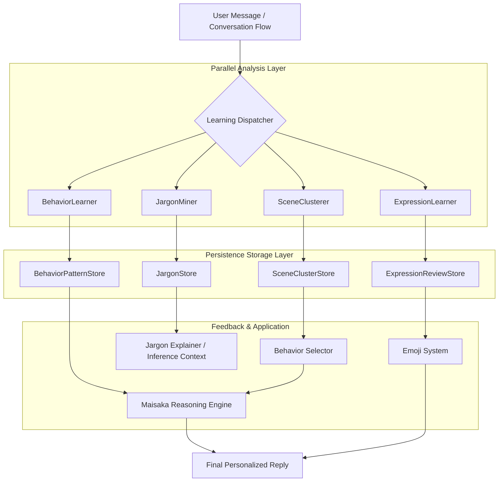

# Expression Learning Architecture

MaiBot's `learners/` learning module is an autonomous evolution subsystem designed to enable the bot to automatically acquire specific expression habits, behavior patterns, and community culture by observing user conversations. It does not rely on predefined rule sets, but instead achieves the identity transformation from a "general agent" to a "community member" through a closed loop of "observation $\rightarrow$ analysis $\rightarrow$ storage $\rightarrow$ influence".

The learning module is composed of four specialized learners working together: BehaviorLearner, ExpressionLearner, JargonMiner, and SceneClusterer.

## Learning Flow Architecture

The learning module operates at an asynchronous analysis position within the message pipeline. It does not directly block real-time message replies; instead, it triggers analysis tasks as messages flow through the pipeline and persists the results, thereby influencing reply quality in subsequent inference cycles.



## Learner Detailed Explanation

### BehaviorLearner

The BehaviorLearner is responsible for capturing deep patterns in user-bot interaction. It does not focus on specific vocabulary, but rather on "what behavior is taken in what scenario yields what result".

**Core Mechanism**: Parses chat history through LLM to generate "scenario-behavior-result" triples. If a certain behavior pattern (e.g., using humor to defuse when the user is frustrated) receives positive feedback, the weight of that pattern increases.

**Key Components**:
**`BehaviorCandidate`** : A learned behavior candidate, containing a scenario description, suggested action, and expected effect.
**`BehaviorPatternStore`** : Manages CRUD for behavior patterns, responsible for converting learned candidates into persisted behavioral experience.
**`BehaviorPatternMaintenance`** : Implements a pattern decay mechanism to prevent the bot from becoming rigid in outdated expression habits, ensuring learning results have temporal validity.

**Trigger Timing**: Learning behavior triggers are managed by the `LearningTrigger` component, determined by a combination of the following conditions:

`Trigger Frequency` — The same scenario-behavior pair appearing ≥3 times within a sliding window (default 24 hours) triggers candidate recording.

`Feedback Signal` — Explicit (likes, @mentions of approval) or implicit (continued follow-up questions, responding in the same style) positive feedback from users on bot replies accelerates pattern consolidation.

`Scenario Similarity` — Calculates semantic similarity between the current conversation and stored patterns via SceneClusterer's scenario tag clusters, activating when exceeding `BEHAVIOR_SIMILARITY_THRESHOLD` (default 0.75).

**Data Storage**: Learned patterns are persisted as `BehaviorPattern` structures in `BehaviorPatternStore`. Each pattern contains the following fields:

`scene_descriptor` — Scenario description, represented by the SceneClusterer's tag vector.

`suggested_action` — Suggested behavior, e.g., "respond with a light teasing tone".

`expected_effect` — Expected effect, e.g., "alleviate user anxiety".

`confidence` — Confidence score (0.0–1.0), increasing with positive feedback and decreasing with negative feedback or time decay.

`last_triggered` — Last triggered timestamp, used for decay calculation.

`source_rooms` — List of source group IDs, supporting cross-group pattern migration.

**Pattern Decay**: `BehaviorPatternMaintenance` periodically scans the Store and soft-deletes patterns with confidence below `DECAY_THRESHOLD` (default 0.2) that have not been triggered for over 7 days. The decay curve uses the exponential decay formula `confidence *= exp(-λ × Δt)`, where λ is controlled by the `DECAY_RATE` configuration.

**Learning Example**:
```json
{
  "scene": "User complains about work pressure late at night",
  "suggested_action": "First lighten the mood with a humorous GIF, then offer practical advice",
  "action_keywords": ["comfort", "empathy", "practical advice"],
  "expected_effect": "User's mood improves and conversation continues",
  "confidence": 0.85,
  "source_rooms": ["group_1001", "group_1002"]
}
```

### ExpressionLearner

The ExpressionLearner focuses on non-textual expression tendencies, particularly emoji usage habits. It learns what types of emoji users tend to send in specific contexts and the trigger words behind those emoji.

**Core Mechanism**: Monitors emoji usage frequency and context within the message stream. When a high-frequency emoji combination with specific semantics is detected, it triggers a learning batch, generating an emoji usage summary via LLM.

**Key Components**:
**`ExpressionLearningBatchGate`** : Concurrency control gate to prevent excessive LLM learning requests during message peaks.
**`ExpressionReviewStore`** : Review storage. Since autonomous learning may introduce inappropriate content, learned expressions must pass AI review and support human intervention (Rescue/Reject).
**`ExpressionUtils`** : Provides eligibility checks and LLM response parsing, ensuring learned expression mappings conform to JSON specifications.

**Trigger Timing**: ExpressionLearner controls the learning pace through `ExpressionLearningBatchGate`. A learning batch is triggered when the following conditions are all met:

`Frequency Threshold` — A certain emoji or emoji combination appears ≥5 times in the most recent 30 messages.

`Semantic Stability` — The emoji consistently points to a consistent semantic meaning in context (e.g., the emoji [Doge] always accompanies a teasing tone), verified by LLM semantic consistency validation.

`Concurrency Level` — The number of currently pending learning tasks is below `MAX_CONCURRENT_BATCHES` (default 3), preventing LLM request buildup.

**Data Storage**: Learning results are stored as `ExpressionMapping` structures in `ExpressionReviewStore`:

`trigger_keywords` — List of trigger keywords, e.g., ["lmao", "haha", "that's wild"] → [Doge].

`expression_id` — Emoji resource identifier.

`context_tags` — Context tags, e.g., ["teasing", "self-deprecating", "lighthearted"].

`review_status` — Review status (pending / approved / rejected / rescue).

`frequency` — Number of occurrences of this mapping within the observation window.

`confidence_weight` — Weight value influencing the final selection probability of the expression_selector.

**Review Flow**: Autonomously learned mappings are initially marked as `pending`. The AI reviewer evaluates content eligibility based on security policies; upon approval, the mapping is marked as `approved` and added to the production mapping table. Humans can intervene via Rescue (restore rejected mappings) or Reject (veto). Review logs are recorded in `ExpressionReviewStore.audit_log`, supporting traceability and rollback.

**Learning Example**:
```json
{
  "trigger_keywords": ["can't hold it in", "lmao", "hahaha"],
  "expression_id": "emoji_packet_042",
  "context_tags": ["teasing", "funny", "intense roasting"],
  "review_status": "approved",
  "frequency": 12,
  "confidence_weight": 0.78
}
```

### JargonMiner

The JargonMiner is responsible for extracting community-specific "insider lingo" or custom terminology. It turns the bot into a self-updating community dictionary.

**Core Mechanism**: Based on frequency inference thresholds. When a word appears multiple times with stable semantics in context, it is flagged as a potential jargon $\rightarrow$ submitted to LLM for meaning inference $\rightarrow$ stored in the jargon store.

**Key Components**:
**`JARGON_INFERENCE_THRESHOLDS`** : Four-level inference thresholds determining the trigger frequency for a word to escalate from "common word" to "candidate jargon" to "confirmed insider lingo".
**`JargonEntry`** : Stores the jargon's definition, source sessions, and meaning variations across different groups.
**`JargonExplainer`** : Provides fuzzy search and scope filtering, allowing the bot to correctly use these terms in replies or explain them when asked.

**Four-Level Inference Thresholds Detailed**:

`Level 0` — First occurrence. Marked as a common word; only records appearance frequency without triggering further analysis.

`Level 1` — Appears ≥3 times in the current group. Upgraded to candidate jargon; begins tracking its semantic context and builds an initial meaning vector.

`Level 2` — Appears across ≥2 different groups with semantic consistency verified. Confirmed as jargon candidate; submitted to LLM for meaning inference, generating a `JargonEntry`.

`Level 3` — Actively used by the bot in replies ≥2 times with positive feedback (increased user interaction rate). Solidified as the bot's active vocabulary and added to the active expression library.

**Data Storage**: `JargonEntry` contains the following fields:

`term` — The jargon word itself.

`definition` — Meaning description inferred by LLM.

`examples` — Usage examples, real sentences extracted from observed conversations.

`origin_sessions` — List of source session IDs.

`group_variants` — Mapping table of meaning variations across different groups; the same jargon may have different meanings in different communities.

`inference_level` — Current inference level (0–3).

`first_seen_at` / `last_seen_at` — First and last appearance timestamps, used for frequency decay calculation.

**Learning Example**:
```json
{
  "term": "YBB",
  "definition": "used as a playful greeting among close friends",
  "examples": ["YBB you're late again today", "YBB have you eaten yet"],
  "group_variants": {
    "group_1001": "friend group nickname",
    "group_1002": "inside joke reference"
  },
  "inference_level": 3,
  "frequency": 47,
  "last_seen_at": "2026-06-16T12:00:00Z"
}
```

### SceneClusterer

The SceneClusterer provides underlying semantic support for behavior learning. It clusters scattered conversation fragments into reusable "scenario tag clusters".

**Core Mechanism**: Uses LLM to perform dimensional analysis on conversations (attitude $\rightarrow$ domain $\rightarrow$ need). For example, clustering "complaining about overtime" and "venting about KPIs" into a `[workplace, negative, seeking empathy]` scenario cluster.

**Key Components**:
**`BehaviorScenarioProfile`** : Scenario profile containing three dimensions: Attitude, Domain, and Need.
**`TagCluster`** : Flat tag cluster supporting tag merging and weight calculation.
**`SCENE_CLUSTER_REUSE_THRESHOLD`** : Reuse threshold determining whether a new scenario joins an existing cluster or creates a new one.

**Trigger Conditions**: SceneClusterer is not directly triggered by a single message, but initiates rounds when BehaviorLearner or the system actively requests scenario analysis. Each round collects the most recent N conversation records (N controlled by `CLUSTER_WINDOW_SIZE`, default 50) as clustering input.

**Dimensional Analysis Flow**: Each conversation fragment is encoded via LLM across three dimensions:

`Attitude Dimension` — The user's emotional tendency, e.g., positive, negative, neutral, sarcastic, anxious, excited.

`Domain Dimension` — The topic domain of the conversation, e.g., workplace, technology, daily life, entertainment, emotions.

`Need Dimension` — The user's deep-seated need, e.g., seeking help, emotional catharsis, information acquisition, social interaction.

The encoded three-dimensional vector is compared with existing `TagCluster` instances via cosine similarity. If the similarity exceeds `SCENE_CLUSTER_REUSE_THRESHOLD` (default 0.7), it is assigned to an existing cluster; otherwise, a new cluster is created.

**Data Storage**: `TagCluster` contains the following properties:

`cluster_id` — Unique cluster identifier.

`tags` — Tag set, e.g., ["workplace", "negative", "seeking empathy"], with weight values.

`prototype_utterances` — Representative raw conversation text for scenario reconstruction.

`member_count` — Number of conversation fragments assigned to this cluster.

`centroid_vector` — Cluster centroid vector, used for similarity calculation with new fragments.

`last_updated` — Last update time, supporting cluster merging and splitting.

**Clustering Example**:
```json
{
  "cluster_id": "sc_0042",
  "tags": {
    "workplace": 0.92,
    "negative": 0.85,
    "seeking empathy": 0.78,
    "overtime": 0.65
  },
  "prototype_utterance": "I can't take it anymore, working until 10pm every day",
  "member_count": 34,
  "last_updated": "2026-06-16T12:00:00Z"
}
```

## Learning Configuration Example

The various behaviors of the learning module are centrally managed via `config.yaml`. The following are the core configuration items:

**Behavior Learning Configuration**:
```yaml
behavior_learner:
  trigger_frequency: 3           # Number of scenario-behavior pair occurrences to trigger candidate recording
  trigger_window_hours: 24       # Sliding window duration (hours)
  decay_rate: 0.1                # Exponential decay coefficient λ
  decay_threshold: 0.2           # Soft-delete confidence threshold
  similarity_threshold: 0.75     # Scenario similarity threshold
  max_patterns_per_room: 200     # Maximum patterns per group
```

**Expression Learning Configuration**:
```yaml
expression_learner:
  min_frequency: 5               # Minimum occurrence count for emoji trigger
  observation_window: 30         # Observation window message count
  max_concurrent_batches: 3      # Maximum concurrent LLM learning batches
  review_required: true          # Whether AI review is required
  auto_approve_threshold: 0.9    # Confidence threshold for auto-approval
```

**Jargon Mining Configuration**:
```yaml
jargon_miner:
  inference_thresholds: [1, 3, 5, 10]  # Four-level inference thresholds (occurrence count)
  cross_group_min: 2                    # Minimum number of groups required for cross-group confirmation
  llm_inference_model: gpt-4o-mini     # LLM model used for jargon inference
  max_jargon_per_room: 500              # Maximum jargon entries per group
```

**Scene Clustering Configuration**:
```yaml
scene_clusterer:
  cluster_window_size: 50        # Number of conversations per clustering analysis round
  reuse_threshold: 0.7           # Cluster reuse cosine similarity threshold
  max_clusters: 1000             # Global maximum cluster count
  enable_merge: true             # Whether to enable automatic cluster merging
  merge_similarity: 0.9          # Cluster merge similarity threshold
```

## Core Processing Flow

The learning module executes following an asynchronous, non-blocking pipeline:

**Message Trigger** $\rightarrow$ Message enters the `chat` pipeline $\rightarrow$ Triggers `learners` async task.
**Preprocessing** $\rightarrow$ Extract message metadata (user, group, time) $\rightarrow$ Filter noise content.
**Parallel Analysis** $\rightarrow$ Four learners execute analysis in parallel according to their respective trigger conditions (frequency, semantics, patterns).
**Learning Result Storage** $\rightarrow$ After AI review (expression) or threshold determination (jargon), write to the corresponding Store.
**Influence Reply** $\rightarrow$ In the next Maisaka inference cycle, retrieve matching behavior patterns via `BehaviorSelector`, or inject jargon context through `JargonStore`.

## Interaction with Other Modules

Learning results influence the bot's overall behavior through multiple paths, forming a tight feedback loop with core modules.

### Maisaka Reasoning Engine

Learning results are not used to directly override LLM output, but are injected as **constraints** and **context**:

**Behavior Constraint**: `BehaviorSelector` selects the optimal behavior pattern (e.g., "use a lightly teasing tone") from `BehaviorPatternStore` based on the current scenario tags, and injects it as part of the System Prompt.
**Semantic Enhancement**: Jargon and their meanings mined by `JargonMiner` are injected into the inference context, enabling Maisaka to understand the insider lingo users send and respond in the same style.
**Expression Guidance**: Tendencies learned by `ExpressionLearner` influence the weights of `expression_selector`, increasing the selection probability of specific emoji in the current context.

### Emoji System

The interaction between ExpressionLearner and the emoji system operates in two directions:

**Forward Influence**: Learned emoji-context mappings are sorted by `confidence_weight`, and the Top-K mappings are injected into the `ExpressionSelector` candidate pool. When a user message hits `trigger_keywords`, the selection weight of the corresponding emoji is adjusted upward by `weight *= (1 + confidence_weight)`.

**Reverse Validation**: Actual usage feedback from the emoji system (whether users react positively to replies containing emoji) flows back to ExpressionLearner, adjusting `confidence_weight`. Mappings that receive no positive feedback for 3 consecutive times are downgraded to `rejected` status.

**Configuration Coordination**: The review status (`approved` / `rejected`) of emoji is uniformly managed by `ExpressionReviewStore`. The emoji system only consumes mappings in the `approved` status, ensuring output content is safe and controllable.

### Chat System

The message pipeline serves as both the data entry point and effect validation field for the learning module:

**Data Collection**: After each message enters the `chat` pipeline, metadata (user ID, group ID, message time, message type) is extracted by `MessagePreprocessor` and dispatched to the four types of learners as `LearningTriggerEvent` events. Learners decide whether to participate in analysis based on their respective filter conditions.

**Asynchronous Decoupling**: Learning analysis tasks are executed asynchronously via `BackgroundTaskExecutor` and do not block the real-time reply pipeline. Even under high user message volume, reply latency remains unaffected.

**Effect Backtesting**: The chat system periodically (default every 100 messages) compares user interaction metrics (reply rate, conversation turn length, emoji usage rate) before and after applying learning results, forming a quantitative feedback loop.

## Hook Extension Points

To support plugin-based extension, the learning module provides multiple Hook interception points:

**`expression.*`** : Allows plugins to customize expression learning filter rules, or intercept and modify learning results before expression learning completes.
**`jargon.*`** : Supports external dictionary injection, or custom prompt words before JargonMiner triggers LLM inference.
**`learning.*`** : Global learning behavior Hook, can be used to monitor learning progress, export learning records, or force-trigger pattern decay.
