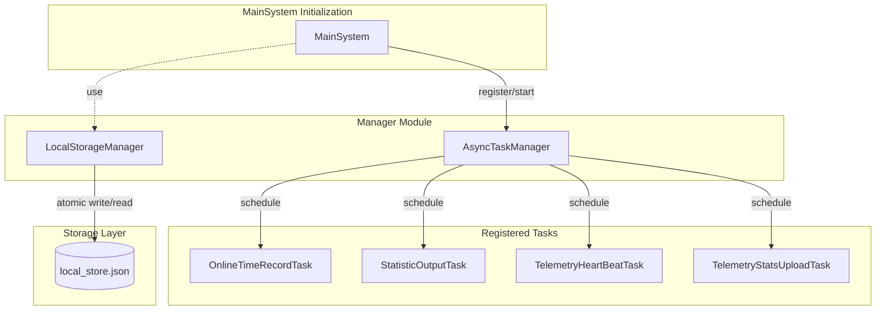

# Global Managers

This document is written based on a code-map snapshot.

## Overview

The Global Managers module (`src.manager`) provides application-level singleton services for coordinating common foundational capabilities at the system infrastructure layer. The module is lightweight by design, contains no business logic, and serves as a purely utility-oriented service, ensuring unified entry points and state management for basic task scheduling and persistent storage throughout the application lifecycle.

This module does not depend on other MaiBot internal modules. It only uses basic packages from the Python standard library such as `asyncio`, `json`, and `os`. The two core managers (AsyncTaskManager and LocalStorageManager) are independent of each other and each runs autonomously. This design ensures that the manager module can serve as the system's infrastructure layer, referenced on demand by MainSystem, various adapters, and plugins, without introducing circular dependencies.

## Architecture Diagram

## Core Concepts

### AsyncTaskManager

The asynchronous task manager manages the lifecycle of background async tasks. It allows the system to run periodic heartbeat, data statistics, and other recurring tasks without blocking the main logic.

AsyncTaskManager
    Responsibility: Manages task registration, starting, cancellation, and graceful shutdown.
    Key Components:
        AsyncTask: Task base class. Defines `wait_before_start` (startup delay) and `run_interval` (execution interval), supporting one-shot or recurring tasks.
        abort_flag: Global abort flag. When the system shuts down, setting this flag notifies all recurring tasks to stop.
        _lock: Async lock. Ensures thread safety when adding or stopping tasks, preventing concurrent modification of the task list.
    Singleton instance: `async_task_manager`

Task Scheduling Mechanism
    The core of AsyncTaskManager is an `asyncio`-based task scheduling engine, whose workflow consists of four phases:

    Registration Phase
        Calling `add_task()` adds an AsyncTask instance to the internal task list. This method holds the `_lock` async lock to prevent race conditions in concurrent scenarios. After registration, the task is in a "registered" state — no `asyncio.Task` has been created yet, and it does not consume event loop resources.

    Scheduling Phase
        Calling `start_task()` creates an `asyncio.Task` for the registered task. Internally, it wraps `AsyncTask.run()` as a coroutine task via `asyncio.create_task()`. Each AsyncTask instance corresponds to one `asyncio.Task` object, with its reference stored in the `_task` attribute for subsequent cancellation and awaiting. After scheduling, the task enters a "running" state.

    Execution Loop
        Once scheduled, the task enters an event-loop-driven execution cycle:
        - If `wait_before_start > 0`, executes `asyncio.sleep(wait_before_start)` for a delayed start.
        - The main loop condition is `while not self.abort_flag`, continuously checking the global abort flag.
        - Each iteration calls `run()` to execute business logic. Exceptions within `run()` are caught by `try/except` and logged, preventing a single task crash from affecting the entire manager.
        - After `run()` returns, if `run_interval > 0`, sleeps for the specified interval via `asyncio.sleep(run_interval)` for periodic execution; otherwise, the task exits after a single execution.

    Shutdown and Cleanup Phase
        When `stop_and_wait_all_tasks()` is called, the manager sets `abort_flag = True`. All running tasks detect this flag on the next loop condition check and exit voluntarily. The manager waits for each task to exit via `asyncio.wait_for()` with a 10-second timeout. Tasks that do not exit within the timeout are forcibly cancelled. Each `asyncio.Task` registers an `add_done_callback` — after completion, the callback automatically removes the terminated reference from the internal list, preventing memory leaks.

### LocalStorageManager

The local storage manager provides a simple key-value interface for persisting lightweight configuration or state to a local JSON file.

LocalStorageManager
    Responsibility: Implements atomic local data reads and writes with automatic corruption recovery.
    Implementation Mechanism:
        Dictionary Interface: Implements magic methods such as `__getitem__` and `__setitem__` to allow dictionary-like operations.
        Atomic Write: First writes to a temporary file (`.tmp`), then uses `os.replace` for atomic replacement of the target file, preventing data loss from write crashes.
        Corruption Recovery: When loading a file, if JSON corruption is detected, the original file is automatically backed up with a `.corrupt` suffix, and an empty storage file is rebuilt, ensuring the system can start normally.
    Singleton instance: `local_storage`

Initialization Flow
    LocalStorageManager is initialized during the `MainSystem.initialize()` phase. During initialization, the storage file path is first determined (default is `local_store.json` in the same directory as the main configuration file). It then attempts to load the existing file contents into an in-memory dictionary; if the file does not exist, it starts with an empty dictionary. If a JSON parsing error is found during loading, the corruption recovery process is automatically performed.

Use Cases
    This manager is suitable for storing the following types of data:
    - User configuration preferences (e.g., language settings, theme selection).
    - Runtime state flags (e.g., first-run flag, feature toggles).
    - Lightweight counters and cached values.
    For data requiring complex queries or transactional support, use a database directly instead.

## Key Flows

### Scheduled Task Execution Flow

AsyncTaskManager manages the complete lifecycle of scheduled tasks, from registration through cleanup:

1. Task Definition
    Developers inherit the `AsyncTask` base class and implement the `run()` method. `run()` is the core logic of the task and should be designed as a reentrant, idempotent operation, since the same task may be executed repeatedly across multiple scheduling cycles. The base class constructor accepts `wait_before_start` and `run_interval` parameters, controlling the first-execution delay and execution interval respectively.

2. Task Registration
    Call `async_task_manager.add_task(task)` to add the task instance to the internal list. Registration holds the `_lock` async lock to ensure no race conditions in concurrent scenarios. After registration, the task is in a "registered" state — no corresponding `asyncio.Task` has been created yet, and it does not consume event loop resources.

3. Scheduling Start
    The manager iterates through the registered task list and calls `start_task()` for each task, internally creating a coroutine task via `asyncio.create_task()`. Each AsyncTask instance corresponds to one `asyncio.Task`, with its reference stored in the `_task` attribute for subsequent cancellation and awaiting. After successful scheduling, the task enters a "running" state.

4. Execution Loop
    - If `wait_before_start > 0`, first executes `asyncio.sleep(wait_before_start)` to implement a delayed start, avoiding task contention during system startup.
    - Enters the `while not self.abort_flag` loop — as long as `abort_flag` is not set, it continues executing `run()`.
    - After each `run()` returns, if `run_interval > 0`, sleeps for the specified interval via `asyncio.sleep(run_interval)` for fixed-period recurring execution.
    - If `run_interval <= 0`, the task automatically exits after completing one `run()`, suitable for one-shot tasks.
    - Exceptions within `run()` are caught by `try/except` and logged, preventing a single exception from permanently terminating the task.

5. Task Cleanup
    Completion callbacks are registered via `add_done_callback`. When the `asyncio.Task` completes (whether normally, by exception, or by cancellation), the callback automatically removes the task from the internal list. This ensures the manager does not hold references to terminated tasks, preventing memory leaks.

Batch Stop Mechanism
    `stop_and_wait_all_tasks()` provides a unified batch stop capability:
    - Sets `abort_flag = True`, notifying all running tasks to exit voluntarily.
    - Concurrently waits for all tasks to complete, with a timeout cap of 10 seconds.
    - Tasks that do not exit within the timeout are forcibly cancelled via `task.cancel()`.
    - After all tasks have stopped, clears the internal task list, releasing references.

### Local Storage Read/Write Flow

Writing Data:
    - User calls `local_storage[key] = value`.
    - Updates the `store` dictionary in memory.
    - Calls `save_local_store()` to trigger an atomic write.
    - Creates a temporary file $\rightarrow$ JSON serialization $\rightarrow$ atomic replace $\rightarrow$ delete temporary file.
    - If an exception occurs during the write (e.g., insufficient disk space, permission error), the temporary file is automatically cleaned up, and the original file remains unaffected.

    The advantage of atomic writing is that even if the process crashes during the write, the original data file is not corrupted. After writing to the temporary file, `os.replace` performs a filesystem-level rename operation, ensuring the target file update is instantaneous.

Reading Data:
    - User calls `local_storage[key]`.
    - Retrieves the value directly from the in-memory `store` dictionary (loaded once into memory at startup).

    Read operations only involve memory accesses and do not trigger file I/O, resulting in very high performance. All file reading is performed only once during initialization; all subsequent read operations occur in memory.

Persistence Trigger Strategy
    `save_local_store()` is called immediately after each write operation, implementing synchronous persistence. This design incurs disk I/O on every assignment but trades for data safety — ensuring that the result of any write operation is immediately persisted, preventing in-memory data loss due to system crashes.

## Interaction with MainSystem

The global managers play a critical supporting role in the `MainSystem` lifecycle. The two collaborate through direct method calls, following the complete task lifecycle of registration → scheduling → execution → cleanup.

Initialization Phase
    During `MainSystem.initialize()` execution, the system registers a series of core background tasks via `AsyncTaskManager.add_task()`. After registration is complete, the manager calls `start_task()` for each task, creating `asyncio.Task` instances and starting their execution loops. The registered core tasks include:
    - OnlineTimeRecordTask: Records the bot's online duration, periodically updating startup timestamps.
    - StatisticOutputTask: Periodically outputs runtime statistics, including message throughput, active session count, etc.
    - TelemetryHeartBeatTask: Sends telemetry heartbeat packets for monitoring system health.
    - TelemetryStatsUploadTask: Uploads statistical metrics to the telemetry service for data analysis and performance monitoring.

    The `wait_before_start` and `run_interval` parameters for these tasks are specified at instantiation time, ensuring that the system is fully started before each scheduled task begins execution, avoiding task contention during startup.

Runtime Phase
    Once started, tasks each run independently, sensing system state through the `abort_flag` mechanism. Tasks do not interfere with each other; an exception in one task does not affect the manager or the normal operation of other tasks. During this phase, AsyncTaskManager serves only as a maintainer of the task list, without intervening in the execution of specific business logic.

Shutdown Phase
    In the `finally` block of the `main()` function, the system calls `async_task_manager.stop_and_wait_all_tasks()`. The execution flow of this method is as follows:
    1. Set `abort_flag = True`: Notifies all running tasks to exit on the next loop condition check.
    2. Broadcast cancellation signal: Iterates through all active `asyncio.Task` instances and calls `cancel()` on each.
    3. Wait for graceful exit: Waits for each task to exit via `asyncio.wait_for()`, with a 10-second timeout.
    4. Force termination: For tasks that do not exit within the timeout, the `asyncio` event loop forcibly cancels them.
    5. Resource cleanup: Clears the internal task list, ensuring all references held by `async_task_manager` are released.

    The entire shutdown process ensures that no pending asynchronous operations cause the process to hang, achieving a predictable clean exit.

## Hooks/Extension Points

As an infrastructure layer, the Global Managers module follows the design philosophy of minimalism and non-intrusiveness, and therefore **does not expose Hook interfaces**. All interaction between MainSystem and Manager occurs through direct method calls, without an event bus or Hook mechanism.

Collaboration with other modules is as follows:

Plugin Custom Scheduled Tasks
    After `event_bus.emit(EventType.ON_START)` is fired during the `MainSystem` startup flow, plugins can obtain the `async_task_manager` singleton instance in their `on_start` callback and register custom scheduled tasks via `add_task()`. This provides plugins with the ability to execute their own logic periodically, such as regular cache cleanup, scheduled message sending, etc.

Local Storage Usage
    Plugins or system modules can directly read and write persistent data via the `local_storage` singleton. `LocalStorageManager` provides a synchronous file I/O interface, suitable for storing lightweight data such as configuration items and state flags. For scenarios requiring structured queries, use a database directly instead of local storage.

Design Rationale
    The manager module deliberately maintains a minimal interface because:
    - It avoids introducing complexity at the infrastructure layer, keeping responsibility boundaries clear.
    - Scheduled task management is already fully covered by AsyncTaskManager, with no need for additional Hook abstractions.
    - Local storage only provides the most basic key-value operations and does not assume data model responsibilities.

    This design allows the manager module to remain stable independently of business logic changes while providing sufficient extensibility for higher-level modules.
