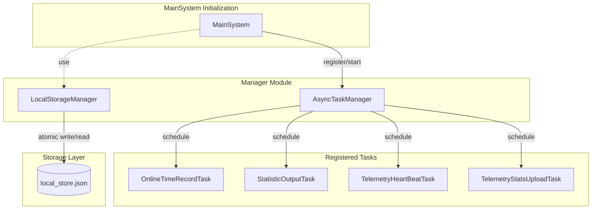

# Global Manager

This document is written based on the code-map snapshot.

## Overview

The Global Manager module (`src.manager`) is responsible for providing application-level singleton services to coordinate general foundational capabilities at the system level. This module is designed to be lightweight, containing no business logic; it serves purely as a utility service, ensuring that throughout the application lifecycle, there is a unified entry point and state management for fundamental task scheduling and persistent storage.

This module does not depend on other internal MaiBot modules, utilizing only basic packages from the Python standard library such as `asyncio`, `json`, and `os`. The two core managers, `AsyncTaskManager` and `LocalStorageManager`, are independent of each other and operate separately. This design ensures that the manager module can serve as the system's infrastructure layer, referenced on demand by `MainSystem`, various adapters, and plugins, without introducing circular dependencies.

## Architecture Diagram

## Core Concepts

### AsyncTaskManager

The Async Task Manager is responsible for managing the lifecycle of background asynchronous tasks. It allows the system to run cyclic tasks such as periodic heartbeats and data statistics without blocking the main logic.

AsyncTaskManager
    Responsibilities: Manage task registration, start, cancellation, and graceful shutdown.
    Key Components:
        AsyncTask: The base task class. Defines `wait_before_start` (startup delay) and `run_interval` (execution interval), supporting both one-time and cyclic tasks.
        abort_flag: A global abort flag. When the system shuts down, setting this flag notifies all cyclic tasks to stop running.
        _lock: An asynchronous lock. Ensures thread safety when adding or stopping tasks, preventing concurrent modifications to the task list.
    Singleton Instance: `async_task_manager`

Task Scheduling Mechanism
    The core of AsyncTaskManager is an `asyncio`-based task scheduling engine. Its workflow consists of four phases:

    Registration Phase
        Call `add_task()` to add an AsyncTask instance to the internal task list. This method holds the `_lock` asynchronous lock to prevent race conditions in concurrent scenarios. Upon registration, the task is in the "registered" state; no `asyncio.Task` is created yet, so it does not consume event loop resources.

    Scheduling Phase
        Call `start_task()` to create an `asyncio.Task` for registered tasks. Internally, this method wraps `AsyncTask.run()` as a coroutine task using `asyncio.create_task()`. Each AsyncTask instance corresponds to an `asyncio.Task` object, with the reference stored in the `_task` attribute for subsequent cancellation and waiting operations. Scheduled tasks enter the "running" state.

    Execution Loop
        After scheduling and startup, tasks enter an event-loop-driven execution cycle:
        - If `wait_before_start > 0`, first execute `asyncio.sleep(wait_before_start)` to implement delayed startup.
        - The main loop condition is `while not self.abort_flag`, continuously checking the global abort flag.
        - In each iteration, call `run()` to execute business logic. Exceptions within `run()` are caught and logged by `try/except`, preventing a single task failure from affecting the entire manager.
        - After `run()` returns, if `run_interval > 0`, sleep for the specified interval using `asyncio.sleep(run_interval)` to achieve periodic execution; otherwise, the task executes once and exits.

    Shutdown and Cleanup Phase
        When `stop_and_wait_all_tasks()` is called, the manager sets `abort_flag = True`. All running tasks detect this flag during the next loop condition check and exit voluntarily. The manager waits for each task to exit using `asyncio.wait_for()`, with a timeout of 10 seconds. Tasks that do not exit within the timeout are forcibly cancelled. Each `asyncio.Task` registers an `add_done_callback`; upon completion, terminated references are automatically removed from the internal list to prevent memory leaks.

### LocalStorageManager

The Local Storage Manager provides a simple key-value interface for persisting lightweight configurations or states to a local JSON file.

LocalStorageManager
    Responsibilities: Implement atomic read/write operations for local data and automatic recovery from corruption.
    Implementation Mechanism:
        Dictionary Interface: By implementing magic methods such as `__getitem__` and `__setitem__`, it operates like a Python dictionary.
        Atomic Write: During write operations, a temporary file (`.tmp`) is created first. After writing completes, `os.replace` is used to atomically replace the target file, preventing data loss due to write crashes.
        Corruption Recovery: When loading the file, if JSON corruption is detected, the original file is automatically backed up with a `.corrupt` suffix, and a new empty storage file is created, ensuring the system can start normally.
    Singleton Instance: `local_storage`

Initialization Process
    LocalStorageManager is initialized during the `MainSystem.initialize()` phase. During initialization, the storage file path is first determined (defaulting to `local_store.json` in the same directory as the main configuration file). Then, it attempts to load the contents of an existing file into an in-memory dictionary; if the file does not exist, it starts with an empty dictionary. If a JSON parsing error is detected during loading, the corruption recovery process is automatically executed.

Use Cases
    This manager is suitable for storing the following types of data:
    - User configuration preferences (e.g., language settings, theme selection).
    - Runtime state flags (e.g., first-run flag, feature toggles).
    - Lightweight counters and cached values.
    For data requiring complex queries or transaction support, a database should be used directly instead.

## Key Processes

### Scheduled Task Execution Flow

`AsyncTaskManager` manages scheduled tasks following a complete lifecycle from registration to cleanup:

1. Task Definition
    Developers inherit from the `AsyncTask` base class and implement the `run()` method. `run()` is the core logic of the task and should be designed as reentrant and idempotent, as the same task may be executed repeatedly across multiple schedules. The base class constructor accepts two parameters: `wait_before_start` and `run_interval`, which control the initial execution delay and the execution interval, respectively.

2. Task Registration
    Call `async_task_manager.add_task(task)` to add the task instance to the internal list. During registration, the `_lock` asynchronous lock is held to ensure no race conditions occur in concurrent scenarios. After registration, the task enters the "Registered" state; no corresponding `asyncio.Task` is created yet, and it does not consume event loop resources.

3. Scheduling and Startup
    The manager iterates through the list of registered tasks and calls `start_task()` for each task, internally creating coroutine tasks via `asyncio.create_task()`. Each `AsyncTask` instance corresponds to one `asyncio.Task`, with its reference stored in the `_task` attribute for subsequent cancellation and waiting operations. Upon successful scheduling, the task enters the "Running" state.

4. Execution Loop
    - If `wait_before_start > 0`, execute `asyncio.sleep(wait_before_start)` first to implement delayed startup, avoiding task contention during the system startup phase.
    - Enter the `while not self.abort_flag` loop; as long as `abort_flag` is not set, continue executing `run()`.
    - After each `run()` returns, if `run_interval > 0`, sleep for the specified interval via `asyncio.sleep(run_interval)` to achieve fixed-period cyclic execution.
    - If `run_interval <= 0`, the task automatically exits after completing one `run()`, suitable for one-time tasks.
    - Exceptions within `run()` are caught by `try/except` and logged, preventing a single exception from causing permanent task termination.

5. Task Cleanup
    Register a completion callback via `add_done_callback`. When the `asyncio.Task` completes (whether normally, due to an exception, or via cancellation), the callback function automatically removes the task from the internal list. This ensures the manager does not hold references to terminated tasks, preventing memory leaks.

Batch Stop Mechanism
    `stop_and_wait_all_tasks()` provides unified batch stop capabilities:
    - Set `abort_flag = True` to notify all running tasks to exit actively.
    - Concurrently wait for all tasks to complete, with a timeout limit of 10 seconds.
    - Tasks that do not exit within the timeout are forcibly cancelled via `task.cancel()`.
    - After all tasks stop, clear the internal task list and release references.

### Local Storage Read/Write Flow

Writing Data:
    - The user calls `local_storage[key] = value`.
    - Update the `store` dictionary in memory.
    - Call `save_local_store()` to trigger atomic writing.
    - Create a temporary file $
ightarrow$ JSON serialization $
ightarrow$ atomic replacement $
ightarrow$ delete the temporary file.
    - If an exception occurs during writing (e.g., insufficient disk space, permission errors), the temporary file is automatically cleaned up, and the original file remains unaffected.

    The advantage of atomic writing is that even if the process crashes during the write operation, the original data file will not be corrupted. After writing to the temporary file, `os.replace` performs a filesystem-level rename operation, ensuring the update to the target file is instantaneous.

Reading Data:
    - The user calls `local_storage[key]`.
    - Retrieve the value directly from the in-memory dictionary `store` (loaded into memory once at startup).

    Read operations involve only memory access and do not trigger file I/O, thus offering extremely high performance. All file reads are executed only once during initialization; all subsequent read operations occur in memory.

Persistence Trigger Strategy
    `save_local_store()` is called immediately after every write operation to achieve synchronous persistence. This design involves disk I/O on every assignment but ensures data safety, guaranteeing that the result of any write operation is persisted instantly, preventing loss of in-memory data due to system crashes.

## Interaction with MainSystem

The global manager plays a critical supporting role throughout the lifecycle of `MainSystem`. The two components collaborate through direct method calls, following a complete task lifecycle: registration → scheduling → execution → cleanup.

### Initialization Phase

During the execution of `MainSystem.initialize()`, the system registers a series of core background tasks via `AsyncTaskManager.add_task()`. After registration, the manager sequentially calls `start_task()` to create `asyncio.Task` instances for each task and start their execution loops. The registered core tasks include:
- `OnlineTimeRecordTask`: Records the robot's online duration and periodically updates the startup timestamp.
- `StatisticOutputTask`: Periodically outputs runtime statistics, including message throughput and the number of active sessions.
- `TelemetryHeartBeatTask`: Sends telemetry heartbeat packets to monitor system health status.
- `TelemetryStatsUploadTask`: Uploads statistical metrics to the telemetry service for data analysis and performance monitoring.

The `wait_before_start` and `run_interval` parameters for these tasks are specified during instantiation, ensuring that all scheduled tasks begin execution only after the system has fully started, thereby avoiding task contention during the startup phase.

### Runtime Phase

Once started, tasks run independently. They perceive the system state through the `abort_flag` mechanism. Tasks do not interfere with one another; an exception in a single task will not affect the normal operation of the manager or other tasks. During this phase, `AsyncTaskManager` acts solely as a maintainer of the task list and does not intervene in the execution of specific business logic.

### Shutdown Phase

In the `finally` block of the `main()` function, the system calls `async_task_manager.stop_and_wait_all_tasks()`. The execution flow of this method is as follows:
1. Set `abort_flag = True`: Notify all running tasks to exit during the next loop condition check.
2. Broadcast cancellation signals: Iterate through all active `asyncio.Task` instances and call `cancel()` sequentially.
3. Wait for graceful exit: Use `asyncio.wait_for()` to wait for each task to exit, with a timeout of 10 seconds.
4. Force termination: For tasks that do not exit within the timeout, the `asyncio` event loop forcibly cancels them.
5. Resource cleanup: Clear the internal task list to ensure all references occupied by `async_task_manager` are released.

The entire shutdown process ensures that no pending asynchronous operations cause the process to hang, achieving a predictable and clean exit.

## Hooks/Extension Points

As an infrastructure layer, the Global Manager Module adheres to the principles of minimalism and non-invasiveness in its design philosophy; therefore, it **does not expose any Hook interfaces**. All interactions between `MainSystem` and `Manager` are completed through direct method calls, without passing through an event bus or Hook mechanism.

Collaboration with other modules is as follows:

### Plugin Custom Scheduled Tasks
During the `MainSystem` startup process, after `event_bus.emit(EventType.ON_START)` is emitted, plugins can obtain the singleton instance of `async_task_manager` within their `on_start` callback and register custom scheduled tasks via `add_task()`. This provides plugins with the capability to execute their own logic periodically, such as regularly clearing caches or sending messages on a schedule.

### Usage of Local Storage
Plugins or system modules can directly read and write persistent data through the `local_storage` singleton. `LocalStorageManager` provides synchronous file I/O interfaces, suitable for storing lightweight data such as configuration items and status flags. For scenarios requiring structured queries, a database should be used directly instead of local storage.

### Design Considerations
The reason the Manager Module deliberately maintains a minimal interface is:
- To avoid introducing complexity at the infrastructure layer and keep responsibility boundaries clear.
- The management of scheduled tasks is already fully covered by `AsyncTaskManager`, making additional Hook abstractions unnecessary.
- Local storage only provides the most basic key-value pair operations and does not assume the responsibility of data models.

This design ensures that the Manager Module can remain stable independently of changes in business logic, while simultaneously providing sufficient extensibility for upper-layer modules.