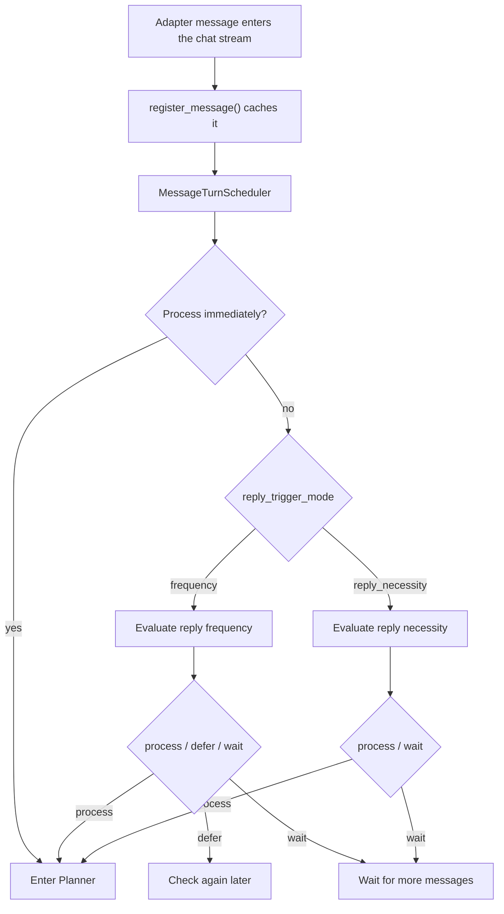
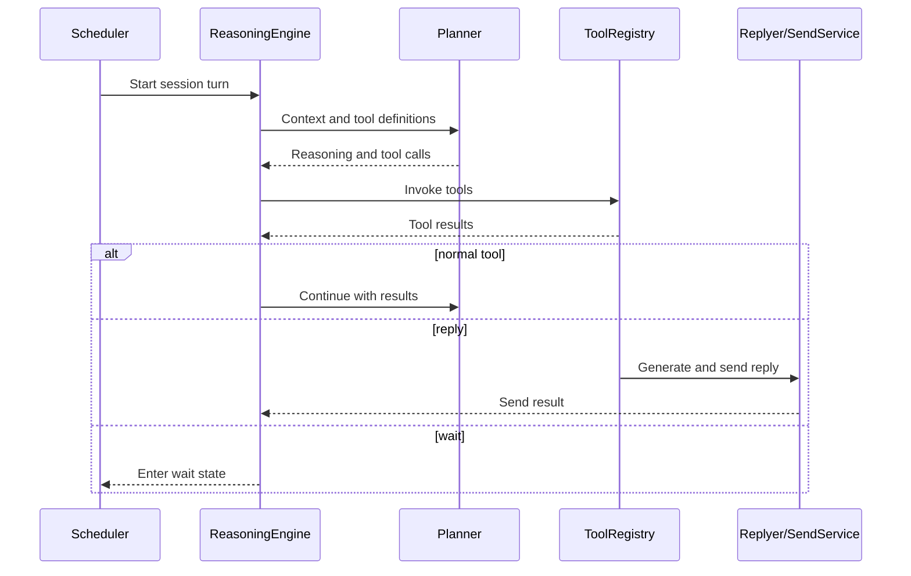

# Maisaka Reasoning Engine

Maisaka is MaiBot's per-session scheduler and multi-round tool-reasoning runtime. `MessageTurnScheduler` schedules messages and decides when they enter the Planner. `MaisakaReasoningEngine` then drives the Planner tool loop.

## Core components

**`MaisakaHeartFlowChatting`** — The runtime for one chat stream in `src/maisaka/runtime.py`. It owns the message cache, context, wait state, Planner interruption state, tool registry, Focus state, and background tasks.

**`MessageTurnScheduler`** — Uses the trigger mode and session state to enter the Planner, defer a check, or wait for more messages.

**`FrequencyThresholdTurnGate`** — In frequency mode, considers effective reply frequency, pending-message count, and idle compensation.

**`ReplyNecessityTurnGate`** — When `reply_trigger_mode = "reply_necessity"`, scores message content and session pressure.

**`MaisakaChatLoopService`** — Builds Planner requests, model messages, and tool definitions, then parses model tool calls.

**`MaisakaReasoningEngine`** — Runs the Planner → Tool → Planner loop and handles pause tools, no-tool retries, and cycle termination.

## Message scheduling

Direct mentions, proactive tasks, and some Focus wake-up paths can request immediate processing. In frequency mode, `talk_value` and dynamic rules determine the effective reply frequency. At a silent frequency, messages are still consumed without entering the normal reply loop.

## Planner tool loop

A reasoning cycle broadly follows these steps:

1. Collect unprocessed messages and wait for a short quiet period.
2. Build Planner context, including visual content, mid-term recall, person profiles, and heuristic memory.
3. Obtain available tools from `ToolRegistry`. Less common deferred tools first appear as hints and must be discovered through `tool_search`.
4. Call the `planner` model task.
5. Execute returned tool calls and append their results to the context.
6. Continue planning after normal tools; pause or end the cycle for tools such as `reply` and `wait`.
7. If the Planner repeatedly returns no tool call, append guidance and retry a limited number of times.

## Tool system

The runtime registers several providers in one `ToolRegistry`:

**Built-in tools** — `MaisakaBuiltinToolProvider` exposes `reply`, `wait`, `send_image`, `send_emoji`, `query_memory`, `query_person_profile`, `tool_search`, and other built-ins.

**Plugin tools** — `PluginToolProvider` exposes tools from the isolated plugin runtime.

**MCP tools** — `MCPToolProvider` is registered when MCP is enabled and connected.

Visibility also depends on configuration, Focus mode, capability state, and deferred-tool discovery. `tool_search` discovers tools but does not execute the target tool.

## Reply generation

When the Planner calls `reply`, it provides a target message and reply reason. The tool prepares the Replyer request, expression selection, quote policy, and optional rich-reply attachments before sending through the send service.

Replyer uses `model_task_config.replyer`. Expression selection may use `model_task_config.expression_use`, falling back to `utils` when empty.

Relevant Hooks include:

- `maisaka.planner.before_request`
- `maisaka.planner.after_response`
- `maisaka.replyer.before_request`
- `maisaka.replyer.before_model_request`
- `maisaka.replyer.after_response`

## Waiting, backoff, and interruption

**Consecutive wait limit** — `chat.reply_timing.max_consecutive_wait_count` limits `wait` calls in one continuous planning chain.

**No-action backoff** — After repeated no-reply decisions, `IdleBackoff` delays the next check using the configured base, cap, start count, and pending-message bypass threshold.

**Planner interruption** — A new message during a Planner request can set an interruption flag and rebuild context. `planner_interrupt_max_consecutive_count` limits consecutive interruptions; `0` means unlimited.

**Wait recovery** — A wait can resume after a timeout, a new message, or a proactive task. Private chats and silent-frequency sessions use slightly different recovery policies.

## Context and monitoring

Context processing keeps tool calls paired with tool results and removes orphaned results after trimming. Visual mode controls whether the Planner receives original images; the visual limiter handles requests above the image limit.

The runtime records session, message, Planner, tool, and reply stages for the WebUI observation view. Event models are defined in `src/maisaka/monitor/events.py`.

## Configuration entry points

- `[chat.reply_timing]`: reply frequency, trigger mode, interruption, wait limit, and no-action backoff.
- `[chat]`: context size, mid-term recall, and context optimization.
- `[visual]`: Planner and Replyer visual modes and image limits.
- `[experimental]`: Focus, rich replies, behavior learning, and attention drift.
- `model_task_config.planner`, `replyer`, and `expression_use`: corresponding model tasks.

When updating this architecture, verify `runtime.py`, `turn_scheduler.py`, `turn_gates.py`, `reasoning_engine.py`, `chat_loop_service.py`, and `builtin_tool/` together.
