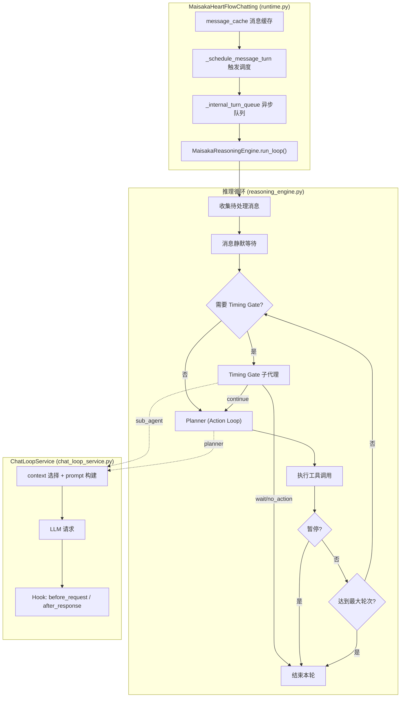
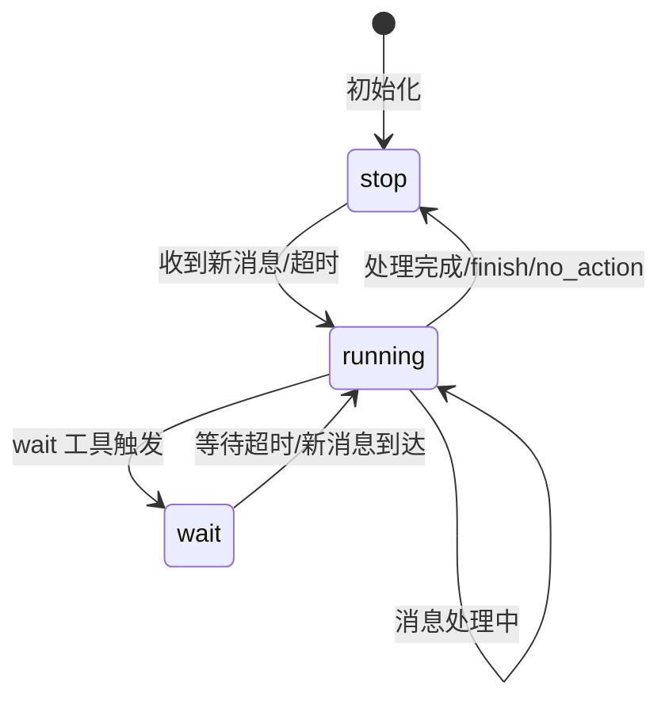
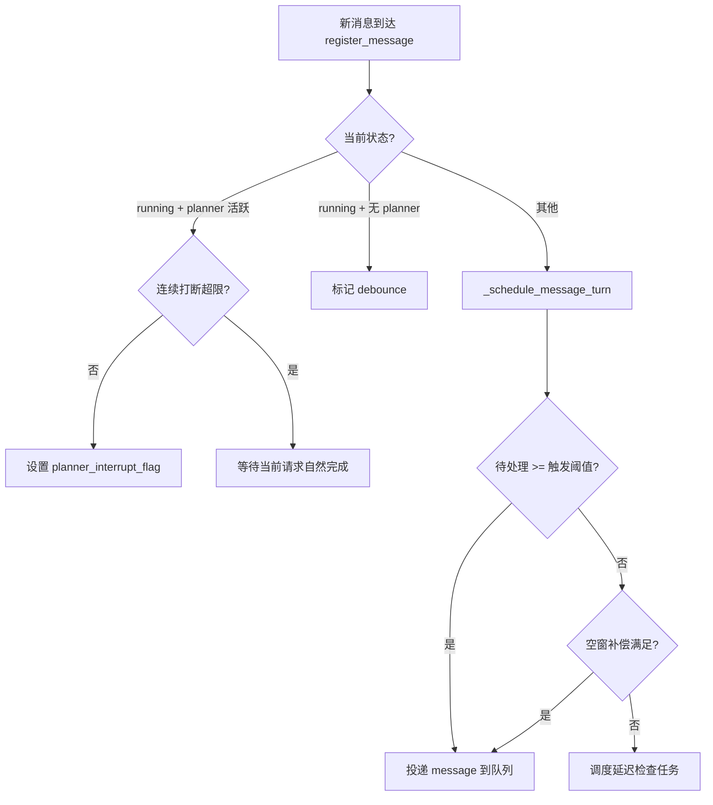
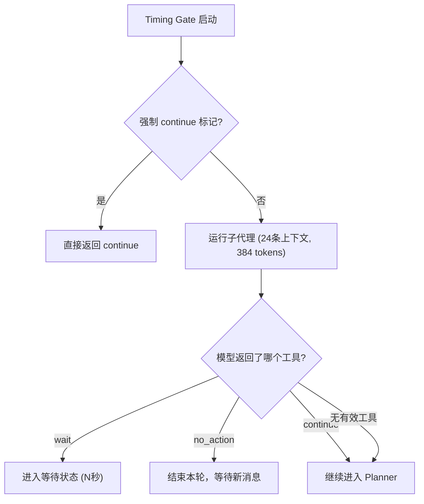
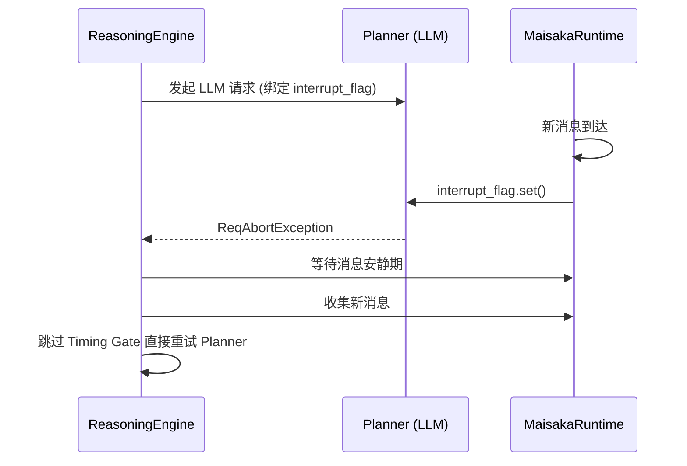
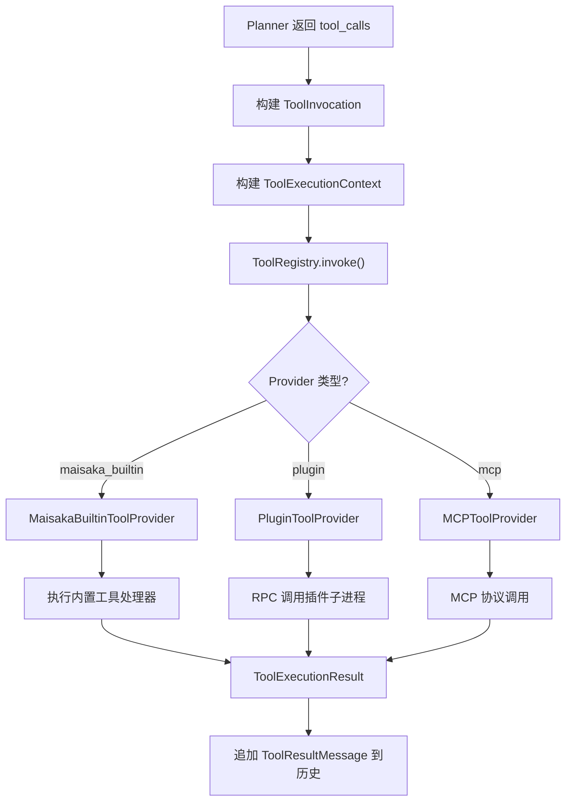
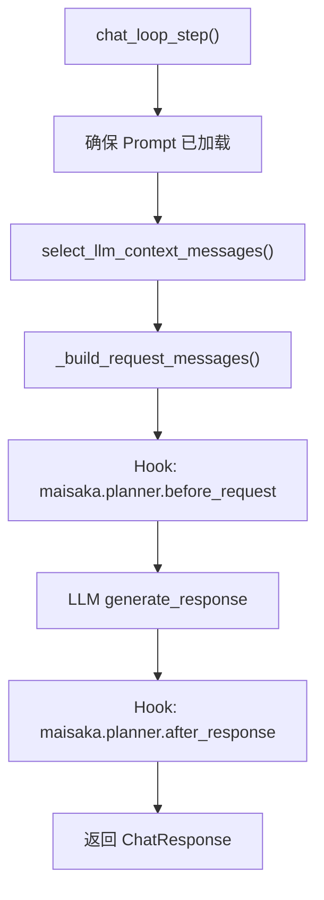
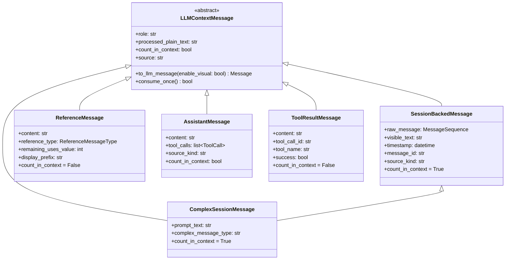
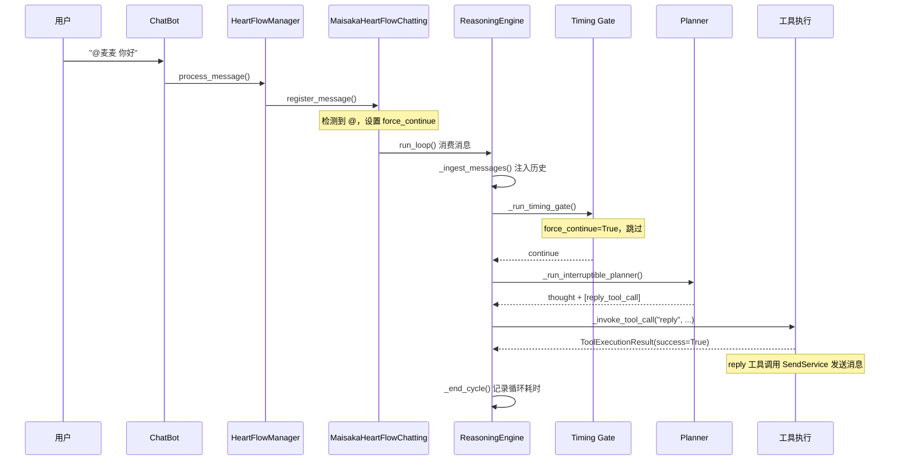

---
title: Maisaka Inference Engine
---# Maisaka Reasoning Engine

Maisaka is the core AI runtime of MaiBot, responsible for conversation reasoning, pacing control, and tool calling. This document details its internal architecture, state machine, and execution flow.

## Architecture Overview



## MaisakaHeartFlowChatting

Source location: `src/maisaka/runtime.py`

Each chat session corresponds to a `MaisakaHeartFlowChatting` instance, with its lifecycle managed by `HeartflowManager`.

### State Machine

The runtime has three states:



- **`running`** — Currently executing the reasoning loop
- **`wait`** — Waiting state; the `wait` tool has set a timeout
- **`stop`** — Idle state, waiting for a new external message trigger

### Core Attributes

- **`session_id`** `str` — Session ID
- **`_chat_history`** `list[LLMContextMessage]` — Internal context history
- **`message_cache`** `list[SessionMessage]` — Pending message cache
- **`_internal_turn_queue`** `asyncio.Queue` — Internal loop trigger queue ("message" / "timeout")
- **`_tool_registry`** `ToolRegistry` — Unified tool registry
- **`_reasoning_engine`** `MaisakaReasoningEngine` — Reasoning engine
- **`_chat_loop_service`** `ChatLoopService` — Conversation loop service
- **`_max_internal_rounds`** `int` — Maximum internal rounds (default 10)
- **`_max_context_size`** `int` — Maximum context message count
- **`_message_debounce_seconds`** `float` — Message debounce seconds (default 1.0)
- **`_talk_frequency_adjust`** `float` — Speaking frequency multiplier
- **`deferred_tool_specs_by_name`** `dict[str, ToolSpec]` — Deferred discovery tool pool
- **`discovered_tool_names`** `set[str]` — Discovered deferred tools

### Message Trigger Mechanism



Trigger threshold calculation:
```python
effective_frequency = talk_value * _talk_frequency_adjust  # 回复频率
trigger_threshold = ceil(1.0 / effective_frequency)  # 所需消息数
```

Idle window compensation: When the number of new messages is insufficient but the idle time is long, it is converted into an equivalent number of messages based on the recent average response duration.

### Forced Continue Mechanism

When an @ or mention is detected, `_arm_force_next_timing_continue()` sets a flag so that the next Timing Gate directly returns `continue`, ensuring the bot responds to the direct call.

## MaisakaReasoningEngine

Source location: `src/maisaka/reasoning_engine.py`

The core reasoning engine responsible for the internal thinking loop and tool execution.

### Key Constants

- **`TIMING_GATE_CONTEXT_LIMIT`** — `_max_context_size` (configurable) · Timing Gate context message limit (reads `global_config.chat.max_context_size` / `max_private_context_size`)
- **`TIMING_GATE_MAX_TOKENS`** — 384 · Timing Gate maximum output tokens
- **`TIMING_GATE_TOOL_NAMES`** — `{"continue", "no_action", "wait"}` · Timing Gate available tools
- **`ACTION_HIDDEN_TOOL_NAMES`** — `{"continue", "no_action"}` · Action Loop hidden tools
- **`MAX_INTERNAL_ROUNDS`** — 10 · Maximum internal thinking rounds

### run_loop Main Loop

```python
async def run_loop(self) -> None:
    while runtime._running:
        # 1. 等待触发信号
        queued_trigger = await runtime._internal_turn_queue.get()
        message_triggered, timeout_triggered = _drain_ready_turn_triggers(queued_trigger)

        # 2. 消息防抖
        if message_triggered:
            await runtime._wait_for_message_quiet_period()

        # 3. 收集待处理消息
        cached_messages = runtime._collect_pending_messages()

        # 4. 消息注入历史
        await _ingest_messages(cached_messages)

        # 5. 内部思考循环
        for round_index in range(max_internal_rounds):
            # 5a. Timing Gate（如果需要）
            if timing_gate_required:
                timing_action = await _run_timing_gate(anchor_message)
            if timing_action != "continue":
                break  # wait 或 no_action，结束本轮

            # 5b. Planner（Action Loop）
            response = await _run_interruptible_planner()

            # 5c. 相似度检测
            if _should_replace_reasoning(response.content):
                # 替换为重新思考提示
                response.content = "我应该根据我上面思考的内容进行反思..."

            # 5d. 工具执行
            if response.tool_calls:
                should_pause, summaries, monitors = await _handle_tool_calls(...)
                if should_pause:
                    break
                continue  # 工具执行后有新信息，继续循环

            break  # 无工具调用且无内容，结束
```

### Timing Gate

The Timing Gate is an independent sub-agent that determines the conversation pace:



Timing Gate system prompt:
- Prioritizes loading from the `maisaka_timing_gate` template
- Fallback prompts emphasize **calling only one tool** and not outputting plain text
- Available tools are limited to `wait`, `no_action`, and `continue`

### Planner (Action Loop)

The Planner is the primary reasoning and tool execution phase:

1. **Construct Tool Definitions**: `_build_action_tool_definitions()`
   - Filter `ACTION_HIDDEN_TOOL_NAMES` (continue, no_action)
   - Built-in Action tools are exposed directly
   - Default third-party/plugin tools are placed in the deferred pool and discovered via `tool_search`; plugin tools declaring `core_tool=True` or `visibility="visible"` are exposed directly

2. **Run Interruptible Planner**: `_run_interruptible_planner()`
   - Bind `asyncio.Event` interrupt flag
   - When a new message arrives, the flag is set → LLM request is aborted (`ReqAbortException`)
   - There is a limit to consecutive interruptions (`planner_interrupt_max_consecutive_count`)

3. **Thinking Deduplication**: `_should_replace_reasoning()`
   - When the similarity between current thinking and the previous round is > 90%
   - Replace with a "rethink" prompt to avoid infinite loops

### Planner Interrupt Mechanism



Behavior after interruption:
- If `has_pending_messages` and the maximum rounds have not been reached → Skip Timing Gate and re-enter Planner
- Otherwise → End the current loop

### Tool Execution

Tool calls are routed through a unified `ToolRegistry`:



## Built-in Tool Definitions

Source location: `src/maisaka/builtin_tool/`

### Timing Gate Tools

- **`continue`** — `continue_tool.py` · Allows proceeding to the next thinking round · Key parameters: None
- **`no_action`** — `no_action.py` · Stops the current loop and waits for new external messages · Key parameters: None
- **`wait`** — `wait.py` · Pauses the conversation for N seconds before re-evaluating · Key parameters: `seconds` (default 30)

### Action Tools

- **`reply`** — `reply.py` · Generates and sends a reply message · Key parameters: `msg_id`, `set_quote`, `reference_info`
- **`send_emoji`** — `send_emoji.py` · Sends an emoji/sticker · Key parameters: None (automatically selected based on context)
- **`finish`** — `finish.py` · Ends the current thinking round · Key parameters: None
- **`query_jargon`** — `query_jargon.py` · Queries slang/terms · Key parameters: `words`
- **`query_memory`** — `query_memory.py` · Queries long-term memory · Key parameters: `query`, `mode`, `limit`
- **`query_person_profile`** — `query_person_profile.py` · Queries character persona · Key parameters: `person_name`
- **`view_complex_message`** — `view_complex_message.py` · Views full forwarded message · Key parameters: `message_id`
- **`tool_search`** — `tool_search.py` · Searches for deferred discovery tools · Key parameters: `query`, `limit`

### Deferred Tool Discovery Mechanism

In the Action Loop, ordinary third-party/plugin tools are not exposed to the Planner by default. Instead, they are discovered in two steps:

1. **tool_search**: Searches the deferred tool pool; matching tool names are marked as "discovered"
2. **Next Planner Round**: Discovered tools are added to the visible tool list

This reduces the number of tools the Planner sees at once, avoiding decision paralysis.

If a plugin Tool declares `core_tool=True` or `visibility="visible"`, it skips the deferred discovery process and enters the Planner's visible tool list directly. This mechanism is suitable for high-frequency, low-risk, and context-strongly-related tools; ordinary plugin tools are still recommended to maintain default deferred behavior.

## ChatLoopService

Source location: `src/maisaka/chat_loop_service.py`

Responsible for encapsulating single-step LLM requests, including context selection, Prompt construction, and Hook triggering.

### chat_loop_step Flow



### Context Selection Strategy

`select_llm_context_messages()` selects the context for the LLM from the history:

1. Filter by `request_kind` (`planner` requests hide the Timing Gate tool chain)
2. Traverse backward from the end, selecting entries that can be successfully converted to LLM messages
3. Counting only includes `count_in_context=True` messages (`ToolResultMessage` and `ReferenceMessage` do not occupy the window)
4. Stop after reaching `max_context_size`
5. Hide the earliest 50% of assistant text messages (preserving the tool call chain)

### Hook Specs

For detailed Hook parameter information related to Maisaka, please refer to [Hook Processors](../plugin-dev/hooks#maisaka-planner-chain). This section only introduces the position and role of Hooks in the reasoning pipeline.

## Context Message Types

Source location: `maibot/src/maisaka/context/messages.py`



### ReferenceMessageType

- **`custom`** — Custom reference message
- **`jargon`** — Slang/term query results
- **`memory`** — Long-term memory retrieval results
- **`tool_hint`** — Tool hint information (e.g., deferred tools reminders)

### Context Window Occupancy

- **`SessionBackedMessage`** — Occupies window ✓ · Real user message
- **`ComplexSessionMessage`** — Occupies window ✓ · Complex/forwarded message
- **`ReferenceMessage`** — Occupies window ✗ · Reference information (does not occupy window)
- **`AssistantMessage`** (assistant) — Occupies window ✓ · Internal thinking text
- **`AssistantMessage`** (perception) — Occupies window ✗ · Perception text (interrupt prompts, etc.)
- **`ToolResultMessage`** — Occupies window ✗ · Tool execution result

## Planner Message Prefix

Source location: `maibot/src/maisaka/context/planner_messages.py`

When each user message is injected into the Planner, a structured prefix is added:

```
[时间]HH:MM:SS
[用户名]nickname
[用户群昵称]group_card
[msg_id]message_id
[发言内容]实际消息文本
```

`build_planner_prefix()` constructs the prefix, and `build_planner_user_prefix_from_session_message()` extracts parameters from `SessionMessage`.

## Monitoring Events

Source location: `maibot/src/maisaka/monitor/events.py`

Events are broadcast to the frontend monitoring panel via WebSocket:

- **`session.start`** — Runtime start · Key data: session_id, session_name
- **`message.ingested`** — Message injected into history · Key data: speaker_name, content, message_id
- **`cycle.start`** — Thinking loop start · Key data: cycle_id, round_index, max_rounds
- **`timing_gate.result`** — Timing Gate decision complete · Key data: action, content, tool_calls, prompt_tokens
- **`planner.finalized`** — Planner complete · Key data: Full cycle data, token statistics, duration

## Complete Reasoning Flow Example

Taking a user sending an @bot message in a group chat as an example:

