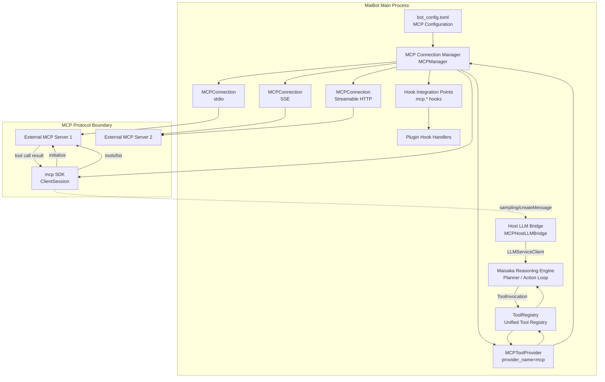
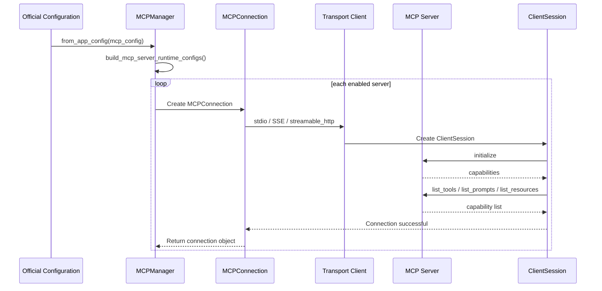
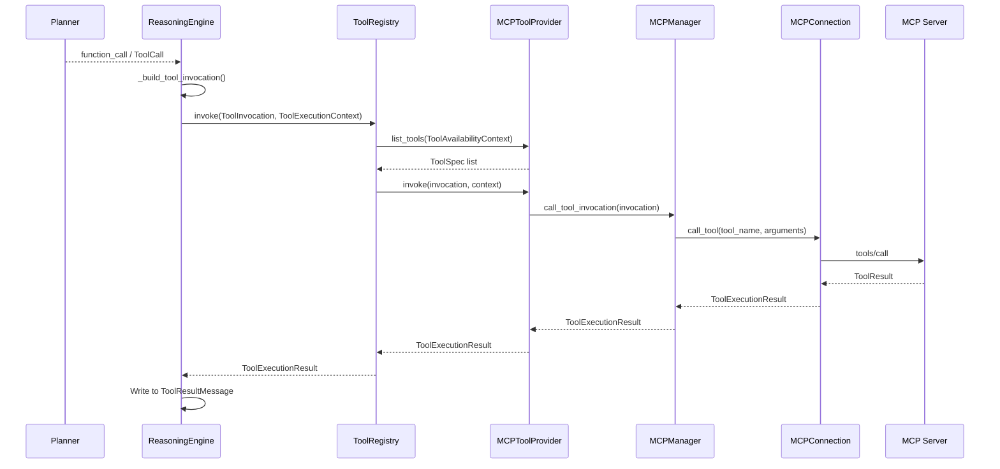

# MCP Integration Architecture

This document is written based on the code-map snapshot.

MaiBot's MCP integration resides in `maibot/src/mcp_module/`. Its responsibility is not to bake a fixed set of capabilities into the main program, but rather to turn external MCP servers into part of MaiBot's tool system. MCP servers provide capabilities such as Tools, Prompts, and Resources. MaiBot acts as an MCP client that connects to these servers, discovers capabilities, and then adapts the tool capabilities to the unified `ToolProvider` interface.

This document focuses on the internal architecture from a development perspective and does not repeat the configuration and usage instructions found in the user manual.

## 1. Overview

**Role of MCP**: MCP stands for Model Context Protocol. In this integration, MaiBot acts as an MCP Client, while external services act as MCP Servers. MaiBot does not embed external tool implementations; it is only responsible for protocol connection, capability discovery, invocation routing, and result normalization.

**Capability Sources**: The capabilities exposed by an MCP Server can include Tools, Prompts, Resources, and Resource Templates. The most directly effective for the Maisaka reasoning engine are Tools, because tools are converted into `ToolSpec` entries and enter the unified tool list.

**Integration Goal**: Once MCP tools are incorporated into MaiBot, they are no longer consumed by the reasoning engine as remote protocol objects. Instead, they are converted into `ToolSpec`, `ToolInvocation`, and `ToolExecutionResult`. Maisaka only deals with the unified tool abstraction and does not need to know whether a tool comes from a plugin, a built-in module, or MCP.

**Runtime Relationship**: External MCP Servers are the capability implementers, while MaiBot is the protocol client and tool dispatcher. When a tool is executed, MaiBot initiates a remote call via the MCP SDK's `ClientSession.call_tool()`, and then converts the MCP response into MaiBot's internal result.

**Optional Dependency**: The `mcp` Python SDK is an optional dependency. The main program can still run without the SDK installed or without any servers configured. `MCPManager.from_app_config()` returns `None` when no configuration is available, the SDK is missing, or all connections fail.

**Boundary**: The MCP module does not replace `tool-system`, nor does it replace `MaisakaReasoningEngine`. It only handles protocol adaptation and lifecycle management. The actual tool registration, LLM tool definition generation, and invocation routing are handled by the tool system and the reasoning engine.

## 2. Architecture Diagram

**MCP Connection Manager**: Corresponds to `MCPManager` in the architecture diagram. It maintains multiple `MCPConnection` instances, stores the mapping from tool names to server names, and provides unified access entry points for Tools, Prompts, and Resources.

**Tool Provider**: `MCPToolProvider` wraps `MCPManager` as a standard `ToolProvider`. It only implements `list_tools()`, `invoke()`, and `close()`, without directly understanding the details of the MCP protocol.

**Host LLM Bridge**: `MCPHostLLMBridge` handles Sampling requests initiated by MCP Servers in reverse. It converts MCP Sampling messages into MaiBot internal messages, then calls `LLMServiceClient`, and finally converts the model response back into an MCP `CreateMessageResult` or `CreateMessageResultWithTools`.

**Hook Integration**: MCP connection, disconnection, and tool execution are boundaries that plugin Hooks can observe or intercept. In the code snapshot, the protocol layer uses `MCPHostCallbacks` injected into `ClientSession`, while the plugin named Hook layer can be accessed via `mcp.server_connected`, `mcp.server_disconnected`, and `mcp.tool_executed`.

## 3. Core Concepts

### 3.1 MCP Server and MCP Client

**MCP Server**: The external capability provider. It can be a local subprocess, a remote HTTP service, or an SSE service. The Server declares its capabilities through the MCP protocol and responds to methods such as `initialize`, `tools/list`, and `tools/call`.

**MCP Client**: The protocol client on the MaiBot side. `MCPConnection` uses the `mcp` SDK to create a `ClientSession`, which is responsible for transport connection, protocol handshake, capability discovery, and remote invocation.

**JSON-RPC 2.0**: MCP requests and responses are based on JSON-RPC 2.0 semantics. The client sends method calls, and the server returns a result or error. `stdio_filter.py` provides additional protection for stdio transport by discarding stdout noise lines that do not match the JSON-RPC starting format.

**stdio**: Local subprocess transport. MaiBot starts the external MCP Server according to the `command`, `args`, and `env` in the configuration, and exchanges JSON-RPC messages via standard input and output.

**SSE**: Server-Sent Events remote transport. MaiBot connects to remote services via `sse_client`, suitable for long-connection push scenarios.

**Streamable HTTP**: Remote HTTP transport. MaiBot connects to remote services via `streamable_http_client` and supports configurable request headers, Bearer Token, and timeouts.

**Authentication**: Remote HTTP and SSE connections can merge custom Headers via `build_http_headers()`. Bearer mode automatically writes `Authorization: Bearer <token>`.

### 3.2 MCPConnectionManager, aka MCPManager

**Architectural Name**: The "MCP Connection Manager" referred to in the user manual and this document corresponds to `MCPManager` in the source code. It is not a built-in class of the `mcp` SDK, but a management layer written by MaiBot for multi-server lifecycle management.

**Configuration Entry**: `MCPManager.from_app_config()` reads the official MCP configuration, calls `build_mcp_server_runtime_configs()` to generate a list of runtime servers, and then creates an `MCPConnection` for each server.

**Connection Collection**: `_connections` holds the connected servers, with the server name as the key and the corresponding `MCPConnection` as the value.

**Routing Mapping**: `_tool_to_server`, `_prompt_to_server`, `_resource_to_server`, and `_resource_template_to_server` store the mapping from capability names to server names. When a tool is invoked, the target server is found via `_tool_to_server`.

**Conflict Protection**: MCP tools cannot occupy MaiBot's built-in tool names, such as `reply`, `no_action`, `stop`, `create_table`, `list_tables`, `view_table`. For tools with the same name across different servers, only the first registered server is kept.

**Capability Registration**: After each successful connection, the manager registers Tools, Prompts, Resources, and Resource Templates, and prints a connection summary. The registration count is used to determine whether the server has actually added usable capabilities to MaiBot.

**Lifecycle Close**: `MCPManager.close()` closes all `MCPConnection` instances and clears the connection and mapping tables. `MCPToolProvider.close()` delegates to the manager to close connections.

### 3.3 MCPConnection

**Responsibility**: `MCPConnection` manages the connection lifecycle of a single MCP server. It encapsulates the transport layer, `ClientSession`, server capabilities, and remote invocation.

**Connection Flow**: `connect()` enters an asynchronous context, establishes the transport, creates a `ClientSession`, executes `session.initialize()`, saves `server_capabilities` and `protocol_version`, and then loads server capabilities.

**Capability Discovery**: `_load_server_features()` decides whether to call `list_tools()`, `list_prompts()`, `list_resources()`, and `list_resource_templates()` based on the server's capability declarations.

**Paginated Loading**: Tools, Prompts, Resources, and Resource Templates are all read page by page using a cursor. As long as `nextCursor` is present, the next page is requested.

**Optional Capability Tolerance**: `list_resource_templates` is an optional method. If some servers do not implement it and return `METHOD_NOT_FOUND`, MaiBot handles it as an empty collection to avoid breaking the entire connection.

**Remote Invocation**: `call_tool()` calls `ClientSession.call_tool()`, and then converts the raw MCP content into a `ToolExecutionResult`. Invocation exceptions are converted into failure results rather than being thrown directly into the reasoning loop.

**Close Behavior**: `close()` releases the asynchronous context, HTTP client, and read/write streams, and clears the current connection state.

### 3.4 MCPToolProvider

**Responsibility**: `MCPToolProvider` is an adapter from MCP to `ToolProvider`. It allows MCP tools to enter the unified tool system.

**provider_name**: `mcp`.

**provider_type**: `mcp`.

**list_tools**: `list_tools(context)` ignores the context and directly returns `MCPManager.get_tool_specs()`. The unified declaration of MCP tools is already completed at the manager layer.

**invoke**: `invoke(invocation, context)` ignores the context and directly calls `MCPManager.call_tool_invocation(invocation)`. The context is still meaningful at the tool system layer, but the MCP call itself only depends on the tool name and arguments.

**close**: Closing the Provider closes `MCPManager`, thereby closing all MCP connections.

### 3.5 HostLLMBridge

**Full Name**: `MCPHostLLMBridge`.

**Trigger Source**: The MCP Server requests model sampling from MaiBot via `sampling/createMessage`. This request originates from the external service, not from MaiBot actively invoking an external tool.

**Bridging Method**: The Bridge reads the MCP Sampling parameters, including `messages`, `systemPrompt`, `temperature`, `maxTokens`, `toolChoice`, and `tools`, then calls the main program's `LLMServiceClient`.

**Tool Selection Mode**: Supports `auto`, `required`, and `none`. When `required` is set and the model does not return a tool call, an MCP `ErrorData` is returned.

**Message Conversion**: The `user`, `assistant`, and `tool_result` content blocks from MCP Sampling are converted into an internal `Message` sequence. Content types that cannot be transparently passed through, such as images and audio, are degraded to text placeholders.

**Result Conversion**: `LLMResponseResult` is converted to MCP `CreateMessageResult` or `CreateMessageResultWithTools`. If the model returns tool calls, the result includes `ToolUseContent`.

**Host Callbacks**: `MCPHostLLMBridge.build_callbacks()` returns `MCPHostCallbacks(sampling_callback=handle_sampling_request)`, which is injected into `ClientSession` by `MCPConnection`.

### 3.6 MCPHostCallbacks and Hook Boundary

**MCPHostCallbacks**: A collection of protocol-layer host callbacks, with fields including `sampling_callback`, `elicitation_callback`, `logging_callback`, and `message_handler`.

**Difference from Plugin Hooks**: `MCPHostCallbacks` are injected into the MCP SDK's `ClientSession` to implement the host capabilities in the MCP protocol. Plugin Hooks are MaiBot's named Hook dispatch system and need to be explicitly called by business code via `invoke_hook()`.

**server_connected**: Suitable for triggering after a single MCP Server completes connection, initialization, and capability loading.

**server_disconnected**: Suitable for triggering upon connection close, connection failure cleanup, or process exit.

**tool_executed**: Suitable for triggering after an MCP tool call completes and generates a `ToolExecutionResult`.

**Recommended Payload**: These Hooks can carry `server_name`, `transport`, `tool_name`, `arguments`, `success`, `duration_ms`, `protocol_version`, `session_id`, and `error_message`.

## 4. Key Flows

### 4.1 MCP Server Connection

**Configuration Filtering**: `build_mcp_server_runtime_configs()` only returns servers that are enabled and fully configured. Disabled servers do not enter the connection flow.

**SDK Detection**: If the `mcp` SDK is not installed, the manager prints a warning and returns `None`.

**Failure Isolation**: A connection failure of one server does not prevent other servers from continuing to connect. If all servers fail, `from_app_config()` returns `None`.

**Initialization Handshake**: `session.initialize()` is the protocol capability negotiation point. After a successful handshake, `server_capabilities` determines which capabilities are subsequently discovered.

### 4.2 Tool Discovery

**Discovery Method**: `tools/list` corresponds to the SDK's `session.list_tools(cursor=cursor)`. MaiBot reads all pages in a loop until there is no `nextCursor`.

**Raw Object**: The tool object returned by the SDK contains fields such as `name`, `title`, `description`, `inputSchema`, `outputSchema`, `icons`, `annotations`, and `meta`.

**Schema Cleaning**: `MCPManager` converts `inputSchema` and `outputSchema` into plain dicts and removes `$schema` to avoid sending redundant fields to the model layer.

**Unified Declaration**: The tool object is converted into a `ToolSpec`, where `provider_name="mcp"`, `provider_type="mcp"`, and `metadata.server_name` records the source server.

**Conflict Handling**: The tool name is first compared against built-in tool names, then against already registered MCP tool names. Conflicting tools are skipped, and a warning is output.

### 4.3 Registration with ToolProvider

**Registration within the Manager**: `MCPManager` establishes the `_tool_to_server` mapping during the connection phase. This mapping is not registration with `ToolRegistry`, but an MCP internal routing table.

**Provider Registration**: `MaisakaRuntime._init_mcp()` calls `ToolRegistry.register_provider(MCPToolProvider(self._mcp_manager))` after the manager is successfully initialized and MCP tools exist.

**Registration Conditions**: The Provider is registered only after these conditions are met: MCP configuration exists, the SDK is available, at least one server has connected successfully, and at least one MCP tool has been discovered.

**Provider Identifier**: `MCPToolProvider` uses `provider_name="mcp"`. If a Provider with the same name already exists, `ToolRegistry` removes the old Provider first, then registers the new one.

### 4.4 Reasoning Engine Invocation

**Model Output**: The model layer may express a tool invocation as `function_call`, `ToolCall`, or an equivalent structure. MaiBot converts these uniformly into `ToolInvocation` in `_build_tool_invocation()`.

**Invocation Context**: `_build_tool_execution_context()` places information such as the session, chat flow, group chat, user, platform, and anchor message into `ToolExecutionContext`.

**Provider Lookup**: `ToolRegistry.invoke()` first collects the tool list from Providers based on the current availability context, then finds the Provider matching `invocation.tool_name`.

**MCP Routing**: `MCPManager.call_tool_invocation()` finds the target server via `_tool_to_server`, then calls the corresponding `MCPConnection.call_tool()`.

**Result Return**: `MCPConnection.call_tool()` converts MCP content into a `ToolExecutionResult`, and the reasoning engine then appends the result to the tool result history.

### 4.5 Result Return and History Writing

**Text Results**: Text content returned by MCP tools goes into `ToolExecutionResult.content`.

**Multimedia Results**: Content such as image, audio, resource, and resource_link goes into `content_items`. MaiBot uses `build_tool_content_items()` to convert raw MCP content into unified content items.

**Structured Results**: If MCP returns `structuredContent`, it is written to `ToolExecutionResult.structured_content` for use by subsequent logic or model summarization.

**Error Results**: When MCP returns `isError=True` or an invocation exception occurs, `success=False` is set and the error information is written to `error_message`.

**History Summary**: `ToolExecutionResult.get_history_content()` prioritizes `content` first, then a summary of `content_items`, then the structured content JSON, and finally the error message.

## 5. Interaction with the Tool Abstraction Layer (tool-system)

**Unified Entry Point**: `MCPToolProvider` implements the `ToolProvider` Protocol, so it can be treated equally by `ToolRegistry` alongside plugin and built-in Providers.

**Declaration Conversion**: The raw MCP tool object is first converted to `ToolSpec` by `MCPManager.get_tool_specs()`. This step includes name, description, parameter schema, output schema, icon, annotations, and metadata.

**Invocation Conversion**: `ToolInvocation` is the unified invocation request. The MCP Provider does not need to understand the raw function call structure of the model API; it only needs to read `tool_name` and `arguments`.

**Result Conversion**: MCP tool results are converted into `ToolExecutionResult`. The tool system does not care whether the result comes from a local Python function or a remote MCP Server.

**Deduplication Rules**: `ToolRegistry.list_tools()` collects tools in Provider order and skips duplicate tool names. MCP also performs conflict detection internally, so conflicts within the same server and across servers are handled as early as possible.

**Provider Order**: Built-in Providers and plugin Providers are the default registration paths. The MCP Provider is registered only after `_init_mcp()` initializes successfully, so it does not occupy the tool list when no MCP tools are available.

**Legacy Model Compatibility**: `MCPManager.get_openai_tools()` can convert MCP tool definitions into the function tool format used by the legacy model layer. The newer path prefers using `ToolRegistry.get_llm_definitions()`.

## 6. Interaction with Maisaka

### 6.1 Tool List Enters the Reasoning Engine

**Initialization Location**: `MaisakaRuntime._init_mcp()` is responsible for creating the Host LLM Bridge, MCPManager, and MCPToolProvider.

**Registration Order**: After successful initialization, `MCPToolProvider` is registered with `_tool_registry`. Subsequently, when the Planner constructs tool definitions, `ToolRegistry.list_tools()` will include MCP tools.

**Visibility Strategy**: `_build_action_tool_definitions()` places non-built-in tools either in the visible list or the deferred pool. If an MCP tool does not have an explicit `metadata.visibility="visible"`, it enters the deferred pool by default and can be discovered later via `tool_search`.

**LLM Definition**: Visible tools are converted to model-layer tool definitions via `ToolSpec.to_llm_definition()`. The descriptions, parameter schemas, and names of MCP tools use the same format as other tools.

**Context Filtering**: When the tool list is constructed, a `ToolAvailabilityContext` is passed in. The MCP Provider currently does not filter tools based on context, but the unified tool layer retains the context parameter for future extensibility.

### 6.2 function_call Routing

**Model Layer Concept**: `function_call` is the tool invocation expression in a model response. MaiBot internally uses `ToolCall` to represent model output, and then converts it to `ToolInvocation`.

**Invocation Construction**: `_build_tool_invocation(tool_call, latest_thought)` extracts `func_name`, `args`, and `call_id` from the model's tool call, and supplements `session_id`, `stream_id`, and `reasoning`.

**Execution Entry**: `_invoke_tool_call()` or the batch `_handle_tool_calls()` hands the `ToolInvocation` over to `ToolRegistry.invoke()`.

**Provider Location**: `ToolRegistry.invoke()` re-collects tool declarations based on the availability context, and finds the Provider whose declaration contains the target tool name. The `provider_name` for MCP tools is `mcp`, so they are routed to `MCPToolProvider`.

**Remote Execution**: `MCPToolProvider.invoke()` delegates to `MCPManager.call_tool_invocation()`, and the manager then finds the corresponding `MCPConnection` via `_tool_to_server`.

**Result Write-back**: After `MCPConnection` returns a `ToolExecutionResult`, the reasoning engine stores the tool record and appends the result as a `ToolResultMessage` or equivalent history content.

### 6.3 Relationship with the Host LLM Bridge

**Bidirectional Capability**: MCP integration not only allows MaiBot to call external tools, but also allows MCP Servers to request model invocation from MaiBot. This direction is implemented through `MCPHostLLMBridge`.

**Sampling Configuration**: `mcp.client.sampling.enable` determines whether to declare the Sampling capability, `task_name` determines which model task to use, and `tool_support` determines whether tools can continue to be used during Sampling.

**Tool Definition Injection**: When an MCP Server includes `tools` in a Sampling request, the Bridge converts the MCP tool definitions into `ToolDefinitionInput` and passes them to `LLMServiceClient`.

**Tool Call Return**: If the model response contains tool calls, the Bridge returns `CreateMessageResultWithTools`, which includes `ToolUseContent`. The MCP Server can subsequently continue processing these tool call results.

**Error Isolation**: The Bridge catches exceptions and returns MCP `ErrorData` to prevent a single Sampling failure from directly breaking the MCP connection.

## 7. Hook Integration Points

### 7.1 Current Protocol Layer Hooks

**MCPHostCallbacks**: These are host capability callbacks for the MCP SDK, not plugin Hook specifications. They are passed into `MCPConnection` and then used by `ClientSession`.

**sampling_callback**: Handles Sampling requests initiated by MCP Servers. The current implementation is provided by `MCPHostLLMBridge.handle_sampling_request()`.

**elicitation_callback**: Reserved for the MCP Elicitation capability. The current configuration and connection layer support declaration, but specific user interaction capabilities still need to be implemented by the business layer.

**logging_callback**: Can be used to consume MCP Server logs. Currently a reserved field in `MCPHostCallbacks` with no default injection.

**message_handler**: Can be used to handle custom MCP messages. Currently a reserved field in `MCPHostCallbacks` with no default injection.

### 7.2 Plugin Named Hook Design Points

**Integration Principle**: To expose MCP lifecycle events to plugin Hooks, `PluginRuntimeManager.invoke_hook()` should be called at the boundaries of connection and tool invocation. These Hooks are not part of the MCP protocol itself, but rather observability extensions of the MaiBot runtime.

**server_connected**: Recommended to trigger after a single `MCPConnection.connect()` succeeds, capabilities are loaded, and the manager records the connection. At this point, the payload already contains a stable tool count and capability summary.

**server_disconnected**: Recommended to trigger upon connection close, connection failure cleanup, or manager shutdown. Even if the connection was never successfully initialized, a disconnect event can still be fired during cleanup to help monitoring tools track connection failures.

**tool_executed**: Recommended to trigger after `MCPConnection.call_tool()` returns a `ToolExecutionResult`. At this point, the tool name, server name, success status, duration, and error information can be accurately recorded.

**server_connected Payload**: `server_name`, `transport`, `protocol_version`, `tool_count`, `prompt_count`, `resource_count`, `resource_template_count`.

**server_disconnected Payload**: `server_name`, `transport`, `reason`, `had_session`, `protocol_version`, `session_id`.

**tool_executed Payload**: `server_name`, `tool_name`, `arguments`, `success`, `duration_ms`, `content_length`, `error_message`, `metadata`.

**Blocking vs. Observation**: `server_connected` and `server_disconnected` are typically suitable for observe handlers. `tool_executed`, if allowed to record audits or rewrite results, can be designed as a blocking handler, but care must be taken to avoid impacting reasoning loop performance.

**Error Handling**: Hook invocation failures should not break the MCP connection lifecycle. It is recommended to log the error and convert the exception into a Hook dispatch error, rather than causing the connection to close or the tool invocation to fail.

## 8. Data Model Conversion

**ToolSpec**: MCP tool declarations are converted to the unified `ToolSpec`. `provider_name` and `provider_type` are fixed to `mcp`, and `metadata.server_name` retains the source server.

**ToolIcon**: MCP icon objects are converted to `ToolIcon`, containing `src`, `mime_type`, and `sizes`.

**ToolAnnotation**: MCP annotation objects are converted to `ToolAnnotation`, containing `audience`, `priority`, and `metadata`.

**ToolContentItem**: MCP tool result content blocks are converted to unified content items. Supports `text`, `image`, `audio`, `resource_link`, `resource`, `binary`, and `unknown`.

**PromptSpec**: MCP Prompts are converted to `MCPPromptSpec`, containing parameter lists, icons, and metadata.

**ResourceSpec**: MCP Resources are converted to `MCPResourceSpec`, containing URI, name, MIME, size, icon, and annotations.

**ResourceTemplateSpec**: MCP Resource Templates are converted to `MCPResourceTemplateSpec`, preserving the URI template, name, description, and metadata.

**Structured Metadata**: `_dump_model_metadata()` extracts the `meta` field from the raw MCP object. This field can enter `ToolSpec.metadata` or annotation metadata.

## 9. Runtime Configuration

**Configuration Conversion**: `config.py` converts the official MCP configuration into runtime dataclasses, preventing the connection layer from directly reading the configuration model.

**Server Configuration**: `MCPServerRuntimeConfig` stores the server name, transport type, command, arguments, environment variables, URL, headers, timeout, and authentication information.

**Client Configuration**: `MCPClientRuntimeConfig` stores the client name, version, Roots, Sampling, Elicitation, and other host capability configurations.

**Transport Type Inference**: `transport_type` is determined based on `transport`, `command`, and `url`. stdio requires a command, while HTTP and SSE require a url.

**HTTP Headers**: `build_http_headers()` merges user-configured headers and Bearer Token. The Bearer Token is automatically written into the standard Authorization Header.

**Roots**: Roots are exposed to the MCP Server via `_build_list_roots_callback()`. The client only declares this capability when Roots are enabled and valid URIs are configured.

**Sampling Capability Declaration**: The `ClientSession` only receives sampling callbacks and sampling capabilities when Sampling is enabled and a `sampling_callback` is provided.

## 10. Fault Tolerance and Security Boundaries

**stdio Noise Filtering**: The MCP protocol requires stdout to carry only JSON-RPC messages. Third-party servers sometimes write startup banners to stdout. MaiBot uses `tolerant_stdio_client()` to discard non-JSON lines, preventing initialization failure.

**Exception Isolation**: Connection failures, tool invocation failures, and Sampling invocation failures should all be converted into logs or failure results at their respective boundaries, preventing a single MCP Server from affecting the stability of the main program.

**Name Protection**: Built-in tool names cannot be occupied by MCP tools. This is a critical protection to prevent the model from being incorrectly routed to external tools.

**Cross-Server Conflicts**: For MCP tools with the same name, only the first registered server is kept. The configuration order determines the retention order.

**Resource Release**: All MCP connections should be released via `MCPManager.close()` or `MCPToolProvider.close()`. It should be ensured that close is called when the process exits or the runtime stops.

**Audit Recommendations**: If `mcp.tool_executed` is enabled, it is recommended to record the tool name, server name, success status, duration, and error summary. Parameters and results may contain sensitive information and should be sanitized before writing to logs.

## 11. Boundaries with Other Documents

**User Manual**: `docs/en/manual/features/mcp.md` is intended for users, explaining what MCP is, how to configure it, and how to troubleshoot. This document does not repeat that content.

**Tool System Architecture**: `docs/en/develop/architecture/tool-system.md` explains the unified `ToolProvider`, `ToolRegistry`, and the tool invocation model. This document only explains how MCP integrates into that layer.

**Maisaka Reasoning Engine**: `docs/en/develop/architecture/maisaka-reasoning.md` explains message scheduling, the Planner loop, and tool execution. This document only explains how MCP tools enter the tool list and function_call routing.

**Plugin Development Documentation**: Specific plugin Hook implementation details belong in the plugin development documentation. This document only defines the trigger boundaries and recommended payloads for MCP-related Hooks.

## 12. Summary

**Essence of MCP Integration**: The MCP module converts the capabilities of external MCP Servers into MaiBot's internal tool capabilities. External services implement the tools, while MaiBot handles connection, discovery, registration, invocation, and result normalization.

**Core Chain**: `MCPManager` manages connections, `MCPConnection` handles protocol interaction, `MCPToolProvider` interfaces with the tool system, `ToolRegistry` routes to the Provider, and `MaisakaReasoningEngine` consumes the tool results.

**Key Extension Points**: MCP tools can extend MaiBot's tool boundaries; the Host LLM Bridge can support reverse requests from MCP Servers for model capabilities; and the `mcp.*` Hooks can provide observability and extensibility for connection and tool execution.

**Implementation Constraints**: MCP is an optional runtime dependency; tool names must avoid conflicts; remote calls must isolate failures; and connection resources must be explicitly released.
