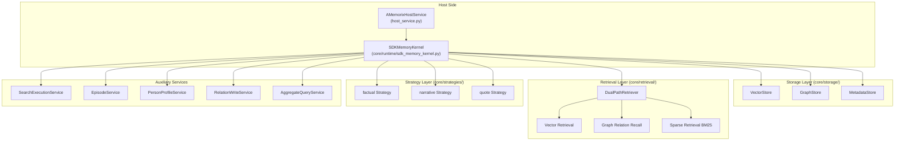
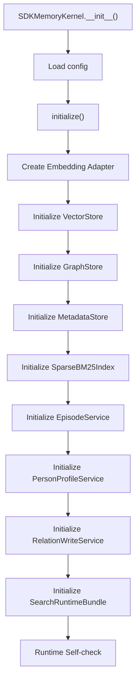
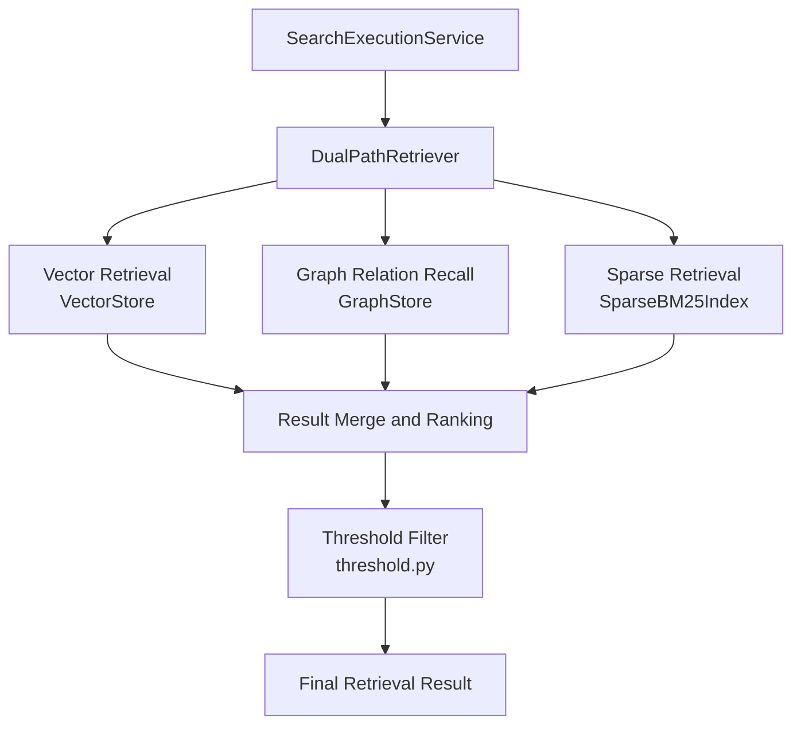

# Memory System (A-Memorix)

A-Memorix is MaiBot's built-in long-term memory subsystem, responsible for persisting user preferences, dialogue history, and person profiles. This document details its architecture, storage mechanisms, and retrieval flows.

## Architecture Overview



## SDKMemoryKernel

Source location: `src/A_memorix/core/runtime/sdk_memory_kernel.py`

`SDKMemoryKernel` is the core runtime of A-Memorix. On initialization, it loads configuration and builds all storage and retrieval components.

### Initialization Flow



### KernelSearchRequest

Data structure for retrieval requests:

- **`query`** `str` · Default: empty — Query text
- **`limit`** `int` · Default `5` — Return count
- **`mode`** `str` · Default `"search"` — Retrieval mode
- **`chat_id`** `str` · Default: empty — Chat stream ID
- **`person_id`** `str` · Default: empty — Person ID
- **`time_start`** `Optional[str|float]` · Default `None` — Start time
- **`time_end`** `Optional[str|float]` · Default `None` — End time
- **`respect_filter`** `bool` · Default: enabled — Whether to apply chat filter config
- **`user_id`** `str` · Default: empty — User ID
- **`group_id`** `str` · Default: empty — Group ID

### Retrieval Modes

- **`search`** — Semantic vector retrieval · Required Parameters: `query`
- **`time`** — Time range retrieval · Required Parameters: `time_start` or `time_end`
- **`hybrid`** — Vector + time hybrid · Required Parameters: `time_start` or `time_end`
- **`episode`** — Episode retrieval · Required Parameters: `query`
- **`aggregate`** — Aggregate retrieval · Required Parameters: `query`

::: warning
`semantic` mode has been removed; passing it will return a parameter error. `time` and `hybrid` modes **must** provide `time_start` or `time_end`, otherwise they return an error.
:::

## AMemorixHostService

Source location: `src/A_memorix/host_service.py`

Host-side service, bridging MaiBot main process with A-Memorix kernel:

```python
class AMemorixHostService:
    _kernel: Optional[SDKMemoryKernel]
    _config_cache: Dict[str, Any] | None

    async def start() -> None
    async def stop() -> None
    async def reload() -> None  # Close kernel → Re-read config → Rebuild kernel
    async def invoke(component_name, args) -> Any  # Unified invocation entry
```

### invoke Entry Point

`invoke()` routes to corresponding kernel methods based on component name:

- **`search_memory`** — `kernel.search_memory()`
- **`ingest_summary`** — `kernel.ingest_summary()`
- **`ingest_text`** — `kernel.ingest_text()`
- **`get_person_profile`** — `kernel.get_person_profile()`
- **`maintain_memory`** — `kernel.maintain_memory()`
- **`memory_stats`** — `kernel.memory_stats()`
- **`memory_graph_admin`** — `kernel.memory_graph_admin()`
- **`memory_source_admin`** — `kernel.memory_source_admin()`
- **`memory_episode_admin`** — `kernel.memory_episode_admin()`
- **`memory_profile_admin`** — `kernel.memory_profile_admin()`
- **`memory_feedback_admin`** — `kernel.memory_feedback_admin()`
- **`memory_runtime_admin`** — `kernel.memory_runtime_admin()`
- **`memory_import_admin`** — `kernel.memory_import_admin()`
- **`memory_tuning_admin`** — `kernel.memory_tuning_admin()`
- **`memory_v5_admin`** — `kernel.memory_v5_admin()`
- **`memory_delete_admin`** — `kernel.memory_delete_admin()`

### Configuration Management

- Main config path: `[a_memorix]` in `config/bot_config.toml`
- Legacy compatibility config: `config/a_memorix.toml` (can be used as a migration source)
- Schema file: `src/A_memorix/config_schema.json`
- `get_config()` / `update_config()` / `get_raw_config()` / `update_raw_config()` for config read/write
- After updating config, automatically `reload()`, rebuild kernel instance

## Storage Layer

Source location: `src/A_memorix/core/storage/`

### VectorStore

Source: `vector_store.py`

Vector storage, storing paragraph embedding vectors, supports:

- Write vectors (paragraph hash → vector mapping)
- Nearest neighbor search (cosine similarity)
- Quantization support (`QuantizationType`: `int8`)
- Non-blocking write queue (on embedding failure, enqueue for retry)

### GraphStore

Source: `graph_store.py`

Knowledge graph storage, managing entities and relationships:

- Create/delete/rename nodes
- Create/delete/update edges (including weights)
- Relationship vector index
- Graph access operations (reinforce / protect / restore / freeze)

### MetadataStore

Source: `metadata_store.py`

Metadata storage, managing sources, paragraphs, and operations records:

- Source management: list, delete, batch delete
- Paragraph metadata tracking
- Relationship maintenance operations (reinforce / protect / restore / freeze / recycle_bin)
- V5 operations records (`external_memory_refs`, `memory_v5_operations`, `delete_operations`)

### knowledge_types.py

Defines data types for knowledge content, distinguishing factual knowledge from narrative knowledge.

## Retrieval Layer

Source location: `src/A_memorix/core/retrieval/`

### Dual-Path Retrieval Architecture



### Key Components

- **`dual_path.py`** — `DualPathRetriever` · Coordinates vector + graph joint recall
- **`graph_relation_recall.py`** — Graph relation recall · Graph-based association lookup
- **`sparse_bm25.py`** — `SparseBM25Index` · BM25-based sparse retrieval (requires FTS5 support)
- **`pagerank.py`** — PageRank · Graph structure weight calculation
- **`threshold.py`** — Threshold filter · Similarity threshold control

### RetrievalResult

Data structure for retrieval results, containing matching paragraphs, similarity scores, and source information.

## Strategy Layer

Source location: `src/A_memorix/core/strategies/`

Write strategies determine how memories are processed and stored:

- **`factual`** — `factual.py` · Factual knowledge strategy, extracts entities and relationships
- **`narrative`** — `narrative.py` · Narrative strategy, handles dialogue summaries
- **`quote`** — `quote.py` · Quote strategy, preserves original text

All strategies inherit from base class in `base.py`, defining unified processing interface.

## Auxiliary Services

### EpisodeService

Source: `core/utils/episode_service.py`

Manages Episodes (dialogue segments), rebuild by source:

- State query (pending / processing / completed)
- Batch process pending Episodes
- Episode segmentation service (`EpisodeSegmentationService`)
- Episode retrieval service (`EpisodeRetrievalService`)

### PersonProfileService

Source: `core/utils/person_profile_service.py`

Person profile management:

- Auto snapshot: automatically extract person features from memory data
- Manual override: manually set profile attributes via API
- Profile query: get profile by person_id and chat_id

### RelationWriteService

Source: `core/utils/relation_write_service.py`

Relation write service:

- Joint write of entities and relationships
- `external_id` idempotent deduplication
- Joint paragraph/relationship write

### AggregateQueryService

Source: `core/utils/aggregate_query_service.py`

Aggregate query service, combines results from multiple retrieval modes.

### ImportTaskManager

Source: `core/utils/web_import_manager.py`

Web import task manager:

- Task creation (upload, paste, raw scan, LPMM modes)
- Task status tracking
- Chunk processing
- Failure retry

## Basic Tool Interfaces

### search_memory

Retrieve long-term memory.

**Parameters**:

- **`query`** `str` — Query text
- **`mode`** `str` — Retrieval mode (search/time/hybrid/episode/aggregate)
- **`limit`** `int` — Return count (default 5)
- **`chat_id`** `str` — Chat stream ID
- **`person_id`** `str` — Person ID
- **`time_start`** `float` — Start timestamp
- **`time_end`** `float` — End timestamp
- **`respect_filter`** `bool` — Whether to apply chat filter config

### ingest_summary

Write chat summary to long-term memory.

**Parameters**:

- **`external_id`** `str` — External idempotent ID (required)
- **`chat_id`** `str` — Chat stream ID (required)
- **`text`** `str` — Summary text (required)
- **`participants`** `list[str]` — Participant list
- **`time_start`** `float` — Start timestamp
- **`time_end`** `float` — End timestamp
- **`tags`** `list[str]` — Tags
- **`metadata`** `dict` — Metadata

### ingest_text

Write normal text memory.

- **`external_id`** `str` — External idempotent ID (required)
- **`source_type`** `str` — Source type (required)
- **`text`** `str` — Original text (required)
- **`chat_id`** `str` — Chat stream ID
- **`entities`** `list` — Entity list
- **`relations`** `list` — Relationship list

### get_person_profile

Get person profile.

- **`person_id`** `str` — Person ID (required)
- **`chat_id`** `str` — Chat stream ID
- **`limit`** `int` — Evidence count

### maintain_memory

Maintain long-term memory relationship state.

- **`reinforce`** — Reinforce relationship
- **`protect`** — Protect relationship (no decay within specified hours)
- **`restore`** — Restore relationship
- **`freeze`** — Freeze relationship
- **`recycle_bin`** — View recycle bin

## Admin Tool Interfaces

- **`memory_graph_admin`** — `get_graph` / `create_node` / `delete_node` / `rename_node` / `create_edge` / `delete_edge` / `update_edge_weight`
- **`memory_source_admin`** — `list` / `delete` / `batch_delete`
- **`memory_episode_admin`** — `query` / `list` / `get` / `status` / `rebuild` / `process_pending`
- **`memory_profile_admin`** — `query` / `list` / `set_override` / `delete_override`
- **`memory_feedback_admin`** — `list` / `get` / `rollback`
- **`memory_runtime_admin`** — `save` / `get_config` / `self_check` / `refresh_self_check` / `set_auto_save`
- **`memory_import_admin`** — `settings` / `get_guide` / `create_upload` / `create_paste` / `list` / `get` / `chunks` / `cancel` / `retry_failed`
- **`memory_tuning_admin`** — `settings` / `get_profile` / `apply_profile` / `rollback_profile` / `create_task` / `list_tasks` / `get_task` / `cancel` / `apply_best` / `get_report`
- **`memory_v5_admin`** — `status` / `recycle_bin` / `restore` / `reinforce` / `weaken` / `remember_forever` / `forget`
- **`memory_delete_admin`** — `preview` / `execute` / `restore` / `get_operation` / `list_operations` / `purge`

## Integration with MaiBot

### Plugin Mode (Legacy)

Source location: `src/A_memorix/plugin.py`

`AMemorixPlugin` inherits from `MaiBotPlugin`, registers memory retrieval and write tools to plugin runtime via `@Tool` decorator.

::: info
Current MaiBot mainline is directly integrated via `AMemorixHostService`, no longer discovered and loaded through plugin runtime. `plugin.py` is retained as a compatibility entry.
:::

### Configuration

- Main config file: `[a_memorix]` in `config/bot_config.toml`
- Legacy compatibility config: `config/a_memorix.toml`
- Runtime data directory: `data/a-memorix` (controlled by `storage.data_dir`)
- Config Schema: `config_schema.json` for WebUI long-term memory console
- WebUI interface: `/api/webui/memory/*`

## Metadata Version

Current metadata schema version is **v12**, supporting:

- External references (`external_memory_refs`)
- Operations records (`memory_v5_operations`)
- Delete operations (`delete_operations`)

Runtime auto-migration is supported from versioned schema v9 and above. Older databases, or databases without a schema version table, should be migrated with the offline migration script first.

## Delete Semantics (source mode)

- **`requested_source_count`** — Requested source count to delete
- **`matched_source_count`** — Actually matched source count
- **`deleted_paragraph_count`** — Actually deleted paragraph count
- **`deleted_count`** — Same as actual deleted objects
- **`success`** — Based on actual match and actual delete determination
