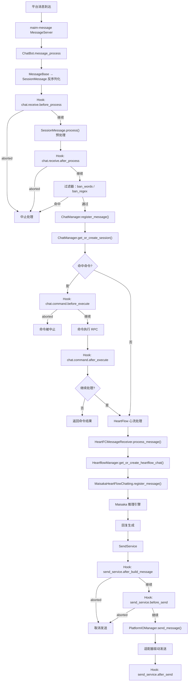

---
title: Message Pipeline
---# Message Pipeline

MaiBot's message processing pipeline is the complete link from inbound reception to outbound transmission. This document details the internal mechanisms, data structures, and Hook interception points of each stage in the pipeline.

## Overall Flow



## Message Inbound and Deserialization

### Entry: `ChatBot.message_process()`

Source location: `src/chat/message_receive/bot.py`

After a message arrives via maim-message `MessageServer`, `ChatBot.message_process(message_data)` is called to enter the main link:

```python
async def message_process(self, message_data: Dict[str, Any]) -> None:
    # 1. 确保后台任务已启动
    await self._ensure_started()
    # 2. 规范化 group_id / user_id 为字符串
    # 3. 反序列化
    maim_raw_message = MessageBase.from_dict(message_data)
    message = SessionMessage.from_maim_message(maim_raw_message)
    await self.receive_message(message)
```

### `SessionMessage` Structure

Source location: `src/chat/message_receive/message.py`

`SessionMessage` inherits from `MaiMessage` and is the core message object circulating in the pipeline:

- **`message_id`** `str` — Unique message ID
- **`platform`** `str` — Source platform identifier
- **`session_id`** `str` — Session ID (calculated by `SessionUtils.calculate_session_id()`)
- **`processed_plain_text`** `str` — Pre-processed plain text
- **`message_info`** `MessageInfo` — Contains `user_info`, `group_info`, `additional_config`
- **`raw_message`** `MessageSequence` — Sequence of original message components
- **`is_at`** `bool` — Whether the bot was @mentioned
- **`is_mentioned`** `bool` — Whether the bot was mentioned
- **`is_command`** `bool` — Whether a command was hit
- **`is_notify`** `bool` — Whether it is a notification message
- **`timestamp`** `datetime` — Message timestamp

### `SessionMessage.process()` Pre-processing

Converts original message components into plain text, supporting the following component types:

- **`TextComponent`** — Returns text directly
- **`ImageComponent`** — Calls `image_manager.get_image_description()` to generate `[图片：描述]`
- **`EmojiComponent`** — Calls `emoji_manager.get_emoji_description()` to generate `[表情包：描述]`
- **`AtComponent`** — Parses target username to generate `@昵称`
- **`VoiceComponent`** — Calls `get_voice_text()` to transcribe to `[语音：转录文本]`
- **`ReplyComponent`** — Finds original message content to generate `[回复了XXX的消息：内容]`
- **`ForwardNodeComponent`** — Recursively processes forward nodes to generate `【合并转发消息：...】`

Lightweight mode (`enable_heavy_media_analysis=False, enable_voice_transcription=False`) is used when calling the inbound main link; binary data for images/emojis is lazily backfilled only when needed by Maisaka.

## Hook Interception Chain

### chat.receive.before_process

Triggered before `SessionMessage.process()`; can intercept or rewrite the original message.

- **Registration Location**: `src/chat/message_receive/bot.py` `register_chat_hook_specs()`
- **Default Timeout**: 8000ms
- **Allow Abort**: Yes
- **Allow Rewrite**: Yes

Parameter Schema:
```json
{
  "message": { "type": "object", "description": "当前入站消息的序列化 SessionMessage" }
}
```

### chat.receive.after_process

Triggered after message pre-processing is complete; can rewrite text, the message body, or abort the subsequent link.

- **Default Timeout**: 8000ms
- **Allow Abort**: Yes
- **Allow Rewrite**: Yes

### chat.command.before_execute

Triggered after a command is successfully matched but before actual execution.

- **Default Timeout**: 5000ms
- **Allow Abort**: Yes
- **Allow Rewrite**: Yes

Parameters include: `message`, `command_name`, `plugin_id`, `matched_groups`

### chat.command.after_execute

Triggered after command execution ends; can adjust the return text and whether to continue main link processing.

- **Default Timeout**: 5000ms
- **Allow Abort**: No
- **Allow Rewrite**: Yes

Parameters include: `message`, `command_name`, `plugin_id`, `matched_groups`, `success`, `response`, `intercept_message_level`, `continue_process`

### send_service.after_build_message

Triggered after the outbound `SessionMessage` is constructed; can rewrite the message body or cancel sending.

- **Registration Location**: `src/services/send_service.py` `register_send_service_hook_specs()`
- **Default Timeout**: 5000ms
- **Allow Abort**: Yes

### send_service.before_send

Triggered before the actual call to Platform IO for sending; the final interception point.

- **Default Timeout**: 5000ms
- **Allow Abort**: Yes

### send_service.after_send

Triggered after the sending process ends; for observation purposes only. Aborting or rewriting is not allowed.

## Message Filtering

Source location: In `src/chat/message_receive/bot.py` `receive_message()`

Filtering is executed after the `chat.receive.after_process` Hook:

1. **Blocked Word Filtering** (`MessageUtils.check_ban_words()`): Checks if `processed_plain_text` contains `ban_words` from the configuration
2. **Regex Filtering** (`MessageUtils.check_ban_regex()`): Checks if it matches the `ban_regex` pattern from the configuration

Once a filtering rule is hit, the message is discarded immediately and will not enter any subsequent stages.

## Session Management

Source location: `src/chat/message_receive/chat_manager.py`

### ChatManager

A singleton `chat_manager` that manages all chat sessions.

```python
class ChatManager:
    sessions: Dict[str, BotChatSession]    # session_id → BotChatSession
    last_messages: Dict[str, SessionMessage]  # session_id → 最近一条消息
```

### Session ID Calculation

Generated by `SessionUtils.calculate_session_id()` based on the following parameters:

- `platform`: Platform identifier
- `user_id`: User ID
- `group_id`: Group ID (optional)
- `account_id`: Platform account ID (optional, extracted from `additional_config`)
- `scope`: Routing scope (optional, extracted from `additional_config`)

### BotChatSession

Inherits from `MaiChatSession`, extending it with:

- **`context`** `SessionContext` — Session context (including recent messages, template name)
- **`accept_format`** `List[str]` — List of acceptable message formats

- **`update_active_time()`** — Update last active time
- **`set_context(message)`** — Set session context
- **`check_types(types)`** — Check if the message matches acceptable types

## Command Processing

Source location: `src/chat/message_receive/bot.py` `_process_commands()`

Command processing flow:

1. `component_query_service.find_command_by_text(text)` searches for matching commands in the plugin component registry
2. Once hit, the `chat.command.before_execute` Hook is triggered
3. Calls the command executor `command_executor()`, passing `message`, `plugin_config`, `matched_groups`
4. Triggers the `chat.command.after_execute` Hook
5. Decides whether to continue subsequent processing based on `intercept_message_level`
   - `intercept_message_level == 0`: Continue processing (message will also go through HeartFlow)
   - `intercept_message_level > 0`: Stop processing

Messages intercepted by commands are written to the database (`MessageUtils.store_message_to_db()`), but no longer enter HeartFlow.

## HeartFlow Processing

Source location: `src/chat/heart_flow/`

### HeartFCMessageReceiver

Source location: `src/chat/heart_flow/heartflow_message_processor.py`

```python
class HeartFCMessageReceiver:
    async def process_message(self, message: SessionMessage):
        # 1. 跳过通知消息
        # 2. 存储消息到数据库
        # 3. 获取或创建 HeartFlow Chat
        # 4. 注册消息到 Maisaka 运行时
        # 5. 注册用户到 Person 信息库
```

### HeartflowManager

Source location: `src/chat/heart_flow/heartflow_manager.py`

Manages session-level `MaisakaHeartFlowChatting` instances:

```python
class HeartflowManager:
    heartflow_chat_list: Dict[str, MaisakaHeartFlowChatting]
    _chat_create_locks: Dict[str, asyncio.Lock]

    async def get_or_create_heartflow_chat(self, session_id: str) -> MaisakaHeartFlowChatting
    def adjust_talk_frequency(self, session_id: str, frequency: float) -> None
```

Uses double-checked locking to ensure only one Maisaka runtime instance is created per session.

## Outbound Sending

Source location: `src/services/send_service.py`

The flow for `SendService` to construct outbound messages:

1. Construct `MessageSending` object (`SessionMessage` + target information)
2. Trigger `send_service.after_build_message` Hook
3. Calculate typing time (`calculate_typing_time()`)
4. Trigger `send_service.before_send` Hook
5. Route to platform driver via `PlatformIOManager.send_message()`
6. Trigger `send_service.after_send` Hook
7. Successfully sent messages are written to the database and synchronized to Maisaka history

## Built-in Hook Summary

All built-in Hooks are registered uniformly by `hook_catalog.py`.

> For the complete Hook directory and parameter descriptions, please refer to [Hook Processors](../plugin-dev/hooks). This document only introduces the location and role of Hooks within the pipeline.

## Data Flow Diagram

```mermaid
graph LR
    subgraph 入站
        A[平台适配器] -->|MessageBase| B[SessionMessage]
    end
    subgraph 预处理
        B --> C[Hook: before_process]
        C --> D[process 预处理]
        D --> E[Hook: after_process]
        E --> F[过滤检查]
    end
    subgraph 分发
        F --> G[命令匹配]
        G -->|命中| H[命令执行]
        G -->|未命中| I[HeartFlow]
        H -->|继续| I
    end
    subgraph 推理
        I --> J[Maisaka 运行时]
        J --> K[Timing Gate]
        K --> L[Planner]
        L --> M[工具执行]
    end
    subgraph 出站
        M --> N[SendService]
        N --> O[Platform IO]
        O --> P[适配器驱动发送]
    end
```

