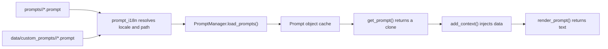

# Prompt Template System

MaiBot stores model prompts in `.prompt` files. `PromptManager` loads them, applies custom overrides, injects context, renders nested templates, and saves user customizations. This page follows the current implementations in `src/prompt/prompt_manager.py` and `src/common/prompt_i18n.py`.

## Directories and locales

**Built-in templates** — `prompts/<locale>/`. The i18n module defines `DEFAULT_LOCALE`.

**Custom templates** — `data/custom_prompts/<locale>/`. The legacy path `data/custom_prompts/*.prompt` is also read for compatibility.

**Active locale** — `PromptManager` reads it through `get_locale()` and normalizes it with `normalize_locale()`.

For a requested template, a custom version in the active locale takes priority. Otherwise MaiBot uses a built-in version and follows the locale fallback rules implemented by `prompt_i18n`.

## Core objects

### Prompt

`Prompt` stores the logical name, raw template text, and context builders local to that instance. `Prompt.add_context(name, func_or_str)` accepts a string, synchronous function, or asynchronous function. `Prompt.clone()` creates an isolated instance for one rendering operation.

### PromptManager

The global instance is `prompt_manager`. Its main interfaces are:

**`load_prompts()`** — Scan and reload all built-in and custom templates.

**`get_prompt(prompt_name)`** — Return a cloned template. A missing name raises `KeyError`.

**`render_prompt(prompt)`** — Asynchronously render a clone returned by `get_prompt()`. Passing a shared original instance raises `ValueError`.

**`add_prompt()` / `replace_prompt()` / `remove_prompt()`** — Manage in-memory templates.

**`add_context_construct_function()`** — Register a context builder available to all templates.

**`save_prompts()`** — Write templates marked for persistence to the custom directory for their locale.

There is currently no `reload_prompts()` method and no `force_reload` or `debug` argument.

## Loading and overrides



`list_prompt_templates()` enumerates built-in templates. `load_prompt_template()` resolves the final text, whether it came from the custom directory, and the selected locale.

The loader first builds a new template dictionary and only replaces the live cache after loading succeeds. Read or validation errors are logged and raised instead of being silently hidden behind a partial cache.

## Rendering rules

Templates use named placeholders compatible with Python's `string.Formatter`:

```text
You are chatting with {user_name}.
{conversation_rules}
```

Use doubled braces when literal braces must remain in the output. Anonymous `{}` placeholders are rejected when a `Prompt` is created.

Fields are resolved in this order:

1. A Prompt with the same name, rendered recursively.
2. Context registered on the current Prompt with `add_context()`.
3. A global context builder registered on `PromptManager`.
4. Context inherited from an outer nested Prompt.

A missing field raises `KeyError`. Nesting deeper than 10 levels raises `RecursionError` to stop circular references.

Context functions may be synchronous or asynchronous. They receive the current Prompt name and return a string. The current implementation resolves fields one by one and does not promise concurrent execution with `asyncio.gather()`.

## Cache refresh

`prompt_i18n.clear_prompt_cache()` increments an in-process cache revision. When `PromptManager.get_prompt()` observes a new revision, it calls `load_prompts()` and logs which templates changed.

This is not a fixed-interval file poller. There are no `prompt_reload_interval`, `prompt_cache_ttl`, `PROMPT_RELOADED`, or `LOCALE_CHANGED` APIs. Code that changes templates must trigger `clear_prompt_cache()` through the existing configuration/WebUI flow or call `load_prompts()` explicitly.

## Development example

```python
from src.prompt.prompt_manager import prompt_manager

prompt = prompt_manager.get_prompt("example")
prompt.add_context("user_name", "Alice")
prompt.add_context("conversation_rules", lambda _: "Keep replies concise.")
rendered = await prompt_manager.render_prompt(prompt)
```

Use an `async def` context builder when data must be fetched asynchronously. Do not mutate shared instances in `prompt_manager.prompts`, and do not store request state in global context builders.

## Checklist for template changes

- Keep placeholders aligned across Chinese, English, and Japanese versions of the same Prompt.
- Update every caller when adding a placeholder.
- Avoid circular Prompt references.
- Put custom templates in `data/custom_prompts/<locale>/`.
- Obtain a clone with `get_prompt()` before calling `add_context()` and `render_prompt()`.
