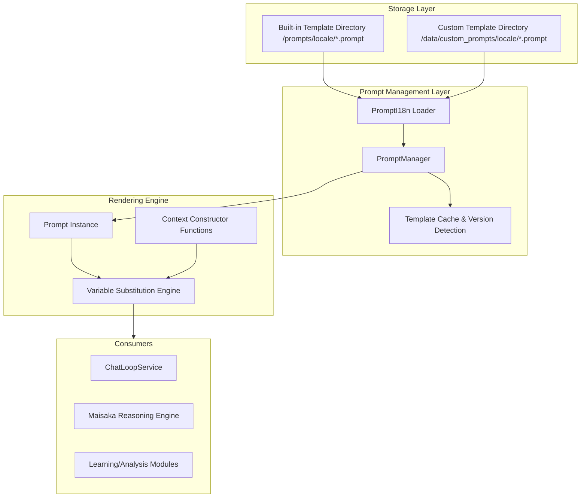

This document is written based on the code-map snapshot.

# Prompt Template System

The Prompt Template System is the core mechanism by which MaiBot gives AI characters their soul. It decouples LLM instructions (System Prompt), task logic (Task Templates), and runtime data (Runtime Parameters), allowing developers to quickly adjust the AI's behavior patterns, response style, and reasoning logic by editing `.prompt` files without modifying any code.

The Prompt Template System belongs to the foundational service layer in MaiBot's overall architecture, working closely with the Config module, the i18n internationalization module, and the Maisaka reasoning engine. It abstracts away the complexity of the filesystem and multilingual routing for downstream consumers, while providing a unified template retrieval interface for modules such as ChatLoopService and the learning module. Through this system, MaiBot maintains consistent response quality across multiple language environments while supporting runtime hot-reloading of behavior.

## Architecture Overview

The core goal of the Prompt system is to provide an internationalizable, hot-reloadable template management mechanism that supports complex variable injection. It transforms static template files into dynamically renderable Prompt instances, and allows real-time business data to be injected into templates through context constructor functions. In MaiBot, the entire system plays the role of an "AI Behavior Definition Layer"—it determines the identity, style, and logical framework with which the LLM interacts with users.

The overall architecture of the system is divided into four layers:
- **Storage Layer**: Responsible for the physical storage of template files, divided into built-in template directory (`/prompts/`) and custom template directory (`/data/custom_prompts/`), organized by locale subdirectory, supporting UTF-8 encoded plain-text `.prompt` files.
- **Management Layer**: `PromptManager` acts as the central controller, handling template registration, caching, version detection, and hot-reload logic, with incremental updates via a version number counter.
- **Rendering Engine Layer**: Receives `Prompt` instances and context constructor functions, performs asynchronous variable substitution and recursive rendering, and outputs plain-text Prompts. The rendering pipeline is based on `asyncio` for concurrent parsing.
- **Consumer Layer**: Upstream modules such as Maisaka's `ChatLoopService` obtain rendered Prompt strings via `PromptManager.get_prompt()` to construct the System Message and task instructions for LLM requests.

Each layer is decoupled through clear interface boundaries: the Management Layer does not concern itself with the storage format details of template files, the Rendering Engine Layer does not care about the origin or lifecycle of templates, and the Consumer Layer does not care about the internal implementation of the Rendering Engine. This layered design ensures each concern can be independently modified and tested.

The data flow is a unidirectional pipeline: template files flow from the Storage Layer to the Management Layer for registration and caching, then from the Management Layer to the Rendering Engine for variable injection and rendering, and finally the rendered result is output to the Consumer Layer. Each layer only interacts with its adjacent layers, with no circular dependencies between layers.

## Architecture Diagram

## Core Concepts

**PromptManager** — The central console of the template system.
Responsible for the lifecycle management of Prompt instances, including registration, loading, substitution, and saving. It maintains a global dictionary of Prompt instances and implements an automatic hot-reload mechanism based on file version numbers, ensuring that modifications to `.prompt` files take effect without requiring a restart.

**Hot-reload Implementation Details**
PromptManager's hot-reload relies on the collaboration between file modification time (mtime) and a version number counter. Each time `load_prompts()` is called, the system traverses all `.prompt` files in the template directories, computes the `mtime` hash of each file, and compares it with the cached version number. If a change is detected, only the modified template file is reloaded rather than performing a full refresh. This incremental update strategy effectively reduces I/O overhead in large-scale multilingual deployment scenarios. The version number counter is a monotonically increasing integer value that increments whenever any file change is detected. Consumers can quickly determine whether templates need to be re-fetched by comparing version numbers before and after.

**Cache Invalidation Strategy**
Template caching follows these invalidation rules:
- **Locale Switch**: When `common.i18n.set_locale()` is called, `PromptManager` marks all cached entries as stale. The next `get_prompt()` call triggers a full reload and rebuilds the locale → file path mapping table.
- **File Modification Detection**: Detects template file changes through periodic version number polling (not real-time file monitoring, no inotify dependency). The detection interval is controlled by the `prompt_reload_interval` parameter in the `Config` module, with a default value of 60 seconds.
- **Explicit Refresh**: Developers can force a cache refresh via `PromptManager.reload_prompts()`, suitable for post-deployment template hot-fix scenarios. Calling this method clears all caches and rescans the template directories.
- **Template Not Found Fallback**: When the requested template name does not exist under the current locale, the system automatically falls back to the default locale (`en-US`) to search. If it still doesn't exist, a `PromptNotFoundError` is raised.

**Prompt Instance** — A wrapper object for templates.
Each `Prompt` object holds the raw template string. To ensure thread safety and session isolation, `PromptManager.get_prompt()` always returns a cloned instance. The cloned instance allows temporary context functions to be injected for a specific session without polluting the global template. Cloning uses a shallow copy strategy — the raw template string is an immutable object, so deep copying is unnecessary; however, the context function dictionary is independently maintained on each cloned instance to avoid concurrent write conflicts.

**Template File Structure** — Plain-text files with the `.prompt` suffix.
Template files use a simple placeholder syntax <code v-pre>{{variable}}</code>. Internally, these placeholders are converted to Python's `string.Formatter` syntax before rendering. Template files are organized by language directory (e.g., `zh-CN`, `en-US`) and support priority overrides through the custom directory. The complete template loading priority chain is: `custom/target locale` → `custom/fallback locale` → `built-in/target locale` → `built-in/fallback locale`, where the fallback locale is fixed to `en-US`. File encoding must be UTF-8 (without BOM), and the filename (without the `.prompt` extension) serves as the logical name of the template.

**Variable Substitution Mechanism** — Recursive rendering engine.
The system supports three levels of variable resolution priority:
- **Internal Constructor Functions**: Functions bound to a specific Prompt instance, with the highest priority, valid only within the lifecycle of the current cloned instance.
- **Global Constructor Functions**: Global functions registered via `add_context_construct_function`, effective for all Prompt instances.
- **Nested Prompts**: If a variable name points to another registered Prompt, the engine recursively renders that Prompt and injects the result at the current position. Nesting depth is protected by a `recursive_level > 10` limit.

When variable resolution fails (e.g., unregistered variable name with no corresponding constructor function), the rendering engine raises a `ContextFunctionNotFoundError`. This exception is caught by the upstream `ChatLoopService`, which logs a warning but does not interrupt the entire reasoning loop.

**Multilingual Support** — Locale-based dynamic routing.
When loading templates, the system calls `get_locale()` from `common.i18n`. The loading order is: `custom directory/current locale` → `custom directory/default locale` → `built-in directory/current locale` → `built-in directory/default locale`. The template loader `PromptI18n` builds a locale → file path mapping table during initialization to avoid repeatedly scanning directories on each load and caches the mapping in memory to accelerate subsequent access. When a template directory for a particular locale does not exist, the loader automatically skips that directory and records a debug-level log.

## Key Flows

**Template Loading Flow**
1. `PromptManager` calls `load_prompts()` on startup.
2. `PromptI18n` loader scans the `/prompts` and `/data/custom_prompts` directories, collecting all `.prompt` file paths.
3. Builds a template mapping table based on the current locale priority; custom templates with the same name override built-in templates.
4. Instantiates each template file as a `Prompt` object and stores it in the `PromptManager.prompts` dictionary cache.
5. Records the mtime hash of each file as the initial version number for subsequent hot-reload comparison.

On repeated loads, `load_prompts()` only reprocesses template files whose version numbers have changed. Unchanged templates continue to use the cache, avoiding unnecessary I/O and parsing overhead.

If issues such as file read failures or syntax parsing errors occur during loading, the `PromptI18n` loader skips the problematic file and logs an error. A single corrupted template file does not cause the entire loading flow to abort. Skipped templates continue to serve the last successfully loaded version until the issue is resolved.

**Variable Injection and Rendering Flow**
1. The caller obtains a cloned instance via `get_prompt("prompt_name")`.
2. (Optional) Calls `add_context("var", func)` to bind real-time data sources; `func` is an async callable returning a string.
3. Calls `render_prompt(prompt)` to enter the async rendering pipeline, which is based on `asyncio` for concurrent parsing.
4. The rendering engine parses <code v-pre>{{...}}</code> blocks, calling the corresponding constructor function or recursively rendering sub-templates in priority order. The parsing process is asynchronous: each <code v-pre>{{variable}}</code> parsing task is scheduled as an independent coroutine, and they execute concurrently via `asyncio.gather()`, significantly improving rendering speed for templates with multiple variables.
5. All parsed results are injected into the template via `.format(**fields)`, ultimately outputting a plain-text Prompt.
6. The returned string can be directly used by the consumer to build an LLM Message object.

In step 4, the rendering engine maintains a set of already-resolved variables to prevent the same variable from being resolved repeatedly during recursive rendering, avoiding inconsistent rendering results within the same session.

## Module Interaction

**Interaction with Maisaka**
Maisaka's reasoning engine (e.g., `ChatLoopService`) is the largest consumer of the Prompt system.
- **System Prompt Construction**: Maisaka obtains core templates such as `maisaka_chat` through `PromptManager`, injects the current user persona, session memory, and recent impressions to build the final System Message sent to the LLM.
- **Task Dispatch**: Different sub-agents (Planner, Replyer, ExpressionSelector) are each associated with different Prompt templates, enabling switching between different reasoning modes within the same session.

**Interaction with i18n**
The internationalization of the Prompt system is deeply integrated with `common.i18n`.
- **Locale Synchronization**: When the user switches languages via `set_locale()`, `PromptManager` detects a version change or locale change on the next Prompt retrieval, triggering template reloading.
- **Path Resolution**: Leverages the path routing mechanism implemented in `prompt_i18n.py` to ensure that Prompts in different languages map to the same logical name.

**Interaction with Config**
- **Path Configuration**: The root directories of the Prompt system are determined by `PROMPTS_DIR` and `CUSTOM_PROMPTS_DIR` defined in the code, which are relative to the project root directory.
- **Custom Override**: Users can override built-in instructions by creating `.prompt` files with the same name under `data/custom_prompts`, enabling "prompt engineering" customization without modifying source code.

## Interaction with Other Modules

**Integration with Maisaka Reasoning Engine**
Maisaka's `ChatLoopService` is the core consumer of Prompt templates, and their deep interaction is reflected in the following aspects:
- **System Prompt Assembly**: At the beginning of each reasoning cycle, `ChatLoopService` calls `PromptManager.get_prompt("maisaka_chat")` to obtain the base system template, then injects dynamic data such as the current session's Persona, MemorySummary, and RecentImpression via `add_context()`. The assembled Prompt is sent to the LLM as the System Message.
- **Sub-agent Template Isolation**: Sub-agents such as Planner, Replyer, and ExpressionSelector are each associated with independent Prompt template names (e.g., `maisaka_planner`, `maisaka_replyer`). `ChatLoopService` selects the corresponding template based on the current reasoning stage, enabling role switching within the same session and ensuring that different sub-agents receive differentiated system instructions.
- **Context Lifecycle**: Each reasoning cycle (ChatLoop iteration) creates a new cloned Prompt instance, preventing context injection from the previous reasoning from leaking into the next request. The cloned instance is discarded after `render_prompt()` completes and is reclaimed by the Python GC.

**Collaboration with the Internationalization Module**
`common.i18n` provides language environment support for the Prompt system. Their collaboration is based on an event-driven model:
- **Locale Change Propagation**: When the upper layer calls `set_locale(locale)`, the i18n module triggers a `LOCALE_CHANGED` event. `PromptManager` listens to this event via the event bus and increments its internal version counter, marking all cached templates as pending refresh on the next access. This loosely coupled design avoids a direct dependency from `PromptManager` to the i18n module.
- **Template Path Routing**: The `PromptI18n` loader maintains a `locale → [PromptDir]` routing table internally. On loading, it first tries an exact locale match; if none is found, it degrades to the default locale (`en-US`). For example, if the current locale is `zh-CN` and both `custom_prompts/zh-CN/` and `prompts/zh-CN/` exist, the loading order is: `custom_prompts/zh-CN/` → `prompts/zh-CN/` → `custom_prompts/en-US/` → `prompts/en-US/`.

**Collaboration with the Configuration Module**
- **Path Configuration Resolution**: The root directories of the template system are defined via the `Config.prompts_dir` and `Config.custom_prompts_dir` configuration items. `PromptManager` reads these paths from `Config` during initialization and supports dynamic adjustment of template directory locations at runtime through Config hot-reload.
- **Config-driven Behavior Control**: Parameters such as `prompt_reload_interval` (hot-reload polling interval, in seconds) and `prompt_cache_ttl` (cache TTL, in seconds) are managed through the Config module. When these configuration items change, `PromptManager` receives `CONFIG_UPDATED` notifications via the Config module's event system and adjusts its internal parameters immediately, without requiring a process restart.
- **Startup Dependency Order**: `PromptManager` initialization depends on the `Config` module having completed loading. In MaiBot's startup lifecycle, the `Config` module is initialized first, followed by `PromptManager`. If the Prompt system is used independently in a test environment, a minimal `Config` instance must be constructed first.

## Development Notes

**Avoid Circular References**
Since nested Prompt rendering is supported, if Prompt A references Prompt B and Prompt B references Prompt A, an infinite loop will occur. `PromptManager` has a hard limit of `recursive_level > 10` to prevent crashes. When developing new templates, carefully check the reference relationships between templates to avoid inadvertently introducing circular dependencies.

**Do Not Modify the Original Instance**
Instances in `PromptManager.prompts` are globally shared. Any modifications to templates or context injection must be performed on the cloned instance returned by `get_prompt()`. Otherwise, all sessions would share the same context data. In multi-session concurrent scenarios, directly modifying the original instance will cause data races and unpredictable rendering results.

**Placeholder Convention**
Templates must use named placeholders in the form <code v-pre>{{variable}}</code>. Unnamed `{}` placeholders are strictly prohibited because they cause `string.Formatter` to throw an exception during parsing. Variable names should follow the snake_case convention and avoid containing spaces or special characters.

**Async Safety**
`render_prompt()` is an async function, and the context constructor functions called within it must also be async. Registering synchronous functions via `add_context()` will cause type errors. Developers should use the `async def` signature for context constructor functions and avoid blocking calls inside the function body. If synchronous code must be called, use `asyncio.to_thread()` to delegate it to the thread pool.

**Template Debugging Tips**
- During development, you can temporarily call `PromptManager.get_prompt("name").raw` to view the raw template string and confirm whether the template file was loaded correctly.
- Use `PromptManager.render_prompt(prompt, debug=True)` to enable debug mode. The rendering engine will output the parsing process and timing for each variable, making it easier to identify performance bottlenecks or parsing failures.
- Hot-reloading of template content does not trigger full logging. To verify whether reloading took effect, compare the value of `PromptManager._version` before and after modifying the file.

**Performance Considerations**
- When there are many template files (more than 50), the first `load_prompts()` incurs significant I/O pressure. It is recommended to complete loading during the service startup warm-up phase.
- Nested Prompt rendering introduces additional async scheduling overhead. It is recommended to keep nesting depth within 3 layers to maintain responsiveness.
- Functions registered via `add_context_construct_function` are called on every render. Ensure their execution efficiency, and avoid performing heavyweight computations or remote calls within them.

## Hooks/Extension Points

The Prompt Template system does not directly expose Hook interfaces. Template customization and extension are achieved through the following mechanisms:

**File-level Hot-reload**
Template updates do not rely on code-level Hook callbacks. When the user modifies a `.prompt` file, `PromptManager` automatically detects the change via file version number comparison and hot-loads the new content on the next template request. The entire process is transparent to upstream consumers, requiring neither a service restart nor any manual refresh command. The trigger condition for hot-reload is that the version counter increments. Consumers need only pass `force_reload=False` (the default) when calling `get_prompt()`, and the system automatically compares the cached version number to decide whether to reload.

**Lifecycle Event Delegation**
State change events of the template system (such as reload completion, locale switch) are managed uniformly by the `Config` module's event system. Other modules can respond to template changes by listening to events such as `PROMPT_RELOADED` and `LOCALE_CHANGED` from the `Config` module. If you need to extend template loading behavior (e.g., pre-loading preprocessing, post-loading validation), it is recommended to register custom listeners on the `Config` module's event bus rather than directly modifying `PromptManager`'s loading logic. This event delegation pattern keeps the core template chain concise while providing sufficient extension points for upstream modules.

**Template Customization Mechanism**
Developers can modify AI behavior patterns without intrusive code changes:
- **Custom Template Directory**: Place a `.prompt` file with the same name under `data/custom_prompts/{locale}/`, and the system will prioritize loading the custom version over the built-in version.
- **Priority Override**: Custom templates have higher loading priority than built-in templates. This means you only need to provide a `.prompt` file with the same name as the built-in template to override the original behavior, without copying all built-in template content.
- **Fine-grained Incremental Customization**: Supports customizing templates for only specific locales. Uncovered locales automatically fall back to built-in templates, enabling progressive template customization. For example, a user can provide only `custom_prompts/zh-CN/maisaka_chat.prompt` to override the Chinese version of the chat prompt, while the English version still uses the built-in template.

**Best Practice Recommendations**
- For simple behavior adjustments (modifying wording, adjusting instruction weights), prefer using custom template overrides over modifying source code.
- For scenarios requiring dynamic data injection, implement via `add_context()` binding context constructor functions, rather than hardcoding business logic in template files.
- When monitoring template changes, listen for the `PROMPT_RELOADED` event from the `Config` module instead of building your own file polling.
- In team collaboration, it is recommended to include custom templates in version control (e.g., Git) and synchronize the `data/custom_prompts` directory uniformly in the deployment pipeline to avoid behavioral inconsistencies due to template differences between environments.
- When writing templates, keep each template file focused on a single responsibility. Avoid cramming too many logical branches into one `.prompt` file, making it easier to maintain and reuse later.
- When conducting template A/B testing, leverage the priority override mechanism of the custom template directory to deploy different versions of template files for different test groups, achieving traffic splitting through routing.
- Template files should maintain backward compatibility. When adding new placeholders, provide default values or fallback rendering logic to prevent older consumers from failing to render due to missing variables.
