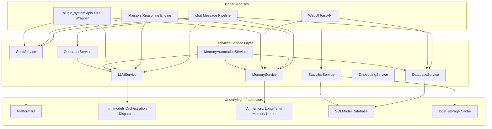

This document is written based on the code-map snapshot.

# Service Layer Architecture

MaiBot's `services/` service layer is a business logic encapsulation layer within the host process. It consolidates capabilities such as LLM calls, long-term memory, outbound messages, database access, statistical aggregation, and memory automation into stable Python interfaces, which are consumed by `chat`, `maisaka`, `webui`, and the plugin runtime wrapper layer.

The service layer does not directly handle platform protocol details, nor does it replace the A_memorix kernel or Platform IO drivers. Its responsibility is to translate upper-layer intents into requests that underlying modules can execute, and then transform the results returned by the underlying modules into objects that are easier for the upper layers to consume.

## Position of the Service Layer in the Architecture

**Business Boundary**: The service layer sits between the host business modules and the underlying infrastructure. `chat` handles message entry points, session state, and pipeline dispatching; `maisaka` handles reasoning, planning, and tool execution; `webui` provides management interfaces and visualization; the underlying modules handle protocols, databases, model clients, and the memory kernel.

**Caller Boundary**: Internal modules can directly import service modules from `src.services`. The plugin system should not bypass the service layer to access underlying modules directly; instead, it should call through the thin wrapper of `plugin_system.apis`, so that implementation details are not exposed to the plugin ecosystem when the underlying system is upgraded.

**Responsibility Boundary**: The service layer may encapsulate request construction, parameter normalization, error convergence, statistical recording, and unified logging, but platform-specific private protocols should not be written into the service layer. Platform differences should remain in `platform_io` and adapter drivers.

**Data Boundary**: Objects returned by the service layer are primarily oriented toward business semantics, such as `MemorySearchResult`, `LLMResponseResult`, and `DashboardData`. Underlying models, database rows, and platform receipts can be transformed within the service layer, avoiding the need for upper layers to handle implementation details everywhere.

## Architecture Diagram

## Service Directory Overview

**`__init__.py`**: Declares `services` as the core service layer. Module comments clearly state that internal modules should use this layer directly, while the plugin system calls it indirectly through a thin wrapper.

**`send_service.py`**: Unified outbound message sending. It constructs `SessionMessage`, executes pre-send Hooks, delegates to `PlatformIOManager.send_message()`, then handles success receipts, database storage, emoji usage statistics, and Maisaka history synchronization.

**`llm_service.py`**: Unified LLM call facade. It resolves model task names, constructs `LLMServiceClient`, encapsulates text generation, multi-image message generation, image understanding, voice transcription, and compatibility embedding entry points, and passes actual execution to `LLMOrchestrator`.

**`memory_service.py`**: Unified long-term memory operations. It routes through `a_memorix_host_service.invoke()` to A_memorix, providing search, text ingestion, summary ingestion, person profile queries, maintenance, and management interfaces.

**`memory_flow_service.py`**: Memory automation service. It contains a person fact write-back queue, a chat summary write-back queue, and `MemoryAutomationService`, which triggers automatic extraction and summary write-back after messages are sent.

**`database_service.py`**: General-purpose database CRUD facade. It encapsulates SQLModel queries, filtering, sorting, pagination, date and enum serialization, and provides tool record persistence interfaces.

**`statistics_service.py`**: WebUI dashboard statistics facade. It aggregates message volume, model requests, online time, token usage, costs, and recent activity, with caching for 24h, 168h, and 720h windows.

**`statistics_aggregation_service.py`**: Statistical summary table refresh service. It uses native SQL to incrementally refresh hourly summary tables for messages, tool calls, and model usage.

**`embedding_service.py`**: Text embedding service. It forwards embedding requests to `llm_models`, with a recommended compatibility entry point to replace `LLMServiceClient.embed_text()`.

**`generator_service.py`**: Reply generator call entry. It obtains a session-level `MaisakaReplyGenerator` from `replyer_manager`, generates reply text, and performs post-processing such as tokenization and error correction.

**`message_service.py`**: Message query and formatting service. It retrieves `SessionMessage` by time range, session, and pagination, supporting tool record queries and historical message volume statistics.

**`message_word_frequency_service.py`**: Word frequency service. It uses jieba and regex rules to analyze group chat messages, maintains the `HighFrequencyTerm` table, and provides caching and expired entry cleanup.

**`html_render_service.py`**: HTML rendering service. It manages the Playwright browser instance lifecycle and renders HTML content to PNG images.

**`telemetry_stats_service.py`**: Telemetry statistics service. It builds anonymous runtime payloads and aggregates model task assignments, LLM usage, online periods, and message volume.

**`service_task_resolver.py`**: Model task resolution utility. It resolves available task names from `model_task_config`, supporting legacy `TaskConfig` object mapping.

**`llm_cache_stats.py`**: LLM prompt cache statistics service. It aggregates cache hit metrics by task, request type, and model, and generates HTML or JSON diagnostic reports.

## Core Services in Detail

### SendService

**Position**: `SendService` is the unified outbound message sending entry point for internal modules. It corresponds to the three send intents documented as `send_text`, `send_image`, and `send_emoji`, with code entry points being `text_to_stream()`, `image_to_stream()`, `emoji_to_stream()`, and `custom_reply_set_to_stream()` for message component sequences.

**Responsibilities**: The service layer is responsible for converting text, Base64 images, or Base64 emoji stickers into internal `MessageSequence`, and then constructing an outbound `SessionMessage`. It fills in the bot account, platform, group information, routing metadata, reply components, and lightweight plain text summaries, but does not decide whether the underlying path goes through the plugin chain or the legacy chain.

**Platform IO Collaboration**: Actual routing and sending is handled by `PlatformIOManager`. `SendService` first calls `ensure_send_pipeline_ready()`, then uses `build_route_key_from_message()` to construct a route key, and finally calls `send_message()`. After successful sending, the service layer backfills the external platform message ID, dispatches adapter callbacks, and writes to the database when needed.

**State Side Effects**: After successful sending, `SendService` records emoji usage counts, notifies `memory_automation_service.on_message_sent()`, and optionally synchronizes to the current session's Maisaka history. This synchronization ensures that subsequent reasoning can see the messages it just sent, preventing a broken history chain.

**Failure Semantics**: If the target chat stream does not exist, the platform has no configured bot account, Platform IO sending fails, or a pre-send Hook aborts the process, the service layer returns `None` or `False`. Callers should not assume that a message was definitely delivered and must handle the failure branch based on the return value.

### LLMService

**Position**: `LLMService` is the host-side LLM call facade. It unifies text generation, message list generation, image understanding, voice transcription, and compatibility embedding requests into service layer entry points, then delegates execution to `LLMOrchestrator` in `src.llm_models`.

**Request Construction**: When initialized, `LLMServiceClient` resolves the `task_name`, binds `request_type` and `session_id`, and creates an `LLMOrchestrator`. `generate_response()` handles single-turn text requests, `generate_response_with_messages()` accepts a message factory, `generate_response_for_image()` normalizes image Base64 and format, and `transcribe_audio()` handles voice transcription.

**Retry and Model Selection**: The service layer does not directly implement retry loops; instead, this is handled uniformly by `LLMOrchestrator`. The underlying layer selects models based on task configuration, supporting random, sequential, and load-balancing strategies. Retryable issues such as network errors, empty responses, 429, 5xx, and response parsing failures are retried at the underlying layer according to provider configuration.

**Streaming Response**: The underlying request object supports `stream_response_handler` for streaming response capability. The service layer preserves this extension point, allowing the upper layer to integrate streaming consumption logic without changing the service boundary, while the underlying layer continues to handle the protocol client and request lifecycle.

**Statistical Recording**: `LLMServiceClient` records prompt cache hit and miss tokens, and the underlying `llm_usage_recorder` writes model calls to `ModelUsage`. These records are then aggregated by `StatisticsService` into WebUI dashboard data.

**Compatibility Entry Point**: `embed_text()` is retained in `LLMServiceClient`, but code comments recommend that new callers use `EmbeddingServiceClient` instead. This allows text generation and vector generation to be separated into clearer responsibilities.

### MemoryService

**Position**: `MemoryService` is the host-side facade for A_memorix. It encapsulates long-term memory search, writing, maintenance, and management operations into stable interfaces, preventing business modules from needing to understand A_memorix's component names and return structures directly.

**Add / Writing**: The main write entry points in the code are `ingest_text()` and `ingest_summary()`. `ingest_text()` is used for ingesting text, entities, relationships, tags, and source metadata; `ingest_summary()` is used for writing chat summaries or externally curated text. Both carry `chat_id`, `user_id`, `group_id`, time ranges, and filtering strategies.

**Recall / Retrieval**: `search()` handles memory recall. The caller provides query text, limit, mode, person ID, session ID, time range, and filtering parameters. The service layer calls A_memorix's `search_memory`, then organizes the results into `MemorySearchResult` and `MemoryHit`.

**Forget and Deletion**: The `forget` semantics are distributed across maintenance and management interfaces. `maintain_memory()` supports maintenance actions such as restore, reinforce, freeze, and protect; `delete_admin()` supports preview and execution of deletion operations. WebUI and built-in tools can express more granular deletion intent via the `action` parameter.

**Graph Query**: `graph_admin()` is the entry point for graph-related queries and management. In WebUI, `action="get_graph"` and `action="search"` query the memory graph through this service. Person profile queries use `get_person_profile()`.

**Error Convergence**: The service layer unifies A_memorix's complex return values into booleans, error strings, and structured objects. Callers can first check `success`, then read `detail`, `error`, or the structured hit list.

### DatabaseService

**Position**: `DatabaseService` is a general-purpose wrapper for SQLModel access. It does not express business rules; instead, it unifies database sessions, query statements, filter conditions, sort fields, pagination limits, and return value serialization.

**CRUD Operations**: `db_save()` supports upsert by primary key or specified fields; `db_get()` supports filtering, sorting, limit, and single-result queries; `db_update()` and `db_delete()` operate in batch by filter conditions; `db_count()` returns the count of matching records.

**Type Handling**: The service layer converts `datetime`, `date`, `Enum`, dictionaries, lists, and sets into values suitable for msgpack or JSON. When returning records, it prefers Pydantic's `model_dump()`, falling back to `__dict__` when that capability is unavailable.

**Tool Records**: `store_tool_info()` and the compatibility entry point `store_action_info()` are used to persist Maisaka tool call records. They write the tool ID, timestamp, session ID, tool name, tool data, reasoning text, and display prompt.

**Calling Boundaries**: Business services may call `DatabaseService` within the service layer — for example, `StatisticsService` reads `ModelUsage`, `OnlineTime`, `Messages`, and `ToolRecord`. Ordinary business modules should not write ad-hoc SQLModel queries everywhere, unless they are themselves part of the data access layer.

### StatisticsService

**Position**: `StatisticsService` is the service layer entry point for WebUI dashboard statistics. It is oriented toward presenting aggregated data to the frontend, rather than directly exposing database tables.

**Online Time**: The service layer reads `OnlineTime` records and trims start/end times according to the query window. It calculates the effective online seconds within the window, which is then used to compute hourly costs and hourly token usage.

**Message Count**: The service layer uses `count_messages()` to count the total number of messages and the number of messages with reply references within a time window. These metrics are included in `StatisticsSummary` for the dashboard to display chat activity.

**Token Usage**: The service layer reads `ModelUsage`, aggregates request count, total cost, total tokens, and average response latency, and returns Top model statistics sorted by model name. Hourly and daily time series are padded with zero buckets to facilitate continuous chart rendering on the frontend.

**Caching Strategy**: `get_dashboard_statistics()` first reads the dashboard cache from `local_storage`, with a default cache duration of 600 seconds, supporting three windows: 24h, 168h, and 720h. `refresh_dashboard_statistics_cache()` can recompute and save sparse time series.

**Aggregation Table Coordination**: `statistics_aggregation_service` is responsible for writing messages, tool records, and model usage into hourly summary tables. `StatisticsService` is oriented toward the dashboard, while the aggregation table service is oriented toward query performance — the two should not be conflated into a single responsibility.

### MemoryAutomationService

**Position**: `MemoryAutomationService` is the coordinator for memory automation. It contains `PersonFactWritebackService` and `ChatSummaryWritebackService`, which place appropriate content into an async queue after messages are sent.

**Trigger Method**: The current implementation is not a simple global scheduled task; instead, it is triggered by `send_service` calling `on_message_sent()` after successful sending. This way, the automation service only processes messages that have been confirmed as sent, preventing failed messages from being written into long-term memory.

**Person Fact Write-back**: `PersonFactWritebackService` identifies the target person, collects the user's original speech and surrounding context, then uses `LLMServiceClient(task_name="utils")` to extract stable facts. The extraction results are written to A_memorix via `store_person_memory_from_answer()`.

**Chat Summary Write-back**: `ChatSummaryWritebackService` maintains trigger cursors per session. When the number of new messages reaches a configured threshold, it reads the recent context, calls `memory_service.ingest_summary()` to write the chat summary, and updates the trigger counter to prevent duplicate writes after restart.

**Queue Boundary**: Both write-back services use `asyncio.Queue` with a default queue size of 256. When the queue is full, the service layer only logs a warning and skips the current trigger, without blocking the main message sending flow.

**Configuration Dependencies**: Both person fact write-back and chat summary write-back are controlled by A_memorix integration configuration. The service layer checks the configuration before enqueuing, preventing model calls and write resources from being consumed when the feature is disabled by the user.

## Inter-Service Dependencies

**LLMService and MemoryService**: LLMService depends on MemoryService to inject memory context. This is not a hard global singleton dependency; rather, the caller first obtains a `MemorySearchResult` from `MemoryService.search()` or a heuristic memory module, then formats it as a prompt or context messages in a `message_factory`, which is passed to `LLMServiceClient.generate_response_with_messages()`.

**MemoryService and A_memorix**: All core memory operations of MemoryService are routed through `a_memorix_host_service.invoke()`. The service layer is responsible for parameter organization, timeout handling, exception convergence, and return object transformation, while A_memorix handles indexing, retrieval, summarization, graph operations, and the write kernel.

**SendService and Platform IO**: SendService is responsible for message construction and Hook execution, while Platform IO is responsible for platform routing and driver-level sending. The service layer does not directly call adapter drivers, so adding a new platform does not require changes to business sending logic.

**StatisticsService and DatabaseService**: StatisticsService currently reads SQLModel models and statistical summary tables directly, but it depends on the data contracts maintained by the database service. Messages, tool records, model usage, and online time all need to be written to the database first by other services or pipelines.

**MemoryAutomationService and LLMService**: Person fact write-back feeds the user's speech, context, and bot responses to `LLMServiceClient` for fact extraction. This call uses the `utils` task with explicit prompt constraints, requiring that only stable facts supported by the user's original speech be extracted.

**MemoryAutomationService and MemoryService**: Chat summary write-back ultimately calls `memory_service.ingest_summary()`. The summary service is only responsible for determining trigger conditions, collecting context, and updating cursors; the actual write to long-term memory is still handled by MemoryService.

**GeneratorService and LLMService**: GeneratorService obtains the Maisaka reply generator through `replyer_manager`; the reply generator then obtains `LLMServiceClient` internally based on the request type. This allows reply generation, expression style, and model calls to be managed in layers.

## Hook Extension Points

**`send_service.after_build_message`**: Triggered after the outbound `SessionMessage` construction completes. At this point, the message already contains the target session, bot account, message components, and lightweight plain text summary, but has not yet entered Platform IO. Hooks can modify the message body or abort sending.

**`send_service.before_send`**: Triggered before the actual Platform IO call. This is the interception point closest to the real send, suitable for secondary sensitive word checks, platform policy decisions, reply reference correction, or sending parameter modification.

**`send_service.after_send`**: Triggered after the send flow completes. It is for observation of the final result only and does not allow aborting or modification. The parameters include `sent`, `typing`, `set_reply`, `reply_message_id`, `storage_message`, and `show_log`.

**send_before Semantics**: What the documentation refers to as `send_before` corresponds to `send_service.before_send` in code. It receives the final message and send parameters before sending, and allows Hooks to modify these parameters by returning kwargs.

**send_after Semantics**: What the documentation refers to as `send_after` corresponds to `send_service.after_send` in code. It is used for logging, telemetry, auditing, and post-hoc observation; sending should not be re-initiated and the message body should not be modified here.

**Hook Timeout**: The default timeout for sending service Hooks is 5000ms. `after_build_message` and `before_send` allow aborting; `after_send` does not allow aborting.

**Hook Message Format**: Hooks receive a serialized `SessionMessage` and may also return a serialized message. The service layer attempts to deserialize the returned message; if deserialization fails, it logs a warning and continues using the original message.

**Hook and Platform IO Boundary**: Hooks can change send parameters and message content, but should not directly call platform drivers. The actual sending is still performed by Platform IO, ensuring consistency in plugin chain, legacy chain, and adapter routing selection.

## Interaction with Maisaka

**Reasoning Engine Acquires LLM Client**: `MaisakaChatLoopService` resolves the model task name and statistical request_type based on `request_kind`, then caches the `LLMServiceClient`. Different sub-agents can use different model tasks, such as planner, replyer, expression_selector, or mid_memory.

**Heuristic Memory Injection**: `HeuristicMemoryInjector` first uses `LLMServiceClient(task_name="utils")` to generate a chat impression from recent messages, then calls `memory_service.search()` to recall relevant long-term memory. The recall results are formatted as one-time reference text and merged into the Planner or Replyer.

**Mid-Term Memory Summary**: `mid_term.py` uses `LLMServiceClient(task_name="mid_memory", request_type="maisaka.mid_term_memory")` to generate mid-term chat record summaries. The summary results are converted into complex messages and inserted into Maisaka's history for subsequent context use.

**Memory Query Tool**: The `query_memory` built-in tool directly calls `memory_service.search()`. When person-specific retrieval misses and query text exists, it falls back to general keyword retrieval and wraps the results as tool responses and Replyer memory references.

**Reply Send Tool**: The `reply` built-in tool generates a visible response and then sends it via `send_service._send_to_target_with_message()`. The call passes `sync_to_maisaka_history=True` and `maisaka_source_kind="guided_reply"`, ensuring the send result is synchronized back to Maisaka history.

**Feedback Correction Task**: After generating a response, the reasoning engine calls `memory_service.enqueue_feedback_task()` to hand the query tool ID, session ID, and timestamp to the A_memorix feedback system. This allows long-term memory to perform subsequent corrections based on the tool query results.

**Service Layer Isolation Value**: Maisaka does not need to understand Platform IO routing, A_memorix component names, SQLModel models, or statistical cache structures. It only expresses intents through the service layer such as "generate content", "retrieve memory", "send reply", and "record statistics".

## Typical Call Chains

**Chat to SendService**: After the Chat pipeline completes reasoning or command processing, it hands the reply text or message components to SendService. SendService constructs the outbound message, executes `after_build_message` and `before_send` Hooks, sends through Platform IO, then executes `after_send`.

**Maisaka to LLMService**: Maisaka's sub-agents obtain `LLMServiceClient` based on the request type, construct a prompt or message factory, and call `generate_response_with_messages()`. The underlying Orchestrator selects the model, constructs the request, performs retries, records tokens, and returns a unified result.

**Maisaka to MemoryService**: Heuristic memory, person profiles, and built-in query tools all call MemoryService. The service layer passes query conditions to A_memorix and organizes hit results into business objects, allowing the reasoning engine to decide whether to inject them into context.

**WebUI to StatisticsService**: WebUI routes `/statistics/dashboard`, `/statistics/summary`, and `/statistics/models` call StatisticsService. The service layer is responsible for reading cache, real-time computation, time series padding, and returning frontend schema.

**MemoryAutomationService to MemoryService**: After successful sending, SendService notifies MemoryAutomationService. The automation service first enqueues, then checks in the background whether to trigger person fact write-back or chat summary write-back, ultimately writing to long-term memory through MemoryService.

## Development Notes

**Do not bypass the service layer to write business logic**: If chat, maisaka, or webui needs a new business action, the service layer interface should be extended or added as a priority, rather than having the upper layer call the underlying client directly.

**Do not write platform protocols into the service layer**: SendService can inherit Platform IO routing metadata, but it must not know how a specific platform sends messages. Platform differences should remain in `platform_io` and adapters.

**Do not expose A_memorix details to the reasoning layer**: MemoryService should continue to shield A_memorix component names, payload structures, and error formats. Maisaka only needs to care about whether memory is available and how recall content enters context.

**Do not let Hooks assume core sending responsibilities**: Hooks can intercept and modify sends, but should not replace SendService. Post-send database writes, receipt backfilling, memory automation notifications, and Maisaka history synchronization are still managed uniformly by the service layer.

**Do not turn the statistics service into a database service**: StatisticsService can read databases and summary tables, but general-purpose CRUD still belongs to DatabaseService. The statistics service should focus on aggregation methodology, caching, and frontend schema.

**Do not block the main message pipeline**: MemoryAutomationService uses async queues for write-back processing. Even if the queue is full or model extraction fails, it should not block the sending of user messages.

## Summary

The service layer is the business coordination layer within the MaiBot host process. It allows `chat`, `maisaka`, and `webui` to perform message sending, model calls, memory retrieval, data access, and statistical display in a consistent manner, while isolating platform protocols, model clients, database details, and the A_memorix kernel in the underlying layer.

When the service layer maintains clear boundaries, the upper layer can focus on business flow, the underlying layer can evolve independently, and the plugin ecosystem can gain capabilities through stable wrappers without directly depending on volatile internal implementations.
