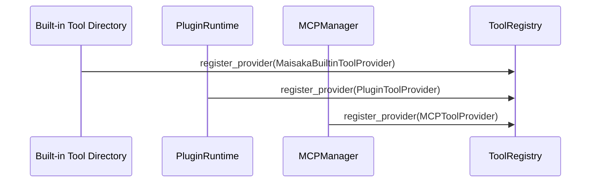
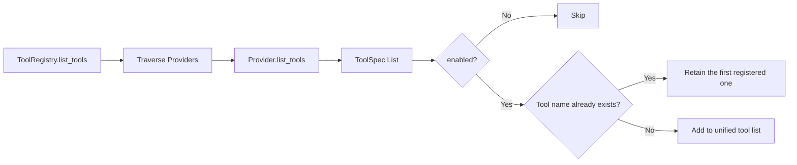
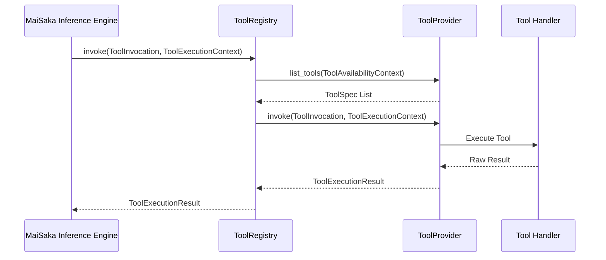

# Tool System Architecture

This document is written based on the code-map snapshot.

MaiBot's tool system converges plugin tools, legacy Actions, MaiSaka built-in capabilities, and external MCP tools into a unified abstraction layer. It does not teach plugin authors how to write a `@Tool`, nor does it replace the development tutorial in [Plugin Tool Usage](../../plugin/tools.md). This article focuses on the internal implementation, explaining how tool declaration, tool invocation, Provider adaptation, and ToolRegistry routing work together.

## 1. Overview

MaiBot currently unifies four types of tool sources:

**Plugin `@Tool`**: The Tool component within the plugin runtime. The plugin SDK uses `@Tool` to declare tools; the runtime writes these declarations into the component registry, and `PluginToolProvider` then exposes these tools to the unified tool layer.

**Legacy `@Action`**: The Action component in legacy plugins. SDK 2.0 automatically converts `@Action` into Tool declarations. The MaiBot runtime retains a compatibility path, allowing legacy plugins to continue being invoked by the LLM.

**MaiSaka Built-in Tools**: System-level capabilities provided natively by the inference engine, such as `send_emoji`, memory retrieval, reply, wait, and end of turn. These tools are provided by `MaisakaBuiltinToolProvider`.

**MCP Tools**: Remote tools bridged from external MCP servers via `MCPToolProvider`. The MCP manager handles connection, discovery, and invocation, while the MaiBot tool layer only consumes the unified `ToolSpec` and `ToolExecutionResult`.

The goal of this unification is to ensure the inference engine interacts with only one tool model:

**Tool Declaration**: Informs the LLM about available tools, their functions, and their parameters.

**Tool Invocation**: Translates the LLM's selection into an executable request, including the tool name, parameters, session, and streaming information.

**Tool Execution**: Executed by the corresponding Provider, returning a unified result, which is then written back to the conversation history or triggers subsequent actions.

## 2. Architecture Diagram

This diagram illustrates two layers of boundaries. The upper layer represents tool sources, which can originate from plugins, legacy Actions, built-in modules, or MCP servers. The lower layer represents the unified protocol: all sources must be converted into `ToolProvider`s, which are then uniformly exposed to the MaiSaka Inference Engine by the `ToolRegistry`.

At the conceptual level, the Provider interface can be understood as `get_tools()` and `execute_tool()`. The actual method names in the source code are `list_tools()` and `invoke()`. Their responsibilities are consistent: the former returns tool declarations, while the latter executes tool invocations.

## 3. Core Concepts

### 3.1 ToolCall

**Definition**: The intent of a tool invocation generated by the LLM during the inference process.

**Internal Model**: MaiBot uses `ToolInvocation` internally for execution, rather than directly reusing the raw `ToolCall` from the model API.

**Key Fields**:

**`tool_name`**: The name of the tool to be executed.

**`arguments`**: The parameter object generated by the LLM.

**`call_id`**: The model's tool call ID, used to place the result in the correct location.

**`session_id`**: The session ID.

**`stream_id`**: The chat stream ID.

**`reasoning`**: The reasoning text when the model selected this tool.

**`metadata`**: Extended information, such as anchor messages, source tags, or debugging fields.

`ToolCall` is the inference result, while `ToolInvocation` is the execution request. MaiBot standardizes between the two to avoid requiring every Provider to understand the raw formats of different models.

### 3.2 ToolIcon

**Definition**: Unified tool icon definition.

**Source Model**: `ToolIcon`.

**Key Fields**:

**`src`**: The icon resource URL.

**`mime_type`**: The resource MIME type.

**`sizes`**: The list of icon sizes.

Icons are not necessary information for the LLM to select a tool. They primarily serve UIs, monitoring dashboards, or debugging interfaces that need to display a list of tools. The `icons` field in tool declarations can be empty without affecting inference and invocation.

### 3.3 ToolAnnotation

**Definition**: Unified tool annotation information.

**Source Model**: `ToolAnnotation`.

**Key Fields**:

**`audience`**: The target users or set of models for the tool.

**`priority`**: The tool priority.

**`metadata`**: Extended annotation fields.

Annotations are used to express non-functional information about tools. They do not directly determine whether a tool is callable but can provide structured metadata for future scheduling, filtering, display, or permission evaluation.

### 3.4 ToolSpec

**Definition**: Unified tool declaration.

**Source Model**: `ToolSpec`.

**Key Fields**:

**`name`**: The tool name, which must be unique in the unified tool view.

**`description`**: The tool description for use by the LLM.

**`title`**: An optional display title.

**`parameters_schema`**: The parameter JSON Schema.

**`output_schema`**: The output Schema, for use by models supporting structured output.

**`provider_name`**: The Provider from which the declaration originates.

**`provider_type`**: The Provider type, e.g., `plugin`, `builtin`, `mcp`.

**`enabled`**: Whether the tool is enabled.

**`icons`**: The list of icons.

**`annotation`**: The tool annotation.

**`metadata`**: Extended metadata.

`ToolSpec` is the core data object of the tool system. All sources must first be converted into `ToolSpec` before entering the LLM tool definition list and invocation routing.

### 3.5 ToolProvider

**Definition**: Unified tool provider interface.

**Source Model**: `ToolProvider` Protocol.

**Conceptual Methods**:

**`get_tools()`**: Lists the tool declarations currently exposed by the Provider. Source code corresponds to `list_tools(context)`.

**`execute_tool()`**: Executes a specified tool invocation. Source code corresponds to `invoke(invocation, context)`.

**Resource Release**: The source code also requires `close()`, used to release external connections or asynchronous resources held by the Provider.

Providers do not care how other sources register, nor do they directly participate in LLM selection. They are only responsible for translating their tools into unified declarations and executing requests when selected by the registry.

### 3.6 ToolRegistry

**Definition**: Unified tool registry.

**Source Model**: `ToolRegistry`.

**Responsibilities**:

**Register Provider**: `register_provider()` saves the Provider. Registering a Provider with the same name later will replace the previously registered one.

**Unregister Provider**: `unregister_provider()` removes by Provider name.

**List Tools**: `list_tools()` collects tools by Provider order and skips duplicate names.

**Query Tools**: `get_tool_spec()` and `has_tool()` are used to determine if a specific tool exists.

**Generate LLM Definitions**: `get_llm_definitions()` converts `ToolSpec` into `ToolDefinitionInput` consumable by the model layer.

**Execute Invocation**: `invoke()` finds the responsible Provider based on the tool name and returns a unified result.

**Close Resources**: `close()` closes all Providers.

`ToolRegistry` is the dispatch center of the tool system. It allows the MaiSaka inference engine to be unaware of whether tools come from plugins, built-in modules, or MCP.

### 3.7 ToolExecutionContext

**Definition**: Tool execution context.

**Key Fields**:

**`session_id`**: The session ID.

**`stream_id`**: The chat stream ID.

**`reasoning`**: The reasoning text when the model selected the tool.

**`is_group_chat`**: Whether it is a group chat.

**`group_id`**: The group ID.

**`user_id`**: The user ID.

**`platform`**: The platform name.

**`metadata`**: Extended context.

The execution context passes the session state during model invocation to the Provider. Plugin tools especially rely on these fields, for example, using `stream_id` to find the chat stream where messages can be sent.

### 3.8 ToolAvailabilityContext

**Definition**: Context for determining tool exposure availability.

**Key Fields**:

**`session_id`**: The session ID.

**`stream_id`**: The chat stream ID.

**`is_group_chat`**: Whether it is a group chat.

**`group_id`**: The group ID.

**`user_id`**: The user ID.

**`platform`**: The platform name.

The availability context is used to decide whether a specific tool should be exposed to the LLM in the current chat. Built-in tools filter based on group chat, private chat, and configuration; plugin tools can also make visibility judgments based on runtime state.

### 3.9 ToolExecutionResult

**Definition**: Unified tool execution result.

**Key Fields**:

**`tool_name`**: The name of the executed tool.

**`success`**: Whether the execution was successful.

**`content`**: Text result.

**`error_message`**: Error message.

**`structured_content`**: Structured result, typically a dict or list.

**`content_items`**: Can include multimedia result items such as images, audio, or resource links.

**`post_history_messages`**: Messages that need to be appended to history after execution.

**`metadata`**: Extended metadata.

`ToolExecutionResult.get_history_content()` converts the result into text suitable for writing to history messages. If `content_items` exist, it will prioritize concatenating a readable summary to avoid directly embedding media binaries into the LLM context.

## 4. Detailed Explanation of Four Tool Sources

### 4.1 Plugin `@Tool`

**Source Entry Point**: `maibot/src/plugin_runtime/tool_provider.py`.

**Provider**: `PluginToolProvider`.

**provider_name**: `plugin_runtime`.

**provider_type**: `plugin`.

Plugin `@Tool`s are registered as plugin components by the SDK. After the plugin runtime starts, the Host-side `ComponentRegistry` stores Tool entries, and `ComponentQueryService` provides a read-only query view. `PluginToolProvider` does not directly hold plugin objects but reads current available tool declarations via `component_query_service`.

Declaration Phase:

**Plugin Loading**: The Runner subprocess loads the plugin and registers the Tool component.

**Component Registry**: The Host-side `ComponentRegistry` records the tool name, plugin ID, invocation method, parameter Schema, visibility, and enabled status.

**Query View**: `ComponentQueryService` converts registry entries into `ToolSpec`.

**Provider Exposure**: `PluginToolProvider.list_tools()` returns a unified tool list.

Execution Phase:

**Tool Name Matching**: `PluginToolProvider.invoke()` locates the Tool entry based on `ToolInvocation.tool_name`.

**IPC Invocation**: The Host invokes the plugin method in the Runner subprocess via plugin runtime RPC.

**Result Normalization**: The plugin return value is converted into `ToolExecutionResult`.

**Legacy Compatibility**: Tools converted from old `@Action`s also follow the same execution path.

### 4.2 Legacy `@Action`

**Source Entry Point**: Plugin SDK conversion layer and `plugin_runtime/tool_provider.py`.

**Provider**: Still exposed by `PluginToolProvider`.

**Compatibility Method**: The SDK internally converts `@Action` into `@Tool` declarations.

The key focus of legacy Action compatibility is not to inform the LLM that it was once an Action, but to allow it to enter the unified system with Tool semantics. After conversion, legacy Actions acquire a tool name, description, parameter Schema, and invocation entry point. The runtime retains necessary metadata to distinguish them as originating from legacy components.

Compatibility Boundaries:

**Discouraged for New Plugins**: New plugins should directly use `@Tool`.

**Preserved Execution Path**: The MaiBot runtime can still invoke tools converted from legacy Actions.

**No Repeated API Tutorials**: Details of the Action-to-Tool conversion belong to the plugin development documentation scope; this document only explains the architectural location.

**Unified Result Model**: Upon completion, execution still returns `ToolExecutionResult`; MaiSaka does not care whether it originated from a legacy Action or a new Tool.

### 4.3 MaiSaka Built-in Tool

**Source Entry Point**: `maibot/src/maisaka/builtin_tool/`.

**Provider**: `MaisakaBuiltinToolProvider`.

**provider_name**: `maisaka_builtin`.

**provider_type**: `builtin`.

Built-in tools are part of the MaiSaka inference engine, used to perform core actions that the model itself cannot directly complete. For example, `send_emoji` sends stickers, memory query tools read long-term memory or character profiles, `reply` sends responses, and `finish` ends the current reasoning turn.

Built-in Tool Characteristics:

**Strong Binding to Inference Flow**: Built-in tools serve the Planner tool loop, reply generation, and session waiting.

**Centralized Declaration Management**: `BUILTIN_TOOL_ENTRIES` centrally declares tool names, spec constructors, and handlers.

**Stage Control**: Tools can be marked as `timing`, `action`, or `both`.

**Visibility Control**: Tools can be marked as `visible`, `deferred`, or `hidden`.

**Configuration Filtering**: Some tools are enabled or disabled based on global configuration.

**Chat Scope Filtering**: Some tools are exposed only in group chats or private chats.

`MaisakaBuiltinToolProvider`'s `list_tools()` calls the built-in tool aggregation function to filter tools based on the current availability context. `invoke()` then locates the corresponding handler by tool name and executes it.

### 4.4 MCP Tool

**Source Entry Point**: `maibot/src/mcp_module/provider.py`.

**Provider**: `MCPToolProvider`.

**provider_name**: `mcp`.

**provider_type**: `mcp`.

MCP tools originate from external MCP servers. MaiBot connects to servers, discovers tools, invokes tools, and closes connections via `MCPManager`. `MCPToolProvider` acts as the adapter for this capability.

MCP Tool Characteristics:

**External Capabilities**: Tool implementations reside outside the MaiBot process.

**Runtime Connection**: MaiBot initializes the manager based on MCP configuration upon startup.

**Tool Discovery**: `MCPManager.get_tool_specs()` returns a unified `ToolSpec` list.

**Tool Invocation**: `MCPManager.call_tool_invocation()` executes remote calls.

**Resource Release**: `MCPToolProvider.close()` closes the MCP connection.

MCP tools extend MaiBot's capability boundaries, but the invocation chain remains unified. MaiSaka only sees `ToolSpec`, submits `ToolInvocation` during execution, and finally receives `ToolExecutionResult`.

## 5. Key Processes

### 5.1 Tool Registration

Registration occurs during the MaiSaka runtime initialization phase. Built-in Providers and Plugin Providers are registered by default. The MCP Provider is only registered when MCP is enabled and tools are successfully discovered.

Registration Rules:

**Name Replacement**: `ToolRegistry.register_provider()` first removes any Provider with the same name, then adds the new Provider.

**Order Preservation**: When listing tools, Providers are traversed in the order they were registered.

**Deduplication Protection**: If multiple Providers expose tools with the same name, the one registered first is retained; subsequent ones are skipped, and a warning is logged.

**Enablement Filtering**: Tools where `ToolSpec.enabled` is false will not be included in the unified list.

### 5.2 Tool Discovery

Tool discovery is not a one-time static snapshot. Whenever MaiSaka needs to prepare tool definitions for the model, it collects currently available tools via `ToolRegistry.list_tools()`.

The discovery phase handles three types of differences:

**Source Differences**: Plugins, built-ins, and MCP have different declaration sources, but they all ultimately become `ToolSpec`.

**Context Differences**: Different chat flows, group chats, or private chats may expose different tools.

**Visibility Differences**: Hidden tools will not enter the LLM tool list, and delayed-discovery tools may not be exposed temporarily.

### 5.3 Inference Engine Selection

MaiSaka sets up a unified `ToolRegistry` via `ChatLoopService`. When the Planner requires tool definitions, `ToolRegistry.get_llm_definitions()` converts `ToolSpec` into model-layer tool definitions.

Selection Process:

**Model Sees Tool List**: The LLM decides whether to call a tool based on the prompt, context, and tool descriptions.

**Model Returns ToolCall**: The model returns the tool name and parameters.

**MaiBot Builds ToolInvocation**: The model call is standardized into an internal request.

**Registry Finds Provider**: The Registry traverses Providers by tool name to find the one that declares the tool and has it enabled.

**Execute Corresponding Provider**: Call `provider.invoke()`.

### 5.4 Tool Invocation

The key to the invocation phase is locating the Provider. `ToolRegistry.invoke()` converts `ToolExecutionContext` into `ToolAvailabilityContext` to match tool declarations in the current chat environment. Once the Provider is found, it executes the tool and returns a unified result.

Exception Handling:

**Provider Throws Exception**: The Registry catches the exception and returns a failed `ToolExecutionResult`.

**Provider Does Not Find Tool**: Returns `Tool not found: {tool_name}`.

**Tool Fails Itself**: The Provider should return `success=False` and fill in `error_message`.

**Resource Cleanup**: When the runtime shuts down, `ToolRegistry.close()` is called, allowing each Provider to release its own resources.

### 5.5 Result Return

Once tool results enter MaiSaka, they are written to the conversation history or trigger subsequent actions. Results may include:

**Plain Text Result**: Written to `content`, suitable for simple query-type tools.

**Structured Result**: Written to `structured_content`, suitable for data the model needs to continue analyzing.

**Media Content Items**: Written to `content_items`, such as images, audio, or resource links.

**Follow-up Messages**: Written to `post_history_messages`, used to supplement context after tool execution.

`ToolExecutionResult.get_history_content()` is responsible for generating history summaries. It prioritizes text content, then content item summaries, then structured content JSON, and finally error messages.

## 6. Relationship with Plugin Development

The plugin development documentation [Tool Component](../../plugin/tools.md) focuses on how plugin authors use `@Tool`, declare parameters, return values, and handle images and media. This document does not repeat these API usages; it only explains their position within the internal architecture.

For plugin authors, it is necessary to understand three boundaries:

**Declaration Boundary**: Plugins use `@Tool` to declare capabilities, which the runtime converts into Tool components.

**Discovery Boundary**: MaiSaka discovers plugin tools through `PluginToolProvider` and `ToolRegistry`.

**Execution Boundary**: Plugin methods execute within Runner subprocesses, and the Host receives results via a unified tool protocol.

From the perspective of MaiBot's internal implementation, plugin tools are merely one source of `ToolProvider`. Regardless of whether tools originate from plugins, legacy Actions, built-in modules, or MCP, MaiSaka ultimately interacts with a single set of `ToolSpec`, `ToolInvocation`, and `ToolExecutionResult`.
