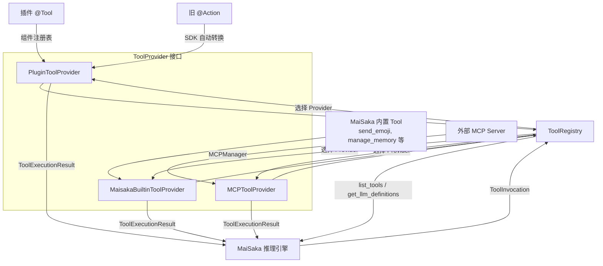

---
title: Tool System Architecture
---# Tool System Architecture

This article is written based on the code-map snapshot.

MBot's tool system converges plugin tools, legacy Actions, MaiSaka built capabilities, and external MCP tools into a single abstraction layer. It is not responsible for teaching plugin authors how to write an `@Tool`, nor does it replace the development tutorial in [Tool Usage](../plugin-dev/tools.md). This article focuses on internal implementation, explaining how tool declaration, tool invocation, Provider adaptation, and ToolRegistry routing work together.

## 1. Overview

MBot currently unifies four types of tool sources:

**Plugin `@Tool`**: Tool components within plugin runtime. The Plugin SDK uses `@Tool` to declare tools, the runtime writes these declarations to the component registry, and `PluginToolProvider` exposes these tools to the unified tool layer.

**Legacy `@Action`**: Action components in legacy plugins. SDK 2.0 automatically converts `@Action` to Tool declarations, and the MaiBot runtime retains a compatibility path to allow legacy plugins to continue being called by the LLM.

MaiSaka Built-in Tool**: System-level capabilities built into the inference engine, such as `send_emoji`, memory query, reply, wait, end current round, etc. These tools are provided by `MaisakaBuiltinToolProvider`.

**MCP Tool**: Remote tools bridged to external MCP servers via `MCPToolProvider`. The MCP manager handles connection, discovery, and invocation, while the MaiBot tool layer only consumes the unified `ToolSpec` and `ToolExecutionResult`.

The goal of unification is to let the inference engine face only one type of tool model:

**Tool Declaration**: Tells the LLM which tools exist, what they do, and what the parameters are.

**Tool Invocation**: Converts LLM selections into executable requests, including tool name, parameters, session, and stream information.

**Tool Execution**: Executed by the corresponding Provider, returning a unified result which is then written back to the chat history or triggers subsequent actions.

## 2. Architecture Diagram

This diagram illustrates two layers of boundaries. The upper layer consists of tool sources, which can come from plugins, legacy Actions, built-in modules, or MCP servers. The lower layer is the unified protocol; all sources must become `ToolProvider`, then are uniformly exposed to the MaiSaka inference engine by `ToolRegistry`.

Conceptually layer, the Provider interface can be understood as `get_tools()` and `execute_tool()`. The actual method names in the source code are `list_tools()` and `invoke()`, with identical responsibilities: the former returns tool declarations, and the latter executes tool invocations.

## 3. Core Concepts

### 3.1 ToolCall

**Definition**: Tool call intent generated by the LLM during the reasoning process.

**Internal Model**: MaiBot uses `ToolInvocation` during internal execution instead of directly reusing the raw `ToolCall` from the model API.

**Key Fields**:

**`tool_name`**: The name of the tool to be executed.

**`arguments`**: The parameter object generated by the LLM.

**`call_id`**: The model tool call ID, used to place results back in the correct position.

**`session_id`**: Session ID.

**`stream_id`**: Chat stream ID.

**`reasoning`**: The reasoning text when the model selects this tool.

**`metadata`**: Extension information, such as anchor messages, source tags, or debug fields.

`ToolCall` is the inference result, and `ToolInvocation` is the execution request. MaiBot standardizes between the two to avoid every Provider having to understand the raw formats of different models.

### 3.2 ToolIcon

**Definition**: Unified tool icon definition.

**Source Model**: `ToolIcon`.

**Key Fields**:

**`src`**: Icon resource address.

**`mime_type`**: Resource MIME type.

**`sizes`**: List of icon sizes.

Icons are not necessary information for the LLM to select tools. They primarily serve UIs that need to display tool lists, monitoring panels, or debug interfaces. `icons` in the tool declaration can be empty and does not affect inference or invocation.

### 3.3 ToolAnnotation

**Definition**: Unified tool annotation information.

**Source Model**: `ToolAnnotation`.

**Key Fields**:

**`audience`**: The target users or set of models for the tool.

**`priority`**: Tool priority.

**`metadata`**: Annotation extension fields.

Annotations are used to express non-functional information about tools. They do not directly determine if a tool is callable but can provide structured metadata for future scheduling, filtering, display, or permission judgment.

### 3.4 ToolSpec

**Definition**: Unified tool declaration.

**Source Model**: `ToolSpec`.

**Key Fields**:

**`name`**: Tool name, which must be unique within the unified tool view.

**`description`**: Tool description for the LLM to use.

**`title`**: Optional display title.

**`parameters_schema`**: Parameter JSON Schema.

**`output_schema`**: Output Schema for models supporting structured output.

**`provider_name`**: Which Provider the declaration comes from.

**`provider_type`**: Provider type, such as `plugin`, `builtin`, or `mcp`.

**`enabled`**: Whether it is enabled.

**`icons`**: Icon list.

**`annotation`**: Tool annotations.

**`metadata`**: Extension metadata.

`ToolSpec` is the core data object of the tool system. All sources must first become `ToolSpec` before entering the LLM tool definition list and invocation routing.

### 3.5 ToolProvider

**Definition**: Unified tool provider interface.

**Source Model**: `ToolProvider` Protocol.

**Conceptual Methods**:

**`get_tools()`**: Lists the tool declarations the current Provider can expose. Corresponds to `list_tools(context)`.

**`execute_tool()`**: Executes a specified tool call. Corresponds to `invoke(invocation, context)`.

**Resource Release**: The source code also requires `close()` to release external connections or asynchronous resources held by the Provider.

P Provider does not care how other sources register, nor does it directly participate in LLM selection. It is only responsible for translating its own tools into unified declarations and executing requests when selected by the registry.

### 3.6 ToolRegistry

**Definition**: Unified tool registry.

**Source Model**: `ToolRegistry`.

**Responsibilities**:

**Register Provider**: `register_provider()` saves the Provider. A Provider with the same name registered later will replace the previously registered one.

**Unregister Provider**: `unregister_provider()` removes by Provider name.

**List Tools**: `list_tools()` collects tools by Provider order and skips duplicate names.

**Query Tool**: `get_tool_spec()` and `has_tool()` are used to determine if a specific tool exists.

**Generate LLM Definition**: `get_llm_definitions()` converts `ToolSpec` into an `ToolDefinitionInput` that the model layer can consume.

**Execute Invocation**: `invoke()` finds the responsible Provider based on the tool name and returns a unified result.

**Close Resources**: `close()` closes all Providers.

`ToolRegistry` is the scheduling center of the tool system. It allows the MaiSaka inference engine to operate without knowing whether tools come from plugins, built-in modules, or MCP.

### 3.7 ToolExecutionContext

**Definition**: Tool execution context.

**Key Fields**:

**`session_id`**: Session ID.

**`stream_id`**: Chat stream ID.

**`reasoning`**: Reasoning text when the model selects the tool.

**`is_group_chat`**: Whether it is a group chat.

**`group_id`**: Group ID.

**`user_id`**: User ID.

**`platform`**: Platform name.

**`metadata`**: Extension context.

Execution context passes the session state to the Provider during model invocation. Plugin tools especially depend on these fields to find `stream_id` to send messages.

### 3.8 ToolAvailabilityContext

**Definition**: Tool availability context.

**Key Fields**:

**`session_id`**: Session ID.

**`stream_id`**: Chat stream ID.

**`is_group_chat`**: Whether it is a group chat.

**`group_id`**: Group ID.

**`user_id`**: User ID.

**`platform`**: Platform name.

Availability context determines whether a tool should be exposed in the current chat. Built-in tools are filtered based on group or private chat; plugin tools can also determine visibility based on runtime state.

### 3.9 ToolExecutionResult

**Definition**: Tool execution result.

**Key Fields**:

**`tool_name`**: The name of the tool being executed.

**`success`**: Whether it was successful.

**`content`**: Text result.

**`error_message`**: Error information.

**`structured_content`**: Structured result, usually a dict or list.

**`content_items`**: Media items including images, audio, and resource links.

**`post_history_messages`**: Messages appended after execution.

**`metadata`**: Metadata.

`ToolExecutionResult.get_history_content()` converts results into text for history. If `content_items` exists, a summary is prioritized.
## 4. Detailed breakdown of four tool sources

### 4.1 Plugin `@Tool`

**Source Entry**: `maibot/src/plugin_runtime/tool_provider.py`.

**Provider**: `PluginToolProvider`.

**provider_name**: `plugin_runtime`.

**provider_type**: `plugin`.

Plugin `@Tool` is registered as a component. After the plugin starts, the Host-side `ComponentRegistry` saves Tool entries, and MaiSaka reads the available tool declarations directly.

**Declaration Phase**:
The Runner process loads the plugin and registers the component.
**Component Registration**: The Host-side `ComponentRegistry` records tool name, plugin method, parameter schema, visibility, and enabled status.
**Query View**: `ComponentQueryService` converts to unified declarations.
**Provider Exposure**: `PluginToolProvider.list_tools()` returns the list.

**Execution Phase**:
**Tool Name Matching**: `PluginToolProvider.invoke()` finds Tool entries based on name.
**IPC Invocation**: Host calls plugin methods in the Runner process.
**Result Normalization**: Plugin return values are converted to `ToolExecutionResult`.
**History Compatibility**: Legacy `@Action` follow the same execution path.

### 4.2 Legacy `@Action`

**Source Entry**: Plugin SDK and `plugin_runtime/tool_provider.py`.

**Provider**: Still exposed by `PluginToolProvider`.

**Compatibility Method**: SDK converts `@Action` to `@Tool` declarations. Legacy Actions gain tool name, description, and invocation entry after conversion. The focus of legacy Action compatibility is not to let the LLM know it was an Action, but to let it enter the system with Tool semantics.

**Compatibility Boundary**:
**Not encouraging new plugins**: New plugins should use `@Tool`.
**Legacy Execution Path**: MaiBot runtime still calls tools converted from legacy Actions.
**No Duplicate Tutorial**: Action to Tool conversion belongs to plugin development; this article only explains the architecture.
**Unified Result**: Still returns `ToolExecutionResult` after execution; MaiSaka does not care if it comes from a legacy Action or a new Tool.

### 4.3 MaiSaka Built-in Tool

**Source Entry**: `maibot/src/maisaka/builtin_tool/`.

**Provider**: `MaisakaBuiltinToolProvider`.

**provider_name**: `maisaka_builtin`.

**provider_type**: `builtin`.
Built-in tools are part of the MaiSaka inference engine used to complete core actions the model cannot perform directly. For example, `send_emoji` sends emojis, memory query tools read long-term memory or personas, `reply` sends replies, and `finish` ends the current thought round.

**Built-in tool features**:
**Tightly coupled reasoning process**: Serve the Planner, Timing Gate, and Action Loop.
**Centralized Declaration**: `BUILTIN_TOOL_ENTRIES` declares tool names, spec constructors, and handlers.
**Stage Control**: Tools can be marked as `timing`, `action`, or `both`.
**Visibility Control**: Tools can be marked as `visible`, `deferred`, or `hidden`.
**Configuration Filtering**: Some tools are enabled or disabled based on global configuration.
**Chat Scope Filtering**: Some tools are only exposed in group or private chats.
`MaisakaBuiltinToolProvider`'s `list_tools()` calls built-in tool aggregation functions, filtering tools by current availability context. `invoke()` then finds the corresponding handler by tool name and executes it.

### 4.4 MCP Tool

**Source Entry**: `maibot/src/mcp_module/provider.py`.

**Provider**: `MCPToolProvider`.

**provider_name**: `mcp`.

**provider_type**: `mcp`.nMTools come from external MCP servers. MaiBot uses `MCPManager` to connect to servers, discover tools, invoke tools, and close connections. `MCPToolProvider` is the adapter for this capability.

**MCP tool features**:
**External Capability**: Tool implementation resides outside the MaiBot process.
**Runtime Connection**: The manager initializes based on MCP configuration when MaiBot starts.
**Tool Discovery**: `MCPManager.get_tool_specs()` returns a unified `ToolSpec` list.
**Tool Invocation**: `MCPManager.call_tool_invocation()` executes remote calls.
**Resource Release**: `MCPToolProvider.close()` closes the MCP connection.
MCP tools extend MaiBot's capability boundary, but the call chain remains unified. MaiSaka only sees `ToolSpec`, and only submits `ToolInvocation` during execution.