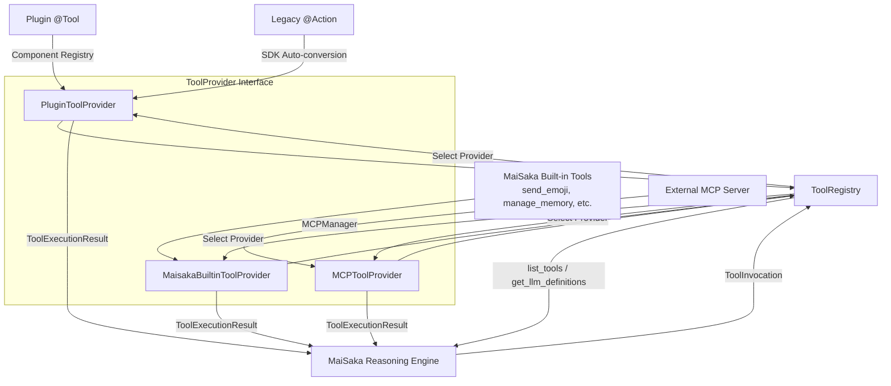
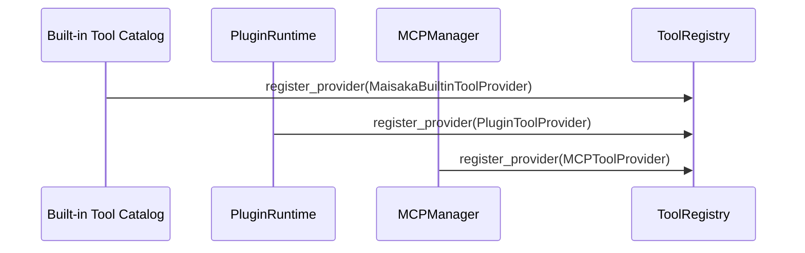
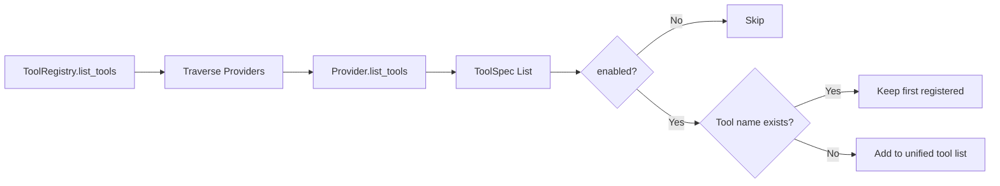

# Tool System Architecture

This document is based on a code-map snapshot.

MaiBot's tool system converges plugin tools, legacy `@Action`, MaiSaka built-in capabilities, and external MCP tools into a single abstraction layer. It does not teach plugin authors how to write a `@Tool`, nor does it replace the [Plugin Tool Usage](/en/develop/plugin-dev/tools.md) development tutorial. This document focuses on the internal implementation, explaining how tool declaration, tool invocation, Provider adaptation, and ToolRegistry routing work together.

## 1. Overview

MaiBot currently unifies four types of tool sources:

**Plugin `@Tool`**: Tool components in the plugin runtime. The plugin SDK uses `@Tool` to declare tools, the runtime writes the declarations into the component registry, and `PluginToolProvider` exposes these tools to the unified tool layer.

**Legacy `@Action`**: Action components in legacy plugins. SDK 2.0 automatically converts `@Action` to Tool declarations; the MaiBot runtime retains a compatibility path so legacy plugins can still be called by the LLM.

**MaiSaka Built-in Tools**: System-level capabilities built into the reasoning engine, such as `send_emoji`, memory queries, reply, wait, finish current round, etc. These tools are provided by `MaisakaBuiltinToolProvider`.

**MCP Tools**: Remote tools bridged from external MCP servers via `MCPToolProvider`. The MCP manager handles connection, discovery, and invocation; the MaiBot tool layer only consumes the unified `ToolSpec` and `ToolExecutionResult`.

The goal of unification is to let the reasoning engine face only one tool model:

**Tool Declaration**: Tells the LLM what tools exist, what they do, and what their parameters are.

**Tool Invocation**: Converts the LLM's selection into an executable request, containing tool name, parameters, session and stream information.

**Tool Execution**: Executed by the corresponding Provider, returns a unified result, which is then written back to chat history or triggers subsequent actions.

## 2. Architecture Diagram

This diagram illustrates two layers of boundaries. The upper layer is tool sources, which can come from plugins, legacy Actions, built-in modules, or MCP servers. The lower layer is a unified protocol — all sources must become `ToolProvider`s, then be uniformly exposed to the MaiSaka reasoning engine via `ToolRegistry`.

At the conceptual level, the Provider interface can be understood as `get_tools()` and `execute_tool()`. The actual method names in the source code are `list_tools()` and `invoke()`, but their responsibilities are identical: the former returns tool declarations, the latter executes tool invocations.

## 3. Core Concepts

### 3.1 ToolCall

**Definition**: The tool invocation intent produced by the LLM during reasoning.

**Internal Model**: MaiBot internally uses `ToolInvocation` for execution, rather than directly reusing the model API's raw `ToolCall`.

**Key Fields**:

**`tool_name`**: The name of the tool to execute.

**`arguments`**: The parameter object generated by the LLM.

**`call_id`**: The model tool call ID, used to place the result in the correct position.

**`session_id`**: Session ID.

**`stream_id`**: Chat stream ID.

**`reasoning`**: The reasoning text from the model when selecting this tool.

**`metadata`**: Extended information, such as anchor message, source markers, or debug fields.

`ToolCall` is the reasoning result; `ToolInvocation` is the execution request. MaiBot normalizes between the two, avoiding the need for each Provider to understand different models' raw formats.

### 3.2 ToolIcon

**Definition**: Unified tool icon definition.

**Source Model**: `ToolIcon`.

**Key Fields**:

**`src`**: Icon resource address.

**`mime_type`**: Resource MIME type.

**`sizes`**: List of icon sizes.

Icons are not necessary information for the LLM to select tools. They primarily serve UIs that need to display tool lists, monitoring dashboards, or debugging interfaces. The `icons` field in a tool declaration can be empty without affecting reasoning or invocation.

### 3.3 ToolAnnotation

**Definition**: Unified tool annotation information.

**Source Model**: `ToolAnnotation`.

**Key Fields**:

**`audience`**: The user or model set the tool is intended for.

**`priority`**: Tool priority.

**`metadata`**: Annotation extension fields.

Annotations express non-functional information about tools. They do not directly determine whether a tool can be invoked, but they provide structured metadata for future scheduling, filtering, display, or permission checks.

### 3.4 ToolSpec

**Definition**: Unified tool declaration.

**Source Model**: `ToolSpec`.

**Key Fields**:

**`name`**: Tool name, must be unique within the unified tool view.

**`description`**: Tool description for the LLM.

**`title`**: Optional display title.

**`parameters_schema`**: Parameter JSON Schema.

**`output_schema`**: Output schema, for models that support structured output.

**`provider_name`**: Indicates which Provider it comes from.

**`provider_type`**: Provider type, e.g., `plugin`, `builtin`, `mcp`.

**`enabled`**: Whether it is enabled.

**`icons`**: List of icons.

**`annotation`**: Tool annotation.

**`metadata`**: Extended metadata.

`ToolSpec` is the core data object of the tool system. All sources must first be converted to `ToolSpec` before entering the LLM tool definition list and invocation routing.

### 3.5 ToolProvider

**Definition**: Unified tool provider interface.

**Source Model**: `ToolProvider` Protocol.

**Conceptual Methods**:

**`get_tools()`**: Lists tool declarations the current Provider can expose. Corresponds to `list_tools(context)` in the source code.

**`execute_tool()`**: Executes a specified tool invocation. Corresponds to `invoke(invocation, context)` in the source code.

**Resource Cleanup**: The source also requires `close()`, used to release external connections or async resources held by the Provider.

A Provider does not care about how other sources register, nor does it directly participate in LLM selection. It is only responsible for translating its own tools into unified declarations and executing requests when selected by the registry.

### 3.6 ToolRegistry

**Definition**: Unified tool registry.

**Source Model**: `ToolRegistry`.

**Responsibilities**:

**Register Provider**: `register_provider()` saves a Provider. Registering a Provider with the same name replaces the previous one.

**Unregister Provider**: `unregister_provider()` removes a Provider by name.

**List Tools**: `list_tools()` collects tools in Provider order and skips duplicate names.

**Query Tools**: `get_tool_spec()` and `has_tool()` determine whether a specific tool exists.

**Generate LLM Definitions**: `get_llm_definitions()` converts `ToolSpec` into `ToolDefinitionInput` consumable by the model layer.

**Execute Invocation**: `invoke()` finds the responsible Provider by tool name and returns a unified result.

**Close Resources**: `close()` closes all Providers.

`ToolRegistry` is the dispatch center of the tool system. It allows the MaiSaka reasoning engine to not know whether tools come from plugins, built-in modules, or MCP.

### 3.7 ToolExecutionContext

**Definition**: Tool execution context.

**Key Fields**:

**`session_id`**: Session ID.

**`stream_id`**: Chat stream ID.

**`reasoning`**: The model's reasoning text for selecting the tool.

**`is_group_chat`**: Whether it is a group chat.

**`group_id`**: Group ID.

**`user_id`**: User ID.

**`platform`**: Platform name.

**`metadata`**: Extended context.

The execution context passes the session state at the time of model invocation to the Provider. Plugin tools in particular depend on these fields, such as using `stream_id` to find the chat stream where messages can be sent.

### 3.8 ToolAvailabilityContext

**Definition**: Context for determining tool exposure availability.

**Key Fields**:

**`session_id`**: Session ID.

**`stream_id`**: Chat stream ID.

**`is_group_chat`**: Whether it is a group chat.

**`group_id`**: Group ID.

**`user_id`**: User ID.

**`platform`**: Platform name.

The availability context is used to decide whether a tool should be exposed to the LLM in the current chat. Built-in tools filter based on group chat, private chat, and configuration; plugin tools can also make visibility judgments based on runtime state.

### 3.9 ToolExecutionResult

**Definition**: Unified tool execution result.

**Key Fields**:

**`tool_name`**: The name of the executed tool.

**`success`**: Whether it succeeded.

**`content`**: Text result.

**`error_message`**: Error message.

**`structured_content`**: Structured result, typically a dict or list.

**`content_items`**: May contain multimedia result items such as images, audio, and resource links.

**`post_history_messages`**: Messages to append to history after execution.

**`metadata`**: Extended metadata.

`ToolExecutionResult.get_history_content()` converts the result into text suitable for writing to history messages. If `content_items` exists, it preferentially constructs a readable summary to avoid putting media binaries directly into the LLM context.

## 4. Detailed Explanation of Four Tool Source Types

### 4.1 Plugin `@Tool`

**Source Entry**: `maibot/src/plugin_runtime/tool_provider.py`.

**Provider**: `PluginToolProvider`.

**provider_name**: `plugin_runtime`.

**provider_type**: `plugin`.

Plugin `@Tool` is registered as a plugin component via the SDK. After the plugin runtime starts, the Host-side `ComponentRegistry` stores Tool entries, and `ComponentQueryService` provides a read-only query view. `PluginToolProvider` does not hold plugin objects directly, but reads currently available tool declarations through `component_query_service`.

Declaration phase:

**Plugin Loading**: The Runner child process loads the plugin and registers Tool components.

**Component Registry**: The Host-side `ComponentRegistry` records the tool name, plugin ID, invocation method, parameter schema, visibility, and enabled status.

**Query View**: `ComponentQueryService` converts registry entries into `ToolSpec`.

**Provider Exposure**: `PluginToolProvider.list_tools()` returns a unified tool list.

Execution phase:

**Tool Name Matching**: `PluginToolProvider.invoke()` finds the Tool entry by `ToolInvocation.tool_name`.

**IPC Invocation**: The Host calls the plugin method in the Runner child process via plugin runtime RPC.

**Result Normalization**: The plugin return value is converted to `ToolExecutionResult`.

**Legacy Compatibility**: Tools converted from legacy `@Action` also go through the same execution path.

### 4.2 Legacy `@Action`

**Source Entry**: Plugin SDK conversion layer and `plugin_runtime/tool_provider.py`.

**Provider**: Still exposed by `PluginToolProvider`.

**Compatibility Approach**: The SDK internally converts `@Action` to `@Tool` declarations.

The focus of legacy Action compatibility is not to let the LLM know it was once an Action, but to make it enter the unified system with Tool semantics. After conversion, legacy Actions acquire a tool name, description, parameter schema, and invocation entry point. The runtime retains necessary metadata to distinguish them as originating from legacy components.

Compatibility boundaries:

**Not recommended for new plugins**: New plugins should use `@Tool` directly.

**Execution path preserved**: The MaiBot runtime can still invoke tools converted from legacy Actions.

**No API tutorial duplication**: The details of Action-to-Tool conversion belong to the plugin development documentation boundary; this document only explains the architectural position.

**Unified result model**: After execution, `ToolExecutionResult` is still returned; MaiSaka does not care whether it came from a legacy Action or a new Tool.

### 4.3 MaiSaka Built-in Tools

**Source Entry**: `maibot/src/maisaka/builtin_tool/`.

**Provider**: `MaisakaBuiltinToolProvider`.

**provider_name**: `maisaka_builtin`.

**provider_type**: `builtin`.

Built-in tools are part of the MaiSaka reasoning engine, used to perform core actions that the model itself cannot directly complete. For example, `send_emoji` sends emoji stickers, memory query tools read long-term memory or character profiles, `reply` sends a reply, `finish` ends the current thinking round.

Built-in tool characteristics:

**Tightly bound to reasoning flow**: Built-in tools serve the Planner, Timing Gate, and Action Loop.

**Centralized declaration**: `BUILTIN_TOOL_ENTRIES` centrally declares tool names, spec constructors, and handlers.

**Phase control**: Tools can be marked as `timing`, `action`, or `both`.

**Visibility control**: Tools can be marked as `visible`, `deferred`, or `hidden`.

**Configuration filtering**: Some tools are enabled or disabled based on global configuration.

**Chat scope filtering**: Some tools are exposed only in group chats or private chats.

`MaisakaBuiltinToolProvider.list_tools()` calls the built-in tool aggregation function, filtering tools by the current availability context. `invoke()` finds the corresponding handler by tool name and executes it.

### 4.4 MCP Tool

**Source Entry**: `maibot/src/mcp_module/provider.py`.

**Provider**: `MCPToolProvider`.

**provider_name**: `mcp`.

**provider_type**: `mcp`.

MCP tools come from external MCP servers. MaiBot connects to servers, discovers tools, invokes tools, and closes connections via `MCPManager`. `MCPToolProvider` is the adapter for this capability.

MCP tool characteristics:

**External capability**: Tool implementations reside outside the MaiBot process.

**Runtime connection**: MaiBot initializes the manager based on MCP configuration at startup.

**Tool discovery**: `MCPManager.get_tool_specs()` returns a unified `ToolSpec` list.

**Tool invocation**: `MCPManager.call_tool_invocation()` executes remote calls.

**Resource cleanup**: `MCPToolProvider.close()` closes MCP connections.

MCP tools extend MaiBot's capability boundaries, but the call chain remains unified. MaiSaka only sees `ToolSpec`, only submits `ToolInvocation` during execution, and only receives `ToolExecutionResult` in return.

## 5. Key Flows

### 5.1 Tool Registration

Registration occurs during the MaiSaka runtime initialization phase. The built-in Provider and plugin Provider are registered by default. The MCP Provider is only registered when MCP is enabled and tools are successfully discovered.

Registration rules:

**Same-name replacement**: `ToolRegistry.register_provider()` removes an existing Provider with the same name before adding the new one.

**Order preserved**: When listing tools, Providers are traversed in registration order.

**Deduplication protection**: If multiple Providers expose tools with the same name, the first registered one is kept, subsequent ones are skipped with a warning logged.

**Enabled filter**: Tools with `ToolSpec.enabled` set to false do not enter the unified list.

### 5.2 Tool Discovery

Tool discovery is not a one-time static snapshot. Each time MaiSaka needs to prepare tool definitions for the model, it collects currently available tools through `ToolRegistry.list_tools()`.

The discovery phase handles three types of differences:

**Source differences**: Plugins, built-in, and MCP have different declaration sources, but they all end up as `ToolSpec`.

**Context differences**: Different chat streams, group chats, or private chats may expose different tools.

**Visibility differences**: Hidden tools do not enter the LLM tool list, and deferred discovery tools may also be temporarily unavailable.

### 5.3 Reasoning Engine Selection

MaiSaka sets the unified `ToolRegistry` through `ChatLoopService`. When the Planner needs tool definitions, `ToolRegistry.get_llm_definitions()` converts `ToolSpec` into model-layer tool definitions.

Selection process:

**Model sees the tool list**: The LLM decides whether to invoke a tool based on the prompt, context, and tool descriptions.

**Model returns ToolCall**: The model returns the tool name and arguments.

**MaiBot constructs ToolInvocation**: Normalizes the model call into an internal request.

**Registry looks up Provider**: Traverses Providers by tool name, finds the first one that declares and has the tool enabled.

**Execute the corresponding Provider**: Calls `provider.invoke()`.

### 5.4 Tool Invocation

The key aspect of the invocation phase is locating the Provider. `ToolRegistry.invoke()` converts `ToolExecutionContext` to `ToolAvailabilityContext` to match tool declarations in the current chat environment. Once the Provider is found, it executes the tool and returns a unified result.

Exception handling:

**Provider throws exception**: The Registry catches the exception and returns a failed `ToolExecutionResult`.

**Provider tool not found**: Returns `Tool not found: {tool_name}`.

**Tool itself fails**: The Provider should return `success=False` and populate `error_message`.

**Resource cleanup**: When the runtime shuts down, `ToolRegistry.close()` is called, and each Provider releases its own resources.

### 5.5 Result Return

After a tool result enters MaiSaka, it is written into the chat history or triggers subsequent actions. The result may contain:

**Plain text result**: Written to `content`, suitable for simple query tools.

**Structured result**: Written to `structured_content`, suitable for data the model can continue to analyze.

**Media content items**: Written to `content_items`, such as images, audio, or resource links.

**Subsequent messages**: Written to `post_history_messages`, used to supplement context after tool execution.

`ToolExecutionResult.get_history_content()` is responsible for generating a history summary. It prefers text content first, then content item summaries, then structured content JSON, and finally error messages.

## 6. Relationship with Plugin Development

The plugin development documentation [Tool Component](/en/develop/plugin-dev/tools.md) focuses on how plugin authors use `@Tool`, how to declare parameters, how to return values, and how to handle images and media. This document does not repeat those API usages, only explaining their positions in the internal architecture.

For plugin authors, three boundaries need to be understood:

**Declaration boundary**: The plugin uses `@Tool` to declare capabilities; the runtime converts them into Tool components.

**Discovery boundary**: MaiSaka discovers plugin tools through `PluginToolProvider` and `ToolRegistry`.

**Execution boundary**: Plugin methods execute in the Runner child process; the Host receives results through the unified tool protocol.

For MaiBot's internal implementation, plugin tools are just one source of `ToolProvider`. Regardless of whether a tool comes from a plugin, legacy Action, built-in module, or MCP, MaiSaka ultimately faces the same `ToolSpec`, `ToolInvocation`, and `ToolExecutionResult`.
