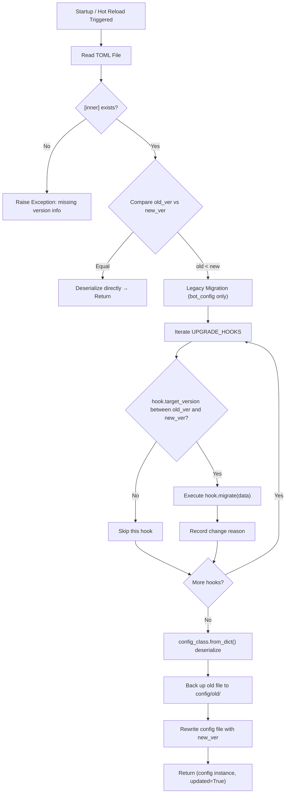
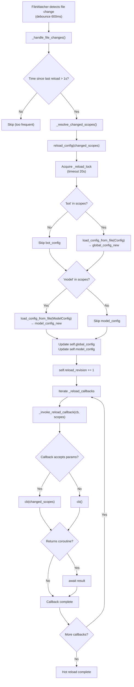

# Configuration System

This document is aimed at deployment operators and advanced users. It explains the internal mechanisms of MaiBot's configuration system: the two TOML files, version chains and upgrade hooks, the full hot-reload flow, legacy migration, and editing dos and don'ts. If you only want to know what a specific field does, refer to the [configuration guide in the user manual](/en/manual/configuration/).

## Overview of the Two TOML Files

At runtime, MaiBot depends on two independent TOML files under the `config/` directory, each managed by its own Pydantic model:

**bot_config.toml** — the main configuration file, corresponding to the `Config` model (located in `src/config/official_configs.py`). Contains 21 sub-config sections: `[bot]`, `[personality]`, `[chat]`, `[experimental]`, `[visual]`, `[expression]`, `[jargon]`, `[a_memorix]`, `[message_receive]`, `[voice]`, `[emoji]`, `[keyword_reaction]`, `[response_post_process]`, `[chinese_typo]`, `[response_splitter]`, `[telemetry]`, `[log]`, `[debug]`, `[maim_message]`, `[webui]`, `[database]`, `[mcp]`, `[plugin]`, `[plugin_runtime]`.

**model_config.toml** — the model configuration file, corresponding to the `ModelConfig` model (located in `src/config/model_configs.py`). Contains 3 top-level sections: `[[models]]` (model list), `[model_task_config]` (task-to-model bindings), `[[api_providers]]` (API provider list).

Each file records a `version` field in its `[inner]` table for comparison against the built-in `CONFIG_VERSION` / `MODEL_CONFIG_VERSION` constants in code during startup and hot reload. Versions use a three-segment scheme (major.minor.patch): the major version follows MMC major updates, the minor version corresponds to substantial configuration changes, and the patch version covers small adjustments.

## Key Fields of BotConfig and PersonalityConfig

This section only covers the core fields that deployment operators need to care about. For a complete field list, see the [Bot configuration user documentation](/en/manual/configuration/bot-config).

### BotConfig (`[bot]`)

**platform** — the platform identifier of the primary account (e.g. `qq`). Determines how the message adapter parses the source.
**qq_account** — the primary account's QQ number (as a string). Used to identify messages sent by the Bot itself.
**nickname** — the Bot's display and self-reference name, default `"麦麦"`.
**alias_names** — list of alias names. Users can trigger mention detection with these names too.
**platforms** — multi-platform account list, format: `platform:account`.

### PersonalityConfig (`[personality]`)

**personality** — personality setting text. The core of the system prompt, describing the Bot's identity, character, and behavioral guidelines.
**reply_style** — expression style description. Layered on top of the personality setting, guiding the Bot's tone and verbosity.
**multiple_reply_style** — list of alternative expression styles. One is randomly injected with probability `multiple_probability` to add variety to replies.
**multiple_probability** — probability of temporary style injection (0~1). Set to 0 to always use the primary style.

### Other Key Configuration Sections

**ChatConfig (`[chat]`)** — controls context window size (`max_context_size` / `max_private_context_size`), reply timing and frequency (`reply_timing`), and reply style (`reply_style`). See the message processing flow for details.

**ExperimentalConfig (`[experimental]`)** — experimental feature toggles: behavior learning, emotion trait tier, attention drift, Focus mode.

**MCPConfig (`[mcp]`)** — MCP server configuration. See [MCP Integration](/en/develop/mcp-integration) for details.

**PluginConfig (`[plugin]`)** — plugin loading and management configuration.

## ModelConfig and APIProvider

### ModelConfig (corresponds to `model_config.toml`)

`ModelConfig` consists of three main components:

**`[[models]]` (array of tables)** — each model entry defines `name` (model alias), `model_identifier` (actual model name in the API), and `api_provider` (points to a provider name in `api_providers`).

**`[model_task_config]`** — binds various inference tasks to models. Core sub-sections include `planner`, `replyer`, `vlm`, `memory`, `embedding`, `tool_calling`, `topic_judge`, `expression_generation`, `expression_recognition`, `chinese_typo`, and more. Each task section contains `model_list` (candidate model name list) and sampling parameters like `temperature`.

**`[[api_providers]]` (array of tables)** — API provider configuration.

### APIProvider Core Fields

`APIProvider`, located in `src/config/model_configs.py`, defines all connection parameters for interacting with LLM APIs:

**name** — provider name (referenced by `api_provider` in `models`; can be named freely).
**base_url** — API endpoint base URL.
**api_key** — API key. Can be left empty when `auth_type` is `none`.
**client_type** — client type, `openai` or `google` (default `openai`).
**max_retry** — maximum retry count after a failed API call (default 3).
**timeout** — single API call timeout in seconds (default 60).
**retry_interval** — interval between retries in seconds (default 5).
**organization** / **project** — optional organization and project identifiers for the official OpenAI API.

The following three fields determine how requests are authenticated and parsed:

**auth_type**

— Authentication method for OpenAI-compatible interfaces.

  - `bearer` — standard Bearer Token (`Authorization: Bearer <api_key>` header), default value.
  - `header` — custom header authentication. Requires `auth_header_name` (header name) and `auth_header_prefix` (prefix).
  - `query` — query parameter authentication. Requires `auth_query_name` (parameter name, default `api_key`).
  - `none` — no authentication, suitable for local models or proxies that don't require a key.

**auth_header_name** — HTTP header name in `header` mode (default `Authorization`).
**auth_header_prefix** — key prefix in `header` mode (default `Bearer`; leave empty to send the raw key directly).
**auth_query_name** — query parameter name in `query` mode (default `api_key`).

**reasoning_parse_mode**

— Controls how model reasoning content (thinking / CoT) is parsed.

  - `auto` — auto-detect. Prefers native, falls back to `think_tag` when unavailable.
  - `native` — native API reasoning fields (e.g. `reasoning_content`).
  - `think_tag` — regex extraction of `{think}` tag content (suitable for some domestic models).
  - `none` — do not parse reasoning content.

**tool_argument_parse_mode**

— Controls the parsing strategy for model tool call arguments.

  - `auto` — automatically select the appropriate strategy, default value.
  - `strict` — parse JSON arguments directly without additional repair.
  - `repair` — attempt to fix malformed JSON arguments before parsing.
  - `double_decode` — URL-decode the argument string first, then parse as JSON (for models that double-encode parameters).

**default_headers** — dictionary of HTTP headers attached to all requests by default.
**default_query** — dictionary of query parameters attached to all requests by default.
**model_list_endpoint** — model list probe endpoint path (default `/models`).

### Special Note on ModelConfig Version Comparison

`MODEL_CONFIG_UPGRADE_HOOKS` is currently an empty tuple, meaning that version number changes in the model configuration file **do not trigger any automatic migration logic**. When the `[inner].version` of `model_config.toml` is lower than `MODEL_CONFIG_VERSION`, the system performs only the following operations:

- Reads the old model configuration and deserializes it into a `ModelConfig` instance
- After detecting the version difference, backs up the old file to `config/old/model_config_<timestamp>.toml`
- Rewrites `model_config.toml` with the current version number

This design stems from the fact that the core fields of model configuration (model names, endpoint URLs, keys, etc.) have almost no structural breaking changes across versions. The empty state of upgrade hooks also means **if you have customized your model configuration, you don't need to manually re-fill it after an upgrade**, but you should pay attention to version release notes to confirm whether new fields need to be added.

## Version Chains and Upgrade Hooks

When a configuration file is loaded, the system compares the file's `[inner].version` with the `CONFIG_VERSION` / `MODEL_CONFIG_VERSION` constant in the code. When the file version is lower than the code version, upgrade hooks are executed sequentially in version order, with each hook triggered only once when its `target_version` is crossed.

### The BOT_CONFIG_UPGRADE_HOOKS Chain

`BOT_CONFIG_UPGRADE_HOOKS` currently contains 7 hooks, arranged in ascending version order:

**8.10.11 — Reset Group Chat Prompt to Default**

The old group chat prompt was long and imprecise. During upgrade, `_reset_group_chat_prompt_to_default` is called to reset `chat.reply_style.group_chat_prompt` to the current code default.

**8.10.18 — Split Jargon Configuration**

Splits jargon-related configuration previously embedded in `[expression]` into a separate `[jargon]` section. The hook function `_split_jargon_config_from_expression` migrates `jargon_groups`, `jargon_file_path`, and other fields from the old structure.

**8.10.19 — Normalize Behavior Learning Fields**

In earlier versions, boolean fields like `use` and `learn` in behavior learning entries (`behavior_learning_list`) could appear as empty strings or other types. `_normalize_learning_item_fields` unifies them into standard boolean values.

**8.10.20 — Normalize Group Item Fields**

Standardizes the format of `targets` entries within shared groups like `focus_groups` and `behavior_groups`. `_normalize_group_item_fields` handles old-format string-based target descriptions.

**8.12.1 — Upgrade Expression Learning Defaults**

The default configuration structure of the expression learning module (`[expression].learning_list`) was adjusted in version 8.12.1. `_upgrade_expression_learning_defaults` corrects relevant fields in old configurations to the new structure.

**8.14.13 — Normalize WebUI Host to List Format**

In early versions, `webui.host` could be a single string. `_normalize_webui_host_to_list` converts it to list format to support binding the WebUI to multiple addresses.

**8.14.19 — Split Chat Configuration Section**

Splits the previously flat fields under `[chat]` into two sub-sections: `reply_timing` (when to speak) and `reply_style` (how to speak), and migrates `group_chat_prompt`, `private_chat_prompts`, and other fields to their new positions.

### Upgrade Hook Execution Flow



## Hot Reload Full Flow

After MaiBot starts, `ConfigManager.start_file_watcher()` creates a `FileWatcher` instance that monitors both `bot_config.toml` and `model_config.toml`. File changes are debounced for 600ms before triggering `_handle_file_changes()`, which calls `reload_config()` to perform the actual reload.

### FileWatcher → Reload → Callback Fanout



Key protections for hot reload:
- **Frequency protection**: at least 1 second between two hot reloads.
- **Timeout protection**: a single `reload_config` runs for at most 20 seconds.
- **Lock protection**: `asyncio.Lock` ensures only one reload is in progress at a time.
- **Callback exception isolation**: an error in one callback does not prevent other callbacks from running.

## Legacy Migration

At startup, MaiBot automatically detects and migrates legacy configurations. Migration is divided into two layers: one-time structural fixes (legacy migration) and version crossing confirmation (legacy upgrade confirmation).

### .env Environment Variable Migration

Older versions of MaiBot used a `.env` file to configure binding addresses. The new version has unified all configuration into `bot_config.toml`. When `legacy_migration_enabled` is `True` (i.e. migration has not yet been completed), the system calls `migrate_legacy_bind_env_to_bot_config_dict()`:

- `HOST` env var → `maim_message.ws_server_host` (default `127.0.0.1`)
- `PORT` env var → `maim_message.ws_server_port` (default `8000`)
- `WEBUI_HOST` env var → `webui.host` (default `127.0.0.1`)
- `WEBUI_PORT` env var → `webui.port` (default `8001`)

After a successful migration, the system automatically deletes the old `.env` file and writes the migration status into the `one_time_maintenance_tasks` table in the database, so subsequent startups will not repeat it.

### Structural Migration

`try_migrate_legacy_bot_config_dict()` handles known old-structure fixes for bot_config.toml:

- `bot.qq_account` converted from integer to string
- Old-format string target descriptions in `chat.talk_value_rules` converted to structured `TargetItem`
- Old format fixes for `expression.learning_list` / `expression.expression_groups`
- Null-value cleanup for `keyword_reaction.keyword_rules` / `keyword_reaction.regex_rules`

Structural migration is idempotent: it only executes when actual differences are detected, and will not pollute normal configurations.

### 0.x → 1.x Upgrade Confirmation Gate

When the system detects that the configuration file version crosses `LEGACY_0X_BOT_CONFIG_BOUNDARY` (8.9.4) or `LEGACY_0X_MODEL_CONFIG_BOUNDARY` (1.14.1), it requires explicit user confirmation before starting. Detection logic includes:

- `[inner].version` of bot_config.toml / model_config.toml is below the 1.0.0 boundary value
- Whether key table structures from the 0.x era exist in the database (e.g. `chat_history`, `person_info`, etc.)

The confirmation prompt lists all detected risk items and asks the user to enter `y` to continue. Users can skip interactive confirmation by setting the environment variable `MAIBOT_LEGACY_0X_UPGRADE_CONFIRMED=1`.

## Configuration Editing Dos and Don'ts

### Eight Recommendations (Do)

1. **Prefer editing via the WebUI**. The WebUI's configuration management page provides field validation, Chinese labels, and value range hints, helping avoid TOML syntax errors that could prevent the Bot from starting. See the WebUI internal mechanisms for details.

2. **Back up before modifying**. Before directly editing TOML files in the `config/` directory, make a copy in `config/old/` or use version control with `git stash`.

3. **Validate TOML syntax after editing**. MaiBot uses `tomlkit` for parsing and is sensitive to the ordering of array tables (`[[...]]`) and standard tables (`[...]`). You can quickly validate with Python:
   ::: code-group

   ```python [Python ~vscode-icons:file-type-python~]
   import tomlkit
   with open("config/bot_config.toml", encoding="utf-8") as f:
       tomlkit.load(f)
   print("Syntax OK")
   ```

   :::

4. **Watch the logs after updating**. After a hot reload or restart, check the logs for key messages like `配置已自动升级`, `配置升级钩子变更`, or `配置解析失败`.

5. **Don't delete non-empty lists down to empty**. Certain config sections (like `[[models]]`, `[[api_providers]]`) have non-empty validation during deserialization; deleting them entirely will cause startup failure.

6. **Keep API Provider names unique**. The `name` field in `model_config.toml` must be unique; duplicate names will be rejected.

7. **Keep model names unique**. Model aliases (`name`) must also be unique.

8. **Watch out for strings vs booleans**. In TOML, `"true"` and `true` are different; modules like behavior learning require `learn = true` as an unquoted boolean.

### Five Things to Avoid (Don't)

1. **Do not manually modify `[inner].version`**. The version number is managed by the system. Tampering with it can cause upgrade hooks to be skipped or repeated, corrupting the configuration.

2. **Do not replace the entire config file while the Bot is running**. `FileWatcher` listens for file modification events; using `mv` or overwriting with a new file changes the inode and may lose the watch.

3. **Do not delete backups in the `config/old/` directory** unless you are certain the current configuration has been running stably across multiple versions. Backup files are the only rollback option when a version crossing fails.

4. **Do not hardcode absolute paths in configuration** unless the corresponding module explicitly requires it (e.g. plugin paths). Prefer relative paths or resolve dynamically at runtime.

5. **Do not use Markdown tables to edit configuration**. TOML is a structured format and must strictly follow TOML syntax rules. If unsure about how to write a particular field, refer to the default config files in the `config/` directory.

## register_reload_callback Usage Example

Plugins or custom modules can register hot reload callbacks via `ConfigManager.register_reload_callback()` to automatically respond to configuration file changes. Callbacks support two signatures:

- No-parameter callback: `def on_config_reload() -> None`
- Parameterized callback: `def on_config_reload(changed_scopes: Sequence[str]) -> None`

`changed_scopes` is one of `("bot",)`, `("model",)`, or `("bot", "model")`, indicating which config files were hit by this reload.

::: code-group

```python [Python ~vscode-icons:file-type-python~]
from collections.abc import Sequence
from src.config.config import global_config_manager as cfg_mgr


def on_bot_config_changed(changed: Sequence[str]) -> None:
    """Update runtime parameters when bot_config.toml is hot-reloaded."""
    if "bot" not in changed:
        return
    new_chat_config = cfg_mgr.get_global_config().chat
    # Adjust context length etc. based on new config
    print(f"[plugin] Chat config updated: max_context={new_chat_config.max_context_size}")


def on_any_config_changed() -> None:
    """Don't care about the specific scope; refresh on every hot reload."""
    print("[plugin] Config hot reload complete, refreshing cache...")


# Register callbacks
cfg_mgr.register_reload_callback(on_bot_config_changed)
cfg_mgr.register_reload_callback(on_any_config_changed)

# Unregister when no longer needed
# cfg_mgr.unregister_reload_callback(on_bot_config_changed)
```

:::

Registered callbacks are invoked in registration order within `reload_config()`. Each callback's exceptions are caught and logged, and will not interrupt other callbacks. To unregister, call `unregister_reload_callback()` with the same function object.

Time-consuming logic in callbacks should ideally be made asynchronous (return a coroutine), otherwise it will block subsequent callbacks.

## Related Documentation

- Statistics and I/O Configuration — the configuration relationship between logging and statistics-io in the service layer
- [MCP Integration Architecture](/en/develop/mcp-integration) — architectural background for MCP server configuration
- Message Pipeline — the relationship between Chat configuration and the message processing flow
- WebUI Internal Mechanisms — how the WebUI interacts with the configuration system
- [Bot Configuration User Documentation](/en/manual/configuration/bot-config) — field descriptions for end users
- [Model Configuration User Documentation](/en/manual/configuration/model-config) — field descriptions and examples for model configuration
