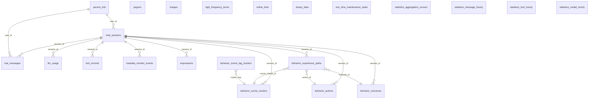

# Database

MaiBot uses **SQLite** as its local database, defining and managing 22 tables via **SQLModel** (on top of SQLAlchemy). The data file is located at `data/trymai.db` in the startup directory. This document is aimed at advanced users who need to operate, troubleshoot, archive data, or run analytics.

::: tip Data Import/Export
If you need to export statistics, messages, or other data to external analysis systems, see [Data Import/Export](/en/develop/statistics-io).
:::

## Connections and Sessions

MaiBot sets a group of SQLite PRAGMAs every time a database connection is created. The source code is at `src/common/database/database.py:36-47`.

**`journal_mode=WAL`** — Write-Ahead Logging mode. SQLite defaults to rollback journal; MaiBot switches to WAL. Under WAL, reads and writes are no longer mutually exclusive, meaning message writes and WebUI queries can run concurrently without "database locked" blocks. The tradeoff is extra `-wal` and `-shm` index files.

**`cache_size=-64000`** — Page cache set to 64 MB. Negative values mean the unit is KB, suitable for MaiBot's continuous operation with frequent small reads.

**`busy_timeout=1000`** — The connection waits at most 1 second before timing out when encountering a lock. This value is usually sufficient under WAL mode, but can be raised for high-concurrency write scenarios.

**`synchronous=NORMAL`** — Balanced mode. FULL would fsync twice after every transaction commit (costly for performance); NORMAL only fsyncs at critical points, still providing decent data consistency under unexpected power loss.

**`foreign_keys=ON`** — Explicitly enables foreign key constraints. SQLite does not enforce foreign key checks by default; this must be manually turned on for every connection.

If you need to use an external tool (like DB Browser for SQLite) to directly connect to the database file for operations, it's recommended to execute the same PRAGMAs:

::: code-group

```sql [SQL ~vscode-icons:file-type-sql~]
PRAGMA journal_mode=WAL;
PRAGMA foreign_keys=ON;
PRAGMA busy_timeout=5000;
```

:::

## Overview of the 22 Tables

MaiBot currently maintains 22 tables, organized around a central thread: **using `chat_sessions.session_id` as the session axis, connecting messages, model calls, tool calls, learning data, and other runtime entities**. Below is the ER diagram (showing only key foreign key relationships, not enumerating columns):



In the diagram above, `chat_sessions` sits at the center, with 9 tables linked to it via `session_id`. `person_info` bridges messages and sessions via `user_id`, providing a unified identity perspective. The remaining 11 relatively independent tables (`jargons`, `images`, `high_frequency_terms`, `online_time`, `binary_data`, `statistics_*`, `one_time_maintenance_tasks`, etc.) each serve specialized roles, detailed in the sections below.

## Chat ↔ Session: Session Management

MaiBot's "session" concept is carried in the `chat_sessions` table, corresponding to the Python model `ChatSession` (`src/common/database/database_model.py:503-527`).

**`session_id`** — unique session identifier, the linking primary key for the entire database. MaiBot generates a session_id each time a new chat context is established (new group chat, new private chat window). All subsequent messages, model inferences, and tool calls are bound to this ID.

**`user_id` / `group_id` / `platform`** — session metadata, identifying which user or group the session belongs to and which platform it comes from.

**`account_id` / `scope`** — multi-account routing fields. If multiple accounts are logged in on the same platform, they are distinguished by `account_id`; `scope` further subdivides different routing domains within the same account.

When a session has been inactive for a long time, `last_active_timestamp` will naturally drift from the current time. You can use this field for session cleanup or activity statistics, see [Common Operational Queries](#common-operational-queries).

## Five Categories of Learning Models

MaiBot's "learning" capability spans 5 categories of data models, stored across 9 tables.

### Expression Learning

The `expressions` table records the expression styles the bot should use in specific situations.

**`situation` / `style`** — situation and style tags. For example, "group member seeking help / comfort", "silence / liven things up".
**`content_list`** — JSON-format list of expression candidates (multiple alternative phrases).
**`session_id`** — when `NULL`, represents a global expression; when set, only effective within that session.

### Jargon Mining

The `jargons` table (`src/common/database/database_model.py:431-458`) records new words and inside jokes that emerge in groups.

**`content`** — the jargon text itself.
**`meaning`** — the AI-inferred meaning (e.g. "开黑 = team up for a game").
**`is_jargon`** — whether this is confirmed jargon. `False` means it's still uncertain.
**`is_complete`** — whether inference is complete (stops after `count > 100`).
**`session_id_dict`** — which sessions this jargon appears in and the frequency, in JSON dictionary format. See [JSON Column Conventions](#json-column-conventions).

### Behavior Experience Learning

This is the most complex set of learning models, containing 5 tables with source code spanning `database_model.py:321-428`.

**`behavior_experience_paths`** — core path table. Records a feedback-able behavior experience: in a certain scene, a certain action was taken, producing a certain outcome.
**`behavior_scene_clusters`** — scene clusters. Describes a type of scene using tag probability distributions (e.g. "group member seeking help with urgent tone").
**`behavior_scene_tag_clusters`** — tag cluster member index, quickly mapping synonymous tags to the same cluster.
**`behavior_actions`** — behavior action entities, reusing action text descriptions.
**`behavior_outcomes`** — behavior outcome entities, reusing outcome descriptions.

Association path: a `behavior_experience_paths` row points to the corresponding cluster, action, and outcome entities via `scene_cluster_id`, `action_id`, and `outcome_id`, forming a complete "scene → action → outcome" experience chain. The `evidence_list` field stores evidence message references supporting this experience as a JSON array.

### Person Profiles

The `person_info` table (`database_model.py:472-501`) builds long-term profiles of conversation participants.

**`person_id`** — a cross-platform / cross-user_id unified identity ID, the anchor for person profiles.
**`person_name`** — inferred real name or form of address.
**`memory_points`** — memory points in JSON format, storing AI-generated impression summaries about the person.

### High-Frequency Term Library

The `high_frequency_terms` table (`database_model.py:256-276`) counts high-frequency words and phrases per group chat dimension.

**`chat_id`** — group chat or private chat identifier.
**`rank`** — ranking within the group.
**`frequency`** — word frequency (occurrences / total words).

## Statistics and Telemetry

MaiBot has built its own hourly aggregation statistics system with 3 aggregation tables plus 1 cursor table:

**`statistics_message_hourly`** — message volume aggregated by hour, deduplicated by `(bucket_time, chat_id)`.
**`statistics_tool_hourly`** — tool call count aggregated by hour, deduplicated by `(bucket_time, tool_name)`.
**`statistics_model_hourly`** — model usage aggregated by hour, including token count, cost (yuan), and latency variance.
**`statistics_aggregation_cursors`** — incremental cursors, recording the maximum `id` last processed for each statistics source, ensuring no data loss when aggregating from scratch.

The `llm_usage` table is the source of raw records. Each record contains the complete metadata of a model request: prompt tokens, completion tokens, cost (yuan), whether prompt cache was hit, etc. If you have enabled model cache billing, the `prompt_cache_hit_tokens` and `prompt_cache_miss_tokens` columns can help you calculate cache savings.

## Person and Identity

`person_info` is not a simple user_id mapping. At runtime, MaiBot attempts to unify the same user's `user_id` across multiple platforms and groups under the same `person_id`, enabling cross-platform profiling.

The **`group_cardname`** field is a JSON column with the format `[{group_id: str, group_cardname: str}]`, storing the person's group card name in each group. This is also a typical JSON column; see the notes below.

**`first_known_time` / `last_known_time`** record the first and last interaction times respectively. Combined with `know_counts`, you can assess interaction frequency.

## Maisaka Monitor

The `maisaka_monitor_events` table (`database_model.py:148-165`) is the observation event ledger of the Maisaka inference engine. Every planning, reply generation, and tool call decision writes an event entry, classified by `event_type`, with `payload_json` holding the complete structured payload.

This table has 4 composite indexes: `(session_id, event_id)` for pulling events by session, `(event_type, event_id)` for filtering by type, `(timestamp)` and `(created_at)` for time-range queries respectively.

::: tip
The WebUI "Maisaka Monitor" panel directly consumes data from this table. If you find the panel loading slowly, check whether the row count of `maisaka_monitor_events` is too large, and clean up historical events by time range if necessary.
:::

## JSON Column Conventions

Multiple tables in MaiBot use `Text` columns to store JSON strings. These columns are serialized/deserialized by the application layer; the SQLite layer only stores them as plain text. Be sure to observe the following constraints:

- **Do not directly `UPDATE ... SET` JSON columns** — the application layer relies on specific JSON structures when reading and writing. Directly changing database values can easily cause structural mismatches, leading to runtime parsing exceptions. The following three columns are high-risk examples:

  **`person_info.group_cardname`** (`database_model.py:488-490`) — stored format is `[{"group_id": "...", "group_cardname": "..."}]`. Manual modification with a misspelled JSON key (e.g. one letter missing from `"group_cardname"`) will cause the group card name to be lost.

  **`jargons.session_id_dict`** (`database_model.py:444-446`) — format is `{"session_id_1": count, "session_id_2": count}`. Manually changing a count value from integer to string will break the jargon association logic.

  **`behavior_experience_paths.evidence_list`** (`database_model.py:350`) — evidence message reference array. Internally references fields like `message_id`; incorrect reference format from manual changes will break the WebUI experience tracing feature.

- **When reading JSON columns, always parse at the application layer** — do not use SQL string functions to manually assemble JSON; field order or internal structure may be upgraded by the application layer at any time.

- **To change JSON content, use MaiBot's functional pathways** — for example, to change a jargon meaning, go through the WebUI jargon panel rather than directly digging into the database.

## Migration System

MaiBot's schema version management uses SQLite's `PRAGMA user_version` as the version number store, combined with a self-built migration manager for ordered upgrades.

### Startup Flow

On every startup, `initialize_database()` (`src/common/database/database.py:122-154`) executes in the following order:

1. **Detect `user_version`** — reads the current database version number via `SchemaVersionResolver` (returns 0 for an empty database).
2. **Version validation** — if the database version is higher than the code's built-in `LATEST_SCHEMA_VERSION`, startup is immediately refused. This is the safety gate for forward-incompatible scenarios.
3. **Empty database direct creation** — if `user_version == 0` (empty database), skips migration and directly uses `SQLModel.metadata.create_all()` to create the latest structure, writing the target version number at the same time.
4. **Incremental migration** — if the version is behind, executes each registered migration step in order. After migration completes, runs `create_all()` as a safety net to ensure any newly added models have their tables created.
5. **Write target version** — writes `LATEST_SCHEMA_VERSION` to `PRAGMA user_version`.
6. **Runtime performance indexes** — calls `ensure_runtime_performance_indexes()` to backfill runtime indexes that don't affect schema version (such as the composite index on the `jargons` table).

### Version Upgrade Path

From v1 (the earliest legacy schema) to the current version, MaiBot has built-in 35 migration steps. The source code entry is at `src/common/database/migrations/builtin.py:46-82`. Each migration step is an independent Python module (e.g. `v22_to_v23.py`), responsible for table structure changes, data migration, or old table cleanup for one version interval.

Key milestones:
- **v1 → v2** — migrates from the legacy single-table model to the `chat_sessions` + `mai_messages` dual-table model, cleaning up old tables like `chat_streams`, `emoji`, `thinking_back`, etc.
- **v21 → v22** — completes the final cleanup of legacy remaining tables; after this point, backward compatibility with legacy structures is no longer supported.

::: danger
MaiBot has no "downgrade" path. Once the database is upgraded to a higher version, it **cannot** run on older code. If you need to roll back the MaiBot version, you must restore the database from a backup (provided the backup's version number matches the old code).
:::

### Performance Indexes

In addition to schema-defined indexes, MaiBot supplements 3 runtime performance indexes after startup (`database.py:76-92`): `ix_jargons_status_count_id`, `ix_jargons_global_count_id`, `ix_jargons_complete_count_id`, which respectively accelerate status, global, and completion determination queries on the `jargons` table. These indexes are created with `IF NOT EXISTS`; if the database is occupied by another process at startup, a creation failure will not prevent startup, and they will be backfilled on the next startup.

## Backup and VACUUM

### Backup

An SQLite database is a single file, and the simplest backup method is copying `data/trymai.db`. However, a direct `cp` carries risk (you might read an intermediate state of an uncommitted transaction). Safe approaches:

**Option 1: SQLite `.backup` command**

::: code-group

```sql [SQL ~vscode-icons:file-type-sql~]
sqlite3 data/trymai.db ".backup 'backup.db'"
```

:::

**Option 2: `VACUUM INTO` (SQLite 3.27+)**

::: code-group

```sql [SQL ~vscode-icons:file-type-sql~]
VACUUM INTO 'backup.db';
```

:::

Both methods maintain transactional consistency during backup. MaiBot enables WAL by default, so the database actually consists of three files: `trymai.db`, `trymai.db-wal`, `trymai.db-shm`. If you must manually `cp` for backup, you must copy all three files — not recommended.

### VACUUM

SQLite does not automatically reclaim space freed by deleted rows; the database file only grows, never shrinks. Running VACUUM periodically rebuilds the entire database file and reclaims disk space. For instances with heavy message volume, it's recommended to run VACUUM every 1-2 months.

**Be sure to shut down MaiBot before running**, as VACUUM locks the entire database:

::: code-group

```sql [SQL ~vscode-icons:file-type-sql~]
VACUUM;
```

:::

After execution, you can verify the effect by comparing page counts before and after with `PRAGMA page_count`. Note that VACUUM requires at least as much additional disk space as the original database size for temporary files; insufficient space will cause failure, but the original database is unaffected.

## Common Operational Queries

The following 5 core examples cover the most common data query scenarios in daily operations. All SQL is recommended to be run with the `sqlite3` command line after MaiBot is shut down.

### Active Sessions in the Last 24 Hours

::: code-group

```sql [SQL ~vscode-icons:file-type-sql~]
SELECT session_id, user_nickname, group_name, platform, last_active_timestamp
FROM chat_sessions
WHERE last_active_timestamp > datetime('now', '-1 day')
ORDER BY last_active_timestamp DESC LIMIT 20;
```

:::

### Model Cost Statistics (Grouped by Model)

::: code-group

```sql [SQL ~vscode-icons:file-type-sql~]
SELECT
    model_name, provider_name,
    COUNT(*) AS requests,
    SUM(total_tokens) AS tokens,
    ROUND(SUM(cost), 4) AS cost_yuan,
    ROUND(AVG(time_cost), 2) AS avg_sec
FROM llm_usage
WHERE timestamp > datetime('now', '-7 days')
GROUP BY model_name, provider_name
ORDER BY cost_yuan DESC;
```

:::

### Inspecting Latest Message Content

::: code-group

```sql [SQL ~vscode-icons:file-type-sql~]
SELECT timestamp, platform, user_nickname, processed_plain_text, session_id
FROM mai_messages
ORDER BY id DESC LIMIT 30;
```

:::

::: details About the raw_content Column
The `raw_content` column stores msgpack-encoded raw message binary, which cannot be read directly via SQL. `processed_plain_text` is the flattened processed plain text, suitable for manual inspection.
:::

### Viewing Learned Jargon

::: code-group

```sql [SQL ~vscode-icons:file-type-sql~]
SELECT content, meaning, count, is_global, created_by, created_timestamp
FROM jargons
WHERE is_jargon = 1
ORDER BY count DESC LIMIT 20;
```

:::

### Viewing Known People

::: code-group

```sql [SQL ~vscode-icons:file-type-sql~]
SELECT person_id, person_name, user_nickname, platform,
       know_counts, first_known_time, last_known_time
FROM person_info
WHERE is_known = 1
ORDER BY know_counts DESC LIMIT 20;
```

:::

### Other Useful Queries

**Check the current database version number:**

::: code-group

```sql [SQL ~vscode-icons:file-type-sql~]
PRAGMA user_version;
```

:::

**Estimate database file size:**

::: code-group

```sql [SQL ~vscode-icons:file-type-sql~]
SELECT page_count * page_size AS file_bytes FROM pragma_page_count, pragma_page_size;
```

:::

**List all table names:**

::: code-group

```sql [SQL ~vscode-icons:file-type-sql~]
SELECT name FROM sqlite_master WHERE type='table' ORDER BY name;
```

:::

For row count statistics, it's recommended to use `.tables` in the `sqlite3` command line followed by individual `SELECT COUNT(*)` queries, rather than a single SQL doing a full-table scan aggregation.

**Clean up old Maisaka Monitor events (use with caution):**

::: code-group

```sql [SQL ~vscode-icons:file-type-sql~]
DELETE FROM maisaka_monitor_events
WHERE created_at < datetime('now', '-7 days');
```

:::

::: warning
Directly `DELETE`ing from a large table may trigger a long transaction. It's recommended to batch by day to control transaction size.
:::
