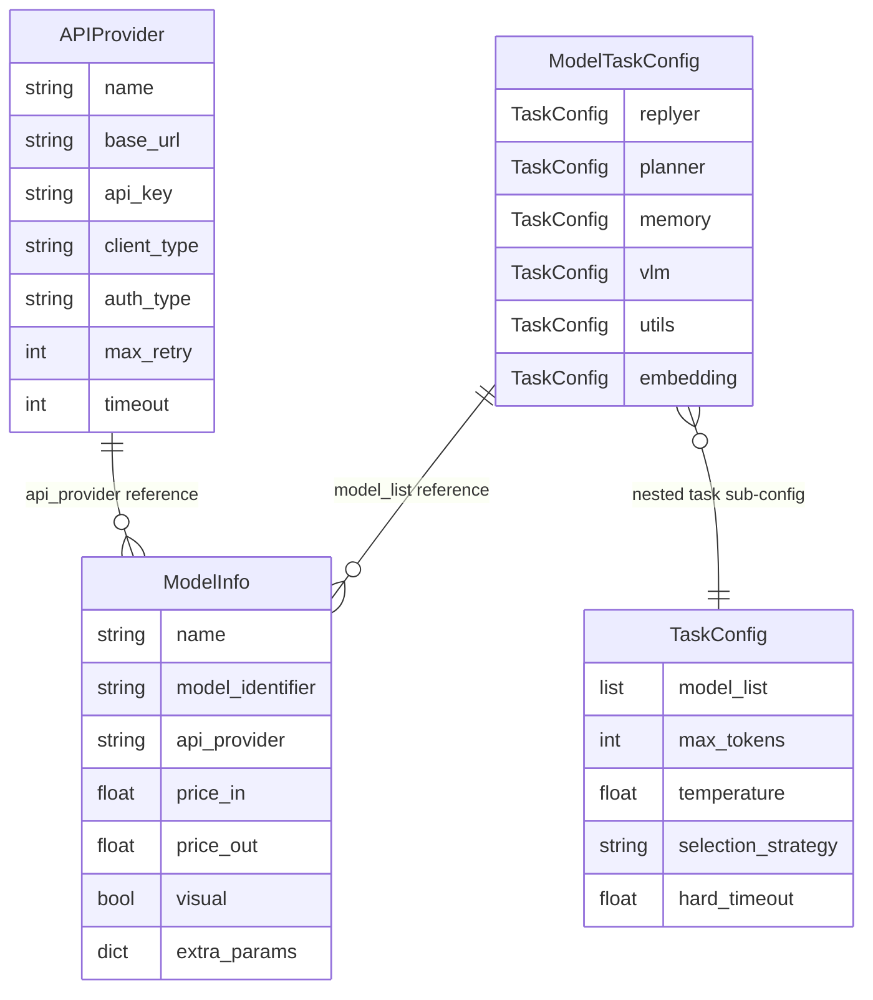
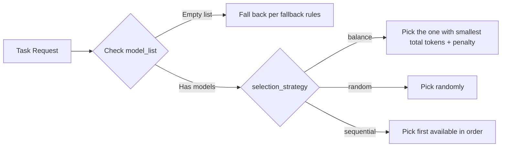

# LLM Model Integration

MaiBot manages LLM access through a configuration-driven approach. Three core concepts form the complete data-plane chain: **APIProvider** (where to connect), **ModelInfo** (which model to use), and **ModelTaskConfig** (what job to do).



**APIProvider** describes "how to connect to an API endpoint": address, authentication, timeout, retry. **ModelInfo** describes "a specific model": identifier, billing, capability flags, `extra_params`. **ModelTaskConfig** distributes models by task role: replyer, planner, vlm, embedding, etc. Each task carries one `TaskConfig`, and `TaskConfig.model_list` is populated with `ModelInfo.name` values.

## Built-in client overview

MaiBot ships with two `client_type` values, auto-registered by `ClientRegistry` at startup:

- **`openai`** (`OpenaiClient`): Adapts all OpenAI-compatible APIs. Uses the `AsyncOpenAI` SDK for calls, supporting streaming/non-streaming, tool calls, and reasoning content parsing. The vast majority of third-party API gateways, proxies, and relays go through this path.
- **`gemini`** (`GeminiClient`): Adapts the native Google Gemini SDK. Uses the `google-genai` library for calls, supporting thinking budget clamping, voice transcription, and embeddings.

Both clients follow the `BaseClient` → `AdapterClient` inheritance hierarchy. The framework obtains client instances uniformly through `ClientRegistry.get_client_class_instance(api_provider)`, so callers are unaware of the underlying SDK.

## Registering an API Provider

To connect a new API endpoint, declare a Provider in `model_config.toml` under `[api_providers]`, then associate models with it in `[[models]]`.

::: code-group

```toml [TOML ~vscode-icons:file-type-toml~]
[api_providers.deepseek]
name = "deepseek"
base_url = "https://api.deepseek.com"
api_key = "sk-..."
client_type = "openai"

[api_providers.gemini-2.5]
name = "gemini-2.5"
base_url = "https://generativelanguage.googleapis.com"
api_key = "AIza..."
client_type = "gemini"

[[models]]
name = "ds-v4-flash"
model_identifier = "deepseek-v4-flash"
api_provider = "deepseek"
visual = false
extra_params = {thinking = {type = "enabled"}}

[[models]]
name = "gemini-2.5-pro"
model_identifier = "gemini-2.5-pro"
api_provider = "gemini-2.5"
visual = true
```

:::

**Key APIProvider fields:**

- **`name`** — Provider name, referenced by ModelInfo's `api_provider` field. Must not be empty.
- **`base_url`** — API endpoint address. Required when `client_type = "openai"`; optional for `gemini`.
- **`api_key`** — API key. Can be empty when `auth_type = "none"`.
- **`client_type`** — Client type, either `"openai"` or `"gemini"`. Custom types registered by plugins are also referenced here.
- **`auth_type`** — Authentication method for OpenAI-compatible endpoints. Options: `bearer` (default, `Authorization: Bearer <key>`), `header` (custom header name + prefix), `query` (URL query parameter), `none` (no auth).
- **`auth_header_name`** — Request header name when `auth_type = "header"`. Defaults to `Authorization`.
- **`auth_header_prefix`** — Prefix when `auth_type = "header"`. Defaults to `Bearer`. Leave empty to send the raw key directly.
- **`auth_query_name`** — Parameter name when `auth_type = "query"`. Defaults to `api_key`.
- **`default_headers`** — Dictionary of HTTP headers attached to all requests by default.
- **`default_query`** — Dictionary of URL query parameters attached to all requests by default.
- **`organization`** — Optional `organization` identifier for the official OpenAI API.
- **`project`** — Optional `project` identifier for the official OpenAI API.
- **`max_retry`** — Maximum retry count after a single model call fails. Defaults to 3.
- **`retry_interval`** — Wait seconds between retries. Defaults to 5.
- **`timeout`** — Timeout in seconds for a single API call. Defaults to 60.
- **`reasoning_parse_mode`** — Reasoning content parsing mode. See below.
- **`tool_argument_parse_mode`** — Tool argument parsing mode. See below.

## ModelTaskConfig task distribution

Under `[model_config]`, 10+ `TaskConfig` sub-configurations are split out by task role. Each `TaskConfig` holds a model list and a selection strategy:



**`selection_strategy` values:**

- **`balance`** — Load balancing (default). Each request picks the model with the smallest `total_tokens + penalty×300 + usage_penalty×1000`, steering requests toward the least-used instance.
- **`random`** — Random selection, ignoring historical usage.
- **`sequential`** — Picks the first available model in `model_list` config order. Falls to the second only if the first recently failed. Suitable for "primary + backup" setups.

**Key `TaskConfig` fields:**

- **`model_list`** — List of model names to use, each corresponding to `ModelInfo.name`.
- **`max_tokens`** — Maximum output tokens for this task. Can be overridden by `ModelInfo.max_tokens`.
- **`temperature`** — Sampling temperature. Can be overridden by `ModelInfo.temperature`.
- **`hard_timeout`** — Hard task timeout in seconds. If the request hasn't returned by then, cancel and switch to the next model. Defaults to 240.
- **`slow_threshold`** — Timeout warning threshold in seconds. Defaults to 15.

**Task role overview:**

- **`replyer`** — Reply model, determines MaiBot's conversational performance.
- **`planner`** — Planning model, drives tool calls and action decisions.
- **`memory`** — Memory model, responsible for long-term memory summarization and extraction.
- **`mid_memory`** — Chat recall model. Falls back to planner if empty.
- **`utils`** — Small-task model (summarization, organization, etc.). A fast, small model is recommended.
- **`learner`** — Learning model, used for expression and jargon learning. Falls back to utils if empty.
- **`expression_use`** — Expression usage model. Falls back to utils if empty.
- **`emoji`** — Emoji sending decision model.
- **`vlm`** — Vision model. Must support image recognition.
- **`voice`** — Voice recognition model.
- **`embedding`** — Text embedding model.

Some roles have empty-config fallback chains: `expression_use` → `utils`, `learner` → `utils`, `mid_memory` → `planner`. Leaving them empty does not cause errors; the framework inherits automatically.

## extra_params passthrough mechanism

`ModelInfo.extra_params` is not sent wholesale to the model provider. Before the actual request, the client performs different splits depending on `client_type`.

### OpenAI-compatible endpoints

For providers with `client_type = "openai"`, `split_openai_request_overrides()` splits `extra_params` into three layers:

- **`headers`** — Extracted as request headers; values forced to strings.
- **`query`** — Extracted as URL query parameters.
- **`body`** — Extracted and merged into the request body `extra_body`.
- **Other plain keys** — Also merged into `extra_body` (keys the SDK doesn't natively recognize are passed through as-is).

`temperature` / `max_tokens` in `model_config.toml`, if placed in `extra_params`, will also take effect, but using `ModelInfo`'s standalone fields of the same name is preferred. Standalone fields are carried as native SDK parameters and do not enter `extra_body`.

::: code-group

```toml [TOML ~vscode-icons:file-type-toml~]
# Custom request header + request body extra_body
[[models]]
name = "custom-proxy"
model_identifier = "qwen-plus"
api_provider = "aliyun"
extra_params = {
  headers = {"X-Custom-Header" = "my-value"},
  body = {enable_search = true},
  top_k = 50,
}
```

:::

When the above config is sent to Alibaba Cloud DashScope, the actual request carries the `X-Custom-Header: my-value` header, and the request body contains `enable_search: true` and `top_k: 50`.

### Gemini endpoints

For providers with `client_type = "gemini"`, the above three-layer split is not applied. The Gemini client filters via `_filter_generate_content_extra_params()`:

1. Iterate all keys of `extra_params`.
2. Skip reserved keys in `GENERATE_CONFIG_RESERVED_EXTRA_PARAMS` (e.g., `temperature`, `max_tokens`, which are carried as native SDK parameters).
3. Keep only fields present in `GenerateContentConfig.model_fields`.
4. Pass qualifying fields directly to `GenerateContentConfig(**filtered_params)`.

Common `extra_params` keys for Gemini:

- **`thinking_budget`** — Thinking budget (token count). Gemini client has a built-in `THINKING_BUDGET_LIMITS` mapping table, clamping to the allowed range based on the model ID. Set to `-1` for auto mode, `-2` to disable (only takes effect when the model supports disabling). `clamp_thinking_budget()` validates before the request; illegal values are logged with a warning and fall back.
- **`task_type`** — Embedding task type (`embedding` requests only). Defaults to `SEMANTIC_SIMILARITY`.

::: code-group

```toml [TOML ~vscode-icons:file-type-toml~]
[[models]]
name = "gemini-2.5-flash-thinking"
model_identifier = "gemini-2.5-flash"
api_provider = "gemini-2.5"
visual = false
extra_params = {thinking_budget = 8192}
```

:::

## reasoning_parse_mode and tool_argument_parse_mode

**`reasoning_parse_mode`** controls how model thinking processes are extracted. Some models (DeepSeek-R1, Gemini thinking series) carry deep reasoning in their responses that must be split according to conventions. Options:

- **`auto`** (default) — Auto-detect. Tries `native` first, falls back to `think_tag`.
- **`native`** — Native mode. Reads directly from the `reasoning_content` field of the SDK response object.
- **`think_tag`** — Tag mode. Uses regex to extract content from ` 响应`  ` 标签对 within the response text. Content inside ` 响应` is assigned to `reasoning_content`, the rest to `content`. If tags are unclosed, everything is treated as reasoning content.
- **`none`** — No parsing. The entire response is treated as `content`.

**`tool_argument_parse_mode`** controls the parsing strategy for tool call argument JSON. Some models (especially those using XML fallback extraction for tool calls) may output non-standard JSON. Options:

- **`auto`** (default) — Auto-repair. Tries `json-repair` library repair first; if the result is still a string, attempts a second decode.
- **`strict`** — Strict mode. Uses `json.loads()` directly; parsing failure raises an error.
- **`repair`** — Repair without second decode. Repairs with `json-repair`; if the result is a dict, returns it directly without a second parse.
- **`double_decode`** — Same as `auto`; always attempts a second decode.

## Multi-Provider config reuse

The same model can register multiple ModelInfo entries sharing a single Provider, differentiating behavior via `extra_params`. Typical scenario: one DeepSeek Provider registering both a thinking and non-thinking model; one Anthropic Provider registering different model versions.

::: code-group

```toml [TOML ~vscode-icons:file-type-toml~]
[api_providers.deepseek]
name = "deepseek"
base_url = "https://api.deepseek.com"
api_key = "sk-..."
client_type = "openai"

[api_providers.anthropic]
name = "anthropic"
base_url = "https://api.anthropic.com"
api_key = "sk-ant-..."
client_type = "openai"
auth_header_prefix = ""
auth_header_name = "x-api-key"

[[models]]
name = "deepseek-think"
model_identifier = "deepseek-v4-flash"
api_provider = "deepseek"
extra_params = {thinking = {type = "enabled"}}

[[models]]
name = "deepseek-nothink"
model_identifier = "deepseek-v4-flash"
api_provider = "deepseek"
extra_params = {thinking = {type = "disabled"}}

[[models]]
name = "claude-sonnet-4"
model_identifier = "claude-sonnet-4-20250514"
api_provider = "anthropic"
extra_params = {max_tokens = 8192}
```

:::

Anthropic API authentication differs from standard OpenAI: it sends the API key directly via the `x-api-key` header, without a `Bearer` prefix. Therefore set `auth_type = "header"`, `auth_header_name = "x-api-key"`, and `auth_header_prefix = ""`.

## Plugin-injected custom Providers

Plugins can register their own `client_type` (see [LLMProvider Component](/en/plugin/llmprovider)), standing alongside the built-in `openai` / `gemini`. After registration, just point `api_providers[].client_type` in `model_config.toml` to the plugin-declared value.

Registration lifecycle: Plugin Manifest declares `llm_providers` list → Runner collects factory functions via `@LLMProvider` decorator at startup → Runner reports `ClientProviderRegistration` via IPC → Host calls `ClientRegistry.register_provider()` to write into the global registry → `ClientRegistry.validate_plugin_provider_replacement()` checks for conflicts (the same `client_type` must not be declared by multiple plugins).

When a plugin `client_type` is deregistered (plugin unload or reload), `ClientRegistry.unregister_plugin_providers()` cleans up all of that plugin's Providers and refreshes the client instance cache.

## Failed request snapshots and retry

When a single API call fails, MaiBot handles it as follows:

**Retry mechanism**: `LLMUtils._attempt_request_on_model()` performs retries at the individual model level. Retry count is controlled by `APIProvider.max_retry` (default 3), with an interval of `APIProvider.retry_interval` seconds (default 5). Retriable error types:

- **`EmptyResponseException`** — Model returned an empty reply, a transient issue. Logged as a warning, then retried.
- **`NetworkConnectionError`** — Network error (connection timeout, DNS failure, proxy issues, etc.), common on unstable networks.
- **`RespNotOkException` (5xx / 429)** — Server error or rate limiting. Whether retriable is determined by the status code.

Non-retriable errors (e.g., 4xx client errors, configuration errors) immediately raise `ModelAttemptFailed` without retry.

**Failure snapshots**: When retries are exhausted and the call still fails, `save_failed_request_snapshot()` serializes the full request context (Provider config, model info, request body, error details) into a JSON snapshot file, saved under the `logs/llm_request/` directory. File name format: `timestamp_clientType_requestType_modelName.json`. Each snapshot includes a `replay` field, providing the `python scripts/replay_llm_request.py <snapshot_path>` command for offline replay debugging.

Snapshot count is capped by `DEFAULT_LLM_REQUEST_SNAPSHOT_LIMIT` (default 128); exceeding this triggers automatic cleanup of the oldest files.

**Model-level failover**: After all retries for the current model are exhausted, `_select_and_execute()` marks that model as failed and selects the next available model per `selection_strategy`. When all models in `model_list` have failed, the task ultimately errors out.
