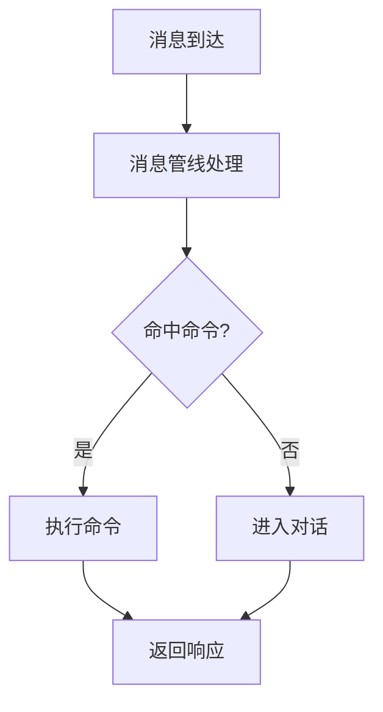

# Markdown Features

Writer's note: This page documents **non-native VitePress** plugin features used on this site. These features require writers to use specific syntax in Markdown to trigger them. For VitePress-native features such as custom containers (`::: tip` / `::: warning`, etc.), code block line highlighting, and code snippet imports, please refer to the [VitePress official documentation](https://vitepress.dev/guide/markdown).

This page follows the [documentation writing conventions](/develop/contributing): **content pages must not use Markdown tables**. Use lists or definition-style descriptions instead.

## Mermaid Diagrams

Use ` ```mermaid ` fenced code blocks to insert flowcharts, sequence diagrams, class diagrams, and more. This site supports them via the `vitepress-plugin-mermaid` plugin. Also supports ` ```mmd ` (no rendering, source-only display, for teaching examples).

Supported diagram types: flowchart, sequenceDiagram, classDiagram, stateDiagram, erDiagram, gantt, pie, gitGraph, and others.

**Usage example:**

````markdown

````

**Rendered effect:**


> This plugin is actually used in 20+ files such as `zh/develop/architecture/message-pipeline.md`.

## Update Timeline

Use `::: timeline <date>` ... `:::` containers to create timeline layouts. This site supports them via the `vitepress-markdown-timeline` plugin. Date format: `YYYY-MM-DD`. Content inside uses Markdown bullet lists.

**Usage example:**

```
::: timeline 2026-07-09
- [1.0.12] 优化 Planner 到 Replyer 的信息传递
- WebUI：增强麦麦观察离线记录，支持自定义 API 模型列表
- 首次配置会引导用户把启动时临时 Token 更换为固定 Token
:::
```

**Rendered effect:** [See timeline rendering →](/en/changelog/)

> This plugin is actually used in `zh/changelog/index.md`.

## Code Group Icons

This site uses the `vitepress-plugin-group-icons` plugin to automatically display icons on `::: code-group` tab labels. Writers have **three** ways to trigger icons.

### 1. Built-in Keyword Auto-Match

When the label text contains specific keywords, the corresponding icon appears automatically. Common keywords include:

- **Package managers** — pnpm, npm, yarn, bun, deno
- **Frameworks** — vue, react, svelte, angular, next, nuxt, astro, solid
- **Tools** — vite, rollup, webpack, esbuild, eslint, tailwind
- **Others** — tsconfig, gitignore, .env, prisma, gradle
- **File extensions** — when the label text contains a filename (e.g. `vite.config.ts`, `package.json`, `main.py`), the extension is auto-matched: .ts, .js, .py, .json, .yml, .toml, .rs, .go, .html, .css, .scss, .lua, .swift, and dozens more

> See the [vitepress-plugin-group-icons official documentation](https://vp.yuy1n.io/features.html) for the full list of built-in labels.

### 2. Repository Custom Keywords

The following keywords have also been configured for auto-matching (defined in the `customIcon` of `.vitepress/config.mts`). Whenever a label contains these keywords, the corresponding icon appears automatically:

- **`git`** — vscode-icons:file-type-git icon
- **`uv`** — vscode-icons:file-type-python icon
- **`pip`** — vscode-icons:file-type-python icon

### 3. Inline Named Icons in Labels

Embed `~iconify-id~` syntax inside code-group labels to explicitly specify icons. Format: `[label text ~iconify-icon-name~]`. Icon names come from [Iconify](https://icon-sets.iconify.design/) (e.g. `vscode-icons:file-type-git`, `logos:docker-icon`).

**Combined usage example:**

````markdown
::: code-group

```bash [稳定版（推荐）~vscode-icons:file-type-git~]
git clone https://github.com/MaiM-with-u/MaiBot.git
cd MaiBot
```

```bash [开发版（尝鲜）~vscode-icons:file-type-git~]
git clone -b dev https://github.com/MaiM-with-u/MaiBot.git
cd MaiBot
```

```bash [pip 安装依赖]
# 标签含 "pip" 自动出现 Python 图标（本仓库自定义关键词）
pip install -r requirements.txt
```

```bash [uv 安装依赖]
# 标签含 "uv" 自动出现 Python 图标（本仓库自定义关键词）
uv sync
```

:::
````

**Rendered effect:**

::: code-group

```bash [stable ~vscode-icons:file-type-git~]
git clone https://github.com/MaiM-with-u/MaiBot.git
```

```bash [uv install]
uv sync
```

```bash [pip install]
pip install -r requirements.txt
```

:::

> In this repository, `zh/manual/deployment/installation.md` uses the `~vscode-icons:file-type-git~` inline icon; other files rely on keyword auto-matching via `pnpm`/`npm`/`yarn`/`pip`/`uv`.

## Optional Vue Components

The following two Vue components are registered in the theme and can be used directly in Markdown as HTML tags. Component source code is in the `.vitepress/theme/components/` directory, registered via `app.component()` in `.vitepress/theme/index.ts`.

> No MD files currently use these components; enable as needed.

### xgplayer Video Player

- **`url`** (required) — Video URL
- **`poster`** (optional, default `''`) — Cover image URL
- **`width`** (optional, default `'100%'`) — Player width
- **`height`** (optional, default `'auto'`) — Player height

```html
<xgplayer url="https://litev4.github.io/rickroll/rickroll.mp4" width="100%" height="auto" />
```

**Rendered effect:**

<xgplayer url="https://litev4.github.io/rickroll/rickroll.mp4" width="100%" height="auto" />

### Bilibili iframe Embedding

In addition to the xgplayer component, you can also embed videos from third-party platforms like Bilibili using `<iframe>`:

```html
<iframe 
style="width:100%; aspect-ratio:16/9; margin-top: 2em;" 
src="//player.bilibili.com/player.html?bvid=BV1amAneGE3P" 
frameborder="0" 
allow="accelerometer; autoplay; clipboard-write; encrypted-media; gyroscope; picture-in-picture; web-share" 
allowfullscreen>
</iframe>
```

**Rendered effect:**

<iframe 
style="width:100%; aspect-ratio:16/9; margin-top: 2em;" 
src="//player.bilibili.com/player.html?bvid=BV1amAneGE3P" 
frameborder="0" 
allow="accelerometer; autoplay; clipboard-write; encrypted-media; gyroscope; picture-in-picture; web-share" 
allowfullscreen>
</iframe>

### Linkcard Link Card

- **`url`** (required) — Link URL
- **`title`** (required) — Card title
- **`description`** (required) — Card description
- **`logo`** (optional, default `''`) — Left-side logo image URL

```html
<Linkcard url="https://github.com/MaiM-with-u/MaiBot" title="MaiBot" description="一个智能 QQ 群聊天机器人" logo="/avatars/mai.png" />
```

**Rendered effect:**

<Linkcard url="https://github.com/MaiM-with-u/MaiBot" title="MaiBot" description="一个智能 QQ 群聊天机器人" />

