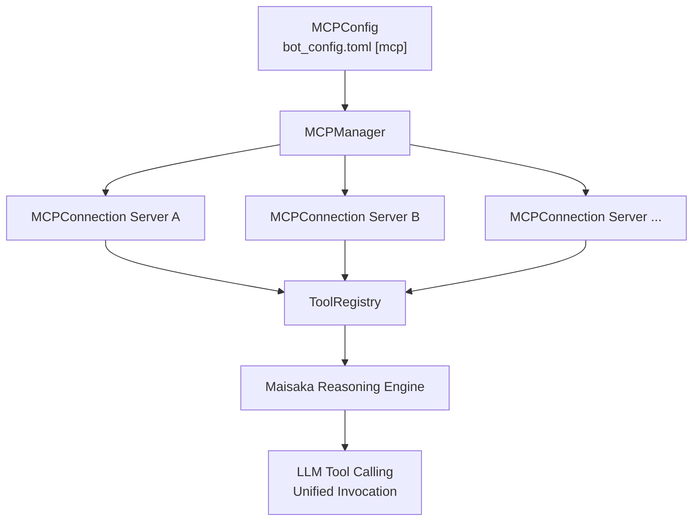

# MCP Integration and External Tool Access

MaiBot has built-in [Model Context Protocol](https://modelcontextprotocol.io) (MCP) client support. It can unify the Tools, Prompts, and Resources exposed by external MCP Servers into the Maisaka reasoning engine, letting the LLM invoke these capabilities directly during conversations.

This page is aimed at deployers, operators, and power users. It covers how MCP works inside MaiBot, trade-offs between the three transports, configuration syntax, naming conflict handling, and debugging techniques. For basic field definitions, see the [MCP Configuration user guide](/en/manual/configuration/mcp-config).

## MCP's role in MaiBot

MaiBot acts as an **MCP Host (client)**. At startup it pulls the `[mcp]` section config, creating an independent `MCPConnection` for each `servers` entry. Each connection handles JSON-RPC handshake, capability negotiation, and tool/prompt/resource discovery with the external MCP Server, then registers them into `ToolRegistry`.

Once registered, MCP tools are fully equal to plugin tools and built-in tools. The Maisaka reasoning engine invokes them through the unified `ToolProvider` and has no awareness of whether the underlying source is MCP.



At startup `MCPManager.from_app_config()` connects to each server sequentially. On success it immediately fetches and registers the four lists: tools, prompts, resources, and resource_templates. Any single connection failure will not prevent MaiBot from continuing to run — only that server's tools will be unavailable.

## MCPConfig field deep dive

The `[mcp]` section lives in `bot_config.toml` and maps to the `MCPConfig` model (for ownership, see [Configuration System](/en/develop/configuration)).

### Top-level switch

**`enable`** — Whether to enable MCP. Defaults to `true`. When disabled the entire section is ignored.

### client — Client identity

**`client_name`** — Defaults to `"MaiBot"`. **`client_version`** — Defaults to `"1.0.0"`.

### client.roots — File root directory exposure

**`enable`** — Defaults to `false`. **`items`** — A list; each entry contains `enabled`, `uri` (format `file:///path`), and `name`.

### client.sampling — Server reverse model requests

Allows MCP Servers to request MaiBot to call an LLM in reverse.

**`enable`** — Defaults to `false`.
**`task_name`** — Model routing task name. Defaults to `"planner"`. See [Model Configuration](/en/manual/configuration/model-config) for `model_task_config`.
**`include_context_support`** — Whether to allow carrying context messages. Defaults to `false`.
**`tool_support`** — Whether to allow nested tool calls. Defaults to `false`. Token consumption may spike dramatically if enabled.

### client.elicitation — Server requests for user input

Controls whether MCP Servers can ask the user for information.

**`enable`** — Defaults to `false`.
**`allow_form`** — Allow requesting forms. Defaults to `true`.
**`allow_url`** — Allow requesting URLs to open. Defaults to `false`.

### servers — Server list (core section)

A TOML array; each entry defines one MCP Server:

**`name`** (required) — Unique identifier. Duplicates are not allowed.
**`enabled`** — Defaults to `true`.
**`transport`** — `"stdio"` / `"streamable_http"` / `"sse"`. Defaults to `"stdio"`.
**`command`** — stdio launch command. **`args`** — Command argument list. **`env`** — Child process environment variables.
**`url`** — HTTP/SSE remote address. **`headers`** — Request headers (commonly used for Bearer Tokens).
**`http_timeout_seconds`** — HTTP timeout. Defaults to `30.0`.
**`read_timeout_seconds`** — Read timeout. Defaults to `300.0`.
**`authorization`** — Auth configuration, contains a `type` field.

## Three transports trade-offs

### stdio — Local child process

Communicates with the child process via standard input/output. MaiBot launches the server process, exchanging JSON-RPC over pipes.

**Suitable for**: The server is a local executable that needs strong isolation. **Pros**: Zero network overhead, lowest latency, no auth configuration needed. **Cons**: Child process consumes resources; restart of MaiBot is required after a crash.

### streamable_http — Remote HTTP service

Communicates via HTTP POST, supporting streaming responses.

**Suitable for**: The server is deployed in an independent container or cloud function, shared across multiple instances. **Pros**: Client and server are fully decoupled, load balancing is supported. **Cons**: Network latency; auth and TLS must be managed.

### sse — Server-Sent Events

Receives push notifications over an HTTP SSE long connection, sends requests via POST.

**Suitable for**: Servers that need to actively push notifications. **Cons**: Heavier implementation; some gateways have incomplete SSE support. **`sse` is planned for gradual deprecation. New integrations should prefer `streamable_http`.**

### Three transport config examples

#### stdio (local filesystem server)

::: code-group

```toml [TOML ~vscode-icons:file-type-toml~]
[mcp]
enable = true

[[mcp.servers]]
name = "filesystem"
enabled = true
transport = "stdio"
command = "npx"
args = ["-y", "@modelcontextprotocol/server-filesystem", "/home/user/data"]
```

:::

#### streamable_http (remote HTTP server)

::: code-group

```toml [TOML ~vscode-icons:file-type-toml~]
[[mcp.servers]]
name = "remote-tools"
enabled = true
transport = "streamable_http"
url = "https://mcp.example.com/api"
headers = { Authorization = "Bearer sk-xxxx" }
http_timeout_seconds = 60.0
read_timeout_seconds = 600.0
```

:::

#### sse

::: code-group

```toml [TOML ~vscode-icons:file-type-toml~]
[[mcp.servers]]
name = "sse-server"
enabled = true
transport = "sse"
url = "https://sse.example.com/events"
headers = { Authorization = "Bearer sk-xxxx" }
http_timeout_seconds = 60.0
```

:::

## Connecting an MCP Server

### Example 1: stdio filesystem

Using the official [filesystem Server](https://github.com/modelcontextprotocol/servers) as an example. Prerequisites: Node.js and npx must be available.

Append to `bot_config.toml`:

::: code-group

```toml [TOML ~vscode-icons:file-type-toml~]
[[mcp.servers]]
name = "filesystem"
enabled = true
transport = "stdio"
command = "npx"
args = ["-y", "@modelcontextprotocol/server-filesystem", "/home/user/shared"]
```

:::

The last argument in `args` is the authorized directory. Restrict it to a dedicated data directory — do not give `/` or `~`. Restart MaiBot. The console should show:

```
✓ MCP server 'filesystem' connected (tools 8 / prompts 0 / resources 0 / templates 0)
```

Open the WebUI tools list page and search for `read_file` or `write_file` to verify. Have the LLM try "read /home/user/shared/readme.txt for me" in a conversation to confirm end-to-end availability.

### Example 2: Remote streamable_http

Suppose a Python MCP Server is listening at `https://tools.yourdomain.com/mcp` with Bearer Token auth.

First confirm reachability from the terminal:

::: code-group

```bash [Bash ~vscode-icons:file-type-shell~]
curl -H "Authorization: Bearer sk-xxxx" https://tools.yourdomain.com/mcp
```

:::

Then append to `bot_config.toml`:

::: code-group

```toml [TOML ~vscode-icons:file-type-toml~]
[[mcp.servers]]
name = "my-remote-tools"
enabled = true
transport = "streamable_http"
url = "https://tools.yourdomain.com/mcp"
headers = { Authorization = "Bearer sk-xxxx" }
http_timeout_seconds = 45.0
read_timeout_seconds = 300.0
```

:::

Bump `http_timeout_seconds` to 45 seconds to accommodate remote handshake latency. After restart, watch the console logs. Common causes of connection failure:

**TLS certificate issues** — Confirm the environment can correctly verify the server's HTTPS certificate.
**Authorization format** — Some servers are case-sensitive about `Bearer`; consult the server's docs.
**Network unreachable** — Check whether the domain resolves and a TCP connection can be established.
**http_timeout too short** — If the handshake is slow, keep increasing it.

## Host Callbacks: Sampling / Logging / Elicitation

MaiBot injects three types of optional callbacks into each connection via `MCPHostCallbacks`, controlled by the `[mcp.client]` section.

### Sampling — Server requests LLM generation

When `[mcp.client.sampling].enable = true`, the server can request MaiBot to call an LLM. Parameters are specified by the server; MaiBot routes to the corresponding model by `task_name`. `include_context_support`, when enabled, allows carrying context messages; `tool_support`, when enabled, allows nested tool calls (high token consumption — generally keep disabled).

### Logging — Server push logs

Servers can push logs to MaiBot via `logging/setLevel` and `notifications/message`. These logs go through the unified pipeline (file JSONL + console + WebUI); no extra switch is needed.

### Elicitation — Server requests user interaction

When `enable = true`, servers can request information from the user. `allow_form` (default true) allows forms; `allow_url` (default false) controls opening links. Evaluate server trustworthiness before enabling.

## stdio_filter: handling "misbehaving" servers

The MCP stdio spec mandates stdout carry only JSON-RPC; logs should go to stderr. Some third-party servers print startup banners, version info, etc. directly to stdout, polluting the protocol stream.

MaiBot has a built-in `tolerant_stdio_client` (`src/mcp_module/stdio_filter.py`) to handle this:

1. Lines not starting with `{` or `[` are discarded and logged as a warning.
2. Lines that fail JSON-RPC parsing are also discarded.
3. Process lifecycle management is fully consistent with the official `stdio_client`.

Seeing `WARNING - Dropped non-JSON line from MCP stdio server` in the console means it's working; functionality is unaffected.

## Naming conflict behavior

MaiBot performs two levels of checks when registering MCP tools.

### Level 1: Built-in reserved names

The following 6 tool names are reserved by the kernel. No MCP Server may use them; conflicts are skipped with a warning:

**`reply`** — Reply to message
**`no_action`** — No-op
**`stop`** — Stop execution
**`create_table`** — Create data table
**`list_tables`** — List data tables
**`view_table`** — View data table

Conflict log example: `⚠️ MCP tool 'reply' (from my-server) conflicts with built-in tool, skipped`

### Level 2: Cross-server name collision

When the same tool name appears from two servers, the first registered wins; the later one is skipped. The order follows the `servers` list ordering. Prompt and Resource collisions behave the same way.

## Debugging tips

### Confirm tools are registered

Open the WebUI tools list page to confirm whether the server connected successfully, whether tool names are correct, and whether the registration count matches the server's declared count.

### Check connection logs

Watch the console at startup. Successfully connected servers print:

```
✓ MCP server 'filesystem' connected (tools 8 / prompts 0 / resources 0 / templates 0)
```

All-failure prints:

```
⚠️ All MCP servers failed to connect
```

### mcp SDK not installed

If you see `⚠️ MCP config found but mcp SDK is not installed`, run:

::: code-group

```bash [Bash ~vscode-icons:file-type-shell~]
uv add mcp
```

```bash [Bash ~vscode-icons:file-type-shell~]
pip install mcp
```

:::

### Fewer tools than expected

Check whether the missing tools conflict with built-in reserved names or other servers. The corresponding skip logs are printed during the startup phase; scroll up in the console to find them.

## Container deployment notes for stdio MCP

### Server runtime dependencies

stdio servers are launched as child processes; the container image must have their runtime preinstalled. For example, a Python server using `uv run`:

::: code-group

```toml [TOML ~vscode-icons:file-type-toml~]
[[mcp.servers]]
name = "python-tools"
enabled = true
transport = "stdio"
command = "uv"
args = ["run", "python", "-m", "my_mcp_server"]
```

:::

### Environment variables

Pass via the `env` field; do not put them in the Dockerfile global `ENV`. Each server's `env` affects only that child process:

::: code-group

```toml [TOML ~vscode-icons:file-type-toml~]
[[mcp.servers]]
name = "api-tools"
enabled = true
transport = "stdio"
command = "node"
args = ["/opt/mcp-servers/api-tools/index.js"]
env = { API_KEY = "sk-xxxx", NODE_ENV = "production" }
```

:::

### Filesystem server directory mapping

Ensure the host path is mounted into the container (`docker run -v /host/shared:/container/shared`), then write the container-side path in TOML:

::: code-group

```toml [TOML ~vscode-icons:file-type-toml~]
[[mcp.servers]]
name = "filesystem"
enabled = true
transport = "stdio"
command = "npx"
args = ["-y", "@modelcontextprotocol/server-filesystem", "/container/shared"]
```

:::

### Security notes

- Do not run MaiBot as root.
- Restrict the filesystem server path to the smallest scope.
- Only connect to MCP servers from trusted sources.
- Sampling and Elicitation are disabled by default; keep them off unless explicitly needed.

## Related documentation

- [MCP Configuration user guide](/en/manual/configuration/mcp-config): Basic field definitions and WebUI configuration
- [MCP Tool feature docs](/en/manual/features/mcp): User-facing MCP tool behavior in conversations
- Tool system architecture: ToolProvider unified tool source management
- [MaiBot Configuration System](/en/develop/configuration): `bot_config.toml` overall structure and hot-reload
- [MCP Specification](https://modelcontextprotocol.io): Official protocol documentation
