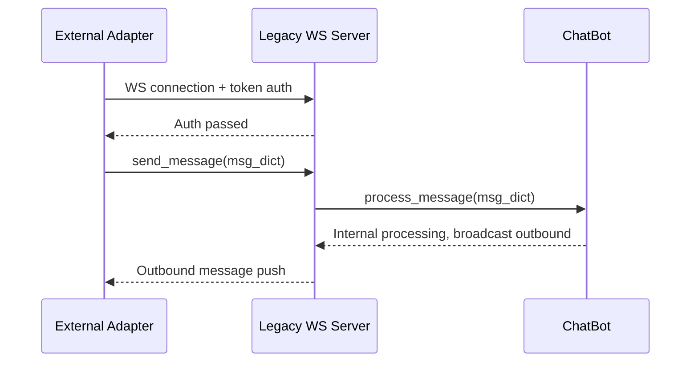
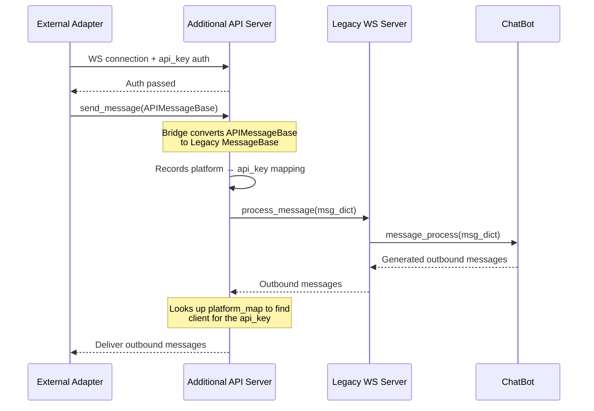
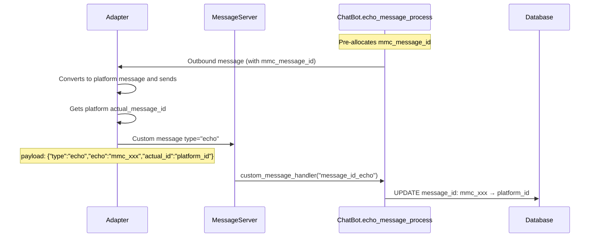

# Message Server and Adapter Integration

MaiBot exposes a WebSocket server through the `maim_message` library for external adapters to connect to. Adapters can run outside MaiBot (as independent processes, on separate machines, or even in different languages), as long as they follow the protocol. This document is for readers who need to deploy, operate, or write their own adapters, covering server modes, message flow, authentication mechanisms, and deployment essentials.

[[toc]]

## Relationship Between MaiBot and Adapters

MaiBot itself **does not embed any platform adapters**. NapCat, GoCQ, Discord, Telegram, SnowLuma, and others are not library code under `src/`. They run as independent external programs, connecting to MaiBot's message server via WebSocket to accomplish three tasks:

- **Inbound**: Convert messages received from platforms (QQ, Discord, etc.) into `maim_message` format and send them to MaiBot
- **Outbound**: Receive `maim_message`-format messages from MaiBot and convert them into platform-native messages for sending
- **Echo**: After successfully sending a message, relay the platform's real message ID back to MaiBot

This design decouples the "message send/receive protocol" from the "AI core logic," allowing a single MaiBot instance to connect to adapters for multiple different platforms.

There is also another scenario: plugins acting as adapters. By declaring `route_type="duplex"` through the [Message Gateway component](../plugin/message-gateway.md), a plugin can directly inject inbound messages and receive outbound deliveries, with routing handled by the Plugin Runtime's internal Platform IO. The principles for in-plugin adapters are the same as external adapters, except communication goes through Host/Runner msgpack IPC instead of WebSocket.

## Two Server Modes

MaiBot's message server comes in two flavors, controlled by `MaimMessageConfig`:

**Legacy Server (Legacy WS)**: Enabled by default, this is the original unified WebSocket entry point for external connections. After connecting, adapters use `maim_message`'s `MessageClient` to send and receive messages. The listening address and port are configured via `ws_server_host` / `ws_server_port`, defaulting to `127.0.0.1:8000`.

**Additional API Server (New API)**: Optionally enabled (`enable_api_server = true`), this opens a separate WebSocket service on an independent port. It has its own authentication system (API Key whitelist) and automatically records `platform`-to-API-Key mappings during message bridging for outbound routing. Defaults to listening on `0.0.0.0:8090`, with optional WSS encryption.

Both services can coexist. Legacy is suitable for simple scenarios (one adapter connecting directly), while Additional API Server is suited for multi-adapter, multi-account scenarios that require routing differentiation.

### Legacy Server (Legacy WS)



### Additional API Server (New API)



## Authentication and Tokens

### Legacy Server Authentication

Configure the `auth_token` list in `bot_config.toml`:

::: code-group

```toml [TOML ~vscode-icons:file-type-toml~]
[maim_message]
auth_token = ["your-secret-token-here"]
```

:::

- When the list is empty, no verification is performed and any WebSocket connection can connect. **Always configure tokens in production.**
- Multiple tokens can be configured, allowing different adapters to connect with different tokens.
- Adapter side: pass `{"token": "your-secret-token-here"}` in `metadata` when creating `MessageClient`.

### Additional API Server Authentication

This service has its own authentication logic, controlled by the `api_server_allowed_api_keys` whitelist:

::: code-group

```toml [TOML ~vscode-icons:file-type-toml~]
[maim_message]
enable_api_server = true
api_server_allowed_api_keys = ["key-for-napcat", "key-for-discord"]
```

:::

- When the whitelist is empty, all connections are allowed.
- Adapter side: pass `{"api_key": "key-for-napcat"}` in WebSocket connection metadata.
- On authentication failure, the connection is rejected and the rejected API Key is logged.

## RouteKey: Multi-Account Routing

`RouteKey` is the routing key used by the Platform IO layer to decide "who this message should be sent to," defined in `src/platform_io/types.py`:

::: code-group

```python [Python ~vscode-icons:file-type-python~]
@dataclass(frozen=True, slots=True)
class RouteKey:
    platform: str               # Platform name, e.g. qq, discord
    account_id: Optional[str]   # Account ID, distinguishes multiple accounts on the same platform
    scope: Optional[str]        # Additional routing scope (tenant, channel, etc.)
```

:::

Route matching falls back from "most specific to most general." For example, `RouteKey(platform="qq", account_id="bot_001", scope="chan_a")` will attempt exact match first, then account_id-only match, then scope-only match, and finally fall back to platform-only match.

For the Additional API Server, `platform_map` automatically records the mapping from platform to API Key (or connection UUID). When a message with `platform="qq"` first arrives through a particular API Key, all subsequent outbound messages destined for the `qq` platform will be routed back to that connection.

**Configuration recommendations**:

- **Single account**: The adapter can use `platform="qq"` when connecting to MaiBot, no need to fill in `account_id`
- **Multiple accounts**: Different accounts use different `RouteKey(platform="qq", account_id="bot_001")`, and MaiBot will deliver outbound messages precisely to the corresponding adapter

## InboundMessageEnvelope (Inbound)

Inbound messages are uniformly encapsulated as `InboundMessageEnvelope` (defined in `platform_io/types.py`):

**`route_key`** — `RouteKey` routing key, determines which platform and account the message belongs to.

**`driver_id`** — The driver ID that produced this message. Legacy and plugin adapters each have unique identifiers.

**`driver_kind`** — `DriverKind` enum (legacy / plugin).

**`external_message_id`** — Platform-side message ID, used for deduplication. When empty, the middleware falls back to `session_message.message_id`.

**`dedupe_key`** — Optional explicit deduplication key. Allows upstream drivers to provide a stable technical idempotency key when the external message lacks a stable message_id.

**`session_message`** — Optional already-normalized `SessionMessage` object.

**`payload`** — Raw dict payload, for deferred conversion or debugging.

**`metadata`** — Additional inbound metadata (connection info, tracing context, etc.).

## SessionMessage (Inbound Message Model)

`SessionMessage` inherits from `MaiMessage` and is the standardized internal model for inbound messages within MaiBot. Key fields:

**`message_info`** — Message metadata, containing `user_info` (sender), `group_info` (group/channel), `platform`, `message_id`, etc.

**`raw_message`** — Original message component list, supporting `Text`, `Image`, `At`, `Reply`, `Emoji`, `Voice`, `File`, `ForwardNode`, etc.

**`reply_to`** — ID of the message being replied to.

**`processed_plain_text`** — Preprocessed plain text content.

Components are modeled as the `StandardMessageComponents` union type, where each component retains platform-original data while providing standardized access interfaces.

## DeliveryReceipt (Outbound Receipt)

`DeliveryReceipt` represents the result of an outbound delivery:

**`internal_message_id`** — Internal message ID (corresponds to `SessionMessage.message_id` from the inbound message).

**`route_key`** — The `RouteKey` used for delivery.

**`status`** — `DeliveryStatus` enum (SENT / FAILED, etc.).

**`driver_id`** — The driver ID that actually handled this delivery.

**`driver_kind`** — Driver type.

**`external_message_id`** — Platform-side message ID returned by the adapter.

**`error`** — Error information on failure.

**`metadata`** — Additional metadata.

For broadcast outbound (one message sent to multiple platforms), `DeliveryBatch` aggregates multiple `DeliveryReceipt` objects, providing convenient properties like `sent_receipts` / `failed_receipts` / `has_success`.

## message_id_echo Loop

MaiBot uses **internally pre-allocated message IDs** (`mmc_message_id`) when generating messages. After the adapter successfully sends a message to the platform, the platform returns a **platform-side real message ID** (`actual_message_id`). The adapter needs to report this mapping back to MaiBot for subsequent references (e.g., recalling the correct message when a recall is needed).

Loop flow:



Echo payload format sent by the adapter:

::: code-group

```json [JSON ~vscode-icons:file-type-json~]
{
  "type": "echo",
  "echo": "mmc_message_id_xxx",
  "actual_id": "platform_real_message_id"
}
```

:::

The MaiBot main program registers the `message_id_echo` custom message handler at startup, and the Additional API Server's `bridge_message_handler` bridges to the same handler function.

## Minimal Python External Adapter Example

Below is a minimal working Python adapter that connects to the Legacy Server and sends/receives messages:

::: code-group

```python [Python ~vscode-icons:file-type-python~]
"""Minimal external adapter: connects to MaiBot Legacy WS Server, sends and receives messages."""
import asyncio
from maim_message import MessageClient, MessageBase


class MinimalAdapter:
    def __init__(self, host: str, port: int, token: str):
        self.client = MessageClient(
            host=host,
            port=port,
            metadata={"token": token},
        )

    async def on_bot_message(self, msg: dict) -> None:
        """Receives outbound messages from MaiBot, converts to platform messages for sending."""
        print(f"[Adapter] Received outbound message: msg_id={msg.get('message_id')}")
        # Connect to the specific platform (QQ / Discord / Telegram) send API here
        # platform_msg_id = await send_to_platform(msg)
        # await self.echo_message(msg["message_id"], platform_msg_id)

    async def inject_inbound(self, text: str, user_id: str, group_id: str) -> None:
        """Injects an inbound message into MaiBot."""
        msg = MessageBase(
            message_id="adapter_001",
            platform="qq",
            group_info={"group_id": group_id},
            user_info={"user_id": user_id, "user_nickname": "User"},
            raw_message={"components": [{"type": "text", "text": text}]},
        )
        await self.client.send_message(msg.to_dict())

    async def echo_back(self, mmc_id: str, actual_id: str) -> None:
        """Relays the platform's real message ID back to MaiBot."""
        echo_payload = {
            "type": "echo",
            "echo": mmc_id,
            "actual_id": actual_id,
        }
        await self.client.send_custom_message("message_id_echo", echo_payload)

    async def run(self) -> None:
        """Establishes connection and starts handling messages."""
        await self.client.connect()
        # Register outbound message callback
        self.client.on("message", self.on_bot_message)
        print(f"[Adapter] Connected to MaiBot Legacy Server")
        # Keep running
        await asyncio.Event().wait()


if __name__ == "__main__":
    adapter = MinimalAdapter(
        host="127.0.0.1",
        port=8000,
        token="your-secret-token-here",
    )
    asyncio.run(adapter.run())
```

:::

- `MessageClient` encapsulates WebSocket connection, authentication, and message send/receive.
- `on_bot_message` is the outbound callback, triggered when MaiBot has a message to send.
- `send_message` injects inbound messages.
- `send_custom_message("message_id_echo", ...)` completes the echo loop.

## Deployment Recommendations

### Network Isolation

- Legacy Server binds to `127.0.0.1` by default, accessible only locally. If the adapter and MaiBot run on the same machine, this is the safest choice.
- Additional API Server binds to `0.0.0.0` by default, allowing external access. If the adapter runs on another machine, enable it and configure TLS.
- Exposing a WebSocket server directly on the public internet is extremely dangerous. Either use an internal network, or configure TLS plus strong authentication.

### TLS (WSS)

Additional API Server supports WSS:

::: code-group

```toml [TOML ~vscode-icons:file-type-toml~]
[maim_message]
enable_api_server = true
api_server_use_wss = true
api_server_cert_file = "/path/to/cert.pem"
api_server_key_file = "/path/to/key.pem"
```

:::

Legacy Server does not have built-in WSS support. If needed, place Nginx / Caddy in front as a reverse proxy to terminate TLS.

### Single Account vs. Multi-Account

**Single-account deployment**:
- Adapter connects to Legacy Server only, no need to worry about routing.
- Additional API Server doesn't need to be enabled.

**Multi-account / multi-platform deployment**:
- Enable Additional API Server, give each adapter a unique API Key.
- Adapters write the platform name in the `platform` field of inbound messages, and MaiBot automatically establishes `platform → api_key` mappings.
- You can also use `RouteKey.account_id` to distinguish multiple accounts on the same platform.
- If multiple adapters share the same `platform`, the last mapping established via `bridge_message_handler` will overwrite previous ones, so careful management is needed.

### Authentication Checklist

- [ ] Legacy `auth_token` is not empty
- [ ] Additional API Server's `api_server_allowed_api_keys` is not empty (if enabled)
- [ ] Each adapter holds an independent Token / API Key, do not share
- [ ] Tokens and API Keys are not logged in plaintext

## Related Documents

- [Plugin Message Gateway](../plugin/message-gateway.md): In-plugin adapter development (`@MessageGateway` decorator)
- [Plugin Hook Handlers](../plugin/hooks.md): Intercepting and modifying message flow via Hooks
- [Message Pipeline](../manual/features/message-pipeline.md): Full inbound message processing flow inside MaiBot
- [Development Guide](./index.md): Tech stack, project structure, and parallel IO layer design
