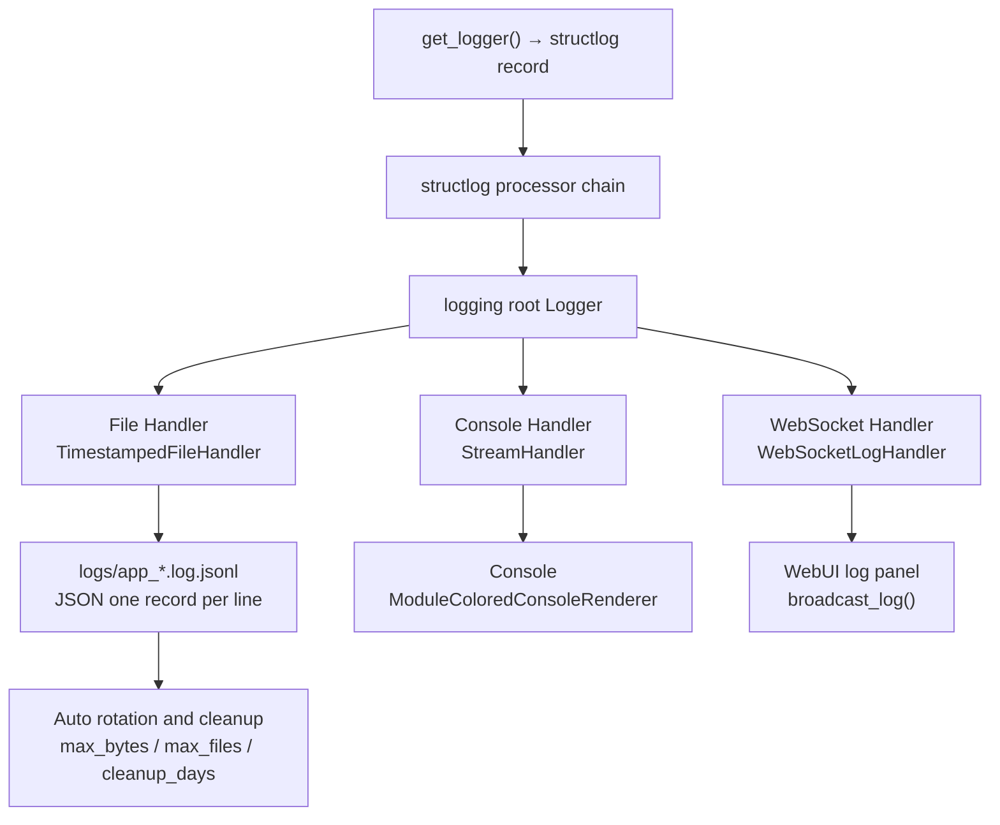

# Logging and Observability

MaiBot's logging system is built on structlog + Python logging, routing all logs simultaneously to three parallel output channels: file (JSONL format), console (with color), and WebUI (real-time WebSocket push). This document is for deployment operators and advanced users, covering log configuration tuning, third-party library noise reduction, LLM request failure snapshot capture, WebSocket log subscriptions, and online troubleshooting workflows.

## Log Records → Handler Routing



The three handlers are registered on the root Logger when the log module is imported. All structlog logs pass through a unified processor chain (context merging, caller info injection, path-to-module-name conversion, timestamp and stack formatting), after which each handler's Formatter determines the final output format.

## Three Handlers

### File JSONL Handler — Persistence and Lookback

The File Handler writes logs in JSONL format to `logs/app_<timestamp>.log.jsonl`, with one complete JSON record per line, containing the following fields:

**`timestamp`** — ISO format timestamp
**`level`** — Log level (debug / info / warning / error / critical)
**`logger_name`** — Module name that produced the log (e.g. `maisaka.planner`, `chat.heartflow`)
**`event`** — Log body
**`module`** — Source-relative path (e.g. `maisaka.planner`)
**`lineno`** — Line number (for traceability)
**`exception`** — If an exception occurred, contains the full stack trace

Fields within a JSONL line can be extended with context (e.g. additionally recording `response_time`, `tool_name`), making it easy to use tools like `jq` and `grep` for precise search and statistics.

**File rotation and cleanup** are controlled by three LogConfig fields:

**`log_file_max_bytes`** — Triggers rotation when a single file exceeds this size, default `5MB`
**`max_log_files`** — Maximum number of main log files to retain, default `30`
**`log_cleanup_days`** — Log files older than this number of days are automatically cleaned up by a background thread (running every 24h)

### Console Handler — Real-time Monitoring During Development

The Console Handler outputs formatted logs directly to the console (stdout). `ModuleColoredConsoleRenderer` is responsible for assigning different colors to different modules, with color range and intensity controlled by the `color_text` field described below.

Console output is affected by two fields, `console_log_level` and `log_level_style`:
- Level: defaults to `INFO`; can be temporarily changed to `DEBUG` during troubleshooting
- Style: `lite` (only colors the timestamp), `compact` (displays level initial), `full` (displays the full level string)

### WebSocket Handler — Real-time Push to WebUI

The WebSocket Handler pushes each log entry as a JSON message in real time to all WebUI clients connected to `/ws/logs`. The message format includes five fields: `id`, `timestamp`, `level`, `module`, and `message`, along with the module's assigned color. After establishing a connection, the frontend log panel first receives the most recent 100 historical log entries as context catch-up.

WebSocket log push is initialized when `initialize_ws_handler()` is called at `bot.py:478`. The handler itself is registered at the `DEBUG` level, ensuring the WebSocket receives logs of all levels regardless of the LogConfig setting.

## Detailed LogConfig Configuration

LogConfig is located in the `[log]` section of `config/bot_config.toml`. Below are the key fields most relevant to operations:

### The Three Log Level Fields

**`log_level`** — Global default level, serves as the fallback for both `console_log_level` and `file_log_level`. Values: `DEBUG` / `INFO` / `WARNING` / `ERROR` / `CRITICAL`, default `INFO`.

**`console_log_level`** — Console output level, default `INFO`. If you're watching logs live in the terminal, this value is the actual filter threshold you see.

**`file_log_level`** — File output level, default `DEBUG`. File logs are the most detailed; when problems arise, the files usually contain details not visible on the console.

**Typical combination**: `console_log_level="INFO"` + `file_log_level="DEBUG"` — console stays clean during normal operation, files have DEBUG when you need to investigate.

### Console Appearance

**`color_text`** — Console coloring scope, values: `"none"` / `"title"` (only module names colored) / `"full"` (module name + level + body all colored). Default `full`, recommended so you can quickly distinguish modules.

**`log_level_style`** — Level text display style, values: `"lite"` (only timestamps colored, level not shown), `"compact"` (shows level initial, e.g. `[I]`), `"full"` (shows full level, e.g. `[   INFO]`). Default `lite`.

**`date_style`** — Timestamp format template, e.g. `"m-d H:i:s"` displays as `07-18 14:30:05`, supports `Y` (year), `m` (month), `d` (day), `H` (hour), `i` (minute), `s` (second).

### Snapshots and Replay

**`llm_request_snapshot_limit`** — Maximum number of failed model request snapshots to retain, default `128`. When an LLM call fails, the system serializes the complete request context (message list, model parameters, API Provider config, error info) to `logs/llm_request/*.json` and automatically prunes excess files. See the "LLM Request Failure Snapshots" section below for details.

**`maisaka_prompt_preview_limit`** — Maximum number of prompt preview groups to retain per chat, default `256`. Preview content can be viewed in the WebUI conversation details.

**`maisaka_reply_effect_limit`** — Maximum number of reply effect records to retain per chat, default `256` (requires `enable_reply_effect_tracking` to be enabled in the Debug configuration).

## library_log_levels: Precise Noise Control

Third-party library logs can easily drown out critical information. The `library_log_levels` field lets you precisely control log levels by library name, instead of blanket-muting everything.

### Default Configuration

MaiBot sets the following libraries to `WARNING` level by default to reduce noise:

**`aiohttp`** — `WARNING`. HTTP request library; at `INFO` level it floods the output with per-connection details.
**`PIL`** — `WARNING`. Image processing library; outputs extensive format identification details.

### Practical Noise-Tuning Examples

You can add arbitrary library name and level key-value pairs to this field. Here are some scenarios and corresponding configuration suggestions:

**Scenario 1: Debugging database queries**

::: code-group

```toml [TOML ~vscode-icons:file-type-toml~]
[log.library_log_levels]
aiohttp = "WARNING"
PIL = "WARNING"
sqlalchemy = "DEBUG"
```

:::

Temporarily enabling SQLAlchemy at `DEBUG` level lets you see every generated SQL statement, useful when troubleshooting ORM performance issues. Remember to change it back to `WARNING` after investigating.

**Scenario 2: Troubleshooting HTTP request timeouts**

::: code-group

```toml [TOML ~vscode-icons:file-type-toml~]
[log.library_log_levels]
httpx = "DEBUG"
```

:::

If you suspect the issue is at the model API call layer, temporarily enable `httpx` (or `openai`) at `DEBUG` to see complete request/response details.

**Scenario 3: WebSocket connection anomalies**

::: code-group

```toml [TOML ~vscode-icons:file-type-toml~]
[log.library_log_levels]
websockets = "INFO"
```

:::

By default, the `websockets` library is completely suppressed in `suppress_libraries`. Changing it to `INFO` lets you see the full lifecycle logs of WebSocket connect/disconnect/reconnect events.

**Scenario 4: Extreme debug mode**

Dial every known noisy library to a higher threshold, keeping only business code logs:

::: code-group

```toml [TOML ~vscode-icons:file-type-toml~]
[log.library_log_levels]
aiohttp = "ERROR"
sqlalchemy = "WARNING"
httpx = "ERROR"
openai = "WARNING"
websockets = "ERROR"
urllib3 = "ERROR"
```

:::

### Complete Suppression

If you don't want to see any output from a library at all, add it to the `suppress_libraries` list. Suppressed libraries produce no logs whatsoever (equivalent to setting the library's logger level higher than `CRITICAL`), and `propagate=False` is configured to prevent logs from bubbling up.

**`suppress_libraries`** defaults to `["faiss", "httpx", "urllib3", "asyncio", "websockets", "httpcore", "requests", "sqlalchemy", "openai", "uvicorn", "jieba"]`. If you need to see logs from one of these libraries, remove it from this list, then use `library_log_levels` to set an appropriate level.

## LLM Request Failure Snapshots

When an LLM model call fails (e.g. timeout, authentication failure, upstream error), MaiBot automatically saves the complete context of the failed request as a snapshot file in the `logs/llm_request/` directory.

### Snapshot Contents

Each snapshot JSON file contains the following information:

**`api_provider`** — API Provider configuration (excluding sensitive information like authentication keys)
**`client_type`** — Client type (`openai` / `gemini`, etc.)
**`error`** — Error details, including error type, status code, message text, and the upstream response body extracted as much as possible
**`model_info`** — Model information (name, identifier, temperature and other parameters)
**`internal_request`** — Internal request structure (message list, tool calls, response_format and other complete context)
**`provider_request`** — The actual request body after conversion to the API Provider format
**`replay`** — Replay information, including a directly executable `uv run python` command to re-invoke the call using the snapshot file
**`created_at`** — Snapshot creation time

### Managing Snapshots

**`llm_request_snapshot_limit`** controls the snapshot retention cap (default `128`). When the number of snapshot files exceeds this threshold, the system automatically deletes the oldest files.

Snapshot filenames follow the format `<timestamp>_<client>_<request_type>_<model_name>.json`, making it easy to quickly locate by time or model name.

### Replaying Failed Requests

The snapshot file's `replay.command` field provides the complete replay command, which can be copied directly to the terminal:

::: code-group

```bash [Bash ~vscode-icons:file-type-shell~]
uv run python scripts/replay_llm_request.py "logs/llm_request/20260718_143005_openai_response_gpt-4o.json"
```

:::

This re-invokes the LLM using the parameters from the snapshot, useful for verifying whether the problem is intermittent or persistent.

## Telemetry Toggle

The Telemetry system periodically sends anonymous usage statistics to the server. It **does not collect chat content or personal information**, only containing system type, Python version, MaiBot version, and deployment time.

**`telemetry.enable`** — Whether to enable telemetry, default `true`.

Disabling telemetry does not affect any functionality. If you do not want MaiBot to communicate externally, set the following in `bot_config.toml`:

::: code-group

```toml [TOML ~vscode-icons:file-type-toml~]
[telemetry]
enable = false
```

:::

Telemetry consists of two independent tasks: `TelemetryHeartBeatTask` (heartbeat every 10 minutes) and `TelemetryStatsUploadTask` (statistics upload approximately every 3 hours). Both are controlled by `enable`, and no network requests are made when disabled.

## Debug Configuration Items

Debug configuration is in the `[debug]` section, with `__ui_parent__` set to `log`, so it appears in the same area as log configuration in the WebUI. The following five items are commonly used during debugging and performance analysis:

**`show_maisaka_thinking`** — Whether to show MaiMai's thinking process in logs (Planner planning details, tool call reasoning chains), default `true`. You can disable this if you want to reduce log volume.

**`enable_reply_effect_tracking`** — Whether to record reply effect scores, default `false`. When enabled, the system calculates effect metrics for each reply and writes them to the database, with `maisaka_reply_effect_limit` limiting the number of records per chat. Useful when tuning prompts or comparing model performance.

**`keep_prompt_preview_json_base64`** — Whether to retain image base64 data in prompt previews, default `false`. When enabled, you can see the complete image content sent to the model in previews, useful for troubleshooting visual model output anomalies, but consumes significant disk space.

**`record_tool_structured_content`** — Whether to save structured content returned by tools (e.g. JSON schema, API response body), default `false`. When enabled, it helps you reproduce tool call chains in conversation records, but increases database size.

**`enable_llm_cache_stats`** — Whether to record model prompt cache hit statistics, default `false`. When enabled, cache-related metrics are appended to logs for performance tuning and model API cost analysis.

## WebSocket Log Subscription

The WebUI log panel implements real-time log push via the WebSocket protocol.

**Endpoint**: `/ws/logs`
**Authentication method**: query parameter `?token=<ws-token>` (obtain a temporary token via `/api/webui/ws-token`) or Cookie `maibot_session`
**Connection flow**:

After the client connects, the server first pushes the most recent 100 historical log entries (read from the latest file in the `logs/` directory), then continuously pushes newly generated logs. `ping`/`pong` heartbeats are supported during the connection.

Log message JSON structure:

::: code-group

```json [JSON ~vscode-icons:file-type-json~]
{
  "id": "1712345678000_42",
  "timestamp": "2026-07-18 14:30:05",
  "level": "WARNING",
  "module": "maisaka.planner",
  "message": "Tool call timeout: search_memory",
  "moduleColor": "#....",
  "moduleBold": true
}
```

:::

The **`moduleColor`** and **`moduleBold`** fields are determined by `_resolve_module_style()` based on a preset terminal color table matched by module name, and the frontend renders colored module labels accordingly.

The WebSocket Handler broadcasts each log entry in a **non-blocking** manner (`call_soon_threadsafe`). WebSocket push failures do not affect the main logging system.

## Three Steps for Online Troubleshooting

When you find that MaiBot has suddenly stopped responding, follow this process to locate the issue:

### Step 1 — Check the Latest Console Output

First, check the most recent logs in the terminal. Watch for the following signals:

- `ERROR` / `CRITICAL` level errors — expand the stack trace for details
- Whether there are many `WARNING` entries (e.g. model call retries, heartbeat failures). Accumulation may point to network or API credential issues
- Whether logs have completely stopped — the process may be blocked. Press `Ctrl+C` to see if there's a KeyboardInterrupt response

If the console's default `INFO` level doesn't show enough detail, **temporarily override via environment variable in the terminal** without modifying the config file. It takes effect immediately and reverts on restart:

::: code-group

```bash [Bash ~vscode-icons:file-type-shell~]
# Temporarily enable DEBUG, reverts after restart
export MAIBOT_CONSOLE_LOG_LEVEL=DEBUG
uv run python bot.py
```

:::

### Step 2 — Dig Into File Logs

File logs default to `DEBUG` level, recording more comprehensive information than the console. Start with the latest log file:

::: code-group

```bash [Bash ~vscode-icons:file-type-shell~]
# View the most recent 50 log entries
tail -50 logs/$(ls -t logs/app_*.log.jsonl | head -1)

# Search for ERROR and exceptions
grep -i '"level": "ERROR"' logs/app_*.log.jsonl | tail -20

# Search for a specific module
grep '"logger_name": "maisaka"' logs/app_*.log.jsonl | tail -30
```

:::

Use `jq` for more precise filtering and formatting:

::: code-group

```bash [Bash ~vscode-icons:file-type-shell~]
# Get the event body of the most recent 20 ERROR entries
tail -2000 logs/app_*.log.jsonl | jq 'select(.level == "ERROR") | {ts: .timestamp, msg: .event}' | tail -20
```

:::

### Step 3 — Switch to DEBUG + Capture LLM Snapshots to Reproduce

If the first two steps haven't identified the root cause, set `file_log_level` to `DEBUG` (usually it already is) to ensure the most detailed logs are written to files. Also check snapshot files under `logs/llm_request/`:

- If a large number of snapshot files are generated around the problem time (e.g. batch timeouts), use the `replay.command` in a snapshot to manually replay, and share the replay results and console output in the community for help
- If no snapshots were generated, the problem is not at the model call layer — investigate the message pipeline, adapter connections, and WebSocket status
- Temporarily lower `library_log_levels` for related libraries to `DEBUG` (see the noise-tuning examples above), re-trigger the problem, and check the output

After completing the investigation, **be sure to restore** the temporarily changed configuration and library log levels to avoid filling up the disk with DEBUG logs.

## Online Time Statistics Overview

MaiBot displays an **online duration** metric on the WebUI's "Chat Statistics" page. This metric is calculated from the runtime's startup timestamp and the current time, recording the bot's actual running duration.

Statistical data is reported through the telemetry system using a time-window (cursor) mechanism, containing aggregated metrics such as token usage, model call frequency, and cost. If you need a deeper understanding of the statistics system's internal implementation (data aggregation logic, reporting cycles, cursor strategy), please refer to [Statistics and I/O Data Pipelines](./statistics-io.md).

**Quick reference for online time related items**:

**`deploy_time`** — Deployment timestamp, stored in local storage, used as the base time for telemetry UUID registration and statistics windows
**`process_start_at`** — Current process start time, used to define the starting point of statistics windows
**Telemetry statistics reporting interval** — Approximately 191 minutes (`11451` seconds), each report covers aggregated data for one time window
