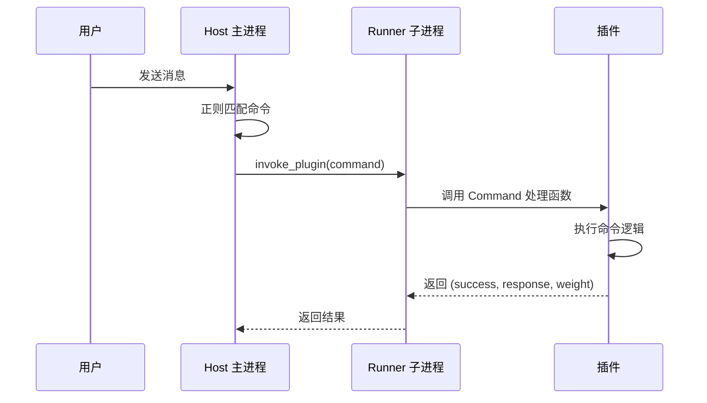

---
title: Command Component
---# Command Component

`@Command` is a command component based on regular expression matching. When a message sent by a user matches the regex pattern of a Command, MaiBot will schedule and execute the corresponding Command handler function.

## Decorator Signature

```python
from maibot_sdk import Command

@Command(
    name: str,                    # 命令名称（必填）
    description: str = "",        # 命令描述
    pattern: str = "",            # 正则匹配模式
    aliases: list[str] | None = None,  # 命令别名列表
    **metadata,                   # 额外元数据
)
```

### Parameter Description

- **`name`** `str` — Command name, must be unique within the plugin
- **`description`** `str` — Command description
- **`pattern`** `str` — Regex matching pattern string. This command is triggered when the user message matches this pattern
- **`aliases`** `list[str] | None` — List of command aliases, providing additional trigger methods

## Basic Usage

```python
from maibot_sdk import MaiBotPlugin, Command


class MyPlugin(MaiBotPlugin):
    @Command("hello", pattern=r"^/hello")
    async def handle_hello(self, **kwargs):
        await self.ctx.send.text("Hello!", kwargs["stream_id"])
        return True, "Hello!", 2
```

### Commands with Aliases

```python
@Command("greet", pattern=r"^/greet", aliases=["/hi", "/hey"])
async def handle_greet(self, **kwargs):
    await self.ctx.send.text("你好！", kwargs["stream_id"])
    return True, "你好！", 2
```

This command can be triggered using `/greet`, `/hi`, or `/hey`.

### Commands with Regex Capture Groups

```python
import re

@Command("echo", pattern=r"^/echo\s+(?P<text>.+)$")
async def handle_echo(self, **kwargs):
    matched = kwargs.get("matched_groups", {})
    text = matched.get("text", "").strip()
    stream_id = kwargs["stream_id"]
    await self.ctx.send.text(f"Echo: {text}", stream_id)
    return True, f"Echo: {text}", 1
```

## Handler Function Parameters

The Command handler function receives `**kwargs`, which contains the following parameters:

- **`stream_id`** `str` — Current chat stream ID, used for sending messages
- **`matched_groups`** `dict` — Matching results of the regex named capture groups
- **`raw_message`** `str` — The original message text sent by the user
- **`message`** `dict` — The complete message object

### Return Value

The Command handler function must return a triple:

```python
return success, response, weight
```

- **`success`** `bool` — Whether the command was executed successfully
- **`response`** `str` — Text description of the command execution result
- **`weight`** `int` — Command priority weight; the higher the value, the higher the priority

```python
# 命令成功执行
return True, "操作成功", 2

# 命令执行失败
return False, "参数错误", 1
```

## Regex Pattern Writing Guide

### Recommended Patterns

```python
# 精确匹配 /hello
pattern=r"^/hello$"

# 匹配 /hello 加可选参数
pattern=r"^/hello(?P<name>.+)?$"

# 匹配 /echo 加必填参数
pattern=r"^/echo\s+(?P<text>.+)$"

# 匹配 /set 加键值对
pattern=r"^/set\s+(?P<key>\w+)\s+(?P<value>.+)$"
```

### Using Named Capture Groups

It is recommended to use `(?P<name>...)` named capture groups, which allow accessing matching results by name via `kwargs["matched_groups"]`:

```python
@Command("ban", pattern=r"^/ban\s+(?P<user>\w+)(?:\s+(?P<reason>.+))?$")
async def handle_ban(self, **kwargs):
    matched = kwargs.get("matched_groups", {})
    user = matched.get("user", "")
    reason = matched.get("reason", "无原因")
    await self.ctx.send.text(f"已封禁 {user}，原因：{reason}", kwargs["stream_id"])
    return True, f"已封禁 {user}", 2
```

## Command Execution Flow



## Command Related Hooks

There are built-in Hook points before and after command execution available for `@HookHandler` subscription:

- `chat.command.before_execute`: Triggered before command execution; can abort or rewrite parameters
- `chat.command.after_execute`: Triggered after command execution; can rewrite the return result

## Complete Example

```python
from maibot_sdk import MaiBotPlugin, Command, Tool
from maibot_sdk.types import ToolParameterInfo, ToolParamType


class AdminPlugin(MaiBotPlugin):
    async def on_load(self) -> None:
        self.ctx.logger.info("管理插件已加载")

    async def on_unload(self) -> None:
        pass

    async def on_config_update(self, scope: str, config_data: dict, version: str) -> None:
        pass

    @Command("status", pattern=r"^/status$")
    async def handle_status(self, **kwargs):
        """查看系统状态"""
        stream_id = kwargs["stream_id"]
        await self.ctx.send.text("系统运行正常 ✅", stream_id)
        return True, "系统运行正常", 1

    @Command("echo", pattern=r"^/echo\s+(?P<text>.+)$")
    async def handle_echo(self, **kwargs):
        """回显消息"""
        matched = kwargs.get("matched_groups", {})
        text = matched.get("text", "").strip()
        stream_id = kwargs["stream_id"]
        await self.ctx.send.text(text, stream_id)
        return True, text, 1

    @Command("help", pattern=r"^/help$", aliases=["/帮助"])
    async def handle_help(self, **kwargs):
        """显示帮助信息"""
        stream_id = kwargs["stream_id"]
        help_text = "可用命令：\n/status - 查看状态\n/echo <text> - 回显消息\n/help - 显示帮助"
        await self.ctx.send.text(help_text, stream_id)
        return True, "帮助信息已发送", 1


def create_plugin():
    return AdminPlugin()
```