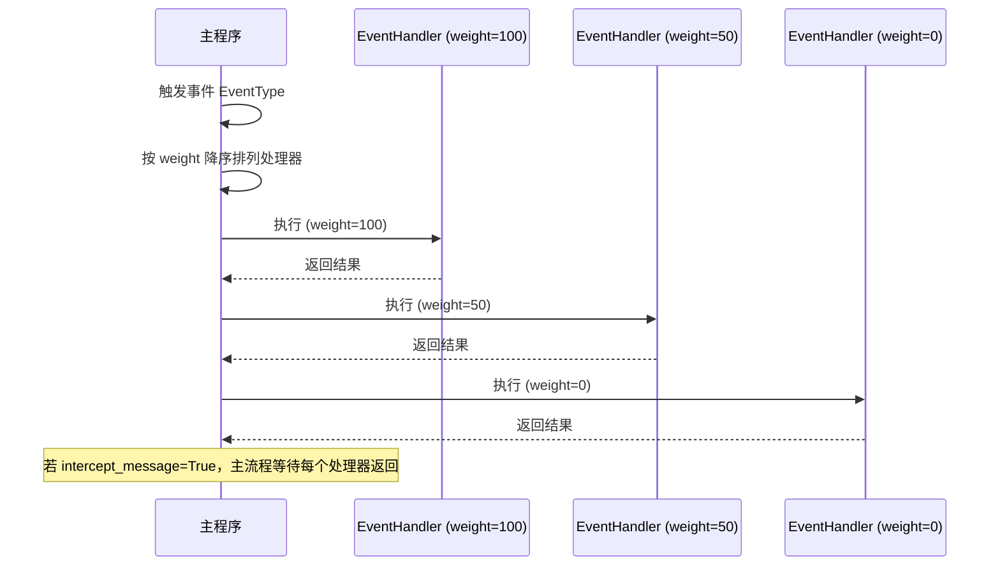

---
title: Event Handlers
---# Event Handler

`@EventHandler` is a component decorator used to subscribe to message and workflow events. Unlike the named Hook point mechanism of `@HookHandler`, `@EventHandler` subscribes to events based on fixed `EventType` enum values, making it suitable for intercepting or observing specific stages of the message processing flow.

## Decorator Signature

```python
from maibot_sdk import EventHandler
from maibot_sdk.types import EventType

@EventHandler(
    name: str,                                      # 组件名称（必填）
    description: str = "",                          # 组件描述
    event_type: EventType = EventType.ON_MESSAGE,   # 订阅的事件类型
    intercept_message: bool = False,                # 是否阻塞消息链
    weight: int = 0,                                # 权重，越高越先执行
    **metadata,                                     # 额外元数据
)
```

## EventType Event Types

- **`UNKNOWN`** — Unknown event
- **`ON_START`** — Plugin startup
- **`ON_STOP`** — Plugin shutdown
- **`ON_MESSAGE_PRE_PROCESS`** — Message pre-processing stage (best time for filtering and interception)
- **`ON_MESSAGE`** — Message processing stage
- **`ON_PLAN`** — Planning stage
- **`POST_LLM`** — After LLM call (response generated)
- **`AFTER_LLM`** — After LLM call completion
- **`POST_SEND_PRE_PROCESS`** — Send pre-processing stage
- **`POST_SEND`** — After message sent
- **`AFTER_SEND`** — After message send completion

## intercept_message Parameter

`intercept_message` controls whether the EventHandler participates in the message processing chain in a blocking manner:

- **`False`** (Default) — Asynchronous fire-and-forget, does not affect the main message flow
- **`True`** — Synchronous blocking, the main program waits for the handler to return before continuing

When set to `True`, the handler can intercept, modify, or even block subsequent processing of the message.

## weight Weight

When multiple EventHandlers subscribe to the same `EventType`, `weight` determines the execution order:

- **Higher values execute first**
- Default value is `0`
- Consistent with the `weight` semantics of the old system

## Basic Usage

### ON_START: Plugin Initialization

```python
from maibot_sdk import MaiBotPlugin, EventHandler
from maibot_sdk.types import EventType


class StartupPlugin(MaiBotPlugin):
    async def on_load(self) -> None:
        self.ctx.logger.info("插件已加载")

    async def on_unload(self) -> None:
        self.ctx.logger.info("插件已卸载")

    async def on_config_update(self, scope: str, config_data: dict, version: str) -> None:
        pass

    @EventHandler(
        "on_startup",
        description="插件启动时初始化资源",
        event_type=EventType.ON_START,
    )
    async def handle_startup(self, **kwargs):
        self.ctx.logger.info("启动事件触发，开始初始化")
        # 在这里执行启动时需要的初始化逻辑
```

### ON_MESSAGE_PRE_PROCESS: Message Filtering

```python
from maibot_sdk import MaiBotPlugin, EventHandler
from maibot_sdk.types import EventType


class MessageFilterPlugin(MaiBotPlugin):
    async def on_load(self) -> None:
        self.ctx.logger.info("消息过滤插件已加载")

    async def on_unload(self) -> None:
        self.ctx.logger.info("消息过滤插件已卸载")

    async def on_config_update(self, scope: str, config_data: dict, version: str) -> None:
        pass

    @EventHandler(
        "spam_filter",
        description="过滤垃圾消息",
        event_type=EventType.ON_MESSAGE_PRE_PROCESS,
        intercept_message=True,   # 阻塞模式，可以拦截消息
        weight=100,               # 高权重，优先执行
    )
    async def filter_spam(self, message, **kwargs):
        raw_message = message.get("raw_message", "")
        user_id = message.get("user_info", {}).get("user_id", "")

        # 检测垃圾消息
        if self._is_spam(raw_message, user_id):
            self.ctx.logger.info("拦截垃圾消息: user=%s, text=%s", user_id, raw_message)
            return {"intercepted": True, "reason": "spam"}

        # 放行消息
        return {"intercepted": False}

    def _is_spam(self, text: str, user_id: str) -> bool:
        # 简单的垃圾消息检测逻辑
        spam_keywords = ["广告", "加群", "免费"]
        return any(kw in text for kw in spam_keywords)
```

### ON_MESSAGE: Message Observation

```python
from maibot_sdk import MaiBotPlugin, EventHandler
from maibot_sdk.types import EventType


class MessageObserverPlugin(MaiBotPlugin):
    async def on_load(self) -> None:
        self._message_count = 0

    async def on_unload(self) -> None:
        self.ctx.logger.info("总消息数: %d", self._message_count)

    async def on_config_update(self, scope: str, config_data: dict, version: str) -> None:
        pass

    @EventHandler(
        "message_counter",
        description="统计消息数量",
        event_type=EventType.ON_MESSAGE,
    )
    async def count_message(self, message, **kwargs):
        self._message_count += 1
        self.ctx.logger.debug("收到第 %d 条消息", self._message_count)
```

### AFTER_LLM: LLM Response Post-processing

```python
from maibot_sdk import MaiBotPlugin, EventHandler
from maibot_sdk.types import EventType


class LLMPostProcessor(MaiBotPlugin):
    async def on_load(self) -> None:
        self.ctx.logger.info("LLM 后处理插件已加载")

    async def on_unload(self) -> None:
        self.ctx.logger.info("LLM 后处理插件已卸载")

    async def on_config_update(self, scope: str, config_data: dict, version: str) -> None:
        pass

    @EventHandler(
        "llm_response_logger",
        description="记录 LLM 响应",
        event_type=EventType.AFTER_LLM,
        weight=50,
    )
    async def log_llm_response(self, **kwargs):
        response = kwargs.get("response", "")
        self.ctx.logger.info("LLM 响应: %s", response[:200])
```

### POST_SEND: Post-send Callback

```python
from maibot_sdk import MaiBotPlugin, EventHandler
from maibot_sdk.types import EventType


class SendAuditPlugin(MaiBotPlugin):
    async def on_load(self) -> None:
        self.ctx.logger.info("发送审计插件已加载")

    async def on_unload(self) -> None:
        self.ctx.logger.info("发送审计插件已卸载")

    async def on_config_update(self, scope: str, config_data: dict, version: str) -> None:
        pass

    @EventHandler(
        "send_audit",
        description="审计所有发送的消息",
        event_type=EventType.POST_SEND,
    )
    async def audit_send(self, **kwargs):
        message = kwargs.get("message", {})
        self.ctx.logger.info(
            "消息已发送: stream_id=%s",
            message.get("stream_id", "unknown"),
        )
```

## Differences from HookHandler

- **Subscription Method**: `@EventHandler` `EventType` enum values $\rightarrow$ `@HookHandler` named Hook point strings
- **Granularity**: `@EventHandler` fixed event types, limited in number $\rightarrow$ `@HookHandler` custom Hook names, infinitely extensible
- **Interception Method**: `@EventHandler` `intercept_message=True` $\rightarrow$ `@HookHandler` `mode=HookMode.BLOCKING`
- **Priority**: `@EventHandler` `weight` numerical weight $\rightarrow$ `@HookHandler` `order` three-tier enum + global sorting
- **Exception Strategy**: `@EventHandler` no dedicated parameter $\rightarrow$ `@HookHandler` `error_policy` control
- **Applicable Scenarios**: `@EventHandler` fixed stages of the message flow $\rightarrow$ `@HookHandler` any extension point defined by the main program

General Principles:
- If you need to execute logic at a **fixed stage** of the message flow (e.g., upon receiving a message, after LLM return), use `@EventHandler`.
- If you need to subscribe to a **specifically named Hook point** defined by the main program (e.g., `heart_fc.heart_flow_cycle_start`), use `@HookHandler`.

## Event Processing Flow

