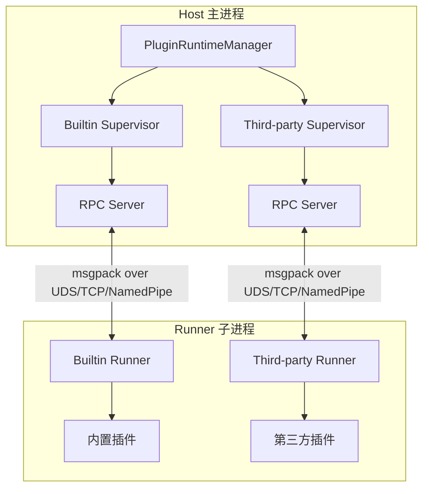

---
title: Plugin Development Guide
---# Plugin Development Guide

MaiBot's plugin system adopts a Host/Runner IPC architecture. Plugin code runs in independent child processes and communicates with the main process via an RPC protocol encoded with msgpack. This section introduces the architectural principles, development workflow, and core concepts of the plugin system.

## Architecture Overview



### Host (Main Process Side)

- **PluginRuntimeManager**: A singleton manager that manages two Supervisors: Builtin and Third-party.
- **PluginSupervisor**: Responsible for the startup, shutdown, health checks, and hot-reloading of Runner child processes.
- **ComponentRegistry**: A component registry that manages all Tools, Commands, and other components declared by plugins.
- **HookDispatcher**: A Hook dispatcher that routes named Hook calls to the corresponding Supervisor.

### Runner (Child Process Side)

- Each Supervisor manages its own independent Runner child process.
- Discovers and loads plugins via `PluginLoader`.
- Communicates with the Host via `RPCClient`.
- Injects `PluginContext` after plugin loading, then calls the `on_load()` lifecycle methods.

### Communication Protocol

- **Encoding/Decoding**: Uses msgpack format for binary serialization (`MsgPackCodec`).
- **Transport Layer**: Supports three transport methods: Unix Domain Socket, TCP, and Named Pipe.
- **RPC Model**:
  - Host $\rightarrow$ Runner: Calls plugin components (Tool, Command, etc.) via `invoke_plugin()`.
  - Runner $\rightarrow$ Host: Plugins initiate RPC callbacks (such as `ctx.send.text()`, `ctx.db.query()`) through the capabilities of `self.ctx`.

## Quick Start

### 1. Install SDK

```bash
pip install maibot-plugin-sdk
```

::: tip 注意
The package name is `maibot-plugin-sdk`, but use `maibot_sdk` when importing in code:
```python
from maibot_sdk import MaiBotPlugin, Command, Tool
```
:::

### 2. Create Plugin Directory

```
plugins/
└── my-plugin/
    ├── _manifest.json
    ├── plugin.py
    └── config.toml          # 可选
```

### 3. Write Manifest

Declare plugin metadata in `_manifest.json` (see [Manifest System](./manifest.md) for full field descriptions):

```json
{
  "manifest_version": 2,
  "id": "com.example.my-plugin",
  "version": "1.0.0",
  "name": "我的插件",
  "description": "一个示例插件",
  "author": {
    "name": "开发者",
    "url": "https://github.com/developer"
  },
  "license": "MIT",
  "urls": {
    "repository": "https://github.com/developer/my-plugin"
  },
  "host_application": {
    "min_version": "1.0.0",
    "max_version": "1.99.99"
  },
  "sdk": {
    "min_version": "1.0.0",
    "max_version": "2.99.99"
  },
  "capabilities": ["send_message"],
  "i18n": {
    "default_locale": "zh-CN"
  }
}
```

### 4. Write Plugin Code

Inherit from `MaiBotPlugin` in `plugin.py`, use decorators to declare components, and implement three lifecycle methods:

```python
from maibot_sdk import MaiBotPlugin, Command, Tool
from maibot_sdk.types import ToolParameterInfo, ToolParamType


class MyPlugin(MaiBotPlugin):
    async def on_load(self) -> None:
        self.ctx.logger.info("插件已加载")

    async def on_unload(self) -> None:
        self.ctx.logger.info("插件已卸载")

    async def on_config_update(self, scope: str, config_data: dict, version: str) -> None:
        if scope == "self":
            self.ctx.logger.info("插件配置已更新: version=%s", version)

    @Tool(
        "greet",
        brief_description="向用户打招呼",
        detailed_description="参数说明：\n- stream_id：string，必填。当前聊天流 ID。",
        parameters=[
            ToolParameterInfo(
                name="stream_id",
                param_type=ToolParamType.STRING,
                description="当前聊天流 ID",
                required=True,
            ),
        ],
    )
    async def handle_greet(self, stream_id: str, **kwargs):
        await self.ctx.send.text("你好！", stream_id)
        return {"success": True, "message": "已回复"}

    @Command("hello", pattern=r"^/hello")
    async def handle_hello(self, **kwargs):
        await self.ctx.send.text("Hello!", kwargs["stream_id"])
        return True, "Hello!", 2


def create_plugin():
    return MyPlugin()
```

::: warning 必须实现三个生命周期方法
The SDK requires all plugins to implement the `on_load()`, `on_unload()`, and `on_config_update()` methods; otherwise, the Runner will refuse to load them. See [Lifecycle](./lifecycle.md) for details.
:::

### 5. Install and Run

Place the plugin directory into the `plugins/` folder. After starting MaiBot, the plugin will be automatically discovered and loaded. Plugin management can also be performed via the WebUI.

## Core Concepts

### Plugin Base Class

All plugins must inherit from `MaiBotPlugin` and declare plugin capabilities via class attributes and decorators:

```python
from maibot_sdk import MaiBotPlugin, Tool, Command, CONFIG_RELOAD_SCOPE_SELF
from typing import ClassVar, Iterable


class MyPlugin(MaiBotPlugin):
    # 订阅全局配置热重载（仅 "bot" 和 "model" 两个值有效）
    config_reload_subscriptions: ClassVar[Iterable[str]] = ("bot", "model")

    @Tool("my_tool", brief_description="示例工具")
    async def handle_tool(self, **kwargs):
        ...

    @Command("my_cmd", pattern=r"^/my_cmd")
    async def handle_cmd(self, **kwargs):
        ...


def create_plugin():
    return MyPlugin()
```

### Component Decorators

The SDK provides 8 types of component decorators, all imported from the `maibot_sdk` top-level:

| Decorator | Purpose | Description |
|-----------|---------|-------------|
| `@Tool` | LLM Tool/Function Call | Tools callable by the LLM; the most commonly used component type |
| `@Command` | Slash Command | Commands triggered by users via regex matching |
| `@HookHandler` | Named Hook Handler | Subscribes to specific Hook points; supports blocking/observe modes |
| `@EventHandler` | Message/Workflow Event | Listens for lifecycle events such as messages and LLM generation |
| `@API` | Inter-plugin API | Exposes APIs that can be called by other plugins |
| `@MessageGateway` | Platform Adapter | Integrates external platforms (QQ, Discord, etc.) into MaiBot |
| `@LLMProvider` | LLM Provider | Declares new LLM model access points (client_type) to extend model services |
| `@Action` | Legacy Plugin Compatibility | Automatically converted internally to `@Tool`; new plugins should use `@Tool` directly |

### Capability Proxy

Access 17 types of capability proxies via `self.ctx`. All calls are automatically forwarded to the Host via RPC:

```python
# 上下文访问
self.ctx              # PluginContext 实例
self.ctx.paths        # 插件持久化与运行时目录
self.ctx.logger       # logging.Logger，名称为 "plugin.<plugin_id>"

# 能力代理
self.ctx.api          # 插件 API 查询、调用与动态同步
self.ctx.gateway      # 消息网关路由与运行时状态上报
self.ctx.send         # 发送文本、图片、表情、转发、混合消息
self.ctx.db           # 数据库增删改查计数
self.ctx.llm          # LLM 文本生成、工具调用、嵌入向量与 ASR 语音识别
self.ctx.config       # 插件配置读取
self.ctx.emoji        # 表情包管理
self.ctx.message      # 历史消息查询
self.ctx.frequency    # 发言频率控制
self.ctx.component    # 插件与组件管理
self.ctx.chat         # 聊天流查询、打开或创建聊天流
self.ctx.person       # 用户信息查询
self.ctx.render       # 将 HTML 渲染为 PNG 图片
self.ctx.knowledge    # LPMM 知识库搜索
self.ctx.statistics   # 本机统计与计费数据读取
self.ctx.tool         # LLM 工具定义查询
self.ctx.maisaka      # Maisaka 上下文追加与主动任务
```

### Configuration Model

Plugins can declare strongly-typed configurations via `PluginConfigBase`. The Runner will automatically generate default configurations and a WebUI Schema:

```python
from maibot_sdk import MaiBotPlugin, PluginConfigBase, Field


class MyPluginConfig(PluginConfigBase):
    enabled: bool = Field(default=True, description="是否启用插件")
    greeting: str = Field(default="你好！", description="默认问候语")


class MyPlugin(MaiBotPlugin):
    config_model = MyPluginConfig

    async def on_load(self) -> None:
        # 通过 self.config 访问强类型配置
        self.ctx.logger.info("当前问候语: %s", self.config.greeting)
        # 通过 self.get_plugin_config_data() 访问原始 dict
        raw = self.get_plugin_config_data()
```

- After declaring `config_model`, `self.config` returns a strongly-typed configuration instance.
- Calling `self.config` without a declaration will throw `RuntimeError`.
- `self.get_plugin_config_data()` is always available and returns the raw configuration dictionary.
- The configuration source is the `config.toml` file in the plugin directory.

## Directory Structure Convention

```
my-plugin/
├── _manifest.json       # 必需：插件清单
├── plugin.py            # 必需：插件入口，包含 create_plugin()
├── config.toml          # 可选：插件配置
├── i18n/                # 可选：国际化资源
│   ├── zh-CN.json
│   └── en-US.json
└── assets/              # 可选：静态资源
```

Plugin runtime data should not be written to the plugin source directory. Starting from SDK 2.6.0, you can obtain the Host-injected plugin-exclusive directory via `self.ctx.paths`:

```python
self.ctx.paths.data_dir     # 持久化数据，默认 data/plugins/<plugin_id>/
self.ctx.paths.runtime_dir  # 临时数据，默认 temp/plugins/<plugin_id>/
```

- `data_dir` is suitable for saving plugin databases, JSON states, user-generated content, and other data that needs to persist across restarts.
- `runtime_dir` is suitable for saving download caches, rendering intermediate products, and reconstructible temporary files.
- Do not use the legacy `plugins/<plugin>/data` to save new data; do not concatenate user input directly into file paths to avoid path traversal via `..` or absolute paths.

## Built-in Plugins vs. Third-party Plugins

MaiBot maintains two independent Runner child processes:

- **Built-in Plugins**: Located in `src/plugins/built_in/`, running under the Builtin Supervisor.
- **Third-party Plugins**: Located in `plugins/`, running under the Third-party Supervisor.

Both use the same communication protocol and component registration mechanism. The startup order between Supervisors is determined by cross-Supervisor dependencies; if a circular dependency is detected, startup will be refused.

## Next Steps

- [Manifest System](./manifest.md): Learn about the full field definitions and validation rules of `_manifest.json`.
- [Lifecycle](./lifecycle.md): Learn about the lifecycle methods for plugin loading, unloading, and configuration hot-reloading.
- [Hook System](./hooks.md): Learn how to use @HookHandler to intercept and rewrite messages.
- [Tool Component](./tools.md): Learn how to develop tool components callable by the LLM.
- [Command Component](./commands.md): Learn how to develop slash command components.
- [LLMProvider Component](./llmprovider.md): Learn how to develop custom LLM Providers to integrate new models.
- [Action Component](./actions.md): Learn about the @Action decorator for legacy system compatibility.
- [Configuration Management](./config.md): Learn how to declare and use plugin configurations.
- [API Reference](./api-reference.md): Consult the complete Plugin SDK API.