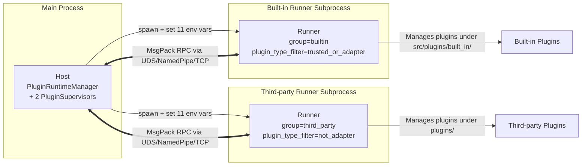

# Plugin Runtime Internal Architecture

This document is for readers who need to deploy, operate, or troubleshoot plugin issues. It dissects the internal design of MaiBot's plugin runtime. If you intend to write plugins (rather than operate them), start with the [Plugin Development Documentation](/en/plugin/) to understand Manifest, component registration, lifecycle callbacks, and other developer-facing usage. This document only discusses what happens between the Host and Runner, and does not cover decorator signatures like `@Tool` / `@Command` / `@Hook`.

[[toc]]

## Overall Architecture: Host / Runner Dual-Process Model

MaiBot's plugin system consists of **three roles**:

**Host** runs within the main process, managed by the `PluginRuntimeManager` singleton. It holds two `PluginSupervisor` instances, responsible for built-in and third-party plugins respectively.

**Runner** is an independent child process launched by the Host via `asyncio.create_subprocess_exec`, with the entry point `python -m src.plugin_runtime.runner.runner_main`. Each Supervisor corresponds to one Runner, so the entire system has at most two Runner child processes running simultaneously.

**Plugins** themselves are ordinary Python packages or directories placed under `src/plugins/built_in/` or `plugins/`, scanned, loaded, and activated by the Runner. Plugins never communicate directly with the Host; all RPC goes through the Runner.

### Why Split Into Two Child Processes

MaiBot defines three plugin types (Manifest `plugin_type` field):

- **`extension`** — Ordinary extension plugin
- **`adapter`** — Platform adapter plugin (e.g. NapCat bridge layer)
- **`trusted`** — Trusted plugin (manually marked, uses the built-in channel)

`PluginRuntimeManager` creates two Supervisors at startup:

1. **`builtin` Supervisor** — `plugin_type_filter="trusted_or_adapter"`, manages the `src/plugins/built_in/` directory and can also load `adapter` / `trusted` plugins from third-party directories
2. **`third_party` Supervisor** — `plugin_type_filter="not_adapter"`, manages the `plugins/` directory, responsible for `extension`-type third-party plugins

This split isolates "platform-level adapters" from "ordinary extensions" into different processes. If a third-party plugin crashes, it can at most drag down the third-party Runner without directly affecting the adapter pipeline.

## Transport Layer: UDS / NamedPipe / TCP

Communication between Host and Runner uses MsgPack-encoded RPC frames. The transport layer is implemented in `src/plugin_runtime/transport/`, with the factory function auto-selecting based on the platform:

**`plugin_runtime.transport.factory.create_transport_server()`** — Host side creates the server:

- **Linux / macOS** — Unix Domain Socket (`UDSTransportServer`)
- **Windows** — Named Pipe (`NamedPipeTransportServer`)

**`plugin_runtime.transport.factory.create_transport_client()`** — Runner side auto-detects based on address format:

- Address starts with `\\.\pipe\` → Named Pipe
- Address contains `/` or ends with `.sock` → UDS
- Address contains `:` → TCP (`TCPTransportClient`)

The custom IPC path is specified via the `plugin_runtime.ipc_socket_path` configuration item. The Supervisor appends `-builtin` / `-third_party` suffixes to distinguish the two Runners' access points.

## Startup Flow and 11 Environment Variables

### Startup Sequence

1. `PluginRuntimeManager.start()` creates two `PluginSupervisor` instances
2. Each Supervisor calls `_build_runner_environment()` to construct the environment variable dictionary
3. The Runner child process is launched via `asyncio.create_subprocess_exec`, injecting all environment variables
4. After starting, the Runner reads the environment variables and actively initiates a TCP/UDS connection to the Host's IPC address
5. The Runner sends a `runner.hello` handshake request; the Host verifies the `session_token` and SDK version
6. After a successful handshake, the Runner installs the IPC log handler, loads plugins, and registers them with the Host
7. The Runner sends `runner.ready` to notify the Host that plugin initialization is complete

### Complete Environment Variable List

The following 11 environment variables are defined as constants in `src/plugin_runtime/__init__.py` and set by the Supervisor in `_build_runner_environment()`. The Runner reads them in `_async_main()` at startup.

**`MAIBOT_IPC_ADDRESS`** — IPC transport layer listening address (UDS socket path or TCP `host:port`). The Runner uses this address to connect to the Host.

**`MAIBOT_SESSION_TOKEN`** — Authentication token for this session. The Host regenerates it on every spawn / reload, and the Runner must return it during the `runner.hello` handshake. This item is also `pop`ped from `os.environ` to prevent leakage.

**`MAIBOT_PLUGIN_DIRS`** — Plugin directories the Runner should scan, separated by `os.pathsep`.

**`MAIBOT_PLUGIN_TYPE_FILTER`** — The filter mode the Runner uses for plugin manifest `plugin_type`. Set to `trusted_or_adapter` for the `builtin` Supervisor and `not_adapter` for the `third_party` Supervisor.

**`MAIBOT_TRUSTED_PLUGIN_DIRS`** — Plugin root directories always trusted in the filter mode, separated by `os.pathsep`. The `builtin` Supervisor sets `src/plugins/built_in/` as this value.

**`MAIBOT_HOST_VERSION`** — Host application version number, used by the Runner for manifest compatibility validation.

**`MAIBOT_EXTERNAL_PLUGIN_IDS`** — JSON object telling the Runner which "external" plugins have already been loaded by another Supervisor and can be considered as satisfied dependencies. Example: `{"some-plugin-id": "1.2.0"}`.

**`MAIBOT_BLOCKED_PLUGIN_REASONS`** — JSON object telling the Runner which plugins are blocked from loading by the dependency pipeline and why. Example: `{"blocked-plugin": "missing dependency: pkg-name"}`.

**`MAIBOT_RUNNER_GROUP`** — The runtime group name the Runner belongs to. Either `builtin` or `third_party`, used to distinguish the two child processes in diagnostic logs.

**`MAIBOT_GLOBAL_CONFIG_SNAPSHOT`** — Reserved field. The constant is defined in the current version but not yet actually injected into the Runner during startup, intended for future global config snapshot distribution.

**`MAIBOT_PLUGIN_SDK_PATH`** — Path to the local `maibot-plugin-sdk` repository. If set, the Runner imports the SDK from this path via `PYTHONPATH` precedence, without needing a PyPI installation. Suitable for SDK co-development scenarios.

## Envelope Protocol

All Host ↔ Runner messages are encapsulated in a unified `Envelope` structure (defined in `src/plugin_runtime/protocol/envelope.py`), with the serialization chain being `Envelope → .model_dump() → MsgPack encode`.

Envelope fields at a glance (Pydantic `BaseModel`):

**`protocol_version`** — Protocol version, fixed at `1.0.0`. Used for forward compatibility.

**`request_id`** — Monotonically increasing int64 request ID, generated by `RequestIdGenerator`. The same request/response pair shares this ID.

**`message_type`** — Message type enum. Values: `request`, `response`, `broadcast`.

**`method`** — RPC method name string, e.g. `plugin.health`, `cap.call`.

**`plugin_id`** — Target plugin ID. Used to route the request to the correct plugin instance within the Runner.

**`timestamp_ms`** — Send timestamp (Unix epoch milliseconds).

**`timeout_ms`** — Relative timeout (milliseconds), default 30000.

**`payload`** — Business data dictionary. Carries structured payloads depending on the method (e.g. `InvokePayload`, `ConfigUpdatedPayload`).

**`error`** — Error information dictionary (response messages only). Contains `code` (error code), `message` (error description), `details` (detailed information). Error codes are defined in the `ErrorCode` enum in `src/plugin_runtime/protocol/errors.py`.

Envelope provides three convenience methods: `is_request()`, `is_response()`, `is_broadcast()`, as well as `make_response()` / `make_error_response()` for constructing corresponding response envelopes from a request.

## RPC Method Catalog

### Host → Runner (16 methods)

The following methods are initiated by the Host to the Runner, registered in `PluginRunner._register_handlers()` (source line numbers 1232-1247):

1. **`plugin.invoke_command`** — Invoke a command component registered by the plugin
2. **`plugin.invoke_action`** — Invoke an action component registered by the plugin
3. **`plugin.invoke_api`** — Invoke an API component registered by the plugin
4. **`plugin.invoke_tool`** — Invoke a tool component registered by the plugin
5. **`plugin.invoke_message_gateway`** — Invoke the plugin's message gateway component
6. **`plugin.invoke_llm_provider`** — Invoke the plugin's LLM Provider
7. **`plugin.emit_event`** — Distribute an event to the plugin
8. **`plugin.invoke_hook`** — Invoke a named Hook registered by the plugin
9. **`plugin.health`** — Query the Runner's health status
10. **`plugin.prepare_shutdown`** — Notify the Runner to prepare for shutdown (drain buffers)
11. **`plugin.shutdown`** — Notify the Runner to shut down immediately
12. **`plugin.config_updated`** — Push plugin configuration updates
13. **`plugin.inspect_config`** — Request the Runner to parse plugin configuration metadata (default config, schema, normalized results)
14. **`plugin.validate_config`** — Request the Runner to validate plugin configuration
15. **`plugin.reload`** — Request the Runner to hot-reload a single plugin
16. **`plugin.reload_batch`** — Request the Runner to batch hot-reload plugins

### Runner → Host (Brief)

The Runner also sends requests to the Host, registered in the Supervisor's `_register_internal_methods()`:

- **`plugin.bootstrap`** — The Runner reports plugins that are loaded but not yet activated, requesting the Host perform secondary initialization
- **`plugin.register_components` / `plugin.register_plugin`** — The Runner registers plugin component lists with the Host (legacy naming compatibility)
- **`plugin.unregister`** — The Runner deregisters a plugin from the Host
- **`runner.hello`** — Handshake request (handled by `RPCServer._handle_handshake`)
- **`runner.ready`** — The Runner notifies the Host that all plugin initialization is complete
- **`runner.log_batch`** — The Runner batch-pushes logs to the Host's `RunnerLogBridge`

Additionally, there are capability invocation methods like `cap.call`, `host.route_message` (message gateway routing inbound), and `host.update_message_gateway_state` (message gateway state update) that the Runner transparently passes through via the `_PLUGIN_ALLOWED_RAW_HOST_METHODS` whitelist.

## Manifest v2 Key Fields

Plugins declare their metadata through `manifest.toml`. The `PluginManifest` model (defined in `manifest_validator.py:611-806`) enforces the v2 protocol (`manifest_version: Literal[2]`) and performs strict validation on key fields. Below are the fields relevant to operations:

**`id`** — Stable plugin ID, formatted as alphanumeric/underscore separated by dots or hyphens, e.g. `github.author.plugin`. **Must not duplicate any other plugin's ID**, otherwise loading is rejected at startup.

**`manifest_version`** — Fixed at `2`. Manifests below v2 are rejected.

**`version`** — Plugin version number, **must be strict three-segment semantic versioning** (e.g. `1.0.0`).

**`name`** — Plugin display name. Cannot be empty.

**`description`** — Plugin description. Cannot be empty.

**`author`** — Author information (sub-object: `name`, `email`, `url`).

**`license`** — Plugin license identifier (e.g. `MIT`, `Apache-2.0`). Cannot be empty.

**`urls`** — Plugin-related links (sub-object: `homepage`, `repository`, `documentation`).

**`host_application`** — Host compatible version range (`min` / `max` / `allow_prerelease`). The Runner compares against its own `MAIBOT_HOST_VERSION` to decide whether to load.

**`sdk`** — SDK compatible version range (same format as above). The Runner compares against the SDK version to decide whether to load.

**`dependencies`** — Dependency declaration list. Each declaration can be `type=plugin` (depends on another plugin ID + version range) or `type=python_package` (depends on a PyPI package). The Runner checks all dependencies are satisfied before loading.

**`llm_providers`** — Static list of LLM Providers declared by the plugin. Each Provider specifies `client_type` (corresponding to `api_providers[].client_type` in model configuration).

**`capabilities`** — List of capability requests declared by the plugin (string array). See the "Capability System" section below.

**`i18n`** — Internationalization configuration (sub-object: `default_locale`, `supported_locales`).

**`plugin_type`** — Plugin type: `extension`, `adapter`, `trusted`. Determines which Supervisor takes over.

**`display`** — Optional display metadata (sub-object: `icon`, `color`, `category`).

**`changelog`** — Optional changelog address. Can be an HTTP(S) URL or a `.md` relative path within the plugin directory.

## Capability System: 60+ Capabilities Classification

Plugins declare which Host-side capabilities they need to call through the Manifest's `capabilities` field. The Host registers 70+ capability implementations with each Supervisor's `CapabilityService` in `register_capability_impls()` (defined in `src/plugin_runtime/capabilities/registry.py`). The PluginRunner automatically validates that every capability declared by the plugin exists in the Host-side registry; activation is rejected if any capability is missing.

Below is the full capability catalog classified by namespace:

### send — Message Sending (7)

- **`send.text`** — Send text message
- **`send.emoji`** — Send emoji
- **`send.image`** — Send image
- **`send.forward`** — Send forwarded message
- **`send.hybrid`** — Send hybrid message
- **`send.command`** — Send command message
- **`send.custom`** — Send custom message

### llm — Large Model Invocation (5)

- **`llm.generate`** — Invoke LLM to generate reply
- **`llm.generate_with_tools`** — Invoke LLM to generate reply (with tool calls)
- **`llm.embed`** — Text embedding
- **`llm.transcribe_audio`** — Audio to text
- **`llm.get_available_models`** — Get available model list

### config — Configuration Access (3)

- **`config.get`** — Read a global configuration item
- **`config.get_plugin`** — Read a specific plugin's configuration
- **`config.get_all`** — Read all configuration

### database — Data Persistence (5)

- **`database.query`** — Custom query
- **`database.save`** — Save record
- **`database.get`** — Get record
- **`database.delete`** — Delete record
- **`database.count`** — Count records

### chat — Session Management (6)

- **`chat.get_all_streams`** — Get all message streams
- **`chat.get_group_streams`** — Get group message streams
- **`chat.get_private_streams`** — Get private message streams
- **`chat.open_session`** — Open session
- **`chat.get_stream_by_group_id`** — Get message stream by group ID
- **`chat.get_stream_by_user_id`** — Get message stream by user ID

### message — Message Retrieval (6)

- **`message.get_by_time`** — Query messages by time range
- **`message.get_by_time_in_chat`** — Query messages by time range in a specific chat
- **`message.get_by_id`** — Query message by message ID
- **`message.get_recent`** — Get recent messages
- **`message.count_new`** — Count new messages
- **`message.build_readable`** — Build readable message text

### person — Persona System (3)

- **`person.get_id`** — Get current persona ID
- **`person.get_value`** — Get a specific persona's settings value
- **`person.get_id_by_name`** — Find persona ID by name

### emoji — Emoji Management (8)

- **`emoji.get_by_description`** — Find emoji by description
- **`emoji.get_random`** — Get random emoji
- **`emoji.get_count`** — Get total emoji count
- **`emoji.get_emotions`** — Get emotion-associated emojis
- **`emoji.get_all`** — Get all emojis
- **`emoji.get_info`** — Get emoji information
- **`emoji.register`** — Register new emoji
- **`emoji.delete`** — Delete emoji

### frequency — Message Frequency Control (3)

- **`frequency.get_current_talk_value`** — Get current message frequency coefficient
- **`frequency.set_adjust`** — Set frequency adjustment
- **`frequency.get_adjust`** — Get frequency adjustment

### api — HTTP API Calls (4)

- **`api.call`** — Call external API
- **`api.get`** — Get API definition
- **`api.list`** — List available APIs
- **`api.replace_dynamic`** — Replace API dynamic parameters

### component — Plugin Component Management (11)

- **`component.get_all_plugins`** — Get all plugin information
- **`component.get_plugin_info`** — Get specific plugin information
- **`component.get_plugin_config_schema`** — Get plugin config schema
- **`component.update_plugin_config`** — Update plugin configuration
- **`component.list_loaded_plugins`** — List loaded plugins
- **`component.list_registered_plugins`** — List registered plugins
- **`component.enable`** — Enable plugin
- **`component.disable`** — Disable plugin
- **`component.load_plugin`** — Load plugin
- **`component.unload_plugin`** — Unload plugin
- **`component.reload_plugin`** — Reload plugin

### maisaka — Maisaka Inference System (2)

- **`maisaka.context.append`** — Append content to inference context
- **`maisaka.proactive.trigger`** — Trigger proactive message

### statistics — Statistics (7)

- **`statistics.local.models`** — Local model usage statistics
- **`statistics.local.model_trend`** — Model usage trend
- **`statistics.local.token_trend`** — Token consumption trend
- **`statistics.local.token_distribution`** — Token distribution
- **`statistics.local.message_trend`** — Message count trend
- **`statistics.local.tool_trend`** — Tool call trend
- **`statistics.local.online_time_trend`** — Online duration trend

### render — Rendering (1)

- **`render.html2png`** — Render HTML to PNG image

### Other

- **`knowledge.search`** — Knowledge base search
- **`tool.get_definitions`** — Get tool definitions

> The above totals 73 capabilities. If a plugin's manifest `capabilities` declares a capability name not listed above, the Runner will reject activation of that plugin.

## Lifecycle: ON_LOAD / ON_UNLOAD / CONFIG_UPDATED

A plugin's lifecycle within the Runner consists of three key phases, all implemented through method calls on the plugin instance (not Host-side concepts):

### ON_LOAD — Loading and Activation

The Runner completes the plugin scanning → instantiation → dependency check → `_activate_plugin()` flow in its `run()` method:

1. `PluginLoader.discover_and_load()` scans all valid directories under `MAIBOT_PLUGIN_DIRS`, parses manifests, and instantiates plugin classes
2. The Runner calls `_activate_plugin(meta)` for each plugin in dependency topological order
3. Activation process: inject `PluginContext` runtime context → inject plugin's configuration → call `on_load()` lifecycle hook
4. After successful activation, the Runner sends the component list to the Host via `plugin.register_components`
5. If activation fails, the Runner reports it in the `failed_plugins` / `failed_plugin_reasons` fields of `runner.ready`

### ON_UNLOAD — Unloading and Shutdown

When the Runner receives a `plugin.unregister` request: calls the plugin instance's `on_unload()` hook → removes from internal registry → notifies Host to deregister components. During global shutdown, the Host first sends `plugin.prepare_shutdown` (drain buffers), then `plugin.shutdown`, and the Runner unloads all plugins in sequence before exiting.

### CONFIG_UPDATED — Configuration Hot Reload

The Host pushes configuration changes via `plugin.config_updated`. Upon receipt, the Runner: calls the plugin instance's `set_plugin_config()` to inject the new configuration → triggers `on_config_updated()` callback if the plugin implements it. The configuration scope is controlled by the `ConfigReloadScope` enum: `self` (current plugin only), `bot` (bot-level config), `model` (model config).

## Hot Reload Mechanism

MaiBot supports reloading plugin code without restarting the process. The entry point for hot reload is `PluginRuntimeManager.reload_plugins_globally()`.

### Concurrency Guard

The Runner maintains an internal `_reload_lock: asyncio.Lock`. Any reload request entering `_handle_reload_plugin` or `_handle_reload_plugins` first acquires this lock. If another reload is already in progress, the new request is rejected. `reload_lock` ensures that within a single Runner, only one reload process runs at a time.

### Global Reload Flow

1. `reload_plugins_globally()` receives a list of plugin IDs
2. Filters out plugins blocked from loading by the dependency pipeline (those in `_blocked_plugin_reasons`)
3. Groups by Supervisor (already-registered plugins go to their original Supervisor, unregistered ones are located by directory scanning)
4. Each Supervisor triggers the in-Runner reload via the `plugin.reload_batch` RPC
5. If a registered plugin has dependents across Supervisors, only a warning is logged; no cascading reload occurs

### Dependency Cascading

Within a single Runner, if reloading plugin X discovers that plugin Y depends on X, Y is also automatically included in this reload (cascading reload). After reload completes, the Runner reports results uniformly (which succeeded / which failed / which became inactive).

## File Watching and Automatic Hot Reload

At startup, MaiBot creates a `FileWatcher` instance (`integration.py:1345`) to monitor all plugin directories for changes:

- **Source subscription** (`_handle_plugin_source_changes`) — Watches for `.py` file creation / modification / deletion events within plugin directories. When changes are detected, triggers hot reload of the corresponding plugin.
- **Config subscription** (`_refresh_plugin_config_watch_subscriptions`) — Subscribes each registered plugin individually to its `config.toml` configuration file. Pushes `plugin.config_updated` on configuration changes.

Watcher parameters:

- **`debounce_ms=600`** — 600ms debounce, prevents consecutive writes from triggering multiple reloads
- **`callback_timeout_s=15.0`** — Single callback timeout of 15 seconds
- **`callback_failure_threshold=3`** — Enters cooldown after 3 consecutive failures
- **`callback_cooldown_s=30.0`** — Cooldown duration of 30 seconds

When the entire Runner shuts down or restarts, the Watcher's subscriptions are cleaned up as well.

## What Happens When a Plugin Dies

### Runner-Level Restart

The Supervisor has a built-in `_health_check_loop()` that sends `plugin.health` requests to the Runner at `health_check_interval_sec` intervals (default 30 seconds). Scenarios that trigger a restart:

- **Runner process exited** — `_health_check_loop` detects `process.returncode is not None`, triggers `_restart_runner(reason="runner_process_exited")`
- **Health check failure** — `plugin.health` returns `healthy=False`, triggers `_restart_runner(reason="health_check_unhealthy")`
- **Health check exception** — RPC call throws an exception, triggers `_restart_runner(reason="health_check_failed")`

### Restart Attempt Limit

`_restart_runner()` maintains a `_restart_count` counter. Each successful restart resets the count; each failure increments it. When `_restart_count >= max_restart_attempts` (default 3), the Supervisor stops attempting and logs an error. This value can be configured via `plugin_runtime.max_restart_attempts`.

### Restart Flow

1. `_shutdown_runner` — Attempts to send `plugin.prepare_shutdown` + `plugin.shutdown` to the Runner; if RPC is unreachable, directly terminates, with a 5-second timeout before kill
2. `_spawn_runner` — Re-launches the child process, injecting the same 11 environment variables
3. `_wait_for_runner_connection` — Waits for the Runner to connect to IPC (at most `runner_spawn_timeout_sec` seconds, default 30 seconds)
4. `_wait_for_runner_ready` — Waits for the Runner to initialize all plugins and emit `runner.ready`

## Troubleshooting Guide

### How to Distinguish Built-in and Third-party Runners

Check the `MAIBOT_RUNNER_GROUP` environment variable:

- Value of `builtin` → Built-in Supervisor's Runner, manages the `src/plugins/built_in/` directory
- Value of `third_party` → Third-party Supervisor's Runner, manages the `plugins/` directory

Searching for these keywords in logs also helps quickly locate:

- `"plugin_runtime.runner.main"` — Runner process main flow logs
- `"plugin_runtime.host.runner_manager"` — Host-side Supervisor logs
- `"plugin_runtime.integration"` — `PluginRuntimeManager`-level logs

### Troubleshooting Runner Startup Failures

**Runner process never started**: Check whether `maibot-plugin-sdk` is installed in the Python environment (or whether `MAIBOT_PLUGIN_SDK_PATH` is correctly set). The Runner executes `activate_local_sdk_import_path()` first at startup to mount the local SDK.

**Handshake failure**: Search for `runner.hello` in Runner logs. Common causes: `MAIBOT_SESSION_TOKEN` mismatch (Host restarted but Runner still using old token), SDK version not within Host's allowed range (Host rejects and returns a `reason` field), an active connection already occupying the channel.

**Plugin loading failure**: Search logs for `"Plugin initialization failed"` or `"Dependency not satisfied"`. The Runner reports three lists in the `runner.ready` payload: `failed_plugins`, `failed_plugin_reasons`, `inactive_plugins`. To investigate why a plugin isn't working, first confirm which Runner group it's in (`MAIBOT_RUNNER_GROUP`), then check the corresponding Runner logs.

### Plugin Hot Reload Not Taking Effect

1. Confirm the Watcher is running: search logs for `"File watcher for plugins started"` or `FileWatcher`
2. Confirm file changes are detected: search for `_handle_plugin_source_changes`
3. Confirm the reload lock isn't held: search for `reload_lock`
4. Confirm the plugin isn't blocked from loading: search for the reason corresponding to `MAIBOT_BLOCKED_PLUGIN_REASONS`

### Diagnostic File

`_RUNNER_DEBUG_FILE_PATH` points to `logs/plugin_runtime_debug/runner_rpc_debug.jsonl` (under the project root). This file records RPC events from both the Host and Runner sides (handshakes, reloads, health check failures, etc.), with one JSON record per line containing fields like `event`, `timestamp`, `pid`, `supervisor_group`. When troubleshooting IPC communication issues, this is the primary data source.

> For plugin development (Manifest authoring, component registration, lifecycle hook implementation, etc.), please refer to the [Plugin Development Documentation](/en/plugin/).
