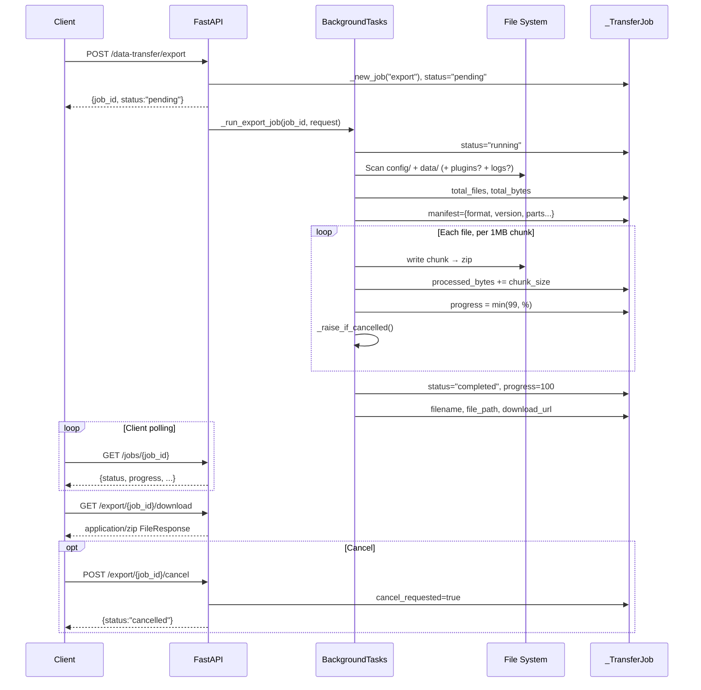

# Statistics and Data Import/Export

MaiBot continuously generates data at runtime: messages, model calls, tool executions, online duration, and more. This data has three consumption paths: **real-time dashboards** query raw tables directly via HTTP API, **hourly aggregation** is periodically written to summary tables by a background service for direct SQL reads, and **async export** packages files into zip archives through WebUI data-transfer endpoints. The three paths are independent, each serving different operational scenarios.

This document assumes you have already read [Database](./database.md) (for table structure) and [Data & Memory API](./webui-api/data-and-memory-api.md) (for user-side curl examples of data-transfer). Below we break down the principles, data availability boundaries, and typical operational commands for each path from a backend perspective.

## Hourly Aggregation Tables

MaiBot maintains four hourly-bucket aggregation tables prefixed with `statistics_*`, periodically written by an independent **incremental aggregation service**. These four tables are independent of the core tables in the [Database](./database.md#22-张表总览) ER diagram and do not participate in the main `session_id` relationship chain.

**`statistics_message_hourly`** — Aggregates hourly message counts uniquely by `(bucket_time, chat_id)`. `bucket_time` is the hour boundary, and `latest_timestamp` records the actual timestamp of the newest message in the bucket. Chat types are differentiated as `group` and `private`.

**`statistics_tool_hourly`** — Aggregates hourly tool call counts uniquely by `(bucket_time, tool_name)`. `tool_name` is written as `"unknown"` when `NULL`.

**`statistics_model_hourly`** — Aggregates uniquely by the `(bucket_time, request_type, model_name, provider_name)` quad. In addition to `request_count`, it accumulates `prompt_tokens` / `completion_tokens` / `total_tokens`, `cost` (in CNY), `time_cost_sum`, and `time_cost_sq_sum` (which can be used to calculate mean and variance of response times).

**`statistics_aggregation_cursors`** — Incremental cursor table, keyed by `source_name` (values: `"messages"`, `"tool_records"`, `"model_usage"`). `last_processed_id` records the maximum `id` last aggregated for that source table. Each run of the aggregation service only scans rows where `id > last_processed_id`, ensuring no loss and no duplicates.

> The schema definitions for the four aggregation tables are in `src/common/database/database_model.py:193-271`. Not all fields are enumerated here to avoid duplication with the database page.

## Aggregation Service Principles

The aggregation entry function `refresh_statistics_aggregates()` (`src/services/statistics_aggregation_service.py:12`) calls three sub-aggregation functions sequentially within a single database session, then commits all at once.

The core logic of each sub-aggregation function is identical:

1. **Read cursor** — Read the `last_processed_id` for the corresponding `source_name` from `statistics_aggregation_cursors`.
2. **Scan increment** — Filter the source table (`mai_messages` / `tool_records` / `llm_usage`) using `id > :last_id`, truncate `timestamp` to the hour boundary via `strftime('%Y-%m-%d %H:00:00')`.
3. **Group write** — After `GROUP BY bucket_time, ...`, use `INSERT ... ON CONFLICT DO UPDATE SET` for upsert: insert new buckets, or accumulate counts and token metrics onto existing rows for existing buckets.
4. **Advance cursor** — Write the source table's `MAX(id)` back to `statistics_aggregation_cursors`.

Taking message aggregation as an example, the SQL skeleton is as follows (omitting the `chat_name` completion logic in the `latest_message` subquery):

::: code-group

```sql [SQL ~vscode-icons:file-type-sql~]
INSERT INTO statistics_message_hourly (bucket_time, chat_id, chat_name, chat_type, message_count, latest_timestamp)
SELECT
    datetime(strftime('%Y-%m-%d %H:00:00', timestamp)) AS bucket_time,
    CASE WHEN group_id IS NOT NULL AND group_id != '' THEN 'g' || group_id
         ELSE 'u' || user_id END AS chat_id,
    ...,
    COUNT(*) AS message_count,
    MAX(timestamp) AS latest_timestamp
FROM mai_messages
WHERE id > :last_id AND timestamp IS NOT NULL
GROUP BY bucket_time, chat_id
ON CONFLICT(bucket_time, chat_id) DO UPDATE SET
    message_count = statistics_message_hourly.message_count + excluded.message_count,
    latest_timestamp = MAX(statistics_message_hourly.latest_timestamp, excluded.latest_timestamp);
```

:::

The aggregation service does not trigger automatically at MaiBot startup. It requires external scheduling (cron, WebUI background tasks, etc.) to periodically call `refresh_statistics_aggregates()`. Without scheduling, the four aggregation tables remain empty.

## Two Ways to Pull Data

### Method 1: Direct SQL Reads on Aggregation Tables

The aggregation table structures are fixed, making them suitable for direct queries by external BI tools (Metabase, Grafana, custom scripts) through read-only connections. This is the lowest-cost path because the data is pre-aggregated and doesn't require joins.

::: code-group

```sql [SQL ~vscode-icons:file-type-sql~]
-- Daily model cost trend over the past 30 days
SELECT
    date(bucket_time) AS day,
    COALESCE(model_name, 'unknown') AS model,
    SUM(cost) AS total_cost,
    SUM(total_tokens) AS total_tokens
FROM statistics_model_hourly
WHERE bucket_time >= datetime('now', '-30 days')
GROUP BY day, model
ORDER BY day DESC, total_cost DESC;
```

:::

If MaiBot is running, always set WAL mode and `busy_timeout` when connecting to the database file to avoid lock conflicts. See [Database / Connections and Sessions](./database.md#连接与会话) for details.

### Method 2: Statistics HTTP Endpoint

Functions in `statistics_service.py` aggregate directly from raw tables (`llm_usage`, `mai_messages`, `online_time`, `tool_records`) in real time, returning structured JSON data. The WebUI frontend consumes this data through three endpoints.

**`GET /api/webui/statistics/dashboard?hours=24`** — Returns five data groups in one call: `summary`, `model_stats`, `hourly_data`, `daily_data`, `recent_activity`. Has a built-in 20-minute local cache; subsequent requests within the cache validity period do not hit the database.

**`GET /api/webui/statistics/summary?hours=24`** — Returns summary only: total requests, total cost, total tokens, online duration, message count, reply count, average response time, cost per hour, and tokens per hour.

**`GET /api/webui/statistics/models?hours=24`** — Returns Top 10 model stats only: request count, cost, tokens, and average response time per model.

All endpoints require authentication (Cookie or Bearer token). Below are three curl examples:

::: code-group

```bash [curl Dashboard ~vscode-icons:file-type-http~]
curl -X GET "http://127.0.0.1:8001/api/webui/statistics/dashboard?hours=168" \
  -H "Cookie: maibot_session=YourToken"
```

```bash [curl Summary ~vscode-icons:file-type-http~]
curl -X GET "http://127.0.0.1:8001/api/webui/statistics/summary?hours=24" \
  -H "Cookie: maibot_session=YourToken"
```

```bash [curl Model Stats ~vscode-icons:file-type-http~]
curl -X GET "http://127.0.0.1:8001/api/webui/statistics/models?hours=720" \
  -H "Cookie: maibot_session=YourToken"
```

:::

The `hours` parameter accepts any positive integer such as 24 (last day), 168 (last week), 720 (last 30 days). Caching is bucketed by the `hours` value; different parameters have independent caches.

## Data-Transfer Export/Import: Backend Job Flow

`data_transfer.py` (474 lines) implements a complete async job system. For the frontend perspective on curl operations, see [Data & Memory API](./webui-api/data-and-memory-api.md#data-transfer-导出导入). Here we expand on the backend execution details.

### Job Lifecycle

All jobs are managed by the in-memory dict `_jobs: dict[str, _TransferJob]` and are not persisted. All in-progress jobs are lost when MaiBot restarts.

An export job's state machine is `pending → running → completed | failed | cancelled`. An import job only has `pending → running → completed | failed` and does not support mid-operation cancellation.

### Export Job Execution Flow

`_run_export_job()` runs asynchronously as a FastAPI `BackgroundTasks`, so the main thread is not blocked on the HTTP response. The flow is as follows:

1. **Determine scope** — `config` and `data` are always included; `plugins` and `logs` are determined by the request parameters `include_plugins` / `include_logs`.
2. **Scan files** — `_iter_export_files()` iterates through each directory, skipping symlinks and permission-denied files. Before reading each file, it calls `_raise_if_cancelled()` to check the cancellation flag.
3. **Generate manifest** — `_build_manifest()` produces JSON containing `format`, `format_version`, `created_at`, `maibot_version`, `included`, and `parts` statistics.
4. **Write archive** — Streams data into the zip in 1 MB chunks. After each chunk, `processed_bytes` is updated and `progress` percentage is refreshed. Before reaching 100%, progress is capped at 99%.
5. **Complete or clean up** — On normal completion, `status="completed"`, `progress=100`. On cancellation, the generated temporary zip is cleaned up. On exception, the `error` field is recorded.

`_raise_if_cancelled()` checks the `job.cancel_requested` flag, which is set by the `POST /export/{job_id}/cancel` endpoint. Since zip writing is single-threaded, cancellation is not instantaneous; it takes effect on the next check after the current chunk finishes writing.

### Import Job Security Validation

`_run_import_job()` performs three layers of protection before writing to the file system:

- **Manifest validation** — Checks that `format == "maibot-data-archive"` and `format_version == 1`.
- **Path safety** — `_safe_zip_member_path()` rejects absolute paths, `..` traversal, and top-level directories not in the whitelist (`{config, data, plugins, logs}`). `_validate_archive_members()` additionally rejects symbolic links.
- **Whitelist filtering** — Even if the zip contains a certain directory, if the user did not check `import_plugins=true` in the request, the corresponding zip member is not written to disk.

### Mermaid Sequence: Export Job



### In-Depth Data-Transfer Curl Examples

The following 4 curl snippets focus on key backend details, complementing the user-side examples in [Data & Memory API](./webui-api/data-and-memory-api.md).

**1. Create an export job (specifying scope)**

::: code-group

```bash [curl Create Export ~vscode-icons:file-type-http~]
curl -s -X POST http://127.0.0.1:8001/api/webui/data-transfer/export \
  -H "Content-Type: application/json" \
  -H "Cookie: maibot_session=YourToken" \
  -d '{"include_plugins": true, "include_logs": false}' | python3 -m json.tool
```

:::

In the response, `progress` of 0 and `status` of `"pending"` means the job is queued but has not started. `total_files` and `total_bytes` only have values after `status` becomes `"running"`.

**2. Poll job progress until completion**

::: code-group

```bash [curl Poll Status ~vscode-icons:file-type-http~]
JOB_ID="your_job_id"
while true; do
  STATUS=$(curl -s http://127.0.0.1:8001/api/webui/data-transfer/jobs/$JOB_ID \
    -H "Cookie: maibot_session=YourToken" | python3 -c "import sys,json; print(json.load(sys.stdin)['status'])")
  echo "status=$STATUS"
  case "$STATUS" in completed|failed|cancelled) break ;; esac
  sleep 2
done
```

:::

**3. Download export result (verify file size)**

::: code-group

```bash [curl Download and Verify ~vscode-icons:file-type-http~]
curl -s -o maibot-data.zip \
  http://127.0.0.1:8001/api/webui/data-transfer/export/$JOB_ID/download \
  -H "Cookie: maibot_session=YourToken"
# Verify zip integrity
unzip -t maibot-data.zip && echo "OK: zip intact"
```

:::

**4. Cancel a running export**

::: code-group

```bash [curl Cancel Export ~vscode-icons:file-type-http~]
curl -s -X POST http://127.0.0.1:8001/api/webui/data-transfer/export/$JOB_ID/cancel \
  -H "Cookie: maibot_session=YourToken" | python3 -m json.tool
```

:::

After cancellation, the backend automatically cleans up the temporary zip file, `status` becomes `"cancelled"`, and `progress` resets to zero. Completed jobs cannot be cancelled (the current status is returned with no change). Import jobs do not support cancellation.

## MaiMai Observation Event Table

The `maisaka_monitor_events` table (model definition: `MaisakaMonitorEventRecord`, `src/common/database/database_model.py:148-166`) is the **runtime event ledger** of the Maisaka inference engine. During inference, state at various stages (session start, message injection, planner aggregation results, etc.) is written to this table via the `record_monitor_event()` function (`src/maisaka/monitor/event_store.py:32`) and simultaneously broadcast to the frontend monitoring panel via WebSocket in real time.

Key table structure points:

- **`event_type`** — Event type (e.g. `"session.start"`, `"message.ingested"`, `"planner.finalized"`, `"llm.error"`).
- **`session_id`** — Associated `chat_sessions.session_id`; empty string indicates a global event.
- **`payload_json`** — Sanitized JSON event payload. The original `data_url` field is stripped by `sanitize_monitor_payload()` before writing to avoid storing duplicate binary data.
- **`schema_version`** — Event format version, currently 1.

Retention policy is hardcoded in `event_store.py`:

- **Maximum record count** — 10,000 records (`MAX_MONITOR_EVENT_RECORDS`); oldest records are deleted when exceeded.
- **Maximum retention time** — 72 hours (`MAX_MONITOR_EVENT_AGE_HOURS`).
- **Cleanup trigger** — Automatically executed every 200 writes or 60 seconds since the last cleanup.

### Replaying Events

`replay_monitor_events()` provides a replay interface paginated by `event_id` cursor. The WebUI frontend calls it after establishing a WebSocket connection to fill in events missed during disconnection:

- **`since_event_id=0`** — At most 1,000 most recent entries, fetched in reverse then reversed back.
- **`since_event_id > 0`** — Fetched in ascending order starting after the specified ID, capped at 1,000 entries.

The return format is `{"event": "<type>", "data": {...}}`, with `event_id` and `schema_version` automatically injected into `data`. Code path: `event_store.py:65-86`.

## Coverage and Latency

Understanding which metrics are **real-time** and which have **hour-level lag** is key to operational troubleshooting.

**Real-time (rt) metrics** — `get_dashboard_statistics()` / `get_summary_statistics()` / `get_model_statistics()` in `statistics_service.py` aggregate directly from raw tables, landing on WebUI dashboards and `/api/webui/statistics/*` HTTP endpoints. Newly generated messages, model calls, and tool records are **immediately visible** after being written to the source tables. The caching mechanism (20-minute local snapshot) may cause brief delays but does not affect the freshness of the data itself.

**Hour-granularity (end-of-hour) metrics** — The aggregation in `statistics_aggregation_service.py` only executes when externally scheduled. The latency of data in the aggregation tables depends on the scheduling frequency. Even if scheduled every minute, data for the current hour will not be written, because the hour-truncation logic requires the hour to end before `strftime('%Y-%m-%d %H:00:00')` produces the correct bucket. This means:

- At 10:30 AM, the 10:00 bucket in `statistics_message_hourly` may be empty or lagging behind the true value.
- At 11:01 AM (previous hour ended + schedule triggered), the 10:00 bucket data is complete.

If you need real-time trends, use Method 2 (HTTP API); if you need long-term archiving or integration with external BI, use Method 1 (direct SQL reads on aggregation tables).

**Maisaka Monitor events** — Writing and broadcasting are synchronous (writing to `maisaka_monitor_events` and WebSocket push happen in the same function call). Therefore the frontend monitoring panel has almost no delay. The replay interface `replay_monitor_events()` covers events missed during disconnection; data completeness depends on the retention policy (at most 10,000 records / 72 hours).

**Data-Transfer** — Export job latency primarily comes from file system scanning and zip compression. A 100 MB data package typically completes within 10-30 seconds. Import jobs, involving unpacking + path validation + disk writes, take a similar amount of time. Both are async jobs and do not block MaiBot's main business flow.
