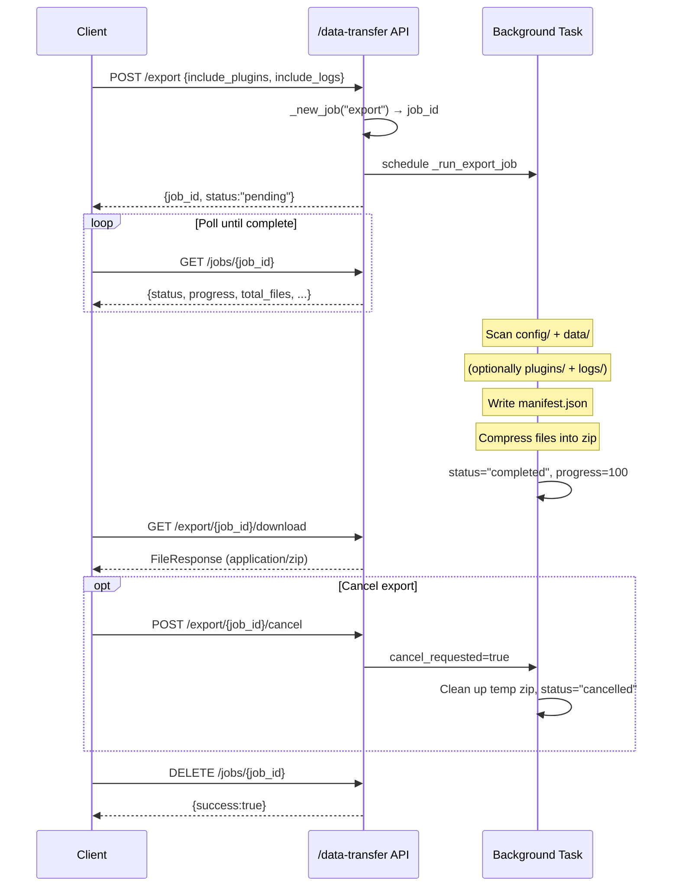

# Data & Memory API

This page covers all HTTP endpoints related to data management and long-term memory in the MaiBot WebUI. This includes TOML config file read/write, Prompt template editing and versioning, CRUD for entities such as personas/behaviors/emojis, Amemorix memory graph operations, and asynchronous data export/import.

All endpoints require authentication (except `/health`). For common auth methods, see [WebUI HTTP API Entry](./index.md#authentication-model-three-methods).

## Config Browsing and Editing

Config-related endpoints are distributed across two routers: the main router `router(prefix="/config")` (paths starting with `/api/webui/config`) and the compat router `compat_router(prefix="/api/config")`. Both are mounted under the `require_auth` dependency.

### Config Schema

- **`GET /api/webui/config/schema/bot`** — Get the complete JSON Schema for all ~20 config sections of `bot_config.toml`
- **`GET /api/webui/config/schema/model`** — Get the JSON Schema for `model_config.toml` (API providers + model task mappings)
- **`GET /api/webui/config/schema/section/{section_name}`** — Get the Schema for a single config section (e.g., `bot`, `webui`, `personality`)

The compat routes `GET /api/config/schema` and `GET /api/config/schema/bot` forward to the Schema endpoints respectively, for use by older frontends.

### Main Program Config (bot_config.toml)

- **`GET /api/webui/config/bot`** — Return the complete structured content of `bot_config.toml` (tomlkit objects preserving comments and formatting)
- **`POST /api/webui/config/bot`** — Full write of `bot_config.toml` (validates Schema first, then writes to disk preserving formatting)
- **`POST /api/webui/config/bot/section/{section_name}`** — Partial update of a specified config section (merge mode, preserves existing comments)
- **`GET /api/webui/config/bot/raw`** — Get the raw TOML text string
- **`POST /api/webui/config/bot/raw`** — Directly write raw TOML text (parsed and validated before saving)

::: code-group

```bash [curl Read Full Config ~vscode-icons:file-type-http~]
curl -X GET http://127.0.0.1:8001/api/webui/config/bot \
  -H "Cookie: maibot_session=你的Token"
```

:::

### Model Config and Version Management

- **`GET /api/webui/config/model`** — Get complete content of `model_config.toml`
- **`POST /api/webui/config/model`** — Full update of model config
- **`POST /api/webui/config/model/section/{section_name}`** — Partial update of a model config section
- **`GET /api/webui/config/model/versions`** — List archived copies of model config and the currently active version
- **`POST /api/webui/config/model/versions`** — Save current config as a new copy (optional label)
- **`POST /api/webui/config/model/versions/{version_id}/activate`** — Switch to activate a specified copy
- **`DELETE /api/webui/config/model/versions/{version_id}`** — Delete an inactive copy

### Adapter Config

Provides external management of `.toml` files for adapters like NapCat / GoCQ:

- **`GET /api/webui/config/adapter-config/path`** — Read the adapter config file path saved in `data/webui.json`
- **`POST /api/webui/config/adapter-config/path`** — Set/update the path preference (whitelist validation)
- **`GET /api/webui/config/adapter-config`** — Read adapter config from the saved path
- **`POST /api/webui/config/adapter-config`** — Write adapter config (validates TOML first, then writes to disk)

### Compat Route `/api/config`

Two independently registered compat endpoints provide a smooth migration window for older scripts:

- **`GET /api/config/raw`** — Equivalent to `GET /api/webui/config/bot/raw`
- **`POST /api/config/raw`** — Equivalent to `POST /api/webui/config/bot/raw`

New scripts are recommended to use the `/api/webui/config/*` paths.

## Prompt Editing System

Prompt files are located under the project's `prompts/` directory, organized by language subdirectories (e.g., `zh-CN/main.prompt`). The WebUI provides a complete versioned editing workflow.

### Core Endpoints

- **`GET /api/webui/config/prompts`** — List all languages and `.prompt` files, returning metadata such as whether overridden, version count, and display name
- **`GET /api/webui/config/prompts/{language}/{filename}`** — Read a Prompt file's content (preferring user custom overrides) and validation results
- **`GET /api/webui/config/prompts/{language}/{filename}/default`** — Read-only built-in Prompt template (ignoring custom overrides), for comparison and restoration
- **`PUT /api/webui/config/prompts/{language}/{filename}`** — Save Prompt content (auto-creates version snapshot, validates placeholder completeness)
- **`DELETE /api/webui/config/prompts/{language}/{filename}`** — Delete custom override, fall back to built-in template

::: code-group

```bash [curl Read Prompt File ~vscode-icons:file-type-http~]
curl -X GET http://127.0.0.1:8001/api/webui/config/prompts/zh-CN/main.prompt \
  -H "Cookie: maibot_session=你的Token"
```

:::

### Versioning Mechanism

Each time a Prompt is saved via `PUT`, the old version is automatically archived in the `data/custom_prompts/` directory. Version management endpoints:

- **`GET /api/webui/config/prompts/{language}/{filename}/versions`** — List all custom versions (including the currently active version identifier)
- **`GET /api/webui/config/prompts/{language}/{filename}/versions/{version_id}`** — Read a specified version's full content and validation results
- **`POST /api/webui/config/prompts/{language}/{filename}/versions/{version_id}/activate`** — Activate a specified version as the current one

Version IDs must match the `^[A-Za-z0-9_.-]+$` format. `legacy-current` is a reserved ID referring to pre-upgrade custom content.

### Persona Generator

- **`POST /api/webui/config/prompt-generator/generate`** — Use LLM to parse any text block (character card, persona description, etc.) into structured config snippets
- **`POST /api/webui/config/prompt-generator/apply`** — Write generated config blocks into `bot_config.toml` (only persona/chat related fields are allowed)

## Entity Endpoint Groups

The following six route modules cover MaiBot's various editable data entities, all mounted under `/api/webui/`. Each module follows a uniform pattern of CRUD + batch operations + statistics/export.

### person — Person Information

**`prefix="/person"`** — Manage the bot's known group members and private chat contacts. Backed by the `PersonInfo` database table, supports filtering by platform, known status, and keyword combinations.

- **`GET /api/webui/person/list`** — Paginated listing, supports search, known-status and platform filtering
- **`GET /api/webui/person/{person_id}`** — Detail (nickname, group nickname, memory points, acquaintance time, etc.)
- **`PATCH /api/webui/person/{person_id}`** — Incremental update of person attributes
- **`DELETE /api/webui/person/{person_id}`** — Delete record
- **`POST /api/webui/person/batch/delete`** — Batch delete
- **`GET /api/webui/person/stats/summary`** — Statistics: total count, known/unknown breakdown, distribution by platform

::: code-group

```bash [curl Paginated Person Query ~vscode-icons:file-type-http~]
curl -X GET "http://127.0.0.1:8001/api/webui/person/list?page=1&page_size=20&is_known=true" \
  -H "Cookie: maibot_session=你的Token"
```

:::

### avatar — Avatar Cache

**`prefix="/avatar"`** — A single GET endpoint providing a cached WebUI avatar proxy.

- **`GET /api/webui/avatar`** — Get avatar by `platform` + `user_id` or `group_id`. Cached for 24h; the `qq`/`napcat`/`qqguild` platforms support auto-download from QQ avatar servers.

### behavior — Behavior Learning Graph

**`prefix="/behavior"`** — Browse and debug behavior experience paths and scenario cluster networks.

- **`GET /api/webui/behavior/chats`** — List chat streams that have behavior experience paths
- **`GET /api/webui/behavior/paths`** — Paginated listing of experience paths (scenario → action → result), supports actor/learning type filtering
- **`GET /api/webui/behavior/clusters`** — Paginated listing of scenario clusters and tag probability distributions
- **`GET /api/webui/behavior/graph-data`** — Return node/edge data for the scenario cluster network + tag network
- **`GET /api/webui/behavior/paths/{path_id}`** — Single path detail with evidence chain
- **`POST /api/webui/behavior/retrieval-debug`** — Simulate a retrieval with arbitrary scenario text to debug behavior learning effectiveness

### expression — Expression Styles

**`prefix="/expression"`** — Full lifecycle management of expression styles, including legacy upgrade import.

- **`GET /api/webui/expression/list`** — Paginated listing (scenario → style), supports chat stream/approval status filtering
- **`POST /api/webui/expression/`** — Create
- **`PATCH /api/webui/expression/{id}`** — Incremental update
- **`DELETE /api/webui/expression/{id}`** — Delete
- **`POST /api/webui/expression/export`** — Export by chat stream as JSON
- **`POST /api/webui/expression/import`** — Import JSON to a specified chat stream
- **`GET /api/webui/expression/clusters`** — Get expression vector clustering summary
- **`GET /api/webui/expression/clusters/{cluster_id}/members`** — View cluster member list

### jargon — Slang / Colloquialisms

**`prefix="/jargon"`** — Manage the bot's learned slang (content → meaning mappings), supporting manual addition and AI auto-learning.

- **`GET /api/webui/jargon/list`** — Paginated listing, filtered by confirmed_jargon/confirmed_not_jargon/pending/manual_jargon status
- **`POST /api/webui/jargon/`** — Manual creation (auto-replaces AI slang in the same scope)
- **`PATCH /api/webui/jargon/{id}`** — Incremental update
- **`DELETE /api/webui/jargon/{id}`** — Delete
- **`POST /api/webui/jargon/batch/delete`** — Batch delete
- **`POST /api/webui/jargon/batch/set-jargon`** — Batch set jargon status
- **`POST /api/webui/jargon/export`** — Export (optionally carrying platform/id/type chat target info)
- **`POST /api/webui/jargon/import`** — Import to a specified chat stream

### emoji — Stickers / Emojis

**`prefix="/emoji"`** — Emoji/sticker upload, approval registration (adopted/discarded/known/unknown state flow), thumbnail cache management.

- **`GET /api/webui/emoji/list`** — Paginated listing, supports status/format/usage frequency filtering
- **`POST /api/webui/emoji/upload`** — Upload and register (supports JPEG/PNG/GIF/WebP)
- **`POST /api/webui/emoji/batch/upload`** — Batch upload
- **`PATCH /api/webui/emoji/{emoji_id}`** — Update description/registration/ban status
- **`POST /api/webui/emoji/{emoji_id}/register`** — Register (with content review)
- **`POST /api/webui/emoji/{emoji_id}/ban`** — Disable
- **`DELETE /api/webui/emoji/{emoji_id}`** — Delete file and record
- **`GET /api/webui/emoji/{emoji_id}/thumbnail`** — Get thumbnail (auto-generated WebP, 3s cache)
- **`GET /api/webui/emoji/thumbnail-cache/stats`** — Thumbnail cache statistics

## Memory Endpoint Group

The Memory endpoint group is the largest endpoint collection in this subdirectory (173 endpoints in total), covering all operations on the Amemorix memory graph. They are distributed across two routers:

- **`router(prefix="/memory")`** — Main router, paths start with `/api/webui/memory`
- **`compat_router(prefix="/api")`** — Compat router, paths start with `/api` (bypassing the `/api/webui` prefix)

Below is a curated selection of 15 high-frequency endpoints by scenario. For the complete endpoint list, see the [`memory.py` source](https://github.com/MaiM-with-u/MaiBot/blob/main/src/webui/routers/memory.py).

### High-Frequency Endpoint Quick Reference

- **`GET /api/webui/memory/graph`** — Knowledge graph query, returns nodes and edges, supports a `limit` parameter to control scale
- **`GET /api/webui/memory/graph/search`** — Search the graph by keyword, returns matching nodes and associated edges
- **`GET /api/webui/memory/episodes`** — Paginated listing of memory episodes, supports query/source/person_id/time range filtering
- **`GET /api/webui/memory/episodes/status`** — Get episode processing status summary (pending/processed/failed counts)
- **`POST /api/webui/memory/episodes/rebuild`** — Rebuild episodes by source or full rebuild (async), pass `source`/`sources`/`all` parameters
- **`GET /api/webui/memory/timeline`** — Get memory timeline by chat stream, supports time range and type filtering
- **`GET /api/webui/memory/sources`** — List all memory sources (files, chat streams, etc.), with entry count and last update time
- **`GET /api/webui/memory/profiles/query`** — Query person profiles by person_id/keyword/platform/user_id
- **`POST /api/webui/memory/profiles/override`** — Manually override person profile text
- **`POST /api/webui/memory/profiles/{person_id}/evidence/correct`** — Correct profile evidence and refresh the profile
- **`GET /api/webui/memory/v5/status`** — V5 memory module status query
- **`POST /api/webui/memory/v5/reinforce`** — Reinforce specified memory entries
- **`POST /api/webui/memory/corrections/preview`** — Preview memory correction plan
- **`POST /api/webui/memory/import/raw-scan`** — Trigger raw folder scan import
- **`GET /api/webui/memory/retrieval_tuning/tasks`** — List retrieval tuning tasks and the currently active tuning config

Below are curl examples for common operations:

::: code-group

```bash [curl Query Memory Graph ~vscode-icons:file-type-http~]
curl -X GET "http://127.0.0.1:8001/api/webui/memory/graph?limit=50" \
  -H "Cookie: maibot_session=你的Token"
```

```bash [curl Override Person Profile ~vscode-icons:file-type-http~]
curl -X POST http://127.0.0.1:8001/api/webui/memory/profiles/override \
  -H "Content-Type: application/json" \
  -H "Cookie: maibot_session=你的Token" \
  -d '{"person_id": "qq:123456", "override_text": "用户喜欢猫，每周去猫咖。"}'
```

```bash [curl Preview Memory Correction ~vscode-icons:file-type-http~]
curl -X POST http://127.0.0.1:8001/api/webui/memory/corrections/preview \
  -H "Content-Type: application/json" \
  -H "Cookie: maibot_session=你的Token" \
  -d '{"query": "用户最近搬家了", "limit": 10}'
```

:::

**Person profile feedback loop:** The profile system uses a two-layer model of "evidence-driven + manual override." `GET /profiles/{person_id}/evidence` lists evidence passages extracted from conversations; `POST /evidence/correct` allows correcting erroneous evidence and triggering a profile refresh; `POST /profiles/override` directly injects custom profile text, taking priority over evidence-derived automatic profiles.

**V5 API:** The V5 endpoint series (`/api/webui/memory/v5/*`) provides finer-grained memory entry lifecycle management — reinforce/weaken/remember permanently/forget/restore — suitable for ops scenarios requiring fine-tuning of memory weights. V5 endpoints exist only on the main router; the compat router does not include them.

For remaining endpoints (config/runtime config read/write, delete operations, fuzzy-modify, import multi-source import types LPMM/Temporal/Migration, retrieval_tuning task details, etc.), consult the endpoint definitions in the source code or the memory module architecture docs.

## Data-Transfer Async Export/Import

Data export and import use an asynchronous Job model, supporting progress polling and cancellation. Backend state is held in an in-memory dictionary (lost on process restart).

### Export Task Lifecycle



**Export always includes** the `config` + `data` directories, with `plugins` and `logs` as optional. The zip archive contains a `manifest.json` (recording export time, MaiBot version, and file statistics for each part).

### 4-Part Data-Transfer Curl Examples

**1. Create Export Task**

::: code-group

```bash [curl Create Export ~vscode-icons:file-type-http~]
curl -X POST http://127.0.0.1:8001/api/webui/data-transfer/export \
  -H "Content-Type: application/json" \
  -H "Cookie: maibot_session=你的Token" \
  -d '{"include_plugins": true, "include_logs": false}'
```

:::

Example response:

::: code-group

```json [JSON ~vscode-icons:file-type-json~]
{"job_id":"a1b2c3d4e5f6","kind":"export","status":"pending","progress":0,...}
```

:::

**2. Poll Task Status**

::: code-group

```bash [curl Query Task Status ~vscode-icons:file-type-http~]
curl -X GET http://127.0.0.1:8001/api/webui/data-transfer/jobs/a1b2c3d4e5f6 \
  -H "Cookie: maibot_session=你的Token"
```

:::

Once `status` becomes `"completed"` and `progress` reaches 100, the download is ready.

**3. Download Export Result**

::: code-group

```bash [curl Download Export ~vscode-icons:file-type-http~]
curl -X GET http://127.0.0.1:8001/api/webui/data-transfer/export/a1b2c3d4e5f6/download \
  -H "Cookie: maibot_session=你的Token" \
  -o maibot-data.zip
```

:::

**4. Create Import Task**

::: code-group

```bash [curl Import Data ~vscode-icons:file-type-http~]
curl -X POST http://127.0.0.1:8001/api/webui/data-transfer/import \
  -H "Cookie: maibot_session=你的Token" \
  -F "file=@maibot-data.zip" \
  -F "import_config=true" \
  -F "import_data=true" \
  -F "import_plugins=false" \
  -F "import_logs=false"
```

:::

Returns `{job_id: "...", status: "pending"}`. Similarly, poll via `GET /jobs/{job_id}` until `status` becomes `"completed"`. The backend auto-cleans the uploaded temp zip after import completes.

**Manifest structure:** The `manifest.json` at the root of the export zip records the following information. During import, the backend validates `format == "maibot-data-archive"` and `format_version == 1`:

- **`format`** — `"maibot-data-archive"`
- **`format_version`** — `1`
- **`created_at`** — ISO 8601 export timestamp
- **`maibot_version`** — MaiBot version at time of export
- **`included`** — List of directories actually included (e.g., `["config", "data", "plugins"]`)
- **`parts`** — Per-part file count and total byte size statistics

**Import security measures:** The backend applies multiple layers of protection before unpacking — rejecting symlinks, rejecting `..` path traversal, rejecting top-level directories outside the `{config,data,plugins,logs}` whitelist.

> For the underlying import/export flow (zip member validation, path security hardening, manifest verification, etc.), see the data-transfer backend detailed flow in [statistics-io.md](../statistics-io.md).

## Compat Route Trade-off: `/api/memory` vs `/memory`

The Memory endpoint group supports two path prefixes simultaneously, for the following reasons:

**`/api/webui/memory/*` (main router)** — Recommended. Aligned with the WebUI main routing system, enjoying unified auth middleware, version dispatch, and future rate-limiting/auditing layers. All 173 memory endpoints are available under this prefix.

**`/api/*` (compat router)** — Retained for older frontends and external integrations. The `compat_router` in `memory.py` with `prefix="/api"` produces endpoint paths like `/api/graph`, `/api/episodes`, etc.

Key differences between the two routes:

- **Coverage differs** — The main router includes all endpoints; the compat router covers high-frequency scenarios like graph / episodes / profiles / import / retrieval_tuning / sources / timeline / query, but does **not** include `/v5/*` (V5 memory API), `/corrections/*` (correction plans), `/delete/*` (delete operations), `/fuzzy-modify/*` (fuzzy modifications), and other newer modules
- **Path style differs** — The main router uses kebab-case (e.g., `/retrieval_tuning` written as `/retrieval-tuning`), while the compat router retains snake_case (e.g., `/retrieval_tuning`, `/raw_scan`)
- **Frontend-backend coupling scope** — The new WebUI frontend exclusively uses the main router; only older frontends, third-party plugins, or manual scripts might reference `/api/*` paths

**Migration advice:**

- New scripts/new integrations: use `/api/webui/memory/*`
- Existing scripts depending on `/api/` paths and unable to change immediately: can continue using the compat router, but note that V5 API and corrections modules require switching to the main router
- Long-term maintenance: the compat router is planned to be gradually deprecated, with new endpoints iterating only on the main router
