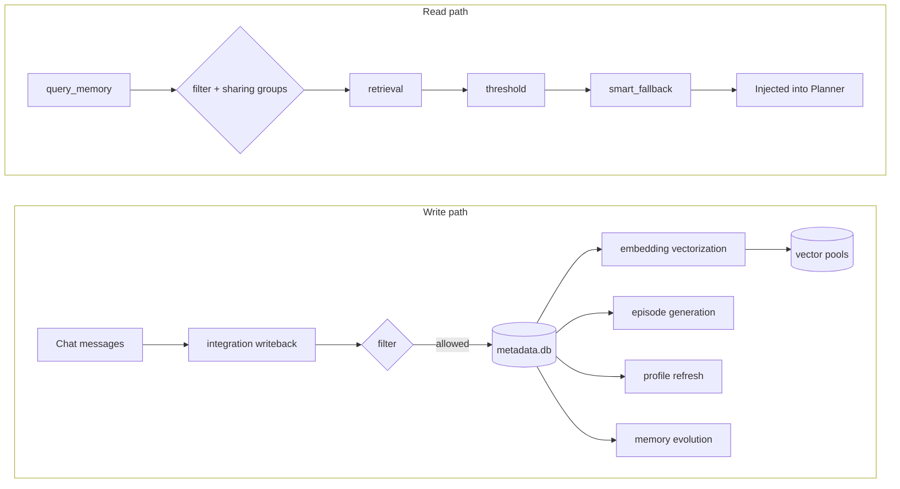

# A_Memorix Memory System Configuration

This page answers two questions: **what each `[a_memorix]` section controls**, and **what actually happens when you change an option**. With over a hundred options, blind tuning most often ends in one of three ways: memories "suddenly can't be found", memories from another group leak into the current chat, or model call costs explode. Read "Before You Change Anything" below first.

All configuration lives under the `[a_memorix]` section of `config/bot_config.toml` (TOML section names are case-sensitive — use lowercase), and can also be edited visually in WebUI "Config Management". The legacy `[memory]` section and the standalone `config/a_memorix.toml` have been replaced; see [Migrating from the Legacy Config](#migrating-from-the-legacy-config).

## Before You Change Anything

**How changes take effect**: saving in WebUI or editing `bot_config.toml` directly hot-reloads the configuration — most options take effect without a restart. But a few options change "how existing data is interpreted", and hot reload cannot save you there; see the high-risk list below.

**Three risk tiers**:

1. **High risk — a mistake makes existing memories unusable**: `storage.data_dir`, `embedding.model_name`, `embedding.dimension`, `embedding.dimension_request_mode`. These determine how stored vectors are interpreted; changing them disables the vector channel via consistency checks and requires a manual rebuild (see [Memory Vectorization](#memory-vectorization))
2. **Behavior & privacy — a mistake can leak or lose memories**: the root-level sharing switches, `filter` chat filtering, heuristic recall and memory correction under `integration`, and `memory` evolution
3. **Quality & performance tuning — a mistake just makes things worse or slower**: `retrieval`, `threshold`, `episode`, `person_profile`, `web`, etc. Feel free to tune these in small steps and observe

**One rule of thumb**: ask yourself "does this change affect new data, or data already stored?" Options that only affect new data are safe to change anytime; options that reinterpret existing data (model, dimension, storage location) demand real thought.

## How Memory Data Flows

Understand this diagram and you'll know exactly which section governs which stage:



The write and read paths are independent. For example, `[a_memorix.filter]` gates both paths, while `[a_memorix.retrieval]` only affects reads — understanding this answers most "why didn't my change do anything" questions.

## Configuration Structure Overview

::: code-group

```toml [bot_config.toml ~vscode-icons:file-type-toml~]
[a_memorix]                    # Root level: cross-chat-stream sharing
[a_memorix.plugin]             # Master switch of the memory system
[a_memorix.storage]            # Data storage location
[a_memorix.integration]        # How memory is used in chat (writeback/injection/correction)
[a_memorix.embedding]          # Memory vectorization (incl. fallback & backfill)
[a_memorix.retrieval]          # Memory retrieval (incl. fusion/vector pools/sparse)
[a_memorix.threshold]          # Retrieval result threshold filtering
[a_memorix.filter]             # Chat filtering (incl. per-type cross-chat filtering)
[a_memorix.episode]            # Episode generation
[a_memorix.person_profile]     # Person profiles
[a_memorix.memory]             # Memory evolution (decay & forgetting)
[a_memorix.advanced]           # Advanced runtime
[a_memorix.web]                # Web operations (Import Center / Tuning Center)
```

:::

**Any field not written into the config file uses its default value**. The minimal working configuration is just two lines (see [Configuration Examples](#configuration-examples)) — start there and come back to tune specific sections when you hit a concrete problem.


## Master Switch

The master switch of the memory system. Off by default.

::: code-group

```toml [bot_config.toml ~vscode-icons:file-type-toml~]
[a_memorix.plugin]
enabled = false   # Whether to enable the long-term memory system
```

:::

**Impact of changes**: after switching from `false` to `true`, the memory system starts accumulating from an empty store — poor retrieval quality in the first few days is normal (vector pools untrained, graph sparse). Switching back to `false` deletes nothing; it only disables all memory read/write entry points, and you can re-enable it anytime.

::: tip Prerequisites
Configure an embedding model in WebUI or `model_config.toml` before enabling, otherwise the memory system starts in degraded mode (sparse retrieval only). See [Memory Vectorization](#memory-vectorization).
:::


## Storage

::: code-group

```toml [bot_config.toml ~vscode-icons:file-type-toml~]
[a_memorix.storage]
data_dir = "data/a-memorix"   # Data directory
```

:::

The directory actually holds: the SQLite main store `metadata/metadata.db` (paragraphs, relations, episodes, profiles, fact ledger, background queues), vector files and faiss index snapshots under `vectors/`, relation graph snapshots under `graph/`, plus import and tuning artifacts.

::: danger Changing data_dir does not migrate old data
After pointing `data_dir` to a new path, MaiBot **starts from an empty store** in the new directory; old data stays in the old directory and is neither copied nor merged. To keep existing memories: stop MaiBot, manually copy the entire old directory contents to the new location, then change the config and start.
:::


## Cross-Chat-Stream Sharing

By default, each chat stream (each group, each private chat) can only retrieve memories it produced itself — this is the basic privacy boundary. The two root-level options below can break that boundary; think before changing them.

::: code-group

```toml [bot_config.toml ~vscode-icons:file-type-toml~]
[a_memorix]
# Whether ordinary memory queries search across all chat streams
global_memory_sharing_enabled = false

# Put groups/private chats that should share long-term memory into the same group
[[a_memorix.shared_memory_groups]]
targets = [
  { platform = "qq", item_id = "group-id-A", rule_type = "group" },
  { platform = "qq", item_id = "group-id-B", rule_type = "group" },
]
```

:::

- **`global_memory_sharing_enabled`** — Whether ordinary memory queries search across **all** chat streams. Disabled by default
- **`shared_memory_groups`** — List of sharing groups; chat streams in the same group share memories with each other. Empty by default

**Impact of changes**:

- Enabling `global_memory_sharing_enabled` is a **global opening**: any query from any group or private chat can hit memories from every chat stream. Private matters discussed in group A may be spoken out by MaiMai in group B. Don't enable it unless you explicitly want an omniscient bot
- `shared_memory_groups` is the controlled middle ground: only streams in the same group see each other; everything outside the group stays isolated. Suitable for scenarios like "several groups of the same person"
- These options only affect **retrieval scope**; writes are still attributed to the chat stream they came from
- In `targets`, `item_id` takes the group number or user QQ number, `rule_type` is `group` or `private`; `item_id = "*"` matches any chat stream on that platform


## Chat Filtering

`[a_memorix.filter]` decides which chat streams participate in the memory system, gating **both writes and reads**.

::: code-group

```toml [bot_config.toml ~vscode-icons:file-type-toml~]
[a_memorix.filter]
enabled = true          # Whether to enable chat filtering
mode = "blacklist"      # Filter mode: blacklist / whitelist
chats = []              # Chat stream list
```

:::

Supported `chats` entry formats: `stream:<stream-id>`, `group:<group-id>`, `user:<user-qq>`, `private:<user-qq>`, or a bare ID (matches if it equals any of stream/group/user ID). Selecting from the chat stream list in WebUI is recommended — it generates `stream:`-prefixed entries automatically.

**Impact of changes**:

- For a filtered chat stream: summary and person-fact writebacks are skipped, queries return empty, and episodes are therefore never generated — the chat effectively "doesn't exist" to the memory system
- **Person profile injection is not affected by filtering** (profiles are maintained per person, not per chat), but a long-filtered chat produces no new facts, so the corresponding person's profile gradually goes stale
- After removing a long-filtered chat from the list, **historical messages are not backfilled** — only new messages enter memory from then on

::: warning An empty list means opposite things in the two modes
`blacklist` + empty `chats` = allow everything (the default); `whitelist` + empty `chats` = **deny everything**. If you switch to whitelist mode and forget to fill the list, the symptom is "the memory system completely stops working with no error anywhere".
:::

### Per-Type Cross-Chat Retrieval Filtering

The three subsections under `[a_memorix.filter.retrieval]` (`chat_stream`, `chat_summary`, `episode`) are finer-grained filters: they only filter results of the given memory type during **cross-chat-stream retrieval** (after enabling sharing above). They don't affect a chat stream reading its own memories, nor writes or background generation.

::: code-group

```toml [bot_config.toml ~vscode-icons:file-type-toml~]
# The chat_summary and episode subsections have the same structure
[a_memorix.filter.retrieval.chat_stream]
enabled = false         # Whether to enable cross-chat filtering for this type
mode = "blacklist"      # Filter mode
chats = []              # Chat stream list, same format as above
```

:::

Typical use: with global sharing enabled, you don't want summaries of private topics from one group retrievable by other groups — add it to the `chat_summary` blacklist. Results whose source matches the current chat (same group, or private chats with the same person) are always exempt from this filtering.


## Memory Integration

`[a_memorix.integration]` controls how MaiMai uses long-term memory in chat. It has the most options and the most direct impact on daily behavior.

### Query & Injection

::: code-group

```toml [bot_config.toml ~vscode-icons:file-type-toml~]
[a_memorix.integration]
enable_memory_query_tool = true          # Whether MaiMai may query long-term memory in chat
memory_query_default_limit = 5           # Default number of results retrieved per query
enable_person_profile_query_tool = true  # Whether MaiMai may query person profile memory
enable_person_profile_injection = true   # Auto-inject relevant person profiles before Planner calls
person_profile_injection_max_profiles = 3  # Max profiles auto-injected per round
```

:::

**Impact of changes**:

- Disabling `enable_memory_query_tool` removes MaiMai's ability to "actively recall", but passive channels (profile injection, heuristic recall) still work — if memory seems to hurt reply quality, prefer disabling active query rather than the whole memory system
- Raising `memory_query_default_limit` (range `1-20`) improves recall, but results go straight into the prompt — too large means token cost and noise; rarely go beyond 10
- Raising `person_profile_injection_max_profiles` (range `1-5`) helps in crowded group chats, but each profile costs prompt space

### Writeback

::: code-group

```toml [bot_config.toml ~vscode-icons:file-type-toml~]
[a_memorix.integration]
person_fact_writeback_enabled = true   # Extract and write back person facts after sending a reply
chat_summary_writeback_enabled = true  # Auto write back chat summaries by message window
chat_summary_writeback_message_threshold = 36  # Trigger a writeback after this many new messages
chat_summary_writeback_context_length = 36     # Max messages looked back per writeback
```

:::

**Impact of changes**:

- `chat_summary_writeback_message_threshold` means "trigger one writeback after N messages accumulate since the last one". Smaller → more frequent, finer summaries, but each costs an LLM call; too large → recent chats stay blank in memory for a long time
- The effective value of `chat_summary_writeback_context_length` is `min(configured value, new messages in this round)` — summaries only cover new messages and never re-summarize old windows. Setting it larger than the threshold is pointless
- Disabling `person_fact_writeback_enabled` starves person profiles of their fact source (profile refresh primarily consumes the person-fact ledger) and they gradually go stale — not recommended

### Heuristic Recall

An advanced feature, off by default: instead of waiting for MaiMai to actively call the query tool, every Planner round generates an "impression" from recent chat, automatically retrieves related memories and injects them (into the Planner prompt as "【Heuristic Memory - internal reference】").

::: code-group

```toml [bot_config.toml ~vscode-icons:file-type-toml~]
[a_memorix.integration]
heuristic_memory_recall_enabled = false            # Recall long-term memory from the current chat impression
heuristic_memory_cross_chat_enabled = false        # Allow recall candidates from other chat streams
heuristic_memory_recall_window_size = 20           # Recent messages used to build the impression
heuristic_memory_recall_limit = 3                  # Max memories recalled per round
heuristic_memory_recall_max_chars = 900            # Max characters of injected recall text
heuristic_memory_recall_min_interval_seconds = 180 # Min interval between two recalls in the same stream
heuristic_memory_recall_min_new_messages = 60      # Min new messages required between two recalls
heuristic_memory_recall_cache_ttl_seconds = 300    # Runtime cache TTL of recall results
heuristic_memory_group_to_private_enabled = false  # Allow recalling group memories in private chats
heuristic_memory_private_to_group_enabled = false  # Allow recalling private memories in group chats
```

:::

**Impact of changes**:

- Enabling the master switch costs **potentially one extra LLM call per Planner round** (impression generation) plus one retrieval; `min_interval_seconds` and `min_new_messages` are the throttles — lowering either noticeably increases model cost
- A smaller `window_size` bases the "impression" on very little context and tends to pull in irrelevant memories; `max_chars` caps the injection size and truncates the rest

::: danger The privacy boundary of cross_chat
`heuristic_memory_cross_chat_enabled = true` widens retrieval to global scope and **bypasses both the `[a_memorix.filter]` blacklist and the per-type retrieval filters**. Only one local safety net remains: the group→private and private→group directions are gated by `group_to_private` / `private_to_group` (both off by default), but **group↔group and private↔private pass through directly**. In other words, with cross_chat on, memories from other groups can be pulled into the current group at any time. Keep it off unless you explicitly accept this.
:::

### Natural-Language Memory Correction

Configuration behind WebUI "Memory Maintenance" and the memory-correction commands. Lets you correct existing memories in natural language (e.g. "XX doesn't eat spicy food") in WebUI, following a "generate plan → confirm → execute → rollback-able" flow.

::: code-group

```toml [bot_config.toml ~vscode-icons:file-type-toml~]
[a_memorix.integration]
fuzzy_modify_enabled = true                # Enable the memory-correction backend interface
fuzzy_modify_auto_execute_enabled = false  # Let high-confidence corrections skip manual confirmation
fuzzy_modify_confirm_threshold = 0.85      # Confidence threshold for auto-confirmation
fuzzy_modify_candidate_limit = 20          # Max candidate memories handed to the LLM per correction
fuzzy_modify_max_targets = 5               # Max old memories a single plan may mark as superseded
fuzzy_modify_allow_global_scope = false    # Allow global-scope correction when no chat stream is specified
```

:::

**Impact of changes**:

- `auto_execute_enabled` is off by default, meaning every correction requires manual confirmation regardless of confidence — the recommended state. Once enabled, plans with confidence ≥ `confirm_threshold` **modify memory without confirmation**; lowering the threshold significantly raises the risk of "the AI changed a memory wrongly"
- `max_targets` caps how many old memories one correction may invalidate — a safety valve, not recommended to raise
- `fuzzy_modify_allow_global_scope = true` allows corrections without specifying a chat stream; candidate retrieval then covers all groups and private chats and is **not subject to the `[a_memorix.filter]` blacklist** — one correction can touch every memory. Enable with care

### Feedback Correction

An experimental feature, fully off by default: after MaiMai answers using `query_memory`, the system watches user reactions over the following period ("wrong", "you misremembered", etc.), tries to correct old memories automatically, and cascades into profile refreshes and episode rebuilds.

::: code-group

```toml [bot_config.toml ~vscode-icons:file-type-toml~]
[a_memorix.integration]
feedback_correction_enabled = false                  # Master switch
feedback_correction_window_hours = 12.0              # Feedback window in hours, starting from query execution
feedback_correction_check_interval_minutes = 30      # Scheduled task polling interval (minutes)
feedback_correction_batch_size = 20                  # Max tasks processed per round
feedback_correction_auto_apply_threshold = 0.85      # Min confidence for auto-applying corrections
feedback_correction_max_feedback_messages = 30       # Max in-window feedback messages used per task
feedback_correction_prefilter_enabled = true         # Pre-filtering to reduce unnecessary model calls
feedback_correction_paragraph_mark_enabled = true    # Mark affected paragraphs as corrected
feedback_correction_paragraph_hard_filter_enabled = true  # Hard-filter stale-marked paragraphs in queries
feedback_correction_profile_refresh_enabled = true   # Queue affected profiles for refresh after correction
feedback_correction_profile_force_refresh_on_read = true  # Force refresh on read while profile is dirty
feedback_correction_episode_rebuild_enabled = true   # Queue affected sources for episode rebuild
feedback_correction_episode_query_block_enabled = true    # Block that source from queries while rebuilding
feedback_correction_reconcile_interval_minutes = 5   # Second-phase consistency reconcile interval
feedback_correction_reconcile_batch_size = 20        # Reconcile batch size per round
```

:::

**Impact of changes**:

- With the master switch on, every `query_memory` leaves behind a delayed correction task, and conversation within the window may trigger extra LLM calls. With little memory and sparse conversation the payoff is low
- Lowering `auto_apply_threshold` (e.g. to 0.7) = more corrections land without human review, and the chance of "auto-breaking a correct memory" rises; stay at 0.85 or above for safety
- Disabling `paragraph_hard_filter_enabled` lets already-corrected old paragraphs still appear in query results, weakening corrections
- Disabling `episode_query_block_enabled` lets users query old content while an episode rebuild is in flight
- The remaining `*_enabled` sub-switches are links in the correction chain; disabling any of them breaks one link of "correction → profile → episode" consistency. Without a clear reason, keep the defaults


## Memory Vectorization

Vectorization is the foundation of memory retrieval — and the **highest-risk section in the whole configuration**.

::: code-group

```toml [bot_config.toml ~vscode-icons:file-type-toml~]
[a_memorix.embedding]
model_name = "auto"              # Vectorization model; auto picks from configured models
dimension = 1024                 # Memory vector dimension; must match model output
dimension_request_mode = "explicit"  # Whether requests carry the dimension parameter
batch_size = 32                  # Items per vectorization request
max_concurrent = 5               # Concurrent vectorization requests
enable_cache = false             # Cache vectorization results
runtime_train_threshold = 256    # Min vectors to trigger background SQ8 training
quantization_type = "int8"       # Vector compression; only int8 (SQ8) supported
```

:::

### Before Changing model_name or dimension

The system computes a **fingerprint** from "model + provider + dimension + dimension request mode" and stores it in the vector metadata. If a startup or runtime check finds a fingerprint mismatch, the vector channel is disabled (retrieval degrades to sparse-only, logs show `vector_rebuild_required`); a dimension mismatch errors out directly. **Existing vectors are never re-embedded automatically** — the vector spaces of old and new models are incompatible, and mixing them produces garbage retrieval.

The right way:

1. If you changed it by mistake: change the config back to the original values — the old vectors are still valid
2. If you truly want to switch models: after changing the config, run a **vector rebuild** from the WebUI memory management operations entry (or run `scripts/release_vnext_migrate.py`) — the system re-encodes every paragraph with the new model. Retrieval stays degraded during the rebuild; the data itself is not lost

Choosing `dimension_request_mode`:

- **`explicit` (default)** — carries the dimension parameter only when explicitly specified; startup probing uses the model's natural output dimension. Right for the vast majority of cases
- **`never`** — use when your gateway/model errors out on receiving a dimension parameter
- **`always`** — use when you explicitly want the model's "dimension truncation" capability (supported by some OpenAI/Gemini models); failed probing automatically falls back to parameter-free probing

### SQ8 Quantization and the Training Threshold

A vector pool has two working states, switched fully automatically:

- **Untrained** (vector count < `runtime_train_threshold`): exact brute-force retrieval — most accurate but memory-hungry and slow at scale
- **Trained** (background training kicks in and persists once the threshold is reached): switches to SQ8-quantized approximate retrieval — dramatically better memory usage and speed, at the cost of slight quantization error in scores

Raising `runtime_train_threshold` = staying in exact mode longer (higher memory usage); lowering it = entering quantized mode sooner. Note it's not the only trigger — at startup, ≥ 40 vectors already triggers a training attempt, so small deployments usually run quantized after a restart.

`batch_size` / `max_concurrent` only affect vectorization throughput: lower them if your embedding service rate-limits strictly, raise them for a generous self-hosted service. `enable_cache` caches the text→vector mapping; worth enabling when memory content is highly repetitive (many similar paragraphs).

### Embedding Fallback

The degradation strategy when the primary embedding service goes down:

::: code-group

```toml [bot_config.toml ~vscode-icons:file-type-toml~]
[a_memorix.embedding.fallback]
enabled = true                    # Whether to enable the fallback mechanism
probe_interval_seconds = 180      # Probe interval; periodically checks whether the primary recovered
allow_metadata_only_write = true  # Allow metadata-only writes during fallback (skip vectorization)
```

:::

**The system's real state during fallback**: reads automatically degrade to sparse retrieval (queries work, but there's no semantic recall — quality drops noticeably); writes still store paragraphs and relations, with vectors skipped and queued for backfill.

- `allow_metadata_only_write = false` makes writes during degradation **fail outright** (memories are neither stored nor queued) — keep it `true` unless you want failures to be loud
- After the service recovers (detected via `probe_interval_seconds`), the system exits degradation automatically and immediately triggers a backfill round to make up the owed vectors. Failed backfill pushes the system back into degradation

### Paragraph Vector Backfill

::: code-group

```toml [bot_config.toml ~vscode-icons:file-type-toml~]
[a_memorix.embedding.paragraph_vector_backfill]
enabled = true        # Whether to enable the backfill task
interval_seconds = 60 # Backfill polling interval
batch_size = 64       # Backfill batch size
max_retry = 5         # Max retries
```

:::

Asynchronously supplies vectors to paragraphs that lack them (due to degradation, imports, etc.). Raising `batch_size` speeds up catch-up but adds pressure on the embedding service; after `max_retry` is exhausted the paragraph is abandoned — investigate why that content repeatedly fails to encode (usually over-length content or service limits).


## Retrieval

`[a_memorix.retrieval]` offers the largest tuning surface. Understand the pipeline order first, or you'll tune the wrong knobs:

```
candidate recall (vector + sparse) → fusion ranking → paragraph/relation weighting (alpha) → PPR graph boost → threshold filtering → graph fallback → truncate to top_k_final
```

### Basic Retrieval

::: code-group

```toml [bot_config.toml ~vscode-icons:file-type-toml~]
[a_memorix.retrieval]
top_k_paragraphs = 20        # Paragraph candidate count
top_k_relations = 10         # Relation candidate count
top_k_final = 10             # Final returned count
alpha = 0.5                  # Paragraph-vs-relation fusion weight
enable_ppr = true            # Enable PPR graph computation
ppr_alpha = 0.85             # PPR damping factor
ppr_timeout_seconds = 1.5    # PPR timeout seconds
ppr_concurrency_limit = 4    # PPR concurrency limit
enable_parallel = true       # Run candidate collection in threads (avoids blocking the event loop)
```

:::

**Impact of changes**:

- `top_k_final` is the **final** truncation of the whole pipeline and the max number of results entering the prompt per query. Raising it improves recall but costs tokens; consider it together with `memory_query_default_limit`
- `top_k_paragraphs` / `top_k_relations` **only take effect with `vector_pools.mode = "single"`**; under the default `dual` mode, paragraph candidacy is controlled by `vector_pools.paragraph_top_k`. If a change seems to do nothing, check which pool mode you're in first
- `alpha` (0~1) weights **paragraph score × α and relation score × (1−α)** — unrelated to the `fusion` method below. Higher leans toward narrative paragraphs, lower toward entity relations; relation-intent queries automatically override it with 0.35
- PPR gives paragraphs related to graph entities an extra boost. It's not a required link: **timeout or error just falls back to the original ranking, without raising errors**. If retrieval occasionally stalls on a large graph, lower `ppr_timeout_seconds` rather than disabling it
- `enable_parallel`'s only effect is moving candidate collection into threads to avoid blocking the event loop — keep it on

### Retrieval Fusion

Only merges the two **paragraph** candidate lists from "vector recall vs sparse recall":

::: code-group

```toml [bot_config.toml ~vscode-icons:file-type-toml~]
[a_memorix.retrieval.fusion]
method = "weighted_rrf"  # Fusion method: weighted_rrf / alpha_legacy
rrf_k = 60               # RRF smoothing constant
vector_weight = 0.7      # Vector retrieval weight (normalized with bm25_weight to sum 1)
bm25_weight = 0.3        # BM25 sparse retrieval weight
```

:::

- `weighted_rrf` (default) scores by **rank**: `w × 1/(rrf_k + rank)` — naturally robust when the two paths' raw scores aren't comparable. Larger `rrf_k` flattens the score gap between head and body ranks
- `alpha_legacy` is a legacy simple merge: both lists are normalized independently, then concatenated and sorted. Head items of a weak sparse list may compete at the same score as head items of a strong vector list, introducing noise. **Not recommended**
- `vector_weight` / `bm25_weight` don't need to sum to 1 manually — the system force-normalizes them. With lots of Chinese memories and reliable keyword hits, moderately raising `bm25_weight` helps

### Dual Vector Pools

The default `dual` mode uses two vector pools: the **paragraph pool** stores paragraph vectors; the **graph pool** stores entity and relation vectors, whose hits expand back to supporting paragraphs as evidence.

::: code-group

```toml [bot_config.toml ~vscode-icons:file-type-toml~]
[a_memorix.retrieval.vector_pools]
mode = "dual"                    # Pool mode: single / dual
paragraph_top_k = 20             # Paragraph pool candidate count
graph_top_k = 40                 # Graph pool candidate count
graph_expand_paragraph_k = 80    # Global cap on paragraphs expanded from graph evidence
relation_expand_per_hit = 5      # Max paragraphs expanded per relation hit
entity_expand_per_hit = 8        # Max paragraphs expanded per entity hit
relation_evidence_weight = 1.0   # Relation evidence score weight
entity_evidence_weight = 0.55    # Entity evidence score weight
semantic_weight = 0.65           # Paragraph semantic score weight
sparse_weight = 0.2              # Sparse retrieval score weight
graph_weight = 0.15              # Graph evidence score weight

[a_memorix.retrieval.vector_pools.relation_intent]
graph_top_k = 80                 # Graph pool candidates when relation intent hits
semantic_weight = 0.45           # Semantic weight under relation intent
sparse_weight = 0.15             # Sparse weight under relation intent
graph_weight = 0.4               # Graph weight under relation intent
return_relation_items = false    # Return standalone relation items on relation intent
```

:::

**Impact of changes**:

- The three main weights (semantic / sparse / graph) decide the final composite score of candidates. Raise `sparse_weight` for more "literal" matching, `semantic_weight` for more "semantic" matching
- `graph_weight` does not act linearly: the system automatically discounts it based on graph reliability, redistributing the freed weight proportionally to the other two channels. Observe for a while before drawing conclusions after tuning it
- The `relation_intent` subsection wholesale takes over the weights only when a query is judged as "asking about relations" (e.g. "what's the relationship between A and B"), expanding graph candidacy to 80
- `mode = "single"` falls back to the legacy single mixed-store retrieval, where the pool parameters above don't apply and `retrieval.top_k_paragraphs` takes over again. Don't switch without a compatibility need

### Sparse Retrieval

Keyword recall based on full-text search (FTS5) — complement and fallback for vector retrieval:

::: code-group

```toml [bot_config.toml ~vscode-icons:file-type-toml~]
[a_memorix.retrieval.sparse]
enabled = true            # Whether to enable sparse retrieval
backend = "fts5"          # Sparse retrieval backend
mode = "auto"             # auto / fallback_only / hybrid
tokenizer_mode = "jieba"  # jieba / mixed / char_2gram
candidate_k = 80          # Paragraph candidate count floor
relation_candidate_k = 60 # Relation candidate count floor
```

:::

Precise semantics of `mode`:

- **`auto` (default)** — sparse kicks in only when embedding fails, vector recall returns nothing, or the top vector score < 0.45. Minimal daily cost
- **`hybrid`** — BM25 runs on every query and merges with vector results via `fusion`. Best recall, at the cost of one extra computation path per query
- **`fallback_only`** — the whole retrieval degrades to sparse-only (skipping the vector path). Note: when embedding enters degraded state the system **forces** this mode at runtime — you don't need to change it manually

`tokenizer_mode`'s effect on Chinese retrieval: `jieba` (default) has the best dictionary-based segmentation quality; `char_2gram` needs no dictionary, is robust to new words/slang but prone to false hits; `mixed` unions both — highest recall, most noise. Without jieba installed it automatically degrades to `char_2gram`.

`candidate_k` is a **floor** for sparse recall size (the actual value is the larger of it and a top_k-derived value); it only affects the candidate pool fed into fusion, not the final returned count.

### Smart Fallback

::: code-group

```toml [bot_config.toml ~vscode-icons:file-type-toml~]
[a_memorix.retrieval.search.smart_fallback]
enabled = true   # Whether to enable smart fallback retrieval
```

:::

When the top score is still below 0.6 after threshold filtering, it walks the relation graph from the entities in the query (up to 3 hops, 5 paths) and **prepends** the relation results found. Note this happens **after** threshold filtering — even if the threshold wiped out everything, the fallback may still add results back. The only reason to disable it: your graph quality is so poor that fallback results regularly do more harm than good.

### Relation Vectorization

::: code-group

```toml [bot_config.toml ~vscode-icons:file-type-toml~]
[a_memorix.retrieval.relation_vectorization]
enabled = false           # Whether to enable relation vectorization
backfill_enabled = false  # Whether to backfill vectors for historical relations
write_on_import = true    # Whether to write relation vectors on import
```

:::

By default **relation vectors are not in use**: the graph pool holds only entity vectors, and relation recall is handled by sparse retrieval and graph traversal — sufficient for most deployments.

The correct order to enable is `enabled = true` **plus** `backfill_enabled = true`: with only the former, historical relations never get vectors (only newly written ones do), leaving old and new inconsistent; `write_on_import` is a no-op while `enabled = false`. Backfilling consumes embedding quota — watch it with many relations. The payoff is mainly recall quality on "asking about relations" queries.


## Threshold Filtering

`[a_memorix.threshold]` decides which retrieval results are "good enough" to return. It's an adaptive algorithm; the four numbers are just boundary conditions:

::: code-group

```toml [bot_config.toml ~vscode-icons:file-type-toml~]
[a_memorix.threshold]
min_threshold = 0.29  # Dynamic threshold floor
max_threshold = 0.95  # Dynamic threshold cap
percentile = 75       # Percentile input of the dynamic threshold
min_results = 4       # Minimum retained results
```

:::

**Actual semantics** (counter-intuitive — read before tuning):

- The dynamic threshold is computed from the score distribution of each batch: the median of three candidates — the `percentile` value, mean minus 1.5 standard deviations, and the score-gap point — **then clamped into `[min_threshold, max_threshold]`**
- Raising `percentile` = stricter relative to the distribution; but the real hard boundary is `min_threshold` — however flat the distribution, anything below it is cut
- `max_threshold` is **not** "above this gets discarded" — quite the opposite: with the threshold clamped at the cap, results scoring ≥ the cap always pass. It merely prevents an over-concentrated distribution from pushing the threshold high enough to kill everything
- `min_results` is the safety net: if fewer than this many results survive filtering, the top N by score are forcibly kept. In other words a query always returns at least 4 results (given candidates), so it indirectly decides how much "noise is better than nothing" you tolerate

**Common adjustments**: results too noisy → raise `min_threshold` (e.g. 0.35); always finding nothing → lower `min_threshold`, or check whether it's actually an [embedding fingerprint problem](#memory-vectorization). Move one number at a time, in steps of 0.05 or less.


## Episode

Episodes are automatic segmentation and summarization of conversations, generated asynchronously in the background.

::: code-group

```toml [bot_config.toml ~vscode-icons:file-type-toml~]
[a_memorix.episode]
enabled = true                     # Whether to enable Episode
generation_enabled = true          # Whether to enable auto-generation
source_poll_interval_seconds = 1.0 # Task polling interval seconds
source_batch_size = 20             # Tasks claimed per round
source_max_retry = 3               # Max attempts per source version (incl. first)
source_lease_seconds = 1800.0      # Task lease duration seconds
source_max_wait_seconds = 60.0     # Max debounce wait while a source keeps writing
max_paragraphs_per_call = 20       # Max paragraphs per LLM call
max_chars_per_call = 6000          # Max characters per LLM call
source_time_window_hours = 24.0    # Time window hours
segmentation_model = "auto"        # Segmentation model; auto selects automatically
disabled_source_types = ["person_fact"]  # Source types skipped by auto-generation
```

:::

**Impact of changes**:

- Paragraphs are first grouped by temporal connectivity within `source_time_window_hours`, then chunked under `max_paragraphs_per_call` / `max_chars_per_call` and sent to the LLM for segmentation. Larger values = more complete context per call and more coherent segmentation, but token cost grows linearly with chunks
- `segmentation_model = "auto"` picks a configured text task in the preference order memory → utils → replyer → planner → tool_use; an invalid explicit name warns and falls back to auto, and with no usable model it degrades to deterministic rule-based segmentation (no tokens spent, worse quality)
- `disabled_source_types` skips `person_fact` by default, because person facts are structured data dedicated to the profile pipeline — generating episodes for them would only waste LLM calls
- **Changing segmentation-related config triggers a wholesale rebuild of episodes for affected sources** (the config feeds the generation fingerprint), and queries on those sources may be briefly blocked during rebuild — knowing this in advance saves a scare
- `source_lease_seconds` is the crash-recovery mechanism: if a generation thread dies, the lease expires and another round takes over. Too small may misjudge slow LLM calls as dead and rerun them; `source_max_wait_seconds` prevents episodes from being postponed indefinitely while a chat keeps flooding


## Person Profiles

Person profiles maintain a summary dossier for each chat partner, driven by **two complementary mechanisms**: periodic refresh (the safety net) + a write-triggered queue (the timely path).

::: code-group

```toml [bot_config.toml ~vscode-icons:file-type-toml~]
[a_memorix.person_profile]
enabled = true                          # Whether to enable profiles
refresh_interval_minutes = 30           # Periodic refresh interval minutes
active_window_hours = 72.0              # Active window hours
max_refresh_per_cycle = 50              # Max people refreshed per periodic round
refresh_debounce_seconds = 120          # Quiet wait before a write-triggered refresh
refresh_queue_interval_seconds = 60     # Refresh queue scan interval seconds
refresh_queue_batch_size = 10           # People processed per queue round
refresh_retry_backoff_seconds = 300     # Wait before retrying a failed refresh
max_retry = 3                           # Max queue retries
top_k_evidence = 12                     # Evidence sampling size
evidence_classification_max_tokens = 1200  # Max output tokens of evidence classification
evidence_classification_temperature = 0.1  # Evidence classification temperature
```

:::

**Impact of changes**:

- Every memory write enqueues the involved people, and the queue debounces by `refresh_debounce_seconds` (default 120s) — meaning **profiles catch up within about 2 minutes of new chat writes**; `refresh_interval_minutes` is only the safety net. So "profiles not timely" is usually not fixed by lowering the interval — check that profiles are enabled and person-fact writeback is on instead
- Periodic refresh only processes people active within the last `active_window_hours` (default 72h). Shrinking the window = profiles of long-absent people stop updating (saves cost); growing it = more profiles stay fresh (each round capped by `max_refresh_per_cycle`)
- Refresh has an "evidence fingerprint" short-circuit: unchanged evidence only extends the TTL without recomputing — **no LLM cost**. So lowering `refresh_interval_minutes` mainly costs more scanning, not a cost explosion
- `top_k_evidence` decides how much evidence is sampled per refresh (relation evidence, vector evidence and fact ledger all derive from it). Larger = fuller profiles but more expensive and slower
- Note: `evidence_classification_max_tokens` / `evidence_classification_temperature` feed the profile generation fingerprint — **changing either forces a full recompute of everyone's profile at the next refresh** (fingerprint short-circuit no longer applies), a concentrated LLM cost when you have many people


## Memory Evolution

Lets old relation memories decay naturally over time, so stale information doesn't occupy space forever. **Evolution only applies to "relations" (edges between entities); paragraphs and episodes do not decay with time.**

::: code-group

```toml [bot_config.toml ~vscode-icons:file-type-toml~]
[a_memorix.memory]
enabled = true                              # Whether to enable memory evolution
half_life_hours = 24.0                      # Half-life hours
prune_threshold = 0.1                       # Freeze threshold
freeze_duration_hours = 24.0                # Wait time from freeze to archival
revive_threshold = 0.15                     # Retention strength needed to revive a frozen relation
access_reinforcement_alpha = 0.05           # Reinforcement factor when a memory is finally used
access_reinforcement_cooldown_minutes = 60  # Min interval between two access reinforcements
explicit_reinforcement_alpha = 0.5          # Reinforcement factor for explicit reinforcement / new evidence
weaken_alpha = 0.5                          # Proportion factor of explicit weakening events
lifecycle_batch_size = 1000                 # Due relations processed per round
```

:::

**The decay model**: retention strength = `initial strength × 2^(-elapsed hours / half_life_hours)`. With defaults, a relation with strength 1.0 that nobody ever mentions again decays below 0.1 — and gets frozen — in about 3.3 days.

**The life of a relation**:

1. **Active**: participates in retrieval and graph computation normally. Each time it is **finally used** by a query it gets a small reinforcement (`access_reinforcement_alpha`, limited by the cooldown); when new evidence arrives for the same relation, strength resets straight to 1.0 and the clock restarts
2. **Frozen**: strength decayed below `prune_threshold` → marked inactive and removed from the graph projection (**not deleted**). While frozen, regaining evidence that pushes strength above `revive_threshold` revives it
3. **Archived**: still not revived after `freeze_duration_hours` of freezing → moved into the recycle bin (recoverable in WebUI), then physically purged only after a further grace period

`revive_threshold` must be greater than `prune_threshold` (enforced in code); the zone between them is a "hysteresis band" preventing relations from flapping around the threshold.

**Impact of changes**:

- Smaller `half_life_hours` = forgetting faster: rarely-mentioned relations disappear from retrieval and graph computation sooner and get archived more often. For fast-moving chat topics, moderately lower it (e.g. 12); for knowledge-style scenarios, raise it (e.g. 168)
- Raising `prune_threshold` moves the freeze line earlier — equivalent to accelerating forgetting; both knobs push in the same direction, so prefer tuning just the half-life
- Smaller `freeze_duration_hours` = frozen relations reach the recycle bin sooner, shortening the "second-chance window"
- Relations pinned, protected or marked permanent in WebUI **never participate in evolution** — no parameter here affects them
- With `enabled` off, all relations stop decaying and the graph only grows — retrieval noise and graph computation cost keep rising over long runs. Keep it on unless you explicitly want "never forget"


## Advanced Runtime

::: code-group

```toml [bot_config.toml ~vscode-icons:file-type-toml~]
[a_memorix.advanced]
enable_auto_save = true        # Whether to enable auto-save
auto_save_interval_minutes = 5 # Auto-save interval minutes
debug = false                  # Enable debugging (logs retrieval-path diagnostics)
```

:::

**Impact of changes**:

- The memory body (SQLite) commits immediately on every write and does not depend on auto-save. Auto-save persists **in-memory structures like vector indexes and graph snapshots**
- With it disabled or stretched out, a crash loses not the memories themselves but the index state — on restart, indexes and the graph are rebuilt by replaying vector data, so **recovery works but startup is noticeably slower**. Not recommended to disable at large data volumes
- `debug` logs detailed retrieval-path diagnostics — turn it on temporarily when investigating "why was/wasn't this found", and keep it off otherwise to avoid log noise


## Web Operations

The two submodules behind the WebUI memory management page.

### Import Center

::: code-group

```toml [bot_config.toml ~vscode-icons:file-type-toml~]
[a_memorix.web.import]
enabled = true                      # Whether to enable the Import Center
max_queue_size = 20                 # Max queue length
max_files_per_task = 200            # Max files per task
max_file_size_mb = 20               # Max file size MB
max_paste_chars = 200000            # Pasted-text character cap
default_file_concurrency = 2        # Default file concurrency
default_chunk_concurrency = 4       # Default chunk concurrency
default_narrative_window_size = 1600  # Narrative extraction sliding-window characters
default_narrative_overlap = 400       # Overlap characters between adjacent windows
default_factual_target_size = 1200    # Factual chunking target characters
max_chunk_chars = 3200              # Hard cap on characters per extraction chunk

[a_memorix.web.import.timeout]
llm_call_seconds = 240.0        # Per-call timeout for LLM extraction during import; 0 = unlimited
process_poll_seconds = 1.0      # Conversion subprocess status polling interval
process_terminate_seconds = 5.0 # Wait for graceful subprocess termination when cancelling
process_kill_seconds = 3.0      # Wait after force-killing the subprocess
convert_preflight_seconds = 20.0  # LPMM conversion dependency preflight timeout
```

:::

**Impact of changes**:

- Narrative/chat-log imports chunk text into `narrative_window_size` sliding windows sent to the LLM for extraction, keeping `narrative_overlap` characters between adjacent windows so semantics don't break at boundaries. Larger windows = fuller context per chunk but each call is costlier and slower; smaller overlap may split one event spanning a boundary into two halves
- `max_chunk_chars` is the hard cap on the window/target values above; keep the relation `window ≤ cap`
- Only raise `llm_call_seconds` when import tasks frequently time out **and** you've confirmed it's a slow model/large chunks — the timeout itself is insurance against stuck imports
- The various concurrency and limit options (queue, files, size) only affect WebUI usability and resource usage, not memory quality

### Tuning Center

::: code-group

```toml [bot_config.toml ~vscode-icons:file-type-toml~]
[a_memorix.web.tuning]
enabled = true                          # Whether to enable the Tuning Center
max_queue_size = 8                      # Max queue length
poll_interval_ms = 1200                 # Polling interval milliseconds
default_intensity = "standard"          # Default intensity: quick / standard / deep
default_objective = "precision_priority"  # Default objective: precision_priority / balanced / recall_priority
default_top_k_eval = 20                 # Default evaluation Top-K
default_sample_size = 24                # Default sample size
```

:::

How the Tuning Center works: it samples `sample_size` questions from your **real memories**, evaluates candidate retrieval parameters over several rounds according to intensity (quick=8 / standard=20 / deep=32), scores them by the chosen objective (precision-first / balanced / recall-first), and produces a set of "recommended retrieval parameters" plus an evaluation report.

::: tip Tuning never changes config by itself
Evaluation results need your manual confirmation to apply. Applying only hot-merges the parameters into the runtime (lost on restart); for permanent effect, use the export function to get a TOML snippet and paste it into `bot_config.toml`. This "evaluate → preview → manually apply" design means you can run tuning freely — it won't change anything behind your back.
:::


## Migrating from the Legacy Config

A_Memorix replaces the legacy `[memory]` section. At startup, if `bot_config.toml` has no `[a_memorix]` section and the legacy `config/a_memorix.toml` exists, the system migrates automatically with a warning in the log; the legacy `[memory]` section needs manual migration per the mapping below.

**Field mapping**:

- **`global_memory`** → replaced jointly by `filter.mode` and the root-level sharing switches. Legacy `true` ≈ `filter.mode = "blacklist"` + an empty list (each chat still queries only itself — a safer new default); for real global sharing, use `global_memory_sharing_enabled` or `shared_memory_groups`
- **`global_memory_blacklist`** → `filter.chats` (with blacklist mode)
- **`enable_memory_query_tool` / `memory_query_default_limit` / `person_fact_writeback_enabled` / `chat_summary_writeback_*`** → moved into `[a_memorix.integration]`, names unchanged
- **`feedback_correction_*`** → all moved into `[a_memorix.integration]`

**Default value changes** (copy your old values to keep the old behavior):

- `chat_summary_writeback_message_threshold`: old default `12` → new default `36`, reducing summary writeback frequency
- `chat_summary_writeback_context_length`: old default `50` → new default `36`

Migration example — legacy config:

::: code-group

```toml [bot_config.toml ~vscode-icons:file-type-toml~]
[memory]
global_memory = true
global_memory_blacklist = []
enable_memory_query_tool = true
memory_query_default_limit = 5
person_fact_writeback_enabled = true
chat_summary_writeback_enabled = true
chat_summary_writeback_message_threshold = 12
chat_summary_writeback_context_length = 50
feedback_correction_enabled = false
```

:::

After migration:

::: code-group

```toml [bot_config.toml ~vscode-icons:file-type-toml~]
[a_memorix]

[a_memorix.plugin]
enabled = true

[a_memorix.integration]
enable_memory_query_tool = true
memory_query_default_limit = 5
person_fact_writeback_enabled = true
chat_summary_writeback_enabled = true
chat_summary_writeback_message_threshold = 12
chat_summary_writeback_context_length = 50
feedback_correction_enabled = false

[a_memorix.filter]
enabled = true
mode = "blacklist"
chats = []
```

:::


## Configuration Examples

### Minimal Configuration

Just the master switch — everything else stays default. Suitable for a first enable:

::: code-group

```toml [bot_config.toml ~vscode-icons:file-type-toml~]
[a_memorix]

[a_memorix.plugin]
enabled = true
```

:::

Prerequisite: an embedding model is configured (`model_name = "auto"` picks one automatically).

### Common Adjustments

Small, safe adjustments on top of defaults — only touching "quality & performance" tier options:

::: code-group

```toml [bot_config.toml ~vscode-icons:file-type-toml~]
[a_memorix]

[a_memorix.plugin]
enabled = true

[a_memorix.integration]
memory_query_default_limit = 8    # Recall a few more per query

[a_memorix.threshold]
min_threshold = 0.32              # Slightly raise the floor when results are noisy

[a_memorix.memory]
half_life_hours = 72.0            # Forget more slowly in knowledge-style scenarios
```

:::

### Sharing Memory Between Specific Groups

Two related groups reference each other's memories; all other chat streams stay isolated:

::: code-group

```toml [bot_config.toml ~vscode-icons:file-type-toml~]
[a_memorix]

[[a_memorix.shared_memory_groups]]
targets = [
  { platform = "qq", item_id = "123456", rule_type = "group" },
  { platform = "qq", item_id = "654321", rule_type = "group" },
]

[a_memorix.plugin]
enabled = true
```

:::


## Verification & Troubleshooting

**Verify config took effect**: after saving, go to WebUI "Memory Management → Memory Query" and search for a memory you know exists; then ask MaiMai a question that depends on it and see whether it hits.

**A change seems to do nothing**: first confirm you changed the right path — `retrieval` only affects queries, `integration` writebacks only affect new data, and `memory` evolution only affects relations. Also confirm the system isn't in embedding degraded state (search the logs for `degraded` or `vector_rebuild_required`).

**Nothing can be found after switching embedding models**: that's the fingerprint-mismatch protection at work — your data isn't lost. Reverting to the original model/dimension restores it; if you do want the new model, run a vector rebuild in WebUI memory management.

**Memories from other groups leak into the current chat**: check, in order, `global_memory_sharing_enabled`, `shared_memory_groups`, and `heuristic_memory_cross_chat_enabled` — they run from smallest scope/strongest constraint to largest scope/weakest constraint.

**Memories seem to be forgotten quickly**: check whether `half_life_hours` under `[a_memorix.memory]` was lowered; remember evolution only applies to relations, and being used by queries extends a relation's life — truly important content can be pinned in WebUI.

**Memory system completely dead after switching to whitelist mode**: `whitelist` + empty `chats` = deny everything. Add chat streams to the list or switch back to blacklist mode.

**Should you enable feedback correction?**: it's off by default. It's a "every query leaves a delayed task" model; with sparse conversation and little memory, the cost outweighs the payoff. Consider it when stale memories are visibly accumulating at scale, and keep `auto_apply_threshold` ≥ 0.85.


## Next Steps

- View and maintain memories in WebUI -> [WebUI Memory Management](/en/manual/webui/memory-management)
- Configure embedding and other models -> [Model Configuration](./model-config.md)
- See all configuration options -> [Bot Configuration](./bot-config.md)
