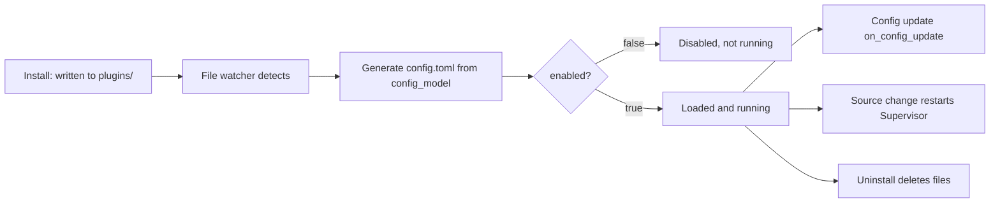

# Manage Plugins

Installing is only the first step. After a plugin is written, you enable, configure, update, or uninstall it in the WebUI's "Plugin Management". This page explains these operations and the runtime timing behind them.

## View Plugins

The plugin list shows:

- 📋 **Name** and description
- 🔧 **Version** and author
- ✅ **Enabled status** (green = enabled, gray = disabled)
- 📖 **Usage instructions** (click to expand)

## Enable / Disable

- Switch ON → the runtime loads the plugin
- Switch OFF → the unload lifecycle runs and the plugin stops
- Normally **takes effect immediately, without restarting all of MaiBot**

## Configure Plugins

Some plugins support custom settings:

1. Click the plugin's "Settings" button;
2. Modify options (e.g. API Key, trigger words, feature toggles);
3. After saving, the runtime invokes the plugin's `on_config_update`.

## Update Plugins

When a new version is available, the page shows a prompt:

1. Click "Update";
2. Wait for download and install;
3. Source changes trigger a plugin Supervisor restart and reload.

The same plugin cannot run install / update / uninstall at the same time; different plugins can be processed in parallel.

## Uninstall Plugins

1. Click "Uninstall" and confirm;
2. The plugin files are deleted.

⚠️ Before uninstalling, confirm whether the plugin stores user data in its own directory—that data may be lost after uninstall.

## Lifecycle and Restart Boundary

- **Install** — written to `plugins/` then detected by the watcher; Runner generates `config.toml` from `config_model` defaults; `enabled=false` needs manual enable
- **Enable / Disable** — the runtime loads or unloads the plugin, **no MaiBot restart needed**
- **Config change** — a loaded plugin receives `on_config_update`; setting it disabled unloads it, enabled loads it
- **Source update** — changes to `.py` / `plugin.py` / `_manifest.json` restart the plugin Supervisor; briefly unavailable, core needs no restart
- **Uninstall** — disable and unload first, then delete files

::: warning Restart is only a fallback
Only fully restart MaiBot when the log explicitly reports that watching, loading, unloading, or a config callback failed. Normal plugin management should not require restarting the core.
:::

## Tips

**Conflicts** — only enable the plugins you need when functions overlap; contact the author for updates if necessary.
**Performance** — too many plugins may affect performance; uninstall unused ones promptly.
**Security** — only install from trusted sources, review permission requirements, update regularly.

## FAQ

**Q: Install failed?** Check network and the URL, and review error messages.
**Q: Installed but no effect?** Confirm it's enabled, the config is correct, and check MaiBot logs.
**Q: Can I develop my own?** Yes! See [Plugin Development](/en/plugin/).
