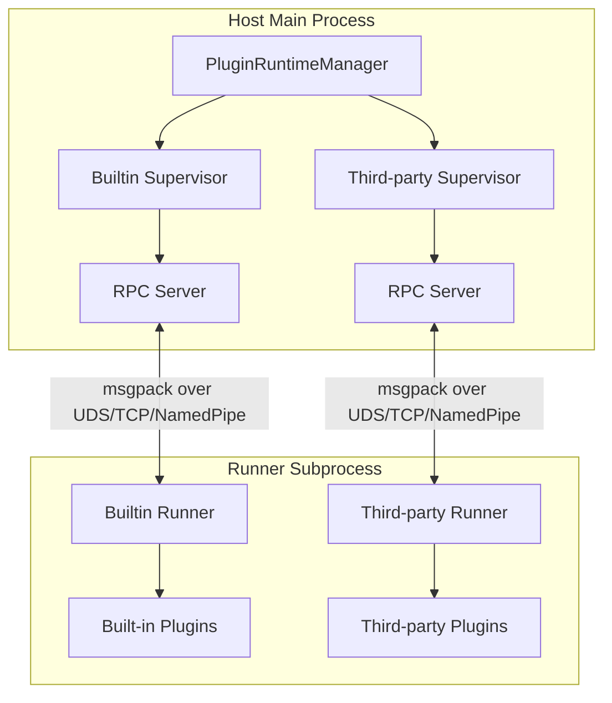

# Plugin Development Guide

MaiBot's plugin system adopts a Host/Runner IPC architecture. Plugin code runs in isolated child processes and communicates with the main process via an RPC protocol encoded with msgpack. This section introduces the architectural principles, development workflow, and core concepts of the plugin system.

## Architecture Overview



### Host (Main Process Side)

- **PluginRuntimeManager**: Singleton manager that manages both Builtin and Third-party Supervisors
- **PluginSupervisor**: Responsible for starting, stopping, health checking, and hot-reloading of Runner subprocesses
- **ComponentRegistry**: Component registry that manages all components (such as Tools, Commands, etc.) declared by plugins
- **HookDispatcher**: Hook dispatcher that routes named hook invocations to the corresponding Supervisor

### Runner (Subprocess Side)

- Each Supervisor manages its own independent Runner subprocess
- Discovers and loads plugins via `PluginLoader`
- Communicates with the Host via `RPCClient`
- Injects `PluginContext` after plugin loading, then calls the `on_load()` lifecycle method

### Communication Protocol

- **Encoding/Decoding**: Uses msgpack format for binary serialization (`MsgPackCodec`)
- **Transport Layer**: Supports three transport methods: Unix Domain Socket, TCP, and Named Pipe
- **RPC Model**:
  - Host → Runner: Invokes plugin components (Tools, Commands, etc.) via `invoke_plugin()`
  - Runner → Host: Plugins initiate RPC callbacks via the capability proxy in `self.ctx` (e.g., `ctx.send.text()`, `ctx.db.query()`)


## Quick Start

### 1. Install SDK

```bash
pip install maibot-plugin-sdk
```

::: tip Note
The package name is `maibot-plugin-sdk`, but in code, import using `maibot_sdk`:
```python
from maibot_sdk import MaiBotPlugin, Command, Tool
```

:::

### 2. Create Plugin Directory

```
plugins/
└── my-plugin/
    ├── _manifest.json
    ├── plugin.py
    └── config.toml          # Optional
```

### 3. Write Manifest

Declare plugin metadata in `_manifest.json` (for full field descriptions, see [Manifest System](./manifest.md)):

::: code-group

```json [JSON ~vscode-icons:file-type-json~]
{
  "manifest_version": 2,
  "id": "com.example.my-plugin",
  "version": "1.0.0",
  "name": "My Plugin",
  "description": "An example plugin",
  "author": {
    "name": "Developer",
    "url": "https://github.com/developer"
  },
  "license": "MIT",
  "urls": {
    "repository": "https://github.com/developer/my-plugin"
  },
  "host_application": {
    "min_version": "1.0.0",
    "max_version": "1.99.99"
  },
  "sdk": {
    "min_version": "1.0.0",
    "max_version": "2.99.99"
  },
  "capabilities": ["send_message"],
  "i18n": {
    "default_locale": "zh-CN"
  }
}
```

:::

### 4. Write Plugin Code

Inherit `MaiBotPlugin` in `plugin.py`, declare components using decorators, and implement three lifecycle methods:

```python
from maibot_sdk import MaiBotPlugin, Command, Tool
from maibot_sdk.types import ToolParameterInfo, ToolParamType


class MyPlugin(MaiBotPlugin):
    async def on_load(self) -> None:
        self.ctx.logger.info("Plugin loaded")

    async def on_unload(self) -> None:
        self.ctx.logger.info("Plugin unloaded")

    async def on_config_update(self, scope: str, config_data: dict, version: str) -> None:
        if scope == "self":
            self.ctx.logger.info("Plugin configuration updated: version=%s", version)

    @Tool(
        "greet",
        brief_description="Greet the user",
        detailed_description="Parameter description:\n- stream_id: string, required. Current chat stream ID.",
        parameters=[
            ToolParameterInfo(
                name="stream_id",
                param_type=ToolParamType.STRING,
                description="Current chat stream ID",
                required=True,
            ),
        ],
    )
    async def handle_greet(self, stream_id: str, **kwargs):
        await self.ctx.send.text("Hello!", stream_id)
        return {"success": True, "message": "Replied"}

    @Command("hello", pattern=r"^/hello")
    async def handle_hello(self, **kwargs):
        await self.ctx.send.text("Hello!", kwargs["stream_id"])
        return True, "Hello!", 2


def create_plugin():
    return MyPlugin()
```

::: warning Three lifecycle methods must be implemented
The SDK requires all plugins to implement `on_load()`, `on_unload()`, and `on_config_update()`. Otherwise, the Runner will refuse to load the plugin. See [Lifecycle](./lifecycle.md) for details.
:::

### 5. Install and Run

Place the plugin directory into the `plugins/` folder. After starting MaiBot, the plugin will be automatically discovered and loaded. Plugin management can also be performed via the WebUI.

## Core Concepts

### Plugin Base Class

All plugins must inherit from `MaiBotPlugin` and declare plugin capabilities through class attributes and decorators:

::: code-group

```python [Python ~vscode-icons:file-type-python~]
from maibot_sdk import MaiBotPlugin, Tool, Command, CONFIG_RELOAD_SCOPE_SELF
from typing import ClassVar, Iterable


class MyPlugin(MaiBotPlugin):
    # Subscribe to global configuration hot reload (only "bot" and "model" are valid values)
    config_reload_subscriptions: ClassVar[Iterable[str]] = ("bot", "model")

    @Tool("my_tool", brief_description="Example tool")
    async def handle_tool(self, **kwargs):
        ...

    @Command("my_cmd", pattern=r"^/my_cmd")
    async def handle_cmd(self, **kwargs):
        ...


def create_plugin():
    return MyPlugin()
```

:::

### Component Decorators

The SDK provides 8 component decorators, all imported from the top level of `maibot_sdk`:

| Decorator | Purpose | Description |
|--------|------|------|
| `@Tool` | LLM tool/function calling | Tools callable by the LLM, the most commonly used component type |
| `@Command` | Slash commands | Commands triggered by users via regex matching |
| `@HookHandler` | Named Hook handlers | Subscribes to specific Hook points, supports blocking/observe modes |
| `@EventHandler` | Message/Workflow events | Listens to lifecycle events such as messages and LLM generation |
| `@API` | Inter-plugin API | Exposes APIs callable by other plugins |
| `@MessageGateway` | Platform adapter | Integrates external platforms (QQ, Discord, etc.) into MaiBot |
| `@LLMProvider` | LLM Provider | Declares new LLM model access points (client_type) to extend model services |
| `@Action` | Legacy plugin compatibility | Internally auto-converted to `@Tool`; new plugins should directly use `@Tool` |

### Capability Proxies

Access 17 capability proxies via `self.ctx`. All calls are automatically forwarded to the Host via RPC:

::: code-group

```python [Python ~vscode-icons:file-type-python~]
# Context access
self.ctx              # PluginContext instance
self.ctx.paths        # Plugin persistence and runtime directories
self.ctx.logger       # logging.Logger, named "plugin.<plugin_id>"

# Capability proxies
self.ctx.api          # Plugin API query, invocation, and dynamic synchronization
self.ctx.gateway      # Message gateway routing and runtime status reporting
self.ctx.send         # Send text, images, emojis, forwards, and mixed messages
self.ctx.db           # Database CRUD operations and counting
self.ctx.llm          # LLM text generation, tool calling, embeddings, and ASR speech recognition
self.ctx.config       # Plugin configuration reading
self.ctx.emoji        # Emoji pack management
self.ctx.message      # Historical message query
self.ctx.frequency    # Speech frequency control
self.ctx.component    # Plugin and component management
self.ctx.chat         # Chat stream query, open, or create chat streams
self.ctx.person       # User information query
self.ctx.render       # Render HTML to PNG images
self.ctx.knowledge    # LPMM knowledge base search
self.ctx.statistics   # Local statistics and billing data reading
self.ctx.tool         # LLM tool definition query
self.ctx.maisaka      # Maisaka context appending and proactive tasks
```

:::

### Configuration Models

Plugins can declare strongly-typed configurations via `PluginConfigBase`. The Runner will automatically generate default configurations and WebUI Schemas:

::: code-group

```python [Python ~vscode-icons:file-type-python~]
from maibot_sdk import MaiBotPlugin, PluginConfigBase, Field


class MyPluginConfig(PluginConfigBase):
    enabled: bool = Field(default=True, description="Whether to enable the plugin")
    greeting: str = Field(default="Hello!", description="Default greeting message")


class MyPlugin(MaiBotPlugin):
    config_model = MyPluginConfig

    async def on_load(self) -> None:
        # Access strongly-typed configuration via self.config
        self.ctx.logger.info("Current greeting: %s", self.config.greeting)
        # Access raw dict via self.get_plugin_config_data()
        raw = self.get_plugin_config_data()
```

:::

- After declaring `config_model`, `self.config` returns a strongly-typed configuration instance
- Calling `self.config` without declaration will raise a `RuntimeError`
- `self.get_plugin_config_data()` is always available and returns the raw configuration dictionary
- The configuration source is `config.toml` in the plugin directory

## Directory Structure Conventions

```
my-plugin/
├── _manifest.json       # Required: Plugin manifest
├── plugin.py            # Required: Plugin entry point, containing create_plugin()
├── config.toml          # Optional: Plugin configuration
├── i18n/                # Optional: Internationalization resources
│   ├── zh-CN.json
│   └── en-US.json
└── assets/              # Optional: Static assets
```

Plugin runtime data should not be written to the plugin source code directory. Starting from SDK 2.6.0, you can obtain the plugin-specific directory injected by the Host via `self.ctx.paths`:

::: code-group

```python [Python ~vscode-icons:file-type-python~]
self.ctx.paths.data_dir     # Persistent data, default: data/plugins/<plugin_id>/
self.ctx.paths.runtime_dir  # Temporary data, default: temp/plugins/<plugin_id>/
```

:::

- `data_dir` is suitable for storing plugin databases, JSON states, user-generated content, and other data that needs to persist across restarts.
- `runtime_dir` is suitable for storing download caches, rendering intermediate artifacts, and temporary files that can be rebuilt.
- Do not use the legacy `plugins/<plugin>/data` path for new data; do not directly concatenate user input into file paths to avoid path traversal attacks caused by `..` or absolute paths.

## Built-in and Third-party Plugins

MaiBot maintains two independent Runner subprocesses:

- **Built-in plugins**: Located in `src/plugins/built_in/`, running under the Builtin Supervisor
- **Third-party plugins**: Located in `plugins/`, running under the Third-party Supervisor

Both use the same communication protocol and component registration mechanism. The startup order between Supervisors is determined by cross-Supervisor dependencies; if a circular dependency is detected, startup is rejected.

## Next Steps

- [Manifest System](./manifest.md): Learn the complete field definitions and validation rules for `_manifest.json`
- [Lifecycle](./lifecycle.md): Learn the lifecycle methods for plugin loading, unloading, and configuration hot-reloading
- [Hook System](./hooks.md): Learn how to use `@HookHandler` to intercept and modify messages
- [Tool Component](./tools.md): Learn how to develop tool components callable by LLMs
- [Command Component](./commands.md): Learn how to develop slash command components
- [LLMProvider Component](./llmprovider.md): Learn how to develop custom LLM Providers to integrate new models
- [Action Component](./actions.md): Learn about the `@Action` decorator compatible with legacy systems
- [Configuration Management](./config.md): Learn how to declare and use plugin configurations
- [API Reference](./api-reference.md): Browse the complete Plugin SDK API