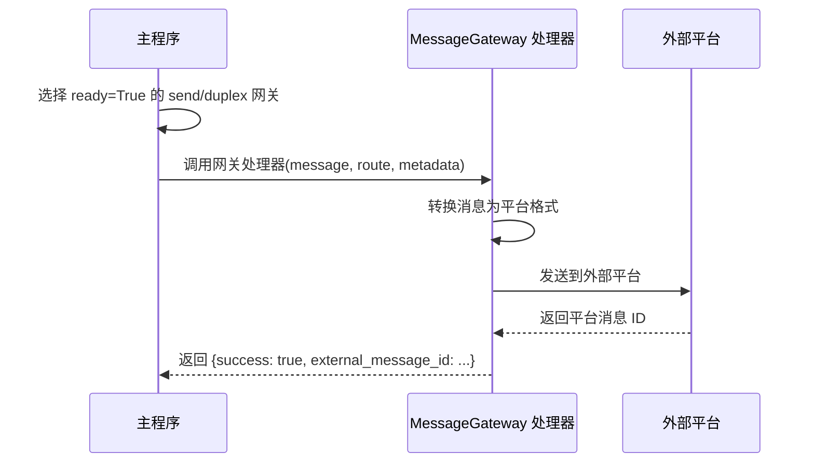
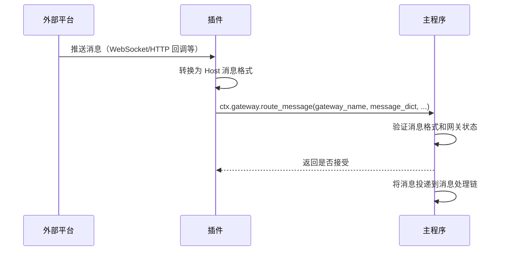
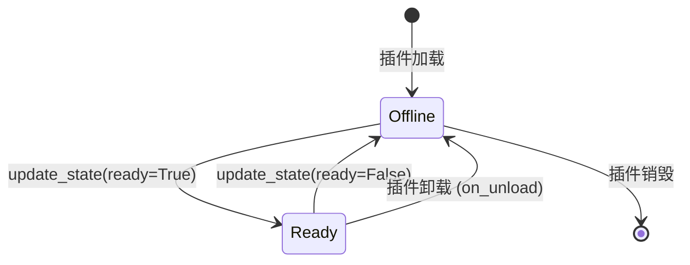

# Message Gateway

The `@MessageGateway` decorator is used to declare a message gateway component, implementing bidirectional message routing between MaiBot and external message platforms (such as QQ, Discord, etc.). The message gateway is the core component of a platform adapter, responsible for outbound message sending and inbound message injection.

## Decorator Signature

::: code-group

```python [Python ~vscode-icons:file-type-python~]
from maibot_sdk import MessageGateway

@MessageGateway(
    route_type: str,             # 路由类型：send / receive / duplex（必填）
    *,
    name: str = "",              # 组件名，留空时使用方法名
    description: str = "",       # 组件描述
    platform: str = "",          # 平台名称（如 qq、discord）
    protocol: str = "",          # 协议或接入方言名称
    account_id: str = "",        # 账号 ID / self_id
    scope: str = "",             # 路由作用域
    **metadata,                  # 额外元数据
)
```

:::

## Routing Types

- **`"send"`** → `MessageGatewayRouteType.SEND` — Outbound: Host → Plugin → External Platform
- **`"receive"`** → `MessageGatewayRouteType.RECEIVE` — Inbound: External Platform → Plugin → Host
- **`"duplex"`** → `MessageGatewayRouteType.DUPLEX` — Bidirectional: Supports both outbound and inbound

::: tip 别名支持
`route_type` also accepts `"recv"` and `"recive"` as aliases for `"receive"`.
:::

## ctx.gateway Capability Proxy

- `await self.ctx.gateway.route_message(gateway_name, message_dict, route_metadata=None, ...)` — Inject inbound messages into the Host
- `await self.ctx.gateway.update_state(gateway_name, ready, platform="", account_id="", scope="", metadata=None)` — Report gateway status

### Status Management

- Only gateways with `ready=True` will be selected by the main program for message routing
- Gateways that are `route_type="send"` or `"duplex"` and `ready=True` can be selected by Platform IO to handle outbound messages
- Gateways that are `route_type="receive"` or `"duplex"` and `ready=True` can inject inbound messages via `ctx.gateway.route_message()`
- Plugins should report `ready=True` when the link is available, and report `ready=False` when disconnected or unloaded

## Complete Adapter Example

Below is a complete example of a QQ platform adapter, implementing bidirectional message routing based on the NapCat protocol:

::: code-group

```python [Python ~vscode-icons:file-type-python~]
from typing import Any

from maibot_sdk import MaiBotPlugin, MessageGateway


class NapCatGatewayPlugin(MaiBotPlugin):
    async def on_load(self) -> None:
        # 上报网关就绪状态
        await self.ctx.gateway.update_state(
            gateway_name="napcat_gateway",
            ready=True,
            platform="qq",
            account_id="10001",
            scope="primary",
            metadata={"protocol": "napcat"},
        )
        self.ctx.logger.info("NapCat 网关已就绪")

    async def on_unload(self) -> None:
        # 上报网关离线
        await self.ctx.gateway.update_state(
            gateway_name="napcat_gateway",
            ready=False,
        )
        self.ctx.logger.info("NapCat 网关已下线")

    async def on_config_update(self, scope: str, config_data: dict, version: str) -> None:
        pass

    @MessageGateway(
        route_type="duplex",
        name="napcat_gateway",
        platform="qq",
        protocol="napcat",
        account_id="10001",
        scope="primary",
    )
    async def send_to_platform(
        self,
        message: dict[str, Any],
        route: dict[str, Any] | None = None,
        metadata: dict[str, Any] | None = None,
        **kwargs: Any,
    ) -> dict[str, Any]:
        """出站：将 Host 消息转发到外部平台。"""
        # 将 Host MessageDict 转换为平台格式并发送
        platform_msg = self._convert_to_platform_format(message)
        result = await self._send_to_napcat(platform_msg)
        return {"success": True, "external_message_id": result.get("message_id")}

    async def handle_inbound(self, payload: dict[str, Any]) -> None:
        """入站：将外部平台消息注入 Host。

        此方法由外部平台回调触发（如 WebSocket 推送），
        不是组件装饰器方法，但演示了入站消息的注入流程。
        """
        accepted = await self.ctx.gateway.route_message(
            gateway_name="napcat_gateway",
            message_dict={
                "message_id": payload["message_id"],
                "platform": "qq",
                "message_info": {
                    "user_info": {
                        "user_id": payload["user_id"],
                        "user_nickname": payload["nickname"],
                    },
                    "additional_config": {},
                },
                "raw_message": payload["message"],
            },
            route_metadata={
                "self_id": "10001",
                "connection_id": "primary",
            },
            external_message_id=payload["message_id"],
            dedupe_key=payload["message_id"],
        )
        if not accepted:
            self.ctx.logger.warning(
                "Host 未接收入站消息: %s", payload["message_id"]
            )

    def _convert_to_platform_format(
        self, message: dict[str, Any]
    ) -> dict[str, Any]:
        """将 Host 消息格式转换为平台格式。"""
        return {
            "action": "send_msg",
            "params": {
                "message_type": "group",
                "group_id": message.get("group_id"),
                "message": message.get("raw_message", ""),
            },
        }

    async def _send_to_napcat(
        self, platform_msg: dict[str, Any]
    ) -> dict[str, Any]:
        """发送消息到 NapCat API。"""
        # 实际实现中这里会调用 NapCat 的 HTTP/WebSocket API
        return {"message_id": "platform-msg-1"}


def create_plugin():
    return NapCatGatewayPlugin()
```

:::

## Inbound-Only Gateway Example

If you only need to inject messages into MaiBot (e.g., Webhook listening), you can use `route_type="receive"`:

::: code-group

```python [Python ~vscode-icons:file-type-python~]
from typing import Any

from maibot_sdk import MaiBotPlugin, MessageGateway


class WebhookReceiverPlugin(MaiBotPlugin):
    async def on_load(self) -> None:
        await self.ctx.gateway.update_state(
            gateway_name="webhook_receiver",
            ready=True,
            platform="webhook",
            scope="default",
        )

    async def on_unload(self) -> None:
        await self.ctx.gateway.update_state(
            gateway_name="webhook_receiver",
            ready=False,
        )

    async def on_config_update(self, scope: str, config_data: dict, version: str) -> None:
        pass

    @MessageGateway(
        route_type="receive",
        name="webhook_receiver",
        platform="webhook",
    )
    async def handle_outbound(self, message: dict[str, Any], **kwargs: Any) -> dict[str, Any]:
        """仅入站网关，出站方向不会收到消息。"""
        # receive 类型网关不会被选中处理出站消息
        # 此处理器不会被调用，但必须声明
        return {"success": True}

    async def inject_webhook_message(self, payload: dict[str, Any]) -> None:
        """接收 Webhook 回调并注入消息。"""
        accepted = await self.ctx.gateway.route_message(
            gateway_name="webhook_receiver",
            message_dict={
                "message_id": payload["id"],
                "platform": "webhook",
                "message_info": {
                    "user_info": {
                        "user_id": payload.get("sender", "unknown"),
                        "user_nickname": payload.get("sender_name", "unknown"),
                    },
                    "additional_config": {},
                },
                "raw_message": payload.get("content", ""),
            },
        )
        if accepted:
            self.ctx.logger.info("Webhook 消息已注入")


def create_plugin():
    return WebhookReceiverPlugin()
```

:::

## Gateway Handler Parameters

Handler methods decorated with `@MessageGateway` receive the following parameters:

- **`self`** `MaiBotPlugin` — Plugin instance
- **`message`** `dict[str, Any]` — Message dictionary sent from the Host (outbound direction)
- **`route`** `dict[str, Any] | None` — Routing information
- **`metadata`** `dict[str, Any] | None` — Routing metadata
- **`**kwargs`** `Any` — Other parameters

The handler return value is `dict[str, Any]`, which should at least contain the `success` field to indicate whether the sending was successful.

## Message Routing Flow

### Outbound Flow (Host → External Platform)



### Inbound Flow (External Platform → Host)



## Gateway Lifecycle



::: important
- Plugins should call `ctx.gateway.update_state(ready=True)` in `on_load()` to report ready status
- Plugins should call `ctx.gateway.update_state(ready=False)` in `on_unload()` to report offline status
- Only gateways with `ready=True` will participate in message routing
:::

## Platform Field Descriptions

- **`platform`** `str` — Target platform name (e.g., `"qq"`, `"discord"`, `"webhook"`)
- **`protocol`** `str` — Protocol or implementation name (e.g., `"napcat"`, `"go-cqhttp"`, `"discord.py"`)
- **`account_id`** `str` — Bot account ID (e.g., `"10001"`, `"bot#1234"`)
- **`scope`** `str` — Routing scope (e.g., `"primary"`, `"default"`)

`platform`, `protocol`, `account_id`, and `scope` can also be reported dynamically at runtime via `ctx.gateway.update_state()` without being fixed in the decorator.
