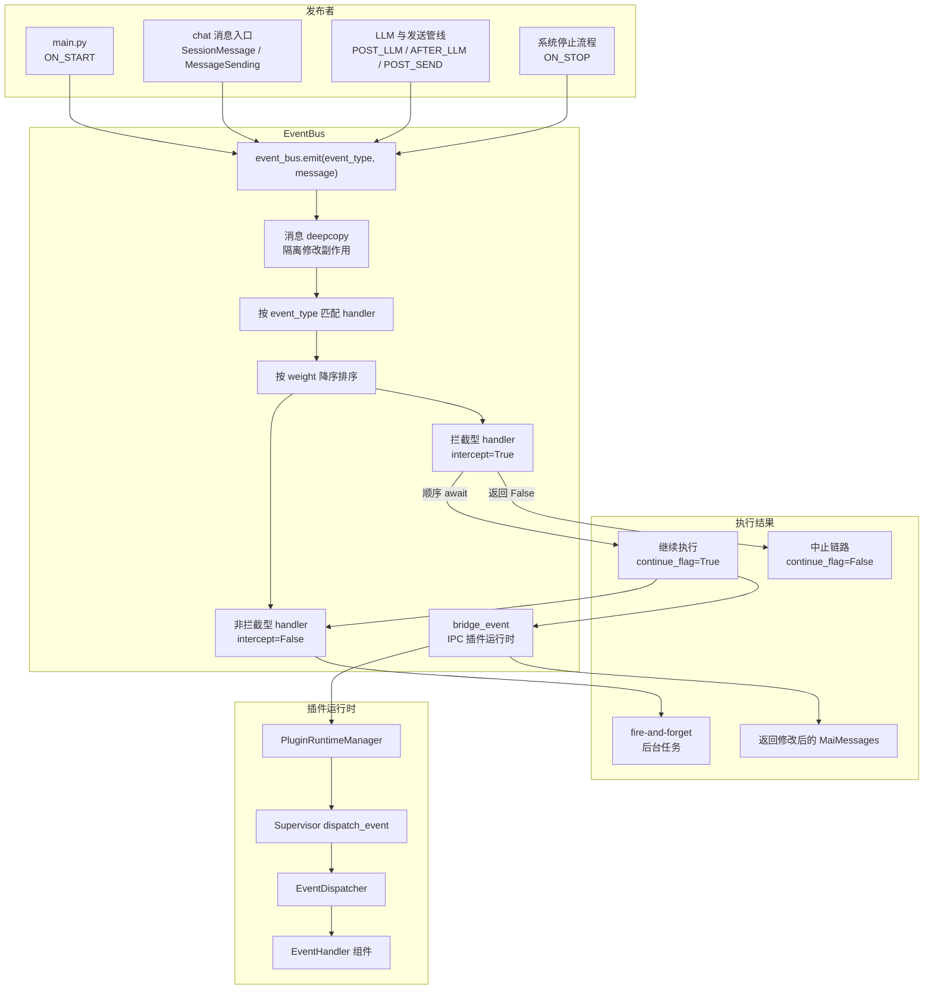
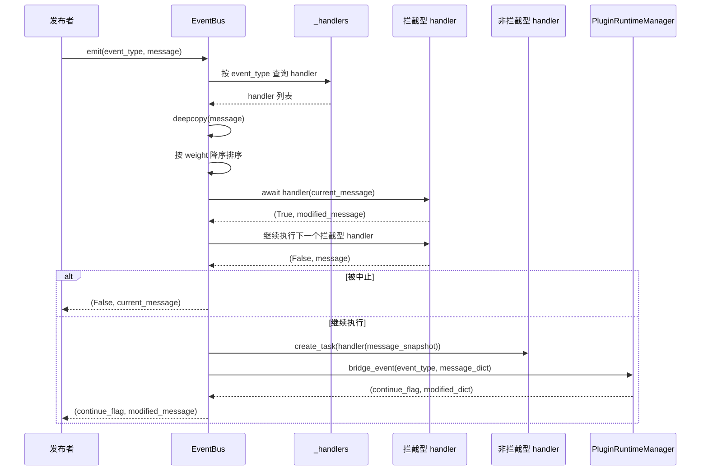

本文基于 code-map 快照编写。

# 事件总线架构

MaiBot 的 EventBus 是进程内通信中枢，负责把分散在启动流程、聊天入口、LLM 管线、发送管线和插件运行时之间的事件，统一收敛到发布/订阅模型中。它不直接定义业务动作，也不负责具体功能执行，而是提供事件注册、事件触发、handler 排序、消息隔离和跨运行时桥接这些基础能力。

## 概述

EventBus 位于 `maibot/src/core/event_bus.py`，属于 `core` 基础设施层。它和 `maibot/src/core/types.py` 中的 `EventType`、`MaiMessages` 共同构成主程序内部事件系统的最小闭环。

**EventBus** ：全局事件总线实例，提供 `subscribe()`、`unsubscribe()`、`emit()` 和任务取消能力。
**EventHandler** ：源码中的 handler 签名，接收 `Optional[MaiMessages]`，返回 `(continue_flag, modified_message)`。
**EventInterceptor** ：文档概念中的拦截型 handler，源码中通过 `intercept=True` 标记，顺序执行，可修改消息并中止链路。
**EventListener** ：文档概念中的非拦截型 handler，源码中通过 `intercept=False` 标记，异步并发执行，不参与主流程控制。
**InterceptResult** ：文档概念中的拦截结果。当前实现没有独立类，实际等价于返回 `(False, message)`，概念上可理解为 `intercept_result.abort()`。
**EventType** ：事件类型枚举，定义系统内可被识别的标准事件名。
**MaiMessages** ：事件消息模型，承载消息段、纯文本、LLM 提示词、LLM 响应、流 ID 和附加数据。

EventBus 的核心职责不是替代 Hook 系统，而是为事件驱动调用提供底层通道。业务模块可以在关键执行点调用 `event_bus.emit()`，插件运行时可以通过 IPC 桥接接收事件，内部 handler 可以通过注册表参与事件处理。

## 架构图



这张图表达的是 EventBus 的一次完整分发：发布者调用 `emit()`，EventBus 根据事件类型取出 handler，按 `weight` 排序，先执行拦截型 handler，再在继续执行的前提下调度非拦截型 handler，最后把事件桥接到插件运行时。

## 核心概念

### 拦截型 handler

拦截型 handler 是主流程的一部分。它在 `subscribe()` 时通过 `intercept=True` 注册，在 `emit()` 中被同步等待。每个 handler 都可以看到当前消息对象，也可以返回新的消息对象。

**执行顺序** ：同一事件类型下的拦截型 handler 按 `weight` 降序执行，权重越大越靠前。
**消息隔离** ：`emit()` 开始时会对传入消息执行 `deepcopy()`，避免外部对象被直接修改。
**可修改消息** ：handler 返回的 `modified_message` 非空时，会替换当前 `current_message`。
**可中止链路** ：handler 返回的 `continue_flag` 为 `False` 时，EventBus 停止后续拦截型 handler，并跳过非拦截型 handler。
**异常处理** ：单个拦截型 handler 异常不会让整个事件总线崩溃，异常会被记录后继续处理下一个 handler。

概念上，拦截型 handler 可以写成下面的形式：

::: code-group

```python [Python ~vscode-icons:file-type-python~]
async def security_filter(message: Optional[MaiMessages]):
    if should_block(message):
        return False, message  # 等价于 intercept_result.abort()
    return True, message
```

:::

如果某个 handler 需要返回修改后的消息，可以把新的 `MaiMessages` 作为第二个返回值。调用方收到 `emit()` 的结果后，可以继续把 `modified_message` 写回业务对象。

### 非拦截型 handler

非拦截型 handler 是旁路观察者。它在 `subscribe()` 时通过 `intercept=False` 注册，在 `emit()` 中被放入后台任务执行。

**执行时机** ：只有所有拦截型 handler 都允许继续时，才会调度非拦截型 handler。
**执行方式** ：通过 `asyncio.create_task()` 创建任务，不等待任务完成。
**控制能力** ：非拦截型 handler 不能中止事件链路，也不能改变 `emit()` 的返回值。
**消息快照** ：每个非拦截型 handler 会收到当前消息的 `deepcopy()`，避免并发任务之间互相覆盖。
**任务跟踪** ：运行中的任务会按 handler 名称记录在 `_running_tasks`，支持 `cancel_handler_tasks()` 取消指定 handler 的任务。

概念上，非拦截型 handler 适合做审计、统计、日志、监控和异步副作用：

::: code-group

```python [Python ~vscode-icons:file-type-python~]
async def audit_listener(message: Optional[MaiMessages]):
    await write_audit_log(message)
    return True, message
```

:::

即使 `audit_listener()` 抛错，也不会影响主链路。异常会在任务完成回调中被记录。

### EventType 枚举分类

`EventType` 定义在 `maibot/src/core/types.py`。它不是插件声明文件，而是主程序共享的事件类型字典。EventBus 在初始化时会预注册所有内置 `EventType`，因此标准事件在没有任何 handler 时也能被识别。

**生命周期事件** ：`ON_START`、`ON_STOP`，用于启动和停止阶段。
**消息预处理事件** ：`ON_MESSAGE_PRE_PROCESS`，用于消息进入核心处理前的拦截点。
**消息主链事件** ：`ON_MESSAGE`，用于消息处理主链上的事件通知和拦截。
**计划与推理事件** ：`ON_PLAN`、`POST_LLM`、`AFTER_LLM`，用于 LLM 推理前后和计划生成相关节点。
**发送管线事件** ：`POST_SEND_PRE_PROCESS`、`POST_SEND`、`AFTER_SEND`，用于消息发送前后。
**未知事件** ：`UNKNOWN`，用于无法归类的事件或兼容场景。

### handler 注册模型

EventBus 的 handler 是纯 async callable，不需要继承插件基类，也不需要注册为 Hook。注册信息由 `_HandlerEntry` 保存。

**event_type** ：事件类型，可以是 `EventType` 枚举，也可以是字符串。
**handler** ：异步 callable，签名为 `(Optional[MaiMessages]) -> (bool, Optional[MaiMessages])`。
**name** ：handler 标识名，用于取消注册和任务追踪。
**weight** ：权重，值越大越先执行。
**intercept** ：是否作为拦截型 handler 执行。

注册流程很简单：

::: code-group

```python [Python ~vscode-icons:file-type-python~]
event_bus.subscribe(
    event_type=EventType.ON_MESSAGE,
    handler=handler_func,
    name="example.handler",
    weight=10,
    intercept=True,
)
```

:::

取消注册时只需要提供事件类型和 handler 名称：

::: code-group

```python [Python ~vscode-icons:file-type-python~]
event_bus.unsubscribe(event_type=EventType.ON_MESSAGE, name="example.handler")
```

:::

## 关键流程

EventBus 的一次 `emit()` 可以拆成四个阶段：事件触发、handler 匹配、拦截型顺序执行、非拦截型并发执行。



### emit 到 handler 匹配

`emit(event_type, message)` 是唯一的触发入口。它从 `_handlers` 中按 `event_type` 查找 handler 列表。如果事件类型没有 handler，会直接返回 `(True, None)`。

**事件类型查找** ：`handlers = self._handlers.get(event_type, [])`。
**空列表处理** ：没有 handler 时返回继续标志和空消息。
**排序策略** ：注册时已经按 `weight` 降序排序，因此分发时直接使用当前列表。
**字符串事件** ：除了 `EventType` 枚举，也允许字符串事件类型，方便运行时扩展。

### 拦截型顺序执行

拦截型 handler 被单独收集到 `intercept_handlers`。EventBus 会逐个 `await` 它们。

**继续标志** ：初始值为 `True`。
**当前消息** ：使用 `current_message` 保存经过前序 handler 修改后的消息。
**修改消息** ：如果 handler 返回的 `modified` 非空，则替换 `current_message`。
**中止链路** ：如果 handler 返回的 `should_continue` 为 `False`，则 `continue_flag` 变为 `False` 并跳出循环。
**异常隔离** ：异常会被记录，不会中断同一事件的其他 handler。

### 非拦截型并发执行

只有 `continue_flag` 仍为 `True` 时，非拦截型 handler 才会被调度。每个 handler 都拿到一份当前消息快照。

**调度方式** ：`asyncio.create_task(entry.handler(message))`。
**任务命名** ：任务名设置为 handler 名称，便于日志和取消。
**完成回调** ：任务完成后会记录异常，并从 `_running_tasks` 移除。
**不可中止** ：非拦截型 handler 的返回值不会影响 `emit()` 的最终结果。

### IPC 插件运行时桥接

拦截型和非拦截型 handler 执行后，EventBus 会把事件桥接到插件运行时。这个步骤位于 `event_bus.py` 的 `_bridge_to_ipc_runtime()`。

**继续检查** ：如果主链路已经被拦截型 handler 中止，则不再桥接。
**运行时检查** ：如果插件运行时未运行，则直接返回当前结果。
**事件值转换** ：`EventType` 会转换为 `.value`，字符串事件则保持原值。
**消息序列化** ：`MaiMessages` 会通过 `to_transport_dict()` 转为可 IPC 传输的字典。
**回写修改** ：插件运行时返回的修改字典会通过 `apply_transport_update()` 回写到消息对象。

## 模块交互

EventBus 不是一个孤立组件。它通过 `core#类型系统` 获得事件名和消息模型，通过 `plugin_runtime#Hook调度器` 与插件运行时协作，通过 `chat#消息入口调度` 接收消息入口产生的事件。

### 与 core#类型系统协作

`core#类型系统` 主要指 `maibot/src/core/types.py`。它提供 EventBus 需要的两类核心类型。

**EventType** ：定义标准事件名，EventBus 初始化时预注册这些枚举。
**MaiMessages** ：定义统一消息结构，拦截型 handler 可以修改其中的字段。
**ModifyFlag** ：记录 IPC 回写时哪些字段被修改，例如消息段、纯文本、LLM prompt。
**Transport 方法** ：`to_transport_dict()` 和 `apply_transport_update()` 支撑跨 IPC 的消息传递。

`MaiMessages` 的字段覆盖了事件系统常见需求：

**message_segments** ：消息段列表，来自 `maim_message.Seg`。
**message_base_info** ：平台、用户、群聊等基础信息。
**plain_text** ：处理后的纯文本消息。
**raw_message** ：原始消息文本。
**stream_id** ：聊天流 ID，用于定位会话上下文。
**llm_prompt** ：发送给 LLM 的提示词。
**llm_response_content** ：LLM 响应正文。
**llm_response_reasoning** ：LLM 推理内容。
**llm_response_tool_call** ：LLM 工具调用信息。
**action_usage** ：使用的 Action 列表。
**additional_data** ：附加数据，用于业务模块传递临时上下文。

### 与 plugin_runtime#Hook调度器协作

EventBus 与 Hook 调度器不是同一个系统，但它们共享相似的发布/订阅思想。EventBus 按事件类型分发，Hook 调度器按命名 Hook 分发。

**EventBus** ：面向 `EventType`，主入口是 `event_bus.emit()`。
**HookDispatcher** ：面向 Hook 名称，主入口是 `PluginRuntimeManager.invoke_hook()`。
**EventHandler** ：插件运行时中的事件处理器组件，由 `EventDispatcher` 调度。
**HookHandler** ：插件运行时中的命名 Hook 处理器，由 `HookDispatcher` 调度。
**阻塞处理器** ：EventBus 中叫拦截型 handler，Hook 中叫 `blocking` handler。
**观察处理器** ：EventBus 中叫非拦截型 handler，Hook 中叫 `observe` handler。

`plugin_runtime#Hook调度器` 的相关源码位置如下：

**PluginRuntimeManager** ：`maibot/src/plugin_runtime/integration.py`，提供 `bridge_event()` 和 `invoke_hook()`。
**EventDispatcher** ：`maibot/src/plugin_runtime/host/event_dispatcher.py`，负责插件事件处理器分发。
**HookDispatcher** ：`maibot/src/plugin_runtime/host/hook_dispatcher.py`，负责命名 Hook 分发。
**Supervisor** ：`maibot/src/plugin_runtime/host/supervisor.py`，在 Supervisor 内暴露 `dispatch_event()` 和 `invoke_hook()`。

EventBus 的桥接流程是先调用 `PluginRuntimeManager.bridge_event()`，再由 `bridge_event()` 遍历 Supervisor，调用 `supervisor.dispatch_event()`。Supervisor 内部再交给 `EventDispatcher` 查询 `EventHandlerEntry` 并执行。

### 与 chat#消息入口调度协作

`chat#消息入口调度` 是 EventBus 最自然的业务入口之一。聊天入口收到外部平台消息后，会形成 `SessionMessage` 或 `MessageSending`，再转换为 `MaiMessages`。

**消息转换工具** ：`maibot/src/chat/event_helpers.py` 提供 `build_event_message()`。
**入站消息** ：`SessionMessage` 可以转换为 `MaiMessages`。
**发送消息** ：`MessageSending` 可以转换为 `MaiMessages`。
**流上下文** ：如果只有 `stream_id`，可以从 `chat_manager` 查找会话并构建最小事件消息。
**生命周期事件** ：`ON_START` 和 `ON_STOP` 没有消息体，`build_event_message()` 对它们返回 `None`。

`maibot/src/chat/message_receive/bot.py` 中保留了事件总线的集成点注释，例如 `ON_MESSAGE_PRE_PROCESS` 和 `ON_MESSAGE` 的调用位置。当前实现也使用插件 Hook 在消息处理前后执行 `chat.receive.before_process` 和 `chat.receive.after_process`。这说明 EventBus 与 chat 入口的关系是明确的，但具体哪些事件点已经启用，应以源码中的实际调用为准。

## 事件类型枚举

本节列出当前 `EventType` 枚举中的关键事件，以及文档中常见的兼容事件名。它们都可以作为 EventBus 的事件类型键使用，其中枚举事件会在初始化时被预注册，字符串事件名则适合插件或外部系统扩展。

**`MESSAGE_RECEIVED`** ：兼容事件名，常用于描述外部平台消息已被接收。当前 `EventType` 枚举未直接定义该名称，可通过字符串事件类型注册或桥接。
**`COMMAND_EXECUTED`** ：兼容事件名，常用于描述命令处理完成后发布通知。当前 `EventType` 枚举未直接定义该名称，可通过字符串事件类型注册或桥接。
**`ON_START`** ：启动事件。`maibot/src/main.py` 在初始化聊天管理器、记忆自动化服务后触发该事件，EventBus 会统一桥接到 IPC 插件运行时。
**`ON_STOP`** ：停止事件。系统重启或停止流程中可以触发该事件，用于通知需要清理资源的组件。
**`ON_MESSAGE_PRE_PROCESS`** ：消息预处理事件。适合在消息进入核心处理前做拦截、改写或过滤。当前 chat 入口中相关调用点是 TODO，说明该事件位已预留。
**`ON_MESSAGE`** ：消息主链事件。适合在消息完成基础处理后、进入推理或命令处理前参与流程控制。
**`ON_PLAN`** ：计划事件。用于计划生成相关节点，可携带 `stream_id` 和 LLM 上下文。
**`POST_LLM`** ：LLM 后事件。LLM 已生成响应后触发，可用于改写响应、审计或触发后续动作。
**`AFTER_LLM`** ：LLM 完成事件。用于 LLM 管线结束后的旁路通知或统计。
**`POST_SEND_PRE_PROCESS`** ：发送前预处理事件。适合在发送前做最终检查或改写。
**`POST_SEND`** ：发送事件。消息即将发送时触发，可用于审计、计数或外部同步。
**`AFTER_SEND`** ：发送后事件。消息发送完成后触发，适合做日志、统计和状态更新。
**`UNKNOWN`** ：未知事件类型。用于兼容未归类事件或运行时动态事件。

### 事件分类说明

**生命周期类** ：`ON_START`、`ON_STOP` 不依赖消息体，通常在应用启动和停止阶段触发。
**入站消息类** ：`MESSAGE_RECEIVED`、`ON_MESSAGE_PRE_PROCESS`、`ON_MESSAGE` 面向外部平台进入系统的消息。
**命令处理类** ：`COMMAND_EXECUTED` 面向命令执行完成后的通知或审计。
**推理计划类** ：`ON_PLAN`、`POST_LLM`、`AFTER_LLM` 面向 LLM 推理和计划生成过程。
**出站发送类** ：`POST_SEND_PRE_PROCESS`、`POST_SEND`、`AFTER_SEND` 面向消息发送过程。
**兼容类** ：`UNKNOWN` 用于兜底，不应作为新业务事件的首选类型。

## 扩展点/Hook

EventBus 自身不提供 Hook 系统。它没有 Hook 规格注册表，没有 `allow_abort`、`allow_observe`、`order` 等 Hook 语义，也不直接管理插件组件声明。它提供的是更底层的事件发布/订阅能力。

**EventBus 负责** ：事件类型匹配、handler 注册、顺序拦截、异步旁路、消息快照、IPC 桥接。
**Hook 系统负责** ：命名 Hook 规格、插件组件声明、blocking/observe 模式、early/normal/late 顺序、abort 策略。
**EventHandler 负责** ：插件侧按事件类型注册的处理器组件。
**HookHandler 负责** ：插件侧按 Hook 名称注册的处理器组件。

EventBus 是 Hook 系统的底层实现基础，原因在于它验证并沉淀了几个关键模式。

**发布/订阅** ：调用方只关心事件类型，不直接知道谁会处理事件。
**权重排序** ：handler 可以按优先级排列，避免硬编码调用顺序。
**拦截与旁路分离** ：主流程控制权和观察型副作用被区分开。
**消息不可变性保护** ：通过 `deepcopy()` 降低 handler 之间的副作用耦合。
**跨运行时扩展** ：通过 IPC 桥接把事件传播到插件 Supervisor。

如果未来需要新增 Hook，不应把 Hook 规格塞进 EventBus。更合理的方向是让 Hook 系统复用 EventBus 的排序、拦截、旁路和桥接思想，但保留自己的命名、规格、插件声明和错误策略。

## 设计边界

EventBus 适合处理进程内事件和插件运行时桥接，不适合承载所有业务控制逻辑。

**适合使用 EventBus** ：启动停止通知、消息入口拦截、发送前后通知、LLM 管线旁路事件、跨模块状态同步。
**不适合使用 EventBus** ：高频细粒度状态更新、需要强事务保证的操作、需要复杂权限模型的业务流程、需要长期持久化的事件日志。
**适合拦截型 handler** ：安全过滤、敏感词处理、消息改写、流程中止。
**适合非拦截型 handler** ：统计、审计、监控、异步通知、缓存刷新。
**适合 Hook 系统** ：插件显式声明的扩展点、需要参数 Schema 的扩展点、需要 blocking/observe 策略的扩展点。

## 实现细节

### handler 存储结构

EventBus 使用 `_handlers` 保存事件类型到 handler 条目的映射。

**键** ：`EventType` 枚举或字符串事件类型。
**值** ：`_HandlerEntry` 列表。
**排序** ：每次 `subscribe()` 后都会按 `weight` 降序重排。
**预注册** ：构造函数中遍历所有 `EventType`，为内置事件创建空列表。

### 消息隔离策略

`emit()` 会对传入消息执行 `deepcopy()`。这个设计让 handler 可以安全修改消息对象，而不会污染调用方原始对象。

**输入消息** ：调用方传入的 `message`。
**当前消息** ：`current_message`，拦截型 handler 之间传递的可变副本。
**异步快照** ：非拦截型 handler 收到的是 `current_message.deepcopy()`。
**IPC 消息** ：桥接时转换为传输字典，插件侧修改后再回写。

### 异常策略

EventBus 对 handler 异常采用隔离策略。

**拦截型异常** ：记录错误，继续执行后续 handler。
**非拦截型异常** ：在任务完成回调中记录错误。
**IPC 桥接异常** ：记录 warning，不影响主链路返回值。
**任务创建失败** ：记录错误，不阻塞其他 handler。

这种策略让事件总线保持稳定，但也意味着调用方不能依赖某个 handler 一定执行成功。需要强一致性的逻辑应放在业务主流程或 Hook 的 blocking 策略中。

### 任务取消

`cancel_handler_tasks(handler_name)` 用于取消指定 handler 的运行中任务。

**查找任务** ：从 `_running_tasks` 中取出 handler 名称对应的任务列表。
**取消任务** ：对未完成的任务调用 `cancel()`。
**等待回收** ：通过 `asyncio.gather(..., return_exceptions=True)` 等待取消完成。
**清理记录** ：任务完成回调会从 `_running_tasks` 中移除已完成任务。

## 典型调用示例

### 注册拦截型 handler

::: code-group

```python [Python ~vscode-icons:file-type-python~]
async def before_message(message: Optional[MaiMessages]):
    if not message:
        return True, None
    if message.plain_text.startswith("!ignore"):
        return False, message
    return True, message

event_bus.subscribe(
    event_type=EventType.ON_MESSAGE,
    handler=before_message,
    name="core.before_message_filter",
    weight=100,
    intercept=True,
)
```

:::

### 注册非拦截型 handler

::: code-group

```python [Python ~vscode-icons:file-type-python~]
async def message_audit(message: Optional[MaiMessages]):
    if not message:
        return True, None
    await audit_service.record(message)
    return True, message

event_bus.subscribe(
    event_type=EventType.ON_MESSAGE,
    handler=message_audit,
    name="core.message_audit",
    weight=0,
    intercept=False,
)
```

:::

### 触发事件并处理结果

::: code-group

```python [Python ~vscode-icons:file-type-python~]
continue_flag, modified_message = await event_bus.emit(
    event_type=EventType.ON_MESSAGE,
    message=event_message,
)

if not continue_flag:
    return

if modified_message and modified_message.plain_text:
    message.processed_plain_text = modified_message.plain_text
```

:::

## 与旧 events_manager 的关系

当前 EventBus 是面向最终架构的事件系统。它不依赖插件基类，内部 handler 直接注册 async callable，IPC 插件通过 `plugin_runtime` 桥接。

**不再要求继承插件基类** ：内部 handler 只需符合签名。
**不再把事件逻辑绑定到单一管理器** ：EventBus 是全局单例，模块可以按需注入或导入。
**保留事件类型兼容** ：标准 `EventType` 来自 `core/types.py`。
**保留消息模型兼容** ：事件消息统一使用 `MaiMessages`。
**保留插件扩展能力** ：通过 `bridge_event()` 进入插件运行时。

## 审计要点

**权重冲突** ：多个 handler 使用相同 `weight` 时，执行顺序取决于注册顺序和列表排序稳定性。
**异步副作用不可见** ：非拦截型 handler 不会阻塞 `emit()`，调用方不能假设它已完成。
**消息字段一致性** ：修改 `message_segments` 后，应同步维护 `plain_text`，否则可能产生不一致。
**IPC 回写限制** ：只有 `MaiMessages` 中可序列化的字段能安全跨 IPC 回写。
**生命周期事件无消息体** ：`ON_START` 和 `ON_STOP` 不携带 `MaiMessages`，handler 需要处理 `None`。
**TODO 事件点** ：`ON_MESSAGE_PRE_PROCESS` 和 `ON_MESSAGE` 在 chat 入口中存在集成点注释，启用前需要确认业务主链已经迁移完成。

## 结论

EventBus 是 MaiBot 内部事件通信的基础设施。它用发布/订阅模型连接核心类型系统、聊天入口和插件运行时，用拦截型 handler 支持主流程控制，用非拦截型 handler 支持异步旁路，用 IPC 桥接把事件扩展到插件 Supervisor。

它的边界也很清楚：EventBus 提供底层事件分发，不提供完整 Hook 规格系统。需要插件显式声明、参数校验、blocking/observe 策略和复杂错误策略时，应继续使用 `plugin_runtime` 中的 Hook 调度器。需要统一事件名、消息快照、顺序拦截和异步通知时，EventBus 是更合适的入口。
