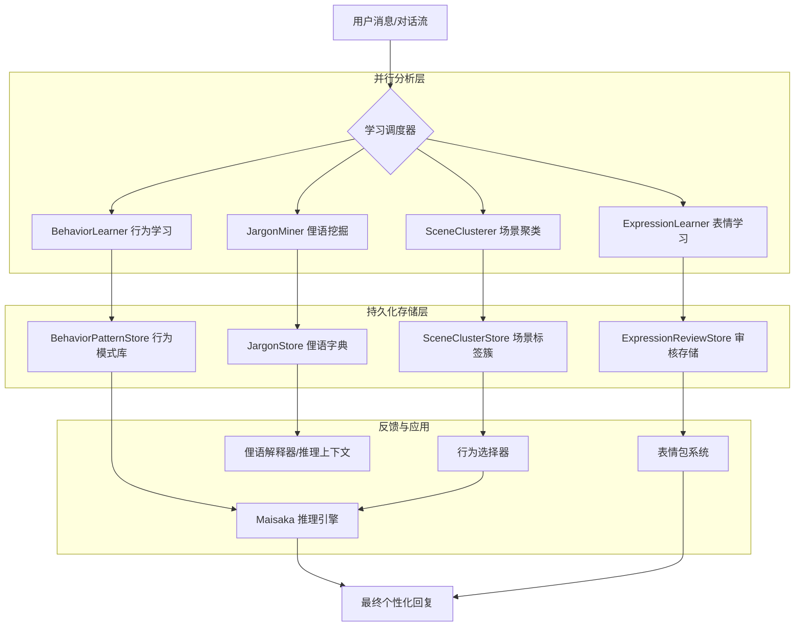

本文基于 code-map 快照编写。

# 表达学习架构

MaiBot 的 `learners/` 学习模块是一个自主进化子系统，旨在让机器人通过观察用户对话，自动习得特定的表达习惯、行为模式和社群文化。它不依赖于预定义的规则集，而是通过“观察 $\rightarrow$ 分析 $\rightarrow$ 存储 $\rightarrow$ 影响”的闭环，实现从“通用智能体”到“社群成员”的身份转变。

学习模块由四类专门的学习器协作完成：行为学习器（BehaviorLearner）、表情学习器（ExpressionLearner）、俚语挖掘器（JargonMiner）和场景聚类器（SceneClusterer）。

## 学习流转架构

学习模块在消息管线中处于异步分析位置。它不直接阻塞消息的实时回复，而是在消息流经管线时触发分析任务，并将结果持久化，从而在后续的推理循环中影响回复质量。



## 学习器详解

### BehaviorLearner（行为学习器）

行为学习器负责捕捉用户与 Bot 交互的深层模式。它不关注具体的词汇，而关注“在什么场景下，采取什么行为，会得到什么结果”。

**核心机制**：通过 LLM 解析聊天历史，生成“场景-行为-结果”三元组。如果某种行为模式（如：在用户沮丧时使用幽默化解）获得了正向反馈，该模式的权重将增加。

**关键组件**：
**`BehaviorCandidate`** ：学习到的潜在行为候选，包含场景描述、建议动作和预期效果。
**`BehaviorPatternStore`** ：管理行为模式的 CRUD，负责将学习到的候选转化为持久化的行为经验。
**`BehaviorPatternMaintenance`** ：执行模式衰减（Decay）机制，防止 Bot 僵化在过时的表达习惯中，确保学习结果具有时效性。

**触发时机**：学习行为的触发由 `LearningTrigger` 组件管理，基于以下条件组合判断：

`触发频率` — 同一场景-行为对在滑动窗口（默认 24 小时）内出现 ≥3 次即触发候选记录。

`反馈信号` — 用户对 Bot 回复的显式（点赞、@提及认可）或隐式（继续追问、使用相同风格回复）正反馈加速模式固化。

`场景相似度` — 通过 SceneClusterer 的场景标签簇计算当前对话与已存储模式的语义相似度，超过 `BEHAVIOR_SIMILARITY_THRESHOLD`（默认 0.75）时激活。

**数据存储**：学习的模式以 `BehaviorPattern` 结构持久化于 `BehaviorPatternStore`。每个模式包含以下字段：

`scene_descriptor` — 场景描述，由 SceneClusterer 的标签向量表示。

`suggested_action` — 建议行为，如"使用轻松调侃的语气回应"。

`expected_effect` — 预期效果，如"缓解用户焦虑情绪"。

`confidence` — 置信度得分（0.0–1.0），随正向反馈递增，随负向反馈或时间衰减递减。

`last_triggered` — 最后触发时间戳，用于衰减计算。

`source_rooms` — 来源群组 ID 列表，支持跨群模式迁移。

**模式衰减（Decay）**：`BehaviorPatternMaintenance` 定期扫描 Store，对置信度低于 `DECAY_THRESHOLD`（默认 0.2）且超过 7 天未触发的模式进行软删除。衰减曲线采用指数衰减公式 `confidence *= exp(-λ × Δt)`，λ 由 `DECAY_RATE` 配置项控制。

**学习示例**：
::: code-group

```json [JSON ~vscode-icons:file-type-json~]
{
  "scene": "用户在深夜抱怨工作压力大",
  "suggested_action": "先用幽默 GIF 缓和气氛，再提供实用建议",
  "action_keywords": ["安慰", "共情", "实用建议"],
  "expected_effect": "用户情绪好转并继续对话",
  "confidence": 0.85,
  "source_rooms": ["group_1001", "group_1002"]
}
```

:::

### ExpressionLearner（表情学习器）

表情学习器专注于非文本的表达倾向，特别是表情包的使用习惯。它学习用户在特定语境下倾向于发送哪类表情，以及这些表情背后的触发词。

**核心机制**：监控消息流中的表情使用频率与上下文。当检测到高频且具有特定语义的表情组合时，触发学习批次，由 LLM 生成表情使用摘要。

**关键组件**：
**`ExpressionLearningBatchGate`** ：并发控制门控，防止在消息高峰期产生过多的 LLM 学习请求。
**`ExpressionReviewStore`** ：审核存储。由于自主学习可能引入不适宜的内容，学习到的表达需经过 AI 审核，并支持人工干预（Rescue/Reject）。
**`ExpressionUtils`** ：提供适格性检查和 LLM 响应解析，确保学习到的表情映射符合 JSON 规格。

**触发时机**：ExpressionLearner 通过 `ExpressionLearningBatchGate` 控制学习节奏。以下条件同时满足时触发学习批次：

`频率阈值` — 某个表情或表情组合在最近 30 条消息中出现 ≥5 次。

`语义稳定性` — 该表情在上下文中指向一致的语义（如表情[旺柴]始终伴随调侃语气），由 LLM 进行语义一致性验证。

`并发水位` — 当前待处理的学习任务数低于 `MAX_CONCURRENT_BATCHES`（默认 3），防止 LLM 请求堆积。

**数据存储**：学习结果以 `ExpressionMapping` 结构存入 `ExpressionReviewStore`：

`trigger_keywords` — 触发关键词列表，如 ["笑死", "哈哈哈", "绝了"] → [旺柴]。

`expression_id` — 表情包资源标识符。

`context_tags` — 语境标签，如 ["调侃", "自嘲", "轻松"]。

`review_status` — 审核状态（pending / approved / rejected / rescue）。

`frequency` — 该映射在观测窗口内的出现次数。

`confidence_weight` — 权重值，影响 expression_selector 的最终选择概率。

**审核流程**：自主学习到的映射先标记为 `pending`。AI 审核器根据安全策略评估内容适格性，审核通过后标记为 `approved` 并加入生产映射表。人工可通过 Rescue（恢复被拒映射）或 Reject（否决）介入。审核日志记录于 `ExpressionReviewStore.audit_log`，支持追溯与回滚。

**学习示例**：
::: code-group

```json [JSON ~vscode-icons:file-type-json~]
{
  "trigger_keywords": ["绷不住了", "笑死", "哈哈哈"],
  "expression_id": "emoji_packet_042",
  "context_tags": ["调侃", "搞笑", "高强度吐槽"],
  "review_status": "approved",
  "frequency": 12,
  "confidence_weight": 0.78
}
```

:::

### JargonMiner（俚语挖掘器）

俚语挖掘器负责提取社群特有的“黑话”或自定义术语。它将 Bot 变成一个能够自动更新的社群词典。

**核心机制**：基于频率推理阈值（Inference Thresholds）。一个词汇被多次出现且在上下文中具有稳定语义时，会被标记为潜在俚语 $\rightarrow$ 提交 LLM 推理含义 $\rightarrow$ 存入俚语库。

**关键组件**：
**`JARGON_INFERENCE_THRESHOLDS`** ：四级推理阈值，决定一个词从“普通词汇”升级为“候选俚语”再到“确认黑话”的触发频率。
**`JargonEntry`** ：存储俚语的定义、来源会话以及在不同群组中的含义差异。
**`JargonExplainer`** ：提供模糊搜索和范围过滤，让 Bot 能在回复中正确使用或在被询问时解释这些黑话。

**四级推理阈值详解**：

`Level 0` — 首次出现。标记为普通词汇，仅记录出现频率，不触发后续分析。

`Level 1` — 在当前群组中出现 ≥3 次。升级为候选俚语，开始追踪其出现的语义上下文，构建初步含义向量。

`Level 2` — 跨 ≥2 个不同群组出现，且语义一致性验证通过。确认为俚语候选，提交 LLM 推理其含义，生成 `JargonEntry`。

`Level 3` — 被 Bot 在回复中主动使用 ≥2 次并获正向反馈（用户互动率提升）。固化为 Bot 的主动词汇，列入主动表达库。

**数据存储**：`JargonEntry` 包含以下字段：

`term` — 俚语词汇本身。

`definition` — LLM 推理得出的含义描述。

`examples` — 使用示例，从观测对话中提取的真实句子。

`origin_sessions` — 来源会话 ID 列表。

`group_variants` — 不同群组中的含义差异映射表，同一俚语在不同社群可能有不同含义。

`inference_level` — 当前所处的推理级别（0–3）。

`first_seen_at` / `last_seen_at` — 首次与最后出现时间戳，用于频率衰减计算。

**学习示例**：
::: code-group

```json [JSON ~vscode-icons:file-type-json~]
{
  "term": "YBB",
  "definition": "used as a playful greeting among close friends",
  "examples": ["YBB 你今天又迟到了", "YBB 吃饭了没"],
  "group_variants": {
    "group_1001": "friend group nickname",
    "group_1002": "inside joke reference"
  },
  "inference_level": 3,
  "frequency": 47,
  "last_seen_at": "2026-06-16T12:00:00Z"
}
```

:::

### SceneClusterer（场景聚类器）

场景聚类器为行为学习提供底层的语义支撑。它将零散的对话片段聚类为可复用的“场景标签簇”。

**核心机制**：使用 LLM 对对话进行维度分析（态度 $\rightarrow$ 领域 $\rightarrow$ 需求）。例如，将“抱怨加班”和“吐槽KPI”聚类为 `[职场, 负面, 寻求共情]` 场景簇。

**关键组件**：
**`BehaviorScenarioProfile`** ：场景画像，包含态度（Attitude）、领域（Domain）和需求（Need）三个维度。
**`TagCluster`** ：标签平等簇，支持标签的合并与权重计算。
**`SCENE_CLUSTER_REUSE_THRESHOLD`** ：复用阈值，决定一个新场景是加入现有簇还是创建新簇。

**触发条件**：SceneClusterer 不直接由单条消息触发，而是在 BehaviorLearner 或系统主动请求场景分析时启动轮次。每轮收集最近 N 条对话记录（N 由 `CLUSTER_WINDOW_SIZE` 控制，默认 50 条）作为聚类输入。

**维度分析流程**：每条对话片段通过 LLM 从三个维度进行编码：

`态度维度（Attitude）` — 用户的情感倾向，如正面、负面、中性、嘲讽、焦虑、兴奋。

`领域维度（Domain）` — 对话涉及的主题领域，如职场、技术、生活、娱乐、情感。

`需求维度（Need）` — 用户的深层需求，如寻求帮助、情感宣泄、信息获取、社交互动。

编码后的三维向量通过余弦相似度与现有 `TagCluster` 比较。相似度超过 `SCENE_CLUSTER_REUSE_THRESHOLD`（默认 0.7）则归入现有簇，否则创建新簇。

**数据存储**：`TagCluster` 包含以下属性：

`cluster_id` — 簇的唯一标识符。

`tags` — 标签集，如 ["职场", "负面", "寻求共情"]，含权重值。

`prototype_utterances` — 代表性对话原文，用于场景还原。

`member_count` — 归入该簇的对话片段数量。

`centroid_vector` — 聚类中心向量，用于新片段的相似度计算。

`last_updated` — 最后更新时间，支持簇的合并与分裂。

**聚类示例**：
::: code-group

```json [JSON ~vscode-icons:file-type-json~]
{
  "cluster_id": "sc_0042",
  "tags": {
    "职场": 0.92,
    "负面": 0.85,
    "寻求共情": 0.78,
    "加班": 0.65
  },
  "prototype_utterance": "真的受不了了，天天加班到十点",
  "member_count": 34,
  "last_updated": "2026-06-16T12:00:00Z"
}
```

:::

## 学习配置示例

学习模块的各项行为通过 `config.yaml` 集中管理，以下为核心配置项：

**行为学习配置**：
::: code-group

```yaml [YAML ~vscode-icons:file-type-yaml-official~]
behavior_learner:
  trigger_frequency: 3           # 同一场景-行为对触发候选的记录次数
  trigger_window_hours: 24       # 滑动窗口时长（小时）
  decay_rate: 0.1                # 指数衰减系数 λ
  decay_threshold: 0.2           # 软删除置信度阈值
  similarity_threshold: 0.75     # 场景相似度阈值
  max_patterns_per_room: 200     # 每群组最大模式数
```

:::

**表情学习配置**：
::: code-group

```yaml [YAML ~vscode-icons:file-type-yaml-official~]
expression_learner:
  min_frequency: 5               # 表情触发最低出现次数
  observation_window: 30         # 观测窗口消息数
  max_concurrent_batches: 3      # 最大并发 LLM 学习批次
  review_required: true          # 是否需要 AI 审核
  auto_approve_threshold: 0.9    # 自动通过审核的置信度阈值
```

:::

**俚语挖掘配置**：
::: code-group

```yaml [YAML ~vscode-icons:file-type-yaml-official~]
jargon_miner:
  inference_thresholds: [1, 3, 5, 10]  # 四级推理阈值（出现次数）
  cross_group_min: 2                    # 跨群确认所需的最小群组数
  llm_inference_model: gpt-4o-mini     # 俚语推理使用的 LLM 模型
  max_jargon_per_room: 500              # 每群组最大俚语条目数
```

:::

**场景聚类配置**：
::: code-group

```yaml [YAML ~vscode-icons:file-type-yaml-official~]
scene_clusterer:
  cluster_window_size: 50        # 每轮聚类分析的对话数
  reuse_threshold: 0.7           # 簇复用余弦相似度阈值
  max_clusters: 1000             # 全局最大簇数
  enable_merge: true             # 是否启用自动簇合并
  merge_similarity: 0.9          # 簇合并相似度阈值
```

:::

## 核心处理流程

学习模块的执行遵循异步、非阻塞的管线：

**消息触发** $\rightarrow$ 消息进入 `chat` 管线 $\rightarrow$ 触发 `learners` 异步任务。
**预处理** $\rightarrow$ 提取消息元数据（用户、群组、时间） $\rightarrow$ 过滤噪声内容。
**并行分析** $\rightarrow$ 四个学习器根据各自的触发条件（频率、语义、模式）并行执行分析。
**学习结果存储** $\rightarrow$ 经过 AI 审核（表情）或阈值判定（俚语）后，写入对应的 Store。
**影响回复** $\rightarrow$ 在下一次 Maisaka 推理循环中，通过 `BehaviorSelector` 检索匹配场景的行为模式，或通过 `JargonStore` 注入黑话上下文。

## 与其它模块的交互

学习结果通过多条路径影响 Bot 的整体行为，与核心模块形成紧密的反馈闭环。

### Maisaka 推理引擎

学习结果不是直接覆盖 LLM 输出，而是作为**约束**和**上下文**注入：

**行为约束**：`BehaviorSelector` 根据当前场景标签，从 `BehaviorPatternStore` 中选出最优行为模式（如"使用轻微调侃的语气"），作为 System Prompt 的一部分注入。
**语义增强**：`JargonMiner` 挖掘的俚语及其含义被注入到推理上下文，使 Maisaka 能理解用户发送的黑话并用相同的风格回应。
**表达引导**：`ExpressionLearner` 学习到的倾向影响 `expression_selector` 的权重，提高特定表情包在当前语境下的被选中概率。

### 表情包系统

ExpressionLearner 与表情包系统的交互分为两个方向：

**正向影响**：学习到的表情-语境映射按 `confidence_weight` 排序，Top-K 映射被注入 `ExpressionSelector` 的候选池。当用户消息命中 `trigger_keywords` 时，对应表情包的选择权重上调 `weight *= (1 + confidence_weight)`。

**反向校验**：表情包系统的实际使用反馈（用户是否对带表情的回复做出积极反应）会回流至 ExpressionLearner，修正 `confidence_weight`。连续 3 次未获得正向反馈的映射降至 `rejected` 状态。

**配置联动**：表情包的审核状态（`approved` / `rejected`）由 `ExpressionReviewStore` 统一管理，表情包系统仅消费 `approved` 状态的映射，确保输出内容安全可控。

### 聊天系统

消息管线是学习模块的数据入口和效果验证场：

**数据采集**：每条消息进入 `chat` 管线后，经 `MessagePreprocessor` 提取元数据（用户 ID、群组 ID、消息时间、消息类型），以 `LearningTriggerEvent` 事件形式派发给四类学习器。学习器根据各自的过滤条件决定是否参与分析。

**异步解耦**：学习分析任务通过 `BackgroundTaskExecutor` 异步执行，不阻塞消息的实时回复管线。即使用户消息量大，回复延迟也不受影响。

**效果回测**：聊天系统定期（默认每 100 条消息）对比使用学习结果前后的用户互动指标（回复率、对话轮次长度、表情使用率），形成量化反馈闭环。

## Hook 扩展点

为了支持插件化扩展，学习模块提供了多个 Hook 拦截点：

**`expression.*`** ：允许插件自定义表情学习的过滤规则，或在表情学习完成前拦截并修改学习结果。
**`jargon.*`** ：支持外部词典注入，或在俚语挖掘触发 LLM 推理前自定义提示词。
**`learning.*`** ：全局学习行为 Hook，可用于监控学习进度、导出学习记录或强制触发模式衰减。
