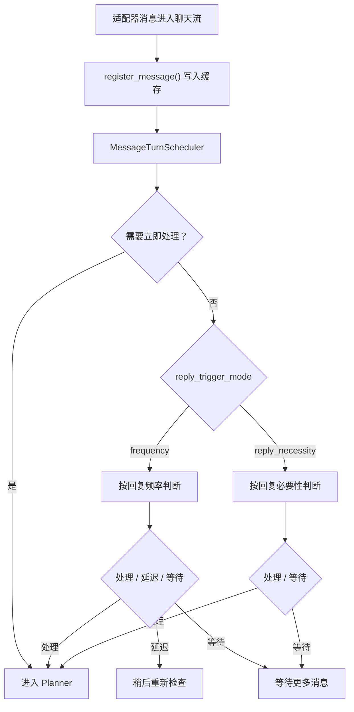
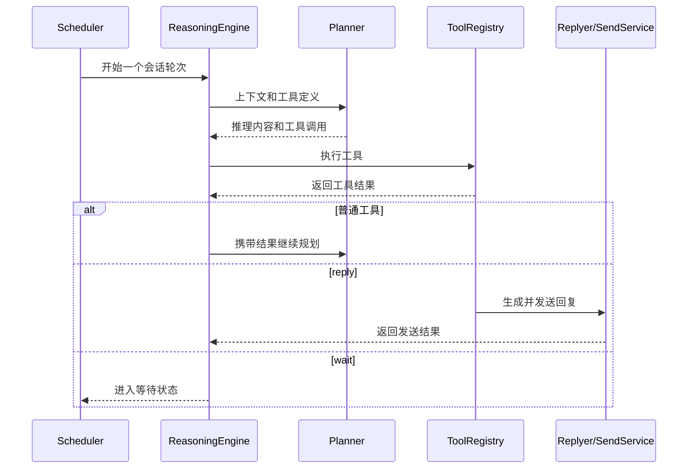

# Maisaka 推理引擎

Maisaka 是 MaiBot 的会话调度与多轮工具推理运行时。`MessageTurnScheduler` 负责按会话调度消息并判断是否进入 Planner，`MaisakaReasoningEngine` 负责驱动 Planner 的工具调用循环。

## 核心组件

**`MaisakaHeartFlowChatting`** — 单个聊天流的运行时对象，位于 `src/maisaka/runtime.py`。它维护消息缓存、上下文、等待状态、Planner 中断状态、工具注册表、Focus 状态和后台任务。

**`MessageTurnScheduler`** — 收到消息后，根据触发模式和会话状态决定立即开始推理、延迟检查或继续等待。

**`FrequencyThresholdTurnGate`** — 在频率模式下，结合有效回复频率、待处理消息数和空窗补偿作出判断。

**`ReplyNecessityTurnGate`** — 在 `reply_trigger_mode = "reply_necessity"` 时，根据消息内容和会话压力评分作出判断。

**`MaisakaChatLoopService`** — 构造 Planner 请求、模型消息和工具定义，并解析模型返回的工具调用。

**`MaisakaReasoningEngine`** — 执行多轮 Planner → Tool → Planner 循环，处理暂停工具、无工具重试和循环结束原因。

## 消息调度

直接提及、主动任务和部分 Focus 唤醒路径可以要求立即处理。频率模式下，`talk_value` 与动态规则共同决定有效回复频率；频率为静默时，消息仍会被消费，但不会进入正常回复循环。

## Planner 工具循环

一次推理周期大致包括以下步骤：

1. 收集尚未处理的消息，并等待短暂的消息安静期。
2. 从会话历史构造 Planner 上下文，加入视觉消息、中期回忆、人物画像和启发式记忆。
3. 从 `ToolRegistry` 获取当前可用工具。较少使用的延迟加载工具先以提示形式出现，需要通过 `tool_search` 发现。
4. 调用 `planner` 模型任务。
5. 执行模型返回的工具调用，并把结果写回上下文。
6. 普通工具执行完成后继续下一轮规划；`reply`、`wait` 等暂停工具会结束或挂起当前周期。
7. Planner 连续不调用工具时，系统会追加提示并进行有限次数的重试。

## 工具体系

运行时将多个 Provider 注册到统一的 `ToolRegistry`：

**内置工具** — 由 `MaisakaBuiltinToolProvider` 提供，包括 `reply`、`wait`、`send_image`、`send_emoji`、`query_memory`、`query_person_profile`、`tool_search` 等。

**插件工具** — 由 `PluginToolProvider` 从独立插件运行时暴露。

**MCP 工具** — MCP 启用且连接成功时，由 `MCPToolProvider` 注册。

工具可见性还会受到配置、Focus 模式、能力状态和延迟加载工具发现状态的影响。`tool_search` 只负责发现工具，不会代替目标工具执行操作。

## 回复生成

Planner 调用 `reply` 时需要提供目标消息和回复理由。`reply` 工具会组织 Replyer 请求、表达方式选择、引用策略与可选的丰富回复附件，然后通过发送服务输出消息。

Replyer 使用 `model_task_config.replyer`。表达方式选择可以使用 `model_task_config.expression_use`；留空时回退到 `utils`。

相关 Hook 包括：

- `maisaka.planner.before_request`
- `maisaka.planner.after_response`
- `maisaka.replyer.before_request`
- `maisaka.replyer.before_model_request`
- `maisaka.replyer.after_response`

## 等待、退避与中断

**连续等待限制** — `chat.reply_timing.max_consecutive_wait_count` 限制一个连续规划链中的 `wait` 次数。

**无动作退避** — 连续未回复后，`IdleBackoff` 根据基准秒数、上限、开始次数和待处理消息绕过阈值，延迟下一次检查。

**Planner 中断** — Planner 请求进行时收到新消息，可以设置中断标志并重新构造上下文。`planner_interrupt_max_consecutive_count` 控制连续中断次数，`0` 表示不限制。

**等待恢复** — `wait` 可以在超时、收到新消息或主动任务到来后恢复。私聊与静默频率下的恢复策略略有不同。

## 上下文与监控

上下文处理会确保工具调用与工具结果成对出现，并在裁剪后移除孤立的工具结果。视觉模式决定 Planner 是否收到原始图片；图片超过数量限制时由视觉消息限制器处理。

运行时会向 Maisaka monitor 写入会话、消息、Planner、工具和回复阶段的事件，供 WebUI 的“麦麦观察”页面展示。事件模型定义在 `src/maisaka/monitor/events.py`。

## 配置入口

- `[chat.reply_timing]`：回复频率、触发模式、中断、等待上限和无动作退避。
- `[chat]`：上下文长度、中期回忆和上下文优化。
- `[visual]`：Planner 和 Replyer 的视觉模式与图片限制。
- `[experimental]`：Focus、丰富回复、行为学习和注意力漂移。
- `model_task_config.planner`、`replyer` 和 `expression_use`：对应的模型任务。

修改推理流程文档时，应同时核对 `runtime.py`、`turn_scheduler.py`、`turn_gates.py`、`reasoning_engine.py`、`chat_loop_service.py` 和 `builtin_tool/`。
