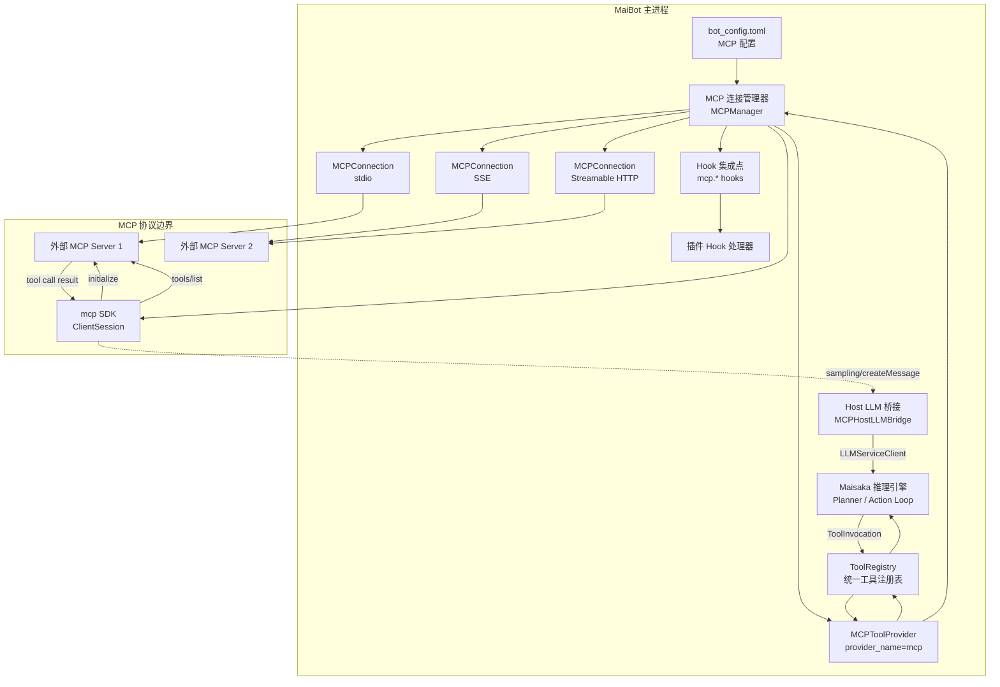
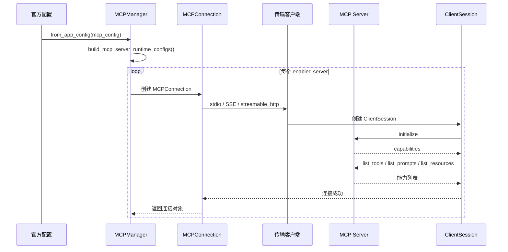
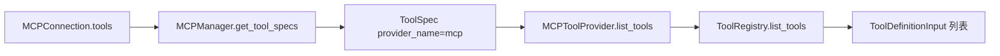
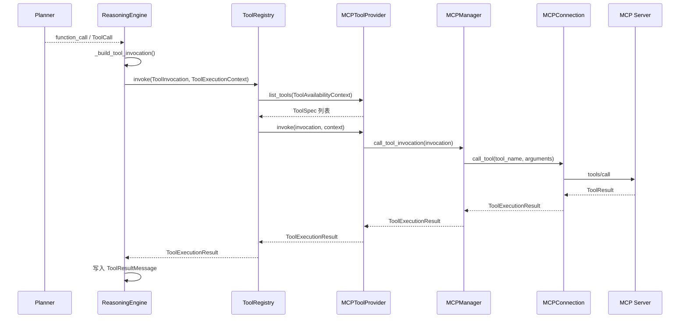

# MCP 集成架构

本文基于 code-map 快照编写。

MaiBot 的 MCP 集成位于 `maibot/src/mcp_module/`，职责不是把某个固定能力写进主程序，而是把外部 MCP 服务器变成 MaiBot 工具系统的一部分。MCP 服务器提供工具、Prompt、Resource 等能力，MaiBot 作为 MCP 客户端连接这些服务器，发现能力，再把工具能力适配到统一 `ToolProvider` 接口。

本文聚焦开发视角的内部架构，不重复用户手册中关于配置和使用的说明。

## 1. 概述

**MCP 的角色** ：MCP 是 Model Context Protocol。MaiBot 在集成中扮演 MCP Client，外部服务扮演 MCP Server。MaiBot 不内置外部工具实现，只负责协议连接、能力发现、调用路由和结果归一化。

**能力来源** ：MCP Server 暴露的能力可以包括 Tools、Prompts、Resources 和 Resource Templates。当前对 Maisaka 推理引擎最直接生效的是 Tools，因为工具会被转换成 `ToolSpec` 并进入统一工具列表。

**集成目标** ：MCP 工具进入 MaiBot 后，不再以远程协议对象的形式被推理引擎消费，而是被转换成 `ToolSpec`、`ToolInvocation` 和 `ToolExecutionResult`。Maisaka 只面对统一工具抽象，不需要知道工具来自插件、内置模块还是 MCP。

**运行时关系** ：外部 MCP Server 是能力实现方，MaiBot 是协议客户端和工具调度方。工具执行时，MaiBot 通过 MCP SDK 的 `ClientSession.call_tool()` 发起远程调用，再把 MCP 返回内容转换成 MaiBot 内部结果。

**可选依赖** ：`mcp` Python SDK 是可选依赖。未安装 SDK 或未配置服务器时，主程序仍可运行。`MCPManager.from_app_config()` 会在无可用配置、SDK 缺失或全部连接失败时返回 `None`。

**边界** ：MCP 模块不替代 `tool-system`，也不替代 `MaisakaReasoningEngine`。它只做协议适配和生命周期管理，真正的工具注册、LLM 工具定义生成、调用路由由工具系统和推理引擎完成。

## 2. 架构图

**MCP 连接管理器** ：架构图中对应 `MCPManager`。它维护多个 `MCPConnection`，保存工具名到服务器名的映射，并提供统一的工具、Prompt、Resource 访问入口。

**工具提供者** ：`MCPToolProvider` 把 `MCPManager` 包成标准 `ToolProvider`。它只实现 `list_tools()`、`invoke()` 和 `close()`，不直接理解 MCP 协议细节。

**Host LLM 桥接** ：`MCPHostLLMBridge` 处理 MCP Server 反向发起的 Sampling 请求。它把 MCP Sampling 消息转换为 MaiBot 内部消息，再调用 `LLMServiceClient`，最后把模型响应转换回 MCP `CreateMessageResult` 或 `CreateMessageResultWithTools`。

**Hook 集成** ：MCP 连接、断开和工具执行是插件 Hook 可以观察或拦截的边界。代码快照中协议层使用 `MCPHostCallbacks` 注入 `ClientSession`，插件命名 Hook 层可按 `mcp.server_connected`、`mcp.server_disconnected`、`mcp.tool_executed` 接入。

## 3. 核心概念

### 3.1 MCP Server 与 MCP Client

**MCP Server** ：外部能力提供方。它可以是本地子进程、远程 HTTP 服务或 SSE 服务。Server 通过 MCP 协议声明能力，并响应 `initialize`、`tools/list`、`tools/call` 等方法。

**MCP Client** ：MaiBot 侧协议客户端。`MCPConnection` 使用 `mcp` SDK 创建 `ClientSession`，负责传输连接、协议握手、能力发现和远程调用。

**JSON-RPC 2.0** ：MCP 请求和响应基于 JSON-RPC 2.0 语义。客户端发送方法调用，服务端返回 result 或 error。`stdio_filter.py` 对 stdio 传输做了额外防护，丢弃不符合 JSON-RPC 起始格式的 stdout 噪声行。

**stdio** ：本地子进程传输。MaiBot 根据配置中的 `command`、`args`、`env` 启动外部 MCP Server，并通过标准输入输出交换 JSON-RPC 消息。

**SSE** ：Server-Sent Events 远程传输。MaiBot 通过 `sse_client` 连接远程服务，适合长连接推送场景。

**Streamable HTTP** ：远程 HTTP 传输。MaiBot 通过 `streamable_http_client` 连接远程服务，并支持配置请求头、Bearer Token 和超时。

**认证** ：远程 HTTP 和 SSE 连接可通过 `build_http_headers()` 合并自定义 Header。Bearer 模式会自动写入 `Authorization: Bearer <token>`。

### 3.2 MCPConnectionManager，也就是 MCPManager

**架构称谓** ：用户手册和本文中的“MCP 连接管理器”对应源码里的 `MCPManager`。它不是 `mcp` SDK 的内置类，而是 MaiBot 为多服务器生命周期管理编写的管理层。

**配置入口** ：`MCPManager.from_app_config()` 读取官方 MCP 配置，调用 `build_mcp_server_runtime_configs()` 生成运行时服务器列表，再为每个服务器创建 `MCPConnection`。

**连接集合** ：`_connections` 保存已连接服务器，键是服务器名称，值是对应的 `MCPConnection`。

**路由映射** ：`_tool_to_server`、`_prompt_to_server`、`_resource_to_server`、`_resource_template_to_server` 分别保存能力名到服务器名的映射。工具调用时通过 `_tool_to_server` 找到目标服务器。

**冲突保护** ：MCP 工具不能占用 MaiBot 内置工具名，例如 `reply`、`no_action`、`stop`、`create_table`、`list_tables`、`view_table`。跨服务器同名工具只保留先注册的服务器。

**能力注册** ：每个连接成功后，管理器会注册工具、Prompt、Resource 和 Resource Template，并打印连接摘要。注册数量用于判断该服务器是否真正为 MaiBot 增加了可用能力。

**生命周期关闭** ：`MCPManager.close()` 会关闭所有 `MCPConnection`，并清空连接和映射表。`MCPToolProvider.close()` 会委托管理器关闭连接。

### 3.3 MCPConnection

**职责** ：`MCPConnection` 管理单个 MCP 服务器的连接生命周期。它封装传输层、`ClientSession`、服务端能力和远程调用。

**连接流程** ：`connect()` 进入异步上下文，建立传输，创建 `ClientSession`，执行 `session.initialize()`，保存 `server_capabilities` 和 `protocol_version`，然后加载服务端能力。

**能力发现** ：`_load_server_features()` 根据服务端能力声明决定是否调用 `list_tools()`、`list_prompts()`、`list_resources()` 和 `list_resource_templates()`。

**分页加载** ：工具、Prompt、Resource 和 Resource Template 都通过 cursor 分页读取。只要 `nextCursor` 存在，就继续请求下一页。

**可选能力容错** ：`list_resource_templates` 是可选方法。部分服务端未实现时返回 `METHOD_NOT_FOUND`，MaiBot 会按空集合处理，避免毁掉整个连接。

**远程调用** ：`call_tool()` 调用 `ClientSession.call_tool()`，再把 MCP 原始内容转换为 `ToolExecutionResult`。调用异常会被转换成失败结果，而不是直接抛出到推理循环。

**关闭行为** ：`close()` 释放异步上下文、HTTP 客户端和读写流，并清空当前连接状态。

### 3.4 MCPToolProvider

**职责** ：`MCPToolProvider` 是 MCP 到 `ToolProvider` 的适配器。它让 MCP 工具进入统一工具系统。

**provider_name** ：`mcp`。

**provider_type** ：`mcp`。

**list_tools** ：`list_tools(context)` 忽略上下文，直接返回 `MCPManager.get_tool_specs()`。MCP 工具的统一声明已经在管理器层完成。

**invoke** ：`invoke(invocation, context)` 忽略上下文，直接调用 `MCPManager.call_tool_invocation(invocation)`。上下文在工具系统层仍有意义，但 MCP 调用本身只依赖工具名和参数。

**close** ：关闭 Provider 时会关闭 `MCPManager`，从而关闭所有 MCP 连接。

### 3.5 HostLLMBridge

**全称** ：`MCPHostLLMBridge`。

**触发来源** ：MCP Server 通过 `sampling/createMessage` 向 MaiBot 请求模型采样。这个请求来自外部服务，而不是 MaiBot 主动调用外部工具。

**桥接方式** ：Bridge 读取 MCP Sampling 参数，包括 `messages`、`systemPrompt`、`temperature`、`maxTokens`、`toolChoice` 和 `tools`，再调用主程序 `LLMServiceClient`。

**工具选择模式** ：支持 `auto`、`required`、`none`。`required` 且模型未返回工具调用时，会返回 MCP `ErrorData`。

**消息转换** ：MCP Sampling 的 `user`、`assistant`、`tool_result` 内容块会被转换为内部 `Message` 序列。图片、音频等不支持透传的内容会降级为文本占位。

**结果转换** ：`LLMResponseResult` 会被转换成 MCP `CreateMessageResult` 或 `CreateMessageResultWithTools`。如果模型返回工具调用，结果中包含 `ToolUseContent`。

**宿主回调** ：`MCPHostLLMBridge.build_callbacks()` 返回 `MCPHostCallbacks(sampling_callback=handle_sampling_request)`，由 `MCPConnection` 注入 `ClientSession`。

### 3.6 MCPHostCallbacks 与 Hook 边界

**MCPHostCallbacks** ：协议层宿主回调集合，字段包括 `sampling_callback`、`elicitation_callback`、`logging_callback`、`message_handler`。

**与插件 Hook 的区别** ：`MCPHostCallbacks` 注入给 MCP SDK 的 `ClientSession`，用于实现 MCP 协议中的宿主能力。插件 Hook 是 MaiBot 的命名 Hook 分发体系，需要由业务代码显式调用 `invoke_hook()`。

**server_connected** ：适合在单个 MCP Server 完成连接、初始化并加载能力后触发。

**server_disconnected** ：适合在连接关闭、连接失败清理或进程退出时触发。

**tool_executed** ：适合在 MCP 工具调用完成并生成 `ToolExecutionResult` 后触发。

**推荐载荷** ：这些 Hook 可携带 `server_name`、`transport`、`tool_name`、`arguments`、`success`、`duration_ms`、`protocol_version`、`session_id` 和 `error_message`。

## 4. 关键流程

### 4.1 MCP 服务器连接

**配置过滤** ：`build_mcp_server_runtime_configs()` 只返回启用且配置完整的服务器。未启用服务器不会进入连接流程。

**SDK 检测** ：如果 `mcp` SDK 未安装，管理器会打印警告并返回 `None`。

**失败隔离** ：单个服务器连接失败不会阻止其他服务器继续连接。全部服务器都失败时，`from_app_config()` 返回 `None`。

**初始化握手** ：`session.initialize()` 是协议能力协商点。握手成功后，`server_capabilities` 决定后续发现哪些能力。

### 4.2 工具发现

**发现方法** ：`tools/list` 对应 SDK 的 `session.list_tools(cursor=cursor)`。MaiBot 会循环读取所有分页，直到没有 `nextCursor`。

**原始对象** ：SDK 返回的工具对象包含 `name`、`title`、`description`、`inputSchema`、`outputSchema`、`icons`、`annotations`、`meta` 等字段。

**Schema 清洗** ：`MCPManager` 会把 `inputSchema` 和 `outputSchema` 转成普通 dict，并移除 `$schema`，避免模型层收到冗余字段。

**统一声明** ：工具对象被转换成 `ToolSpec`，其中 `provider_name="mcp"`、`provider_type="mcp"`，`metadata.server_name` 记录来源服务器。

**冲突处理** ：工具名先与内置工具名比较，再与已注册 MCP 工具名比较。冲突工具会被跳过，并输出警告。

### 4.3 注册到 ToolProvider

**管理器内注册** ：`MCPManager` 在连接阶段建立 `_tool_to_server` 映射。这个映射不是 `ToolRegistry` 注册，而是 MCP 内部路由表。

**Provider 注册** ：`MaisakaRuntime._init_mcp()` 在管理器初始化成功且存在 MCP 工具后，调用 `ToolRegistry.register_provider(MCPToolProvider(self._mcp_manager))`。

**注册条件** ：MCP 配置存在、SDK 可用、至少一个服务器连接成功、至少发现一个 MCP 工具，这些条件满足后才会注册 Provider。

**Provider 标识** ：`MCPToolProvider` 使用 `provider_name="mcp"`。如果同名 Provider 已存在，`ToolRegistry` 会先移除旧 Provider，再注册新 Provider。

### 4.4 推理引擎调用

**模型输出** ：模型层可能把工具调用表达为 `function_call`、`ToolCall` 或等价结构。MaiBot 在 `_build_tool_invocation()` 中统一转换成 `ToolInvocation`。

**调用上下文** ：`_build_tool_execution_context()` 把会话、聊天流、群聊、用户、平台、锚点消息等信息放入 `ToolExecutionContext`。

**Provider 查找** ：`ToolRegistry.invoke()` 先根据当前可用性上下文收集 Provider 工具列表，再查找匹配 `invocation.tool_name` 的 Provider。

**MCP 路由** ：`MCPManager.call_tool_invocation()` 通过 `_tool_to_server` 找到目标服务器，再调用对应 `MCPConnection.call_tool()`。

**结果返回** ：`MCPConnection.call_tool()` 把 MCP 内容转换成 `ToolExecutionResult`，推理引擎再把结果追加到工具结果历史。

### 4.5 结果返回与历史写入

**文本结果** ：MCP 工具返回的 text 内容进入 `ToolExecutionResult.content`。

**多媒体结果** ：image、audio、resource、resource_link 等内容进入 `content_items`。MaiBot 使用 `build_tool_content_items()` 完成 MCP 原始内容到统一内容项的转换。

**结构化结果** ：如果 MCP 返回 `structuredContent`，会写入 `ToolExecutionResult.structured_content`，供后续逻辑或模型摘要使用。

**错误结果** ：MCP 返回 `isError=True` 或调用异常时，`success=False`，错误信息写入 `error_message`。

**历史摘要** ：`ToolExecutionResult.get_history_content()` 优先使用 `content`，其次使用 `content_items` 的摘要，再其次使用结构化内容 JSON，最后才使用错误信息。

## 5. 与工具抽象层 tool-system 的交互

**统一入口** ：`MCPToolProvider` 实现 `ToolProvider` Protocol，因此可以被 `ToolRegistry` 和插件、内置 Provider 同等对待。

**声明转换** ：MCP 原始工具对象先由 `MCPManager.get_tool_specs()` 转换为 `ToolSpec`。这一步包含名称、描述、参数 Schema、输出 Schema、图标、注解和元数据。

**调用转换** ：`ToolInvocation` 是统一调用请求。MCP Provider 不需要理解模型 API 的原始 function call 结构，只需要读取 `tool_name` 和 `arguments`。

**结果转换** ：MCP 工具结果被转换成 `ToolExecutionResult`。工具系统不关心结果是本地 Python 函数返回，还是远程 MCP Server 返回。

**去重规则** ：`ToolRegistry.list_tools()` 按 Provider 顺序收集工具，并跳过重复工具名。MCP 内部也做冲突检测，因此同服务器和跨服务器的冲突会被尽量提前处理。

**Provider 顺序** ：内置 Provider 和插件 Provider 是默认注册路径。MCP Provider 只在 `_init_mcp()` 成功初始化后注册，因此不会在没有 MCP 工具时占用工具列表。

**旧模型兼容** ：`MCPManager.get_openai_tools()` 可把 MCP 工具定义转换成旧模型层使用的 function tool 格式。新路径更推荐走 `ToolRegistry.get_llm_definitions()`。

## 6. 与 Maisaka 的交互

### 6.1 工具列表进入推理引擎

**初始化位置** ：`MaisakaRuntime._init_mcp()` 负责创建 Host LLM Bridge、MCPManager 和 MCPToolProvider。

**注册顺序** ：初始化成功后，`MCPToolProvider` 注册到 `_tool_registry`。之后 Planner 构造工具定义时，`ToolRegistry.list_tools()` 会包含 MCP 工具。

**可见性策略** ：`_build_action_tool_definitions()` 会把非内置工具放入可见列表或 deferred 池。MCP 工具如果没有显式 `metadata.visibility="visible"`，默认进入 deferred 池，后续可通过 `tool_search` 发现。

**LLM 定义** ：可见工具会通过 `ToolSpec.to_llm_definition()` 转成模型层工具定义。MCP 工具的描述、参数 Schema 和名称与其他工具使用同一格式。

**上下文过滤** ：工具列表构造时会传入 `ToolAvailabilityContext`。MCP Provider 当前不基于上下文过滤工具，但统一工具层仍保留上下文参数，方便未来扩展。

### 6.2 function_call 路由

**模型层概念** ：`function_call` 是模型响应中的工具调用表达。MaiBot 内部统一使用 `ToolCall` 表示模型输出，再转换成 `ToolInvocation`。

**调用构建** ：`_build_tool_invocation(tool_call, latest_thought)` 从模型工具调用中提取 `func_name`、`args`、`call_id`，并补充 `session_id`、`stream_id` 和 `reasoning`。

**执行入口** ：`_invoke_tool_call()` 或批量 `_handle_tool_calls()` 会把 `ToolInvocation` 交给 `ToolRegistry.invoke()`。

**Provider 定位** ：`ToolRegistry.invoke()` 会重新按可用性上下文收集工具声明，找到声明包含目标工具名的 Provider。MCP 工具的 `provider_name` 是 `mcp`，因此会被路由到 `MCPToolProvider`。

**远程执行** ：`MCPToolProvider.invoke()` 委托 `MCPManager.call_tool_invocation()`，管理器再通过 `_tool_to_server` 找到对应 `MCPConnection`。

**结果回写** ：`MCPConnection` 返回 `ToolExecutionResult` 后，推理引擎存储工具记录，并把结果追加为 `ToolResultMessage` 或等价历史内容。

### 6.3 与 Host LLM 桥接的关系

**双向能力** ：MCP 集成不仅让 MaiBot 调用外部工具，也允许 MCP Server 请求 MaiBot 调用模型。这个方向通过 `MCPHostLLMBridge` 实现。

**Sampling 配置** ：`mcp.client.sampling.enable` 决定是否声明采样能力，`task_name` 决定使用哪个模型任务，`tool_support` 决定是否允许 Sampling 中继续使用工具。

**工具定义注入** ：当 MCP Server 在 Sampling 请求中附带 `tools` 时，Bridge 会把 MCP 工具定义转换为 `ToolDefinitionInput`，传给 `LLMServiceClient`。

**工具调用回传** ：如果模型响应包含工具调用，Bridge 会返回 `CreateMessageResultWithTools`，其中包含 `ToolUseContent`。MCP Server 后续可以继续处理这些工具调用结果。

**错误隔离** ：Bridge 捕获异常并返回 MCP `ErrorData`，避免一次 Sampling 失败直接破坏 MCP 连接。

## 7. Hook 集成点

### 7.1 当前协议层 Hook

**MCPHostCallbacks** ：这是 MCP SDK 的宿主能力回调，不是插件 Hook 规格。它被传入 `MCPConnection`，再由 `ClientSession` 使用。

**sampling_callback** ：处理 MCP Server 发起的 Sampling 请求。当前实现由 `MCPHostLLMBridge.handle_sampling_request()` 提供。

**elicitation_callback** ：保留给 MCP Elicitation 能力。当前配置和连接层支持声明，但具体用户交互能力仍需业务层补齐。

**logging_callback** ：可用于消费 MCP Server 日志。当前 `MCPHostCallbacks` 预留字段，默认不注入。

**message_handler** ：可用于处理自定义 MCP 消息。当前 `MCPHostCallbacks` 预留字段，默认不注入。

### 7.2 插件命名 Hook 设计点

**集成原则** ：如果要把 MCP 生命周期暴露给插件 Hook，应在连接和工具调用的边界调用 `PluginRuntimeManager.invoke_hook()`。这些 Hook 不属于 MCP 协议本身，而是 MaiBot 运行时的可观测性扩展。

**server_connected** ：建议在单个 `MCPConnection.connect()` 成功、能力加载完成、管理器记录连接后触发。此时 payload 已经包含稳定工具数量和能力摘要。

**server_disconnected** ：建议在连接关闭、连接失败清理或管理器关闭时触发。即使连接从未成功初始化，也可以在清理阶段发出断开事件，方便监控工具统计连接失败。

**tool_executed** ：建议在 `MCPConnection.call_tool()` 返回 `ToolExecutionResult` 后触发。此时可以准确记录工具名、服务器名、成功状态、耗时和错误信息。

**server_connected 载荷** ：`server_name`、`transport`、`protocol_version`、`tool_count`、`prompt_count`、`resource_count`、`resource_template_count`。

**server_disconnected 载荷** ：`server_name`、`transport`、`reason`、`had_session`、`protocol_version`、`session_id`。

**tool_executed 载荷** ：`server_name`、`tool_name`、`arguments`、`success`、`duration_ms`、`content_length`、`error_message`、`metadata`。

**阻塞与观察** ：`server_connected` 和 `server_disconnected` 通常适合 observe 处理器。`tool_executed` 如果允许记录审计或改写结果，可以设计为 blocking 处理器，但需要谨慎避免影响推理循环性能。

**错误处理** ：Hook 调用失败不应破坏 MCP 连接生命周期。建议记录错误，并把异常转换为 Hook dispatch error，而不是让连接关闭或工具调用失败。

## 8. 数据模型转换

**ToolSpec** ：MCP 工具声明转换为统一 `ToolSpec`。`provider_name` 和 `provider_type` 固定为 `mcp`，`metadata.server_name` 保留来源服务器。

**ToolIcon** ：MCP 图标对象转换为 `ToolIcon`，包含 `src`、`mime_type`、`sizes`。

**ToolAnnotation** ：MCP 注解对象转换为 `ToolAnnotation`，包含 `audience`、`priority`、`metadata`。

**ToolContentItem** ：MCP 工具结果内容块转换为统一内容项。支持 `text`、`image`、`audio`、`resource_link`、`resource`、`binary` 和 `unknown`。

**PromptSpec** ：MCP Prompt 转换为 `MCPPromptSpec`，包含参数列表、图标和元数据。

**ResourceSpec** ：MCP Resource 转换为 `MCPResourceSpec`，包含 URI、名称、MIME、大小、图标和注解。

**ResourceTemplateSpec** ：MCP Resource Template 转换为 `MCPResourceTemplateSpec`，保留 URI 模板、名称、描述和元数据。

**结构化元数据** ：`_dump_model_metadata()` 会提取 MCP 原始对象中的 `meta` 字段。该字段可进入 `ToolSpec.metadata` 或注解 metadata。

## 9. 运行时配置

**配置转换** ：`config.py` 将官方 MCP 配置转换成运行时 dataclass，避免连接层直接读取配置模型。

**服务器配置** ：`MCPServerRuntimeConfig` 保存服务器名称、传输类型、命令、参数、环境变量、URL、Header、超时和认证信息。

**客户端配置** ：`MCPClientRuntimeConfig` 保存客户端名称、版本、Roots、Sampling、Elicitation 等宿主能力配置。

**传输类型推断** ：`transport_type` 根据 `transport`、`command` 和 `url` 判断。stdio 需要 command，HTTP 和 SSE 需要 url。

**HTTP Header** ：`build_http_headers()` 合并用户配置 Header 和 Bearer Token。Bearer Token 会被自动写入标准 Authorization Header。

**Roots** ：Roots 由 `_build_list_roots_callback()` 暴露给 MCP Server。只有启用 Roots 且配置了有效 URI 时，客户端才声明该能力。

**Sampling 能力声明** ：只有启用 Sampling 且提供 `sampling_callback` 时，`ClientSession` 才会收到 sampling 回调和 sampling capabilities。

## 10. 容错与安全边界

**stdio 噪声过滤** ：MCP 协议要求 stdout 只承载 JSON-RPC 消息。第三方服务器有时会把启动横幅写到 stdout，MaiBot 使用 `tolerant_stdio_client()` 丢弃非 JSON 行，避免初始化失败。

**异常隔离** ：连接失败、工具调用失败、Sampling 调用失败都应在各自边界转换为日志或失败结果，避免单个 MCP Server 影响主程序稳定性。

**名称保护** ：内置工具名不能被 MCP 工具占用。这是防止模型错误路由到外部工具的关键保护。

**跨服务器冲突** ：同名 MCP 工具只保留先注册的服务器。配置顺序决定了保留顺序。

**资源释放** ：所有 MCP 连接都应通过 `MCPManager.close()` 或 `MCPToolProvider.close()` 释放。进程退出或运行时停止时应确保 close 被调用。

**审计建议** ：如果启用 `mcp.tool_executed`，建议记录工具名、服务器名、成功状态、耗时和错误摘要。参数和结果可能包含敏感信息，写入日志前应做脱敏。

## 11. 与其他文档的边界

**用户手册** ：`docs/manual/features/mcp.md` 面向使用者，说明 MCP 是什么、如何配置、如何排障。本文不重复这些内容。

**工具系统架构** ：`docs/develop/architecture/tool-system.md` 说明统一 `ToolProvider`、`ToolRegistry` 和工具调用模型。本文只说明 MCP 如何接入这一层。

**Maisaka 推理引擎** ：`docs/develop/architecture/maisaka-reasoning.md` 说明消息调度、Planner 循环和工具执行流程。本文只说明 MCP 工具如何进入工具列表和 function_call 路由。

**插件开发文档** ：插件 Hook 的具体写法属于插件开发文档范围。本文只定义 MCP 相关 Hook 的触发边界和推荐载荷。

## 12. 总结

**MCP 集成的本质** ：MCP 模块把外部 MCP Server 的能力转成 MaiBot 内部工具能力。外部服务实现工具，MaiBot 负责连接、发现、注册、调用和结果归一化。

**核心链路** ：`MCPManager` 管理连接，`MCPConnection` 执行协议交互，`MCPToolProvider` 接入工具系统，`ToolRegistry` 路由到 Provider，`MaisakaReasoningEngine` 消费工具结果。

**关键扩展点** ：MCP 工具可以扩展 MaiBot 的工具边界，Host LLM Bridge 可以支持 MCP Server 反向请求模型能力，`mcp.*` Hooks 可以为连接和工具执行提供可观测性与扩展能力。

**实现约束** ：MCP 是可选运行时依赖，工具名必须避免冲突，远程调用必须隔离失败，连接资源必须显式释放。
