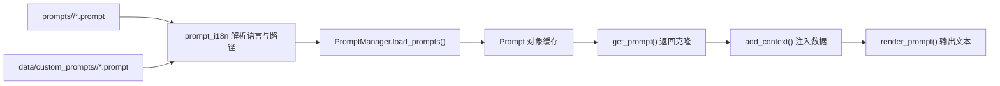

# Prompt 模板系统

MaiBot 使用 `.prompt` 文件保存模型提示词，并通过 `PromptManager` 完成加载、覆盖、上下文注入、嵌套渲染和保存。本文以当前的 `src/prompt/prompt_manager.py` 与 `src/common/prompt_i18n.py` 为准。

## 目录与语言

**内置模板** — 位于 `prompts/<locale>/`。默认语言由 i18n 模块的 `DEFAULT_LOCALE` 决定。

**自定义模板** — 位于 `data/custom_prompts/<locale>/`。为了兼容旧版本，也会读取 `data/custom_prompts/*.prompt`。

**当前语言** — `PromptManager` 通过 `get_locale()` 获取当前语言，再由 `normalize_locale()` 规范化语言代码。

加载某个模板时，系统优先使用当前语言的自定义版本；没有自定义版本时使用内置版本，并按 `prompt_i18n` 的语言候选规则回退到默认语言。

## 核心对象

### Prompt

`Prompt` 保存三个主要状态：

**`prompt_name`** — 模板的逻辑名称。

**`template`** — 原始模板文本。

**`prompt_render_context`** — 只作用于当前实例的上下文构造函数。

`Prompt.add_context(name, func_or_str)` 可绑定字符串、同步函数或异步函数。`Prompt.clone()` 创建独立实例，避免不同请求相互污染。

### PromptManager

全局实例为 `prompt_manager`。主要接口如下：

**`load_prompts()`** — 扫描并重新加载所有内置和自定义模板。

**`get_prompt(prompt_name)`** — 返回指定模板的克隆实例；模板不存在时抛出 `KeyError`。

**`render_prompt(prompt)`** — 异步渲染由 `get_prompt()` 返回的克隆实例；传入原始共享实例会抛出 `ValueError`。

**`add_prompt()` / `replace_prompt()` / `remove_prompt()`** — 管理内存中的模板。

**`add_context_construct_function()`** — 注册所有模板均可使用的全局上下文构造函数。

**`save_prompts()`** — 将标记为需要保存的模板写入当前语言对应的自定义目录。

当前没有 `reload_prompts()`、`force_reload` 或 `debug` 参数；调用时应以以上真实签名为准。

## 加载与覆盖



`list_prompt_templates()` 负责枚举内置模板。`load_prompt_template()` 解析最终使用的模板文本，并返回它是否来自自定义目录以及实际语言。

加载过程采用先构造新字典、成功后整体替换的方式。如果文件读取或模板校验失败，`load_prompts()` 会记录错误并继续向上抛出异常，不会静默保留一个无法确认的半加载状态。

## 渲染规则

模板使用 Python `string.Formatter` 风格的命名占位符：

```text
你正在和 {user_name} 聊天。
{conversation_rules}
```

若需要在最终文本中保留字面量花括号，可使用双花括号。未命名的 `{}` 会在创建 `Prompt` 时被拒绝。

字段解析顺序为：

1. 同名 Prompt，作为嵌套模板递归渲染。
2. 当前 Prompt 通过 `add_context()` 注册的上下文。
3. `PromptManager` 注册的全局上下文构造函数。
4. 由外层嵌套 Prompt 传入的上下文。

字段没有对应模板或构造函数时抛出 `KeyError`。嵌套超过 10 层时抛出 `RecursionError`，用于阻止循环引用。

上下文函数可以同步或异步执行，接收当前 Prompt 名称并返回字符串。当前实现按字段逐个解析，不承诺使用 `asyncio.gather()` 并发执行。

## 缓存刷新

`prompt_i18n.clear_prompt_cache()` 会递增进程内缓存修订号。`PromptManager.get_prompt()` 发现修订号变化后，会调用 `load_prompts()` 重新加载并记录发生变化的模板名。

这不是基于固定秒数的文件轮询，也不存在 `prompt_reload_interval`、`prompt_cache_ttl`、`PROMPT_RELOADED` 或 `LOCALE_CHANGED` 事件。修改模板的调用方需要通过现有配置/WebUI 链路触发 `clear_prompt_cache()`，或显式调用 `load_prompts()`。

## 开发示例

::: code-group

```python [Python ~vscode-icons:file-type-python~]
from src.prompt.prompt_manager import prompt_manager

prompt = prompt_manager.get_prompt("example")
prompt.add_context("user_name", "小明")
prompt.add_context("conversation_rules", lambda _: "回复保持简短。")
rendered = await prompt_manager.render_prompt(prompt)
```

:::

若上下文需要异步数据，可以传入 `async def` 函数。不要直接修改 `prompt_manager.prompts` 中的共享实例，也不要把业务状态保存在全局上下文函数中。

## 修改模板时的检查清单

- 保持同一 Prompt 的中文、英文和日文版本占位符一致。
- 新增占位符时同步更新所有调用方的上下文注入。
- 避免 Prompt 之间形成循环引用。
- 自定义模板放入 `data/custom_prompts/<locale>/`，不要直接修改运行时生成的数据文件。
- 使用 `get_prompt()` 获取克隆后再调用 `add_context()` 和 `render_prompt()`。
